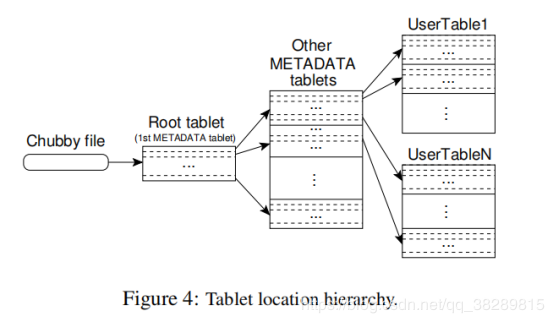
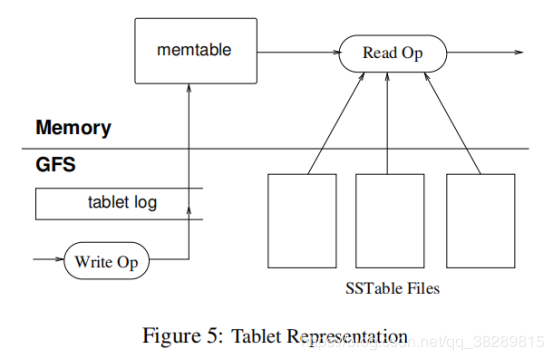

## 数据模型：(row:string, column:string,time:int64)->string
  -行关键字：最大64K的字符串。

    - Bigtable通过行关键字的字典顺序来维护数据

    - 表中一定范围的行被动态分区，每个分区叫做一个Tablet

    - 单一行关键字下的每一个读或者写操作都是原子的，即支持单行事务

  - 列族：列关键字组成的集合

    - 访问控制、磁盘和内存的计数都是在列族层面进行的

    - 同一列族的所有数据都属于同一类型（同一列族下的数据压缩在一起）

    - 先创建列族，然后才能在列族的任何列关键字下存放数据

    - 一张表中不同的列族数目要尽量小（最多几百个），并且列族在操作中很少改变

    - 列族名字必须是可打印的字符串

  - 列关键字：命名语法如下：列族：限定词

    - 列族的名字必须是可打印的字符串，但是限定词可以是任意字符串

    - 一张表可以有无限多的列

  - 时间戳：64位整型数，用时间戳来索引同一数据的不同版本

    - 数据项的不同版本按照时间戳倒序排列，所以最新的版本可以先读到

    - 为了减轻多个版本数据的管理负担，对每一个列族提供两个设置参数，通过这两个参数对废弃版本的数据进行自动垃圾回收（1.只保存最后n个版本数据，2.保存最近XXX时间内的数据）

## BigTable构件：BigTable是建立在一些其他google的基础组件之上的
  - SSTable文件格式

    - SSTable使用块索引来定位数据块，在打开SSTable的时候，索引被加载到内存。一次查找通过一次磁盘搜索完成：在内存索引里执行二分查找，找到对应的索引，然后从磁盘中读取合适的数据块,也可以把整个SSTable都映射到内存中，这样便不需要访问硬盘了。

  - Chubby分布式锁: 高可用、持久化的分布式锁服务

    - 一个Chubby服务包括了5个活动的副本，其中一个副本为master，并积极处理请求。

    - 使用paxos算法保证副本的一致性

## 实现：三个主要的组件
  - 链接到每个客户程序的库

  - 一个master服务器

     - 为tablet服务器分配tablets，

     - 检测新加入的或者过期失效的tablet服务器

     - 平衡tablet服务器的负载

     - 对GFS中的文件进行垃圾手机

     - 客户数据不经过master：直接和tablet服务器通信来进行读写操作，不以来master服务器来获取tablet的位置信息。因此大多数客户程序甚至完全不和master通信，所以实际应用中master的负载很轻

  - 多个table服务器，每个tablet服务器都管理一组tablet(数十至上千个tablet)

     - 处理它所加载的tablet的读写操作

     - 分割增长的过大的tablet

每个表包含一组tablet（初始状态下每个表只有一个tablet，随着表中数据增长，被自动分割成多个tablet，默认每个tablet大小约为100M~200M）

上图是一个三层结构，分别为：Chubby file, METADATA, User tablet，其中METADATA包含 Root Tablet和Other METADATA tablets，即图中间两个。
每个tablet包含128M / 1K = 2^17，所以一共组多可以有2^17 * 2^17=2^34个tablet（Root tablet有2^17行，每行代表一个METADATA tablet，每个METADATA tablet也有2^17行，每行代表一个User tablet）

Root Tablet是METADATA的第一个tablet，这个表包含所有的Tablet的位置信息

***Chubby file中：***

- 包含了RootTablet的位置信息

- Tablet服务器文件（代表该tablet服务器的状态）。

   - 当一个Tablet服务器启动时，它在Chubby的一个指定目录下建立一个唯一的文件，并且获取该文件的独占锁。

   - Master服务器实时监控这个目录，因此Master服务器很了解Tablet服务器的状态

   - Master轮询Tablet所有的服务器文件，检查Tablet服务器的状态。如果一个Tablet服务器丢失了文件或者master尝试和它通信都没有回应master则尝试获取其文件独占锁并删除其服务器文件，一旦Tablet服务器在Chubby上的服务器文件被删除了，Master就把分配给他的所有Tablet放入未分配的Tablet集合中

***Master服务器记录了：***

- 当前有哪些活跃的Tablet服务器

- 哪些Tablet分配给了哪些Tablet服务器

- 哪些Tablet还没有分配

*** Master服务器启动步骤：***

- Master服务器从Chubby获取一个唯一的Master锁，用来阻止创建其它的Master服务器实例

- Master服务器扫描Chubby的服务器文件锁存储目录，获取当前正在运行的服务器列表

- Master服务器和所有的正在运行的Tablet服务器通信，获取每个Tablet服务器上Tablet的分配信息

- Master服务器扫描METADATA表获取所有的Tablet的集合。在扫描的过程中，当Master服务器发现了一个还没有分配的Tablet，Master服务器就将这个Tablet加入未分配的Tablet集合并等待合适的时机分配

上图中的tablet log就是REDO日志

***恢复Tablet操作***

  - Tablet服务器从METADATA中读取它的元数据(元数据中包含组成这个Tablet的SSTable列表，以及Redo point)

  - Tablet服务器把SSTable加载入内存

  - 重复Redo之后的提交

***对Tablet服务器进行写操作***

  - 检查格式是否正确、权限校验(权限验证通过从Chubby文件中读取的操作者列表来验证)

  - 成功的修改会记录在提交日志里。并通过group commit（批量提交）的方式来提交吞吐量

  - 当写操作提交后，写的内容插入到MemTable里

***对Tablet服务器进行读操作***

  - 类似于写操作的完整性和权限检查

  - 从SSTable和MemTable的合并视图里执行读操作

***Compactions(空间压缩)***

分为三类：

  - Minor Compaction. 随着写操作的执行，MemTable的大小不断增加，当MemTable大小到达一个阈值的时候，这个MemTable就会被冻结并创建一个新的MemTable，被冻结住的MemTable会被转换成SSTable(创建一个新的SSTable)，然后写入GFS

  - Merging Compaction. Merge compaction会读取一些SSTable和MemTable，合并成一个新的SSTable

  - Major Compaction. 会合并所有的SSTable并生成一个新的SSTable, Bigtable定期扫描它所有的Tablet，并定期对他们执行Major Compaction.

Major Compaction生成的SSTable不包含已删除的信息和数据，而非Major Compaction产生的SSTable可能含有特殊的删除条目。

共同点：都会产生新的SSTable

***优化***

- 局部性群组(Locality groups): 客户程序可以将多个列族组合成一个局部性群组

  - 对Tablet中的每个局部性群组都会生成一个单独的SSTable

  - 不会一起访问的列族分割成不同的局部性群组，可以提高读取操作的效率(避免了读取无用数据)

  - 可以以局部性群组为单位设定一些有用的调试参数，比如，可以把一个局部性群组声明为全部存储在内存中(在BigTable内部，我们利用这个特性提高METADATA表中具有位置相关性的列族的访问速度)

- 压缩：客户程序可以控制一个局部性群组的SSTable是否需要压缩

  - 以SSTable块为单位进行压缩。优点：读取少量数据的时候，不需解压整个文件

  - 两阶段压缩：1-Bentley and Mcllroy's方式（在一个很大的扫描窗口里对常见的长字符串进行压缩）、2-快速压缩算法（在一个16KB的扫描窗口里寻找重复数据
）

- 缓存：采用二级缓存策略

  - 第一级缓存（扫描缓存）：缓存key-value对，对于重复读非常有效

  - 第二级缓存（块缓存）：对于经常读取临近数据的情况非常有效

- Bloom过滤器：用于检索一个数据是否在集合中(内存中执行检索，而无需去硬盘中逐个查找所有SSTable), 其空间效率和查询时间比一般算法好的多，但是有一定的误识别率和删除困难。

- commit日志的实现

  假设: 每个tablet一个单独的日志文件，并且多个tablet会并行的写入

  问题：那么将会导致大量的磁盘seek操作。

  解决方法：对每个tablet服务器采用一个日志文件

  缺点：这种解决方法提高了普通操作的性能，但是将恢复操作复杂化了。例如：tablet服务器A宕机了，服务器B/C/D分别接管服务器A的部分tablet，一个普遍的做法是B/C/D分别执行A的commit日志文件。但是由于对所有tablet都写在同一个commit日志文件中，所以B/C/D需要分别读取对所有的tablet的写入日志，然后挑选出自己需要接管的tablet，无疑性能低了很多（假如有100个Tablet服务器接管，那么需要读取100次）

  改进：按照关键字(tablet, row name, log sequence number)排序，排序后同一个tablet的日志就连续存放在一起了。因此只需要一次磁盘seek操作之后顺序读取就可以了。

  在向GFS中写入commit日志时可能会引起系统颠簸。为了确保在颠簸时仍能顺利进行，每个tablet服务器有两个日志写入线程，分别写入不同的日志文件（不同日志文件处于不同的GFS服务器上），如果在一个线程写入效率低的时候，则使用另外一个线程进行写入（因为每个日子都有序号，所以可以根据需要忽略掉由于线程切换导致的重复写入）

- tablet恢复提速

  当master将一个tablet从一个tablet服务器转移到另一个tablet服务器时，源tablet服务器先对其进行一次minor compaction（减少其没有归并的记录，从而减少恢复时间），compaction完成之后，该服务器就停止为该tablet服务。在写在tablet之前，再做一次minor compaction, 以消除前面一次minor compaction过程中产生的未归并记录（通常会很快，这也是为什么执行两次minor compaction的原因，如果为了防止漏掉记录而在执行第一次minor compaction之前就停止为该tablet服务，第一次minor compactioin执行的时间会比较长，导致该tablet长时间得不到服务），第二次minor compaction之后，tablet就可以被装在到新的tablet服务器上了，并且不需要从日志中进行恢复

- 利用不变性

  除了SSTable缓存之外其他部分产生的SSTable都是不变的，可以利用这一点，例如：

  - 从SSTable中读数据的时候，不需要进行同步操作，效率更高。

  - MemTable是唯一能被读写同时访问的可变数据结构，采用COW(Copy-on-Write)机制，这样也可以读写并行

  - 由于SSTable不变，因此可以把移除已删除数据的问题，转换成对垃圾进行回收的方式（标记-删除的方式）

  - Tablet分割操作变得简单，因为SSTable不变，所以分割的Tablet可以使用原有的SSTable，而不必重新建立新的SSTable

