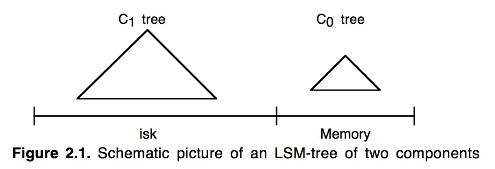

1.    导引

随着activity flow(活动流)管理系统中的long-lived(长生命期)事务的商业化使用，针对事务日志记录提供索引化的访问需求也在逐步增长。传统的，事务日志机制主要专注于失败和恢复，需要系统能够在偶然的事务回滚中可以回退到一个相对近期的正常历史状态，而恢复的执行则通过批量化的顺序读取完成。然而，随着系统需要管理越来越多的复杂行为，组成单个长生命期活动的事件的持续时间和个数也会增长到某种情况，在该情况下，需要实时查看已经完成的事务步骤以通知用户目前已经完成了哪些。与此同时，一个系统的处于活动状态的事件总数，也会增长到某种情况，在该情况下，用于记录活动日志的基于内存的数据结构开始无法工作，尽管内存价格的不断下降是可以预计的。这种对于过去的行为日志的查询需求，意味着索引化的日志访问将会越来越重要。

即使是对于当前的事务系统来说，如果对在具有高插入频率上的历史记录表上的查询提供了索引支持，其价值也是很明显的。网络应用，电子邮件，和其他的近事务系统通常会产生不利于它们的主机系统的大量日志。为了便于理解，还是从一个具体的大家都熟知的例子开始，在下面的例1.1和1.2中我们使用了一个修改版的TPC-A benchmark。需要注意的是，为了便于表述，本文中的例子都采用了一些特定的参数值，当然这些结果应该都很容易进行推广。还要指出的是，尽管历史记录表和日志都是一些时间序列相关的数据，LSM-Tree中的索引节点并不一定具有与之相同的key值顺序。唯一的假设就是与查询频率相比的高更新率。

5分钟法则

下面的两个例子都依赖于5分钟法则。该法则是说当页面访问频率超过每60秒就会被访问一次的频率后，可以通过加大内存来将页面保存到内存，以避免磁盘访问来降低系统总体开销。60秒在这里只是个近似值，实际上是磁盘提供每秒单次IO的平摊开销与每秒缓存4K bytes的磁盘页的内存开销的比值。用第3节的术语来说，就是COSTp/COSTm。在这里，我们会从经济学的角度上简单看下如何在磁盘访问和缓存在内存之间进行权衡。需要注意的是，由于内存价格与磁盘相比下降地更快，60秒这个值实际应该会随着时间而变大。但是在1995年的今天它是60秒，与1987年的5分钟相比，它却变小了，部分是因为技术性的(不同的缓存假设)原因，部分是因为介于二者之间的廉价量产磁盘的引入。

例1.1 考虑TPC-A benchmark中描述的每秒执行1000个事务(该频率可以被扩展，但是此处我们只考虑1000TPS)的多用户应用程序。每个事务会更新一个列值，从一个Balance列中取出数目为Delta的款项，对应的记录(row)是随机选定的并且具有100字节大小，涉及到三个表：具有1000条记录的Branch(分公司)表，具有10000条记录的Teller(出纳员)表，以及具有100,000,000条记录的Account表；更新完成之后，该事务在提交之前会向一个历史记录表中插入一条50字节的记录，该记录具有如下列：Account-ID，Branch-ID，Teller-ID，Delta和时间戳。

根据磁盘和内存成本计算下，可以看出Account表在未来的很多年内都不可能是内存驻留的，而Branch和Teller表目前是可以全部存入内存中的。在给定的假设下，对于Account表的同一个磁盘页的两次访问大概要间隔2500秒{!磁盘页是4K bytes，Account表每行是100bytes，这样每次读会涉及到4k/100=40条记录，TPS是1000,这样2500秒内读到的行数就是40*1000*2500=100,000,000。2500秒就是这么算出来的}，很明显这个值还未达到5分钟法则中缓存驻留所需要的访问频率。现在每次事务都需要大概两次磁盘IO，一次用于读取所需的Account记录(我们忽略那种页面已经被缓存的特殊情况)，一次用于将之前的一个脏的Account页写出来为读取腾出缓存空间(necessary for steady-status behavior)。因此1000TPS实际上对应着大概每秒2000个IO。如果磁盘的标称速率是25IO/s，那么这就需要80个磁盘驱动器，从1987年到如今(1995)的8年间磁盘速率(IOPS)每年才提高不到10%，因此现在IOPS大概是40IO/s，这样对于每秒2000次IO来说，就需要50个磁盘。对于TPC应用来说，磁盘的花费大概占了整个系统成本的一半，尽管在IBM的大型机系统中这个比例要低一些。然而，用于支持IO的开销很明显在整个系统成本中正在不断增长，因为内存和CPU成本下降地比磁盘要快。

例1.2 现在来考虑一个在具有高插入量的历史记录表上的索引，可以证明这样的一个索引将会使TPC应用的磁盘开销加倍。一个在“Account-ID+Timestamp”上的联合索引，是历史记录表能够对最近的account活动进行高效查询的关键，比如：

Select * from History

Where History.Acct-ID = %custacctid

And History.Timestamp > %custdatetime;

如果Acct-ID Timestamp索引不存在，这样的一个查询将需要搜索历史记录表中的所有记录，因此基本上是不可行的。如果只是在Acct-ID上建立索引，可以得到绝大部分的收益，但是即使将Timestamp排除，我们下面的那些开销考虑也不会发生变化{!即去掉Timestamp也不会省掉什么开销}，因此我们这里假设使用的是最有效的联合索引。那么实时地维护这样的一个B-树索引需要多少资源呢？可以知道，B树中的节点每秒会生成1000个，考虑一个20天的周期，每天8小时，每个节点16字节，这意味着将会有576,000,000{!1000*20*8*3600}个节点，占据的磁盘空间是9.2GBytes，即使是在没有浪费空间的情况下，整个索引的叶节点都大概需要2.3million个磁盘页。因为事务的Acct-ID值是随机选择的，每个事务至少需要一次读取，此外基本上还需要一次页面写入。根据5分钟法则，这些索引页面也不应该是内存驻留的(磁盘页大概每隔2300秒被读一次)，这样所有的IO都是针对磁盘的。这样针对Account表的更新，除了现有的2000IO/s就还需要额外的2000IO/s，也就需要再购买50个磁盘，这样磁盘的需求就加倍了。同时，这还是假设用于将日志文件索引维持在20天的长度上的删除操作，可以作为一个批处理任务在空闲时间执行。

现在我们已经分析了使用B-树来作为Acct-ID Timestamp索引的情况，因为它是当前商业系统中使用的最通用的基于磁盘的访问方法。事实上，也没有什么其他经典的磁盘索引结构可以提供更好的IO性价比。在第5节中我们还会讨论下如何得出这样的结论的。

本文提出的LSM-Tree访问方法使得我们可以使用更少的磁盘运动来执行在Acct-ID Timestamp上的频繁插入操作。LSM-Tree通过使用某种算法，该算法会对索引变更进行延迟及批量处理，并通过一种类似于归并排序的方式高效地将更新迁移到磁盘。正如我们将在第5节看到的，将索引节点放置到磁盘上的这一过程进行延迟处理，是最根本的，LSM-Tree结构通常就是包含了一系列延迟放置机制。LSM-Tree结构也支持其他的操作，比如删除，更新，甚至是那些具有long latency的查询操作。只有那些需要立即响应的查询会具有相对昂贵的开销。LSM-Tree的主要应用场景就是像例1.2那样的，查询频率远低于插入频率的情况(大多数人不会像开支票或存款那样经常查看自己的账号活动信息)。在这种情况下，最重要的是降低索引插入开销；与此同时，也必须要维护一个某种形式的索引，因为顺序搜索所有记录是不可能的。

在第2节，我们会引入2-组件LSM-Tree算法。在第3节，我们会分析下LSM-Tree的性能，并提出多组件LSM-Tree。在第4节，我们会描述下LSM-Tree的并发和恢复的概念。在第5节，我们会讨论下其他的一些访问方式，以及它们的性能。第6节是总结，我们会指出LSM-Tree的一些问题，并提出一些扩展建议。

2. 两组间LSM-Tree算法

LSM-Tree由两个或多个类树的数据结构组件构成。本节，我们只考虑简单的两个组件的情况，同时假设LSM-Tree索引的是例1.2中的历史记录表中的记录。如下图

在每条历史记录表中的记录生成时，会首先向一个日志文件中写入一个用于恢复该插入操作的日志记录。然后针对该历史记录表的实际索引节点会被插入到驻留在内存中的C0树，之后它将会在某个时间被移到磁盘上的C1树中。对于某条记录的检索，将会首先在C0中查找，然后是C1。在记录从C0移到C1中间肯定存在一定时间的延迟，这就要求能够恢复那些crash之前还未被移出到磁盘的记录。恢复机制将会在第4节讨论，现在我们只是简单地认为那些用于恢复插入的历史记录数据的日志记录可以被看做逻辑上的日志；在恢复期间我们可以重构出那些已经被插入的历史记录，同时可以重建出需要的那些记录并将这些记录进行索引以恢复C0丢失的内容。

向驻留在内存中的C0树插入一个索引条目不会花费任何IO开销。但是，用于保存C0的内存的成本要远高于磁盘，这就限制了它的大小。这就需要一种有效的方式来将记录迁移到驻留在更低成本的存储设备上的C1树中。为了实现这个目的，在当C0树因插入操作而达到接近某个上限的阈值大小时，就会启动一个rolling merge过程，来将某些连续的记录段从C0树中删除，并merge到磁盘上的C1树中。图2.2描述了这样的一个过程。

C1树具有一个类似于B-树的目录结构，但是它是为顺序性的磁盘访问优化过的，所有的节点都是100%满的，同时为了有效利用磁盘，在根节点之下的所有的单页面节点都会被打包(pack)放到连续的多页面磁盘块(multi-page block)上；类似的优化也被用在SB-树中。对于rolling merge和长的区间检索的情况将会使用multi-page block io，而在匹配性的查找中会使用单页面节点以最小化缓存需求。对于root之外的节点使用256Kbytes的multi-page block大小，对于root节点根据定义通常都只是单个的页面。

Rolling merge实际上由一系列的merge步骤组成。首先会读取一个包含了C1树中叶节点的multi-page block，这将会使C1中的一系列记录进入缓存。之后，每次merge将会直接从缓存中以磁盘页的大小读取C1的叶节点，将那些来自于叶节点的记录与从C0树中拿到的叶节点级的记录进行merge，这样就减少了C0的大小，同时在C1树中创建了一个新的merge好的叶节点。

merge之前的老的C1树节点被保存在缓存中的称为emptying block{!掏空ing，即该block中的那些节点正在被掏空}的multi-page block中，而新的叶节点会被写入到另一个称为filling block{!填充ing，即该block正在被不断地用新节点填充}的缓存中的multi-page block。当C1中新merge的节点填满filling block后，该block会被写入到磁盘上的新空闲区域中。如果从图2.2中看的话，包含了merge结果的新的multi-page block位于图中老节点的右侧。后续的merge步骤会随着C0和C1的索引值的增加而发生，当达到阈值时，就又会从最小值开始启动rolling merge过程。

新的merge后的blocks会被写入到新的磁盘位置上，这样老的blocks就不会被覆盖，这样在crash发生后的恢复中就是可用的。C1中的父目录节点也会被缓存在内存中，此时也会被更新以反映出叶节点的变动，同时父节点还会在内存中停留一段时间以最小化IO；当merge步骤完成后，C1中的老的叶节点就会变为无效状态，之后会被从C1目录结构中删除。通常，每次都是C1中的最左边的叶节点记录参与merge，因为如果老的叶节点都是空的那么merge步骤也就不会产生新的节点，这样也就没有必要进行。除了更新后的目录节点信息外，这些最左边的记录在被写入到磁盘之前也会在内存中缓存一段时间。用于提供在merge阶段的并发访问和从crash后的内存丢失中进行恢复的技术将会在第4节详细介绍。为了减少恢复时的重构时间，merge过程需要进行周期性的checkpoints，强制将缓存信息写入磁盘。

2.1 How a Two Component LSM-Tree Grows

为了追踪LSM-tree从诞生那一刻开始的整个变化过程，我们从针对C0的第一次插入开始。与C1树不同，C0树不一定要具有一个类B-树的结构。首先，它的节点可以具有任意大小：没有必要让它与磁盘页面大小保持一致，因为C0树永不会位于磁盘上，因此我们就没有必要为了最小化树的深度而牺牲CPU的效率{!如果看下B-树，就可以知道实际上它为了降低树的高度，牺牲了CPU效率。在当整个数据结构都是在内存中时，与二分查找相比，B-树在查找时，在节点内部的比较，实际上退化成了顺序查找，这样它查找一个节点所需的比较次数实际上要大于AVL的比较次数}。这样，一个2-3树或者是AVL树就可以作为C0树使用的一个数据结构。当C0首次增长到它的阈值大小时，最左边的一系列记录将会从C0中删除(这应是以批量处理的模式完成，而不是一次一条记录)，然后被重新组织成C1中的一个100%满的叶子节点。后续的叶节点会按照从左到右的顺序放到缓存中的一个multi-page block的初始页面中，直到该block填满为止；之后，该block会被写到磁盘中，成为C1树的磁盘上的叶级存储的第一部分。随着后续的叶节点的加入，C1树会创建出一个目录节点结构，具体细节如下。

C1树的叶节点级的后续multi-page block会按照键值递增的顺序被写入到磁盘中，以防止C0树大小超过阈值。C1树的上级目录节点被存放在独立的multi-page block buffers或者是单页面缓存中，无论存在哪里，都是为了更好地利用内存和磁盘；目录节点中的记录包含一些分隔点，通过这些分隔点可以将用户访问导引到单个的singe-page节点中，像B-树那样。通过这种指向叶级节点的single-page索引节点可以提供高效的精确匹配访问，避免了multi-page block的读取，这样就最小化了缓存需求。这样在进行rolling merge或者按range检索时才会读写multi-page block，对于索引化的查询(精确匹配)访问则读写singe-page节点。[22]中提出了一种与之类似但又稍有不同的结构。在一系列叶级节点blocks被写出时，那些由C1的目录节点组成的还未满的multi-page block可以保留在缓存中。在如下情况下，C1的目录节点会被强制写入磁盘：

1.由目录节点组成的某个multi-page block被填满了

2.根节点发生了分裂，增加了C1树的深度(成了一个大于2的深度)

3.执行Checkpoint

ck会被写出到磁盘。对于后两个情况，所有的multi-page block buffers和目录节点buffers都会被flush到磁盘。

当C0树的最右边的叶节点记录首次被写出到C1树后，整个过程就又会从两个树的最左端开始，只是从现在开始，需要先把C1中的叶子级别的multi-page block读入到buffer，然后与C0树中的记录进行merge，产生出需要写入到磁盘的新的C1的multi-page leaf block。

一旦merge过程开始，情况就变地更复杂了。我们可以把整个两组件LSM-tree的rolling merge过程想象成一个具有一定步长的游标循环往复地穿越在C0和C1的键值对上，不断地从C0中取出数据放入到磁盘上才C1中。该rolling merge游标在C1树的叶节点和更上层的目录级都会有一个逻辑上的位置。在每个层级上，所有当前正在参与merge的multi-page blocks将会被分成两个blocks：”emptying block”-它内部的记录正在搬出，但是还有一些信息是merge游标所未到达的，”filling block”-反映了此刻的merge结果。类似地，该游标也会定义出”emptying node”和”filling node”，这两个节点此刻肯定是已在缓存中。为了可以进行并发访问，每个层级上的”emptying block”和”filling block”包含整数个的page-sized C1树节点。(在对执行节点进行重组的merge步骤中，针对这些节点的内部记录的其他类型的并行访问将会被阻塞)。当所有被缓存的节点需要被flush到磁盘时，每个层级的所有被缓存的信息必须被写入到磁盘上的新的位置上(同时这些位置信息需要反映在上层目录信息中，同时为了进行恢复还需要产生一条日志记录)。此后，当C1树某一层级的缓存中的filling block被填满及需要再次flush时，它会被放到新的磁盘位置上。那些可能在恢复过程中需要的老的信息永不会被覆盖，只有当后续的写入提供了足够信息时它们才可以宣告失效。第4节来还会进行一些关于roling merge过程的更细节的解释，在那一节里还会考虑关于并发访问和恢复机制的设计。

在C1的某个层级上的rolling merge过程，需要很高的节点传输速率时，所有的读写都是以multi-page blocks为单位进行的，对于LSM-tree来说，这是一个很重要的效率上的优化。通过减少寻道时间和旋转延迟，我们认为与普通的B-树节点插入所产生的随机IO相比，这样做可以得到更大的优势(我们将会在3.2节讨论其中的优势)。总是以multi-page blocks为单位进行写入的想法源自于由Rosenblum和Ousterhout发明的Log-Structured File System，Log-Structured Merge-tree的叫法也源于此。需要注意的是，对于新的multi-page blocks的写入使用连续的新的磁盘空间，这就意味着必须对磁盘区域进行包装管理，旧的被丢弃的blocks必须能被重用。使用记录可以通过一个内存表来管理；旧的multi-page blocks作为单个单元被置为无效和重用，通过checkpoint来进行恢复。在Log-Structured File System中，旧的block的重用会引入显著的IO开销，因为blocks通常是半空的，这样重用就需要针对该block的一次读取和写入。在LSM-tree中，blocks是完全空的，因此不需要额外的IO。

2.2 Finds in the LSM-tree index

当在LSM-tree index上执行一个需要理解响应的精确匹配查询或者range查询时，首先会到C0中查找所需的那个或那些值，然后是C1中。这意味着与B-树相比，会有一些额外的CPU开销，因为现在需要去两个目录中搜索。对于那些具有超过两个组件的LSM-tree来说，还会有IO上的开销。先稍微讲一下第3章的内容，我们将一个具有组件C0，C1，C2…Ck-1和Ck的多组件LSM-tree，索引树的大小伴随着下标的增加而增大，其中C0是驻留在内存中的，其他则是在磁盘上。在所有的组件对(Ci-1,Ci)之间都有一个异步的rolling merge过程负责在较小的组件Ci-1超过阈值大小时，将它的记录移到Ci中。一般来说，为了保证LSM-tree中的所有记录都会被检查到，对于一个精确匹配查询和range查询来说，需要访问所有的Ci组件。当然，也存在很多优化方法，可以使搜索限制在这些组件的一个子集上。

首先，如果生成逻辑可以保证索引值是唯一的，比如使用时间戳来进行标识时，如果一个匹配查找已经在一个早期的Ci组件中找到时那么它就可以宣告完成了。再比如，如果查询条件里使用了最近时间戳，那么我们可以让那些查找到的值不要向最大的组件中移动。当merge游标扫描(Ci,Ci+1)对时，我们可以让那些最近某个时间段(比如τi秒)内的值依然保留在Ci中，只把那些老记录移入到Ci+1。在那些最常访问的值都是最近插入的值的情况下，很多查询只需要访问C0就可以完成，这样C0实际上就承担了一个内存缓冲区的功能。[23]中也使用了这一点，同时这也是一种重要的性能优化。比如，用于短期事务UNDO日志的索引访问模式，在中断事件发生时，通常都是针对相对近期的数据的访问，这样大部分的索引就都会是仍处在内存中。通过记录每个事务的启动时间，就可以保证所有最近的τ0秒内发生的事务的所有日志都可以在C0中找到，而不需要访问磁盘组件。

2.3 Deletes，Updates and Long-Latency Finds in the LSM-tree

需要指出的是删除操作可以像插入操作那样享受到延迟和批量处理带来的好处。当某个被索引的行被删除时，如果该记录在C0树中对应的位置上不存在，那么可以将一个删除标记记录(delete node entry)放到该位置，该标记记录也是通过相同的key值进行索引，同时指出将要被删除的记录的Row ID(RID)。实际的删除可以在后面的rolling merge过程中碰到实际的那个索引entry时执行：也就是说delete node entry会在merge过程中移到更大的组件中，同时当碰到相关联的那个entry，就将其清除。与此同时，查询请求也必须在通过该删除标记时进行过滤，以避免返回一个已经被删除的记录。该过滤很容易进行，因为删除标记就是位于它所标识的那个entry所应在的位置上，同时在很多情况下，这种过滤还起到了减少判定记录是否被删除所需的开销{!比如对于一个实际不存在的记录的查找，如果没有该删除标记，需要搜索到最大的那个Ci组件为止，但是如果存在一个删除标记，那么在碰到该标记后就可以停止了}。对于任何应用来说，那些会导致索引值发生变化{!比如一条记录包含了ID和name，同时是以ID进行索引的，那么如果是name更新了，很容易，只需要对该记录进行一个原地改动即可，但是如果是ID该了，那么该记录在索引中的位置就要调整了，因此是很棘手的}的更新都是不平凡的，但是这样的更新却可以被LSM-tree一招化解，通过将该更新操作看做是一个删除操作+一个插入操作。

还可以提供另一种类型的操作，可以用于高效地更新索引。一个称为断言式删除(predicate deletion)的过程，提供了一种通过简单地声明一个断言，就可以执行批量删除的操作方式。比如这样的一个断言，删除那些时间戳超过20天的所有的索引值。当位于最大组件里的受断言影响的记录，通过日常的rolling merge过程进入到内存时，就可以简单地将他们丢弃来实现删除。另一种类型的操作，long-latency find，对于那些可以等待很长时间(所需等待的时间实际上是由最慢的那个merge游标的速度决定的)的查询来说，它提供了一种高效地响应方式。通过向C0中插入一个find note entry，它被移入到更大的组件的过程实际上也就是该查询执行的过程，一旦该find note entry到达了LSM-tree中最大的那个组件的对应位置，该long-latency find所对应的那些匹配的RID列表也就生成完毕了。

3 Cost-Performance and the Multi-Component LSM-Tree
本节我们会从一个两组件LSM-tree开始分析下LSM-tree的性价比。同时会将LSM-tree与具有与之类似的索引规模的B-树进行对比，比较下它们在大量插入操作下的IO资源利用情况。正如我们将在第5节所述的那样，其他的基于磁盘的访问方式在插入新索引节点所需的IO开销上都基本上与B-树类似。我们在此处对LSM-tree和B-树进行比较的最重要的原因是这两个结构很容易比较，它们都在叶子节点上为每个以特定顺序索引的记录行保存了一个entry，同时上层目录信息可以沿着一系列页面大小的节点将各种访问操作进行指引。通过与低效但是很好理解的B-树的对比分析，对于LSM-tree在新节点插入上的所具有的IO优势的分析，可以更好地进行表达。

在3.2节中，我们会比较IO开销，并将证明两组件LSM-tree的开销与B-树的开销的比值实际上两个因子的乘积{!即3.2节中的公式3.4}。第一个因子， ，代表了LSM-tree通过将所有的IO以multi-page blocks进行得到的优势，这样通过节省大量的寻道和旋转延迟可以更有效地利用磁盘磁臂。COSTπ代表了磁盘以multi-page blocks为单位读写一个page时的开销，COSTp则代表了随机读写一个page时的开销。第二个因子是1/M，代表了在merge过程中的批量处理模式带来的效率提升。M是从C0中merge到C1中的一个page-sized的叶节点中的记录的平均数目。对于B树来说，每条记录的插入通常需要对该记录所属的节点进行两次IO(一次读出一次写入)，与此相比，可以向每个叶子中一次插入多条记录就是一个优势。根据5分钟法则，例1.2中的叶子节点在从B树中读入后之后短暂地在内存中停留，在它被再一次使用时它已不在内存了。因此对于B树索引来说就没有一种批量处理的优势：每个叶节点被读入内存，然后插入一条记录，然后写出去。但是在一个LSM-tree中，只要与C1组件相比C0组件足够大，总是会有一个批量处理效果。比如，对于16字节的索引记录大小来说，在一个4Kbytes的节点中将会有250条记录。如果C0组件的大小是C1的1/25，那么在每个具有250条记录的C1节点的Node IO中，将会有10条是新记录{!也就是说在此次merge产生个node中有10条是在C0中的，而C0中的记录则是用户之前插入的，这相当于将用户的插入先暂存到C0中，然后延迟到merge时写入磁盘，这样这一次的Node IO实际上消化了用户之前的10次插入，的确是将插入批量化了}。很明显，由于这两个因素，与B-树相比LSM-tree效率更高，而rolling merge过程则是其中的关键。

用来代表multi-page block比single-page的优势之处的实际上是个常量，为了使它生效我们无需对LSM-tree的结构进行任何处理。但是merge中的1/M的批量模式效率是跟C0和C1的大小之比成比例的；与C1相比，C0越大，效果越好；某种程度上说，这意味着我们可以通过使用更大的C0来节省额外的磁盘磁臂开销，但是这也需要更大的内存开销来容纳下C0组件。这也是在使用LSM-tree时需要考虑的，会在3.3节中对此进行研究。一个三组件LSM-tree具有一个内存组件C0和两个基于磁盘的组件C1和C2，并且随着组件大小随下标增加而增大。这样，除了C0和C1之间会有一个rolling merge过程，在C1和C2之间也会存在一个rolling merge过程，来负责在小的组件达到阈值大小时，将记录从小的组件中移到大的组件中。三组件LSM-tree的优势在于，它可以通过选择C1的大小来实现C0和C1以及C1和C2之间的比率大小来提高批处理效率。这样C0的大小就可以变得更小，可以大大地降低开销。{!因为在只有C0和C1的情况下，C1的大小有一个硬性要求，它必须能够容得下所有的记录，这样C0的大小选择就没有多少自由，而引人C2后，我们可以利用C2来保证可以存储下所有的记录，而C1就可以用来调整与C0的比例，而它就可以小点，这样由于目标是为了让C0/(C1+C0)尽量小，那么C0也可以变得小点就可以达到两组件下的效果}。

总结：为什么使用多组件？因为当C0相对于C1太小时，如果只使用两组间，批处理效果比较差。由于C1中一个叶节点一次性写入，所以批处理的效果 = C1叶节点中记录数量 * (C0 / C1)（参考上文第3节）
