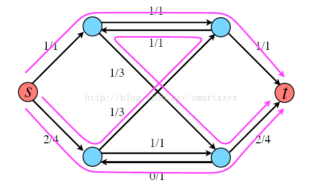
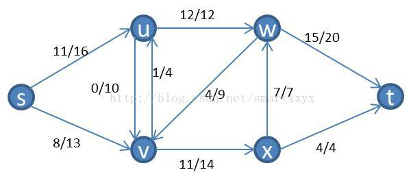
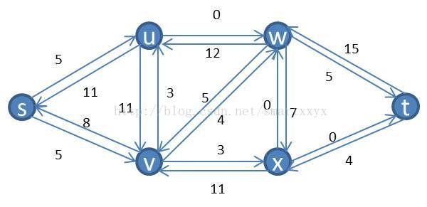
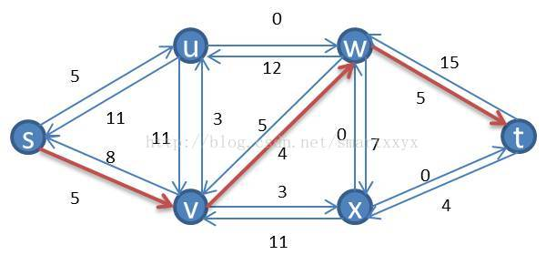
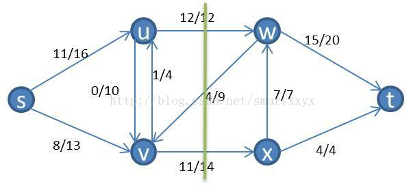
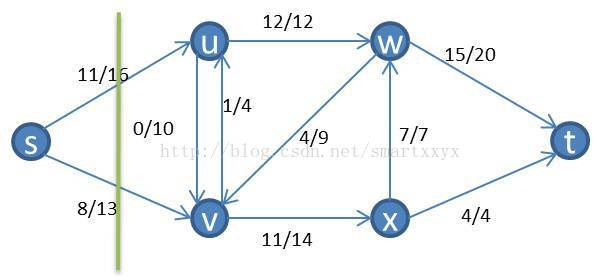
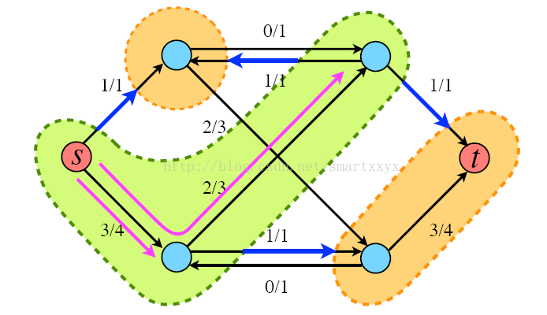

本文主要讲解最大流问题的Ford-Fulkerson解法。可以说这是一种方法，而不是算法，因为它包含具有不同运行时间的几种实现。该方法依赖于三种重要思想：残留网络，增广路径和割。

在介绍着三种概念之前，我们先简单介绍下Ford-Fulkerson方法的基本思想。首先需要了解的是Ford-Fulkerson是一种迭代的方法。开始时，对所有的u,v属于V，f(u,v)=0(这里f(u,v)代表u到v的边当前流量)，即初始状态时流的值为0。在每次迭代中，可以通过寻找一个“增广路径”来增加流值。增广路径可以看做是从源点s到汇点t之间的一条路径，沿该路径可以压入更多的流，从而增加流的值。反复进行这一过程，直到增广路径都被找出为止。

举个例子来说明下，如图所示，每条红线就代表了一条增广路径，当前s到t的流量为3。



当然这并不是该网络的最大流，根据寻找增广路径的算法我们其实还可以继续寻找增广路径，最终的最大流网络如下图所示，最大流为4。


接下来我们就介绍如何寻找增广路径。在介绍增广路径之前，我们首先需要介绍残留网络的概念。

# 残留网络

顾名思义，残留网络是指给定网络和一个流，其对应还可以容纳的流组成的网络。具体说来，就是假定一个网络G=（V，E），其源点s，汇点t。设f为G中的一个流，对应顶点u到顶点v的流。在不超过C（u，v）的条件下（C代表边容量），从u到v之间可以压入的额外网络流量，就是边（u，v）的残余容量（residual capacity），定义如下：

r（u，v）=c（u，v）-f（u，v）

举个例子，假设（u，v）当前流量为3/4，那么就是说c（u，v）=4，f（u，v）=3，那么r（u，v）=1。

我们知道，在网络流中还有这么一条规律。从u到v已经有了3个单位流量，那么从反方向上看，也就是从v到u就有了3个单位的残留网络，这时r（v，u）=3。可以这样理解，从u到v有3个单位流量，那么从v到u就有了将这3个单位流量的压回去的能力。

我们来具体看一个例子，如下图所示一个流网络



其对应的残留网络为：



# 增广路径

在了解了残留网络后，我们来介绍增广路径。已知一个流网络G和流f，增广路径p是其残留网络Gf中从s到t的一条简单路径。形象的理解为从s到t存在一条不违反边容量的路径，向这条路径压入流量，可以增加整个网络的流值。上面的残留网络中，存在这样一条增广路径：



其可以压入4个单位的流量，压入后，我们得到一个新的流网络，其流量比原来的流网络要多4。这时我们继续在新的流网络上用同样的方法寻找增广路径，直到找不到为止。这时我们就得到了一个最大的网络流。

# 流网络的割

上面仅仅是介绍了方法，可是怎么证明当无法再寻找到增广路径时，就证明当前网络是最大流网络呢？这就需要用到最大流最小割定理。

首先介绍下，割的概念。流网络G（V，E）的割（S，T）将V划分为S和T=V-S两部分，使得s属于S，t属于T。割（S，T）的容量是指从集合S到集合T的所有边（有方向）的容量之和（不算反方向的，必须是S-àT）。如果f是一个流，则穿过割（S，T）的净流量被定义为f（S，T）（包括反向的，SàT的为正值，T—>S的负值）。将上面举的例子继续拿来，随便画一个割，如下图所示：



割的容量就是c(u,w)+c(v,x)=26

当前流网络的穿过割的净流量为f(u,w)+f(v,x)-f(w,v)=12+11-4=19

显然，我们有对任意一个割，穿过该割的净流量上界就是该割的容量，即不可能超过割的容量。所以网络的最大流必然无法超过网络的最小割。

可是，这跟残留网络上的增广路径有什么关系呢？

首先，我们必须了解一个特性，根据上一篇文章中讲到的最大流问题的线性规划表示时，提到，流网络的流量守恒的原则，根据这个原则我们可以知道，对网络的任意割，其净流量的都是相等的。具体证明是不难的，可以通过下图形象的理解下，



和上面的割相比，集合S中少了u和v，从源点s到集合T的净流量都流向了u和v，而在上一个割图中，集合S到集合T的流量是等于u和v到集合T的净流量的。其中w也有流流向了u和v，而这部分流无法流向源点s，因为没有路径，所以最后这部分流量加上s到u和v的流量，在u和v之间无论如何互相传递流，最终都要流向集合T，所以这个流量值是等于s流向u和v的值的。将s比喻成一个水龙头，u和v流向别处的水流，都是来自s的，其自身不可能创造水流。所以任意割的净流量都是相等的。

万事俱备，现在来证明当残留网络Gf中不包含增广路径时，f是G的最大流。

假设Gf中不包含增广路径，即Gf不包含从s到v的路径，定义S={v:Gf中从s到v存在一条通路}，也就是Gf中s能够有通路到达的点的集合，显然这个集合不包括t，因为s到t没有通路。这时，我们令T=V-S。那么（S，T）就是一个割。如下图所示：



	那么，对于顶点u属于S，v属于T，有f（u，v）=c（u，v）。否则（u，v）就存在残余流量，因而s到u加上u到v就构成了一条s到v的通路，所以v就必须属于S，矛盾。因此这时就表明当前流f是等于当前的割的容量的，因此f就是最大流。

# 伪代码

Ford-Fulkerson方法的伪代码如下。其中<u,v>代表顶点u到顶点v的一条边，<u,v>.f表示该边的流量，c是边容量矩阵，c(i,j)表示边<i,j>的容量，当边<i,j>不存在时，c(i,j)=0。e为残存网络矩阵，e(i,j)表示边<i,j>的值，当边<i,j>不存在时，e(i,j)=0。E表示边的集合。f表示流网络。

```
Ford-Fulkerson:
 
    for <u,v> ∈ E
        <u,v>.f = 0

    while find a route from s to t in e
        m = min(<u,v>.f, <u,v>  ∈ route)
        for <u,v> ∈ route
            if <u,v>  ∈ f
                <u,v>.f = <u,v>.f + m
            else
                <v,u>.f = <v,u>.f - m
```

Ford-Fulkerson方法首先对图中的所有边的流量初始化为零值，然后开始进入循环：如果在残存网络中可以找到一条从s到t的增广路径，那么要找到这条这条路径上值最小的边，然后根据该值来更新流网络。

# Reference

https://www.cnblogs.com/DarrenChan/p/9563511.html
