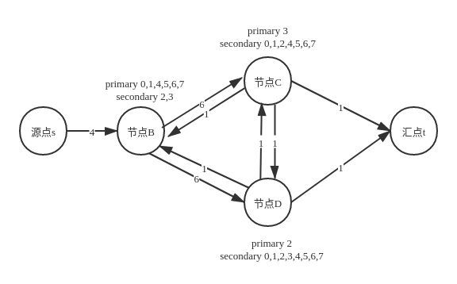

## 理论背景

在当前pegasus balancer的实现中，meta server会定期对所有replica server节点的replica情况做评估，当其认为replica在节点分布不均衡时，会将相应replica进行迁移。

在balancer生成决策过程中需要考虑的因素有：
* 对于任意表，其partition在节点上的分布要均衡，这其中包括如下几个方面：
	* 某个partition的三个副本不能全部落在一个节点上
	* primary的数量要均摊
	* secondary的数量也要均摊
* 如果发现**primary**分配不均衡时，首先考虑的策略应该是对primary进行角色切换，而不是直接就进行数据拷贝
* 不仅要考虑节点间的负载均衡，也要尽量保证节点内各个磁盘的replica个数是均衡的

### 优化Ford-Fulkerson

上面讲到，当primary分布不均衡时，首先考虑的策略是对进行角色切换，也就是说，需要寻找到一条从路径，将primary从“多方”迁移到“少方”。将迁移的primary数量作为流量，很自然的我们就想到了Ford-Fulkerson，即：
1. 寻找一条从source到sink的增广路径
2. 按照增广路径修改各边权重，形成残差网络
3. 在残差网络中继续步骤1，直到找不到增广路径为止。

但是我们又不能直接套用Ford-Fulkerson。原因在于第2步中，按照Ford-Fulkerson，增广路上的一条权重为x的边意味着从A流向B的primary的个数为x，此时形成残差网络中，该边的权重需要减去x，然而其反向边也同时增加x（反向边的作用用于提供一个调整的机会，因为之前形成的增广路径很有可能不是最大流，该反向边用于调整此前形成的增广路径，具体参考Ford-Fulkerson算法）。但是在我们的模型中，反向边增加x是不合理的，例如，对于Partition[Primary: A, Secondary: (B, C)]，Primary从A向B流动，最终使得Partition成为[Primary: B, Secondary: (A, C)]，这时意味着：
* A到B的流量减少
* A到C的流量减少
* B到A的流量增加
* B到C的流量增加

这显然与Ford-Fulkerson的残差网络的反向边的权重变化是不同的。
所以我们将算法修改如下：
1. 按照当前的partition分布生成图结构，并根据Ford-Fulkerson算法，找到一条增广路径
2. 根据找到的增广路径，构造primary角色切换的决策动作。并在集群中执行该动作，生成新的partition分布
3. 根据新的partition分布，迭代步骤1，一直到不能找到增广路径

从上面可以看出，该算法主要是对第2步进行了修改，并非像Ford-Fulkerson算法那样简单的进行边权重修改。

***NOTE***：我们在执行Ford-Fulkerson进行primary迁移的时候，是针对单个表的，也就是说构造网络、执行角色切换都是针对单个表的，当要对多个表进行迁移，则只要循环对所有表各执行上述流程就可以了。

当然，有可能我们执行完上述算法后，集群负载仍然不平衡，此时说明通过primary切换已经无法达到集群平衡了，那么接下来就必须要进行primary迁移了(即背景介绍中讲到的进行数据拷贝)。
同样，在执行完primary迁移后，也要对secondary进行迁移。但是secondary迁移就不用像primary这么复杂还要考虑角色切换了（因为在做primary迁移时能切换的已经切换过了），此时直接进行数据拷贝就可以了。
下面我们分别对这几个点进行详细讲解。

## Primary负载均衡
Primary角色切换是Pegasus balancer整体逻辑的核心部分，先看一下这一块是如何实现的。

### 构造Ford-Fulkerson图

根据上文所述，primary角色切换采用的是改进Ford-Fulkerson来实现的，Ford-Fulkerson执行的第一步就是要构造partition分布图，其构造方式如下：
* 记N为某个表partition的数目，M为replica server节点数目
* 图中增加两个点source和sink，分别代表源点和汇点
* 如果某个节点A上primary的数目x >= N/M, 则从source到A添加一条有向边，边的权重为x - N/M，表示可以从该节点向外流出x - N/M个primary；反之，如果节点B上的primary数目y < N/M，则添加一条B到sink的有向边，其权重为N/M - y，表示可以向B流入N/M - y个primary
* 如果节点A上有一个primary，其对应的secondary在结点B上，则为A->B的有向边的权重+1



上图所示为在3 replica server集群上，一个8分片表的图情况：
* 由于N=8, M=3，则N/M = 2
* 由于只有节点B上的primary数量>2，则源点只指向B，其权重为B节点上的primary数量 - N/M = 6 - 2 = 4；其他节点则指向汇点t，其权重均为1
* 节点B上有6个primary其相应的secondary在C和D上，所以B->C和B->D上权重等于6。同理可以得出D->B, C->D, D->C的权重均为1

### 获取增广路径

对于获取增广路径，有很多中不同的方法，这里我们采取的改进dijstra算法。众所周知dijstra算法是一种贪心策略，在这里依然依据贪心算法进行修改。主要改动点有如下两点：
1. 对于所有未访问过的节点，依据贪心算法，获取源节点到这些节点的容量，最后选取拥有最大容量的点。由于我们是获取最大流，而dijstra却是获取最短路径，所以在选取节点的时候与dijstra策略稍有不同。
2. 根据获取到的节点，更新源节点到所有节点的流量。由于增广路的流量等于该路径上所有边容量的最小值，所以这里更新的时候与dijstra也有所不同。

这里粘贴上代码，并加上必要的注释以帮助理解
```c++
void shortest_path(std::vector<bool> &visit,
                             std::vector<int> &flow,
                             std::vector<int> &prev,
                             std::vector<std::vector<int>> &network)
{
    int pos, max_value;
    flow[0] = INT_MAX;

    int graph_nodes = network.size();
    while (!visit[graph_nodes - 1]) {
        pos = -1, max_value = 0;
        for (int i = 0; i != graph_nodes; ++i) {
		    // 在这里获取拥有最大流的节点，用于满足1
            if (visit[i] == false && flow[i] > max_value) {
                pos = i;
                max_value = flow[i];
            }
        }

        if (pos == -1)
            break;

        visit[pos] = true;
        for (int i = 0; i != graph_nodes; ++i) {
		    // 这里的条件主要用于满足2，也就是说，已经获取了最大流节点了，根据其去更新其他源节点到其他节点的流
            if (!visit[i] && std::min(flow[pos], network[pos][i]) > flow[i]) {
                flow[i] = std::min(flow[pos], network[pos][i]);
                prev[i] = pos;
            }
        }
    }
}
```

### primary角色切换

当获取到增广路径之后，接下来的工作则是按照获取到的路径进行primary角色切换了。在了解具体算法前，先看一下几个变量与结构的定义：
1. typedef std::map<std::string, int> disk_load: 表示磁盘负载，其key是disk tag，value则是该磁盘上的primary/partition count
2. std::vector\<int\> prev: 表示该增广路径，prev[i]表示该路径上节点i的前置节点

算法具体执行步骤如下：
1. 依次遍历增广路径中的每个节点(current)，并获取其在增广路径上的相邻节点(prev)
2. 获取current和prev两个节点的磁盘负载(disk_load *current_load和disk_load *prev_load)
3. 对prev中的每一个primary，查找其在current中是否有相应的secondary，如果有的话，则将该primary放入到potential_moving中，表示有可能move的primary
4. 通过增广路径，可以获取到从prev应该move多少个primary到current上(plan_moving)
5. 对于potential_moving中的所有的primary，选择plan_moving个磁盘负载差最大的primary(prev中primary所在的磁盘的负载 - current中相应的secondary所载磁盘的负载)，将选择出来的这些primary进行角色切换。这样选择的优点是不仅可以优化节点间的负载，同时还可以兼顾到磁盘的负载

### copy primary

当没有成功获取增广路径时，则说明简单通过角色切换的方式已经无法达到负载均衡了，必须通过迁移primary来实现了。
迁移primary算法的实现相对简单，其具体执行步骤如下：
1. 将节点按照primary数量按从小到大排序，得到pri_queue
2. 对pri_queue上，id_min始终指向pri_queue的头结点，id_max始终指向pri_queue的尾节点，如下图所示:
```
    +------+------+------+------+------+------+------+------+
    |							 |
    V				       			 V
id_min 					              id_max
```
3. 对当前id_max上的所有primary，分别找到其对应的磁盘并获取其磁盘负载，选择负载最大的磁盘及其对应的primary，进行迁移
4. 对当前id_min/id_max指向的primary数量分别+1/-1。重新排序，并循环执行上述步骤，直到id_min节点上的primary数量 >= N/M，此时说明达到了平衡

***NOTE：*** 上述构建图、查找增广路径、move  primary和copy primary步骤都是针对一个表进行的操作，对于集群上的多个表，都要执行一次上述步骤。

## Secondary负载均衡
上述讲解了primary负载均衡，当然secondary也同样需要负载均衡，否则的话可能会出现不同节点上primary均衡，但是partition总数不均衡的情况。
因为在做primary迁移时已经做过角色切换了，secondary迁移就不用像primary这么复杂，不用考虑角色切换的问题了。此时直接进行copy就可以。因此secondary的负载均衡，直接采用copy primary一样的算法实现，这里不再赘述。
同理，secondary也要对所有表分别进行负载均衡。

## Conlusion
对所有表执行完上述步骤也只是查找了一次增广路径而已，我们知道对于最大流问题，可能要查找多个增广路径才能够真正找到最大流。所以我们需要根据执行后集群是否处于load balance的状态来判断是否还要继续查找增广路径。
