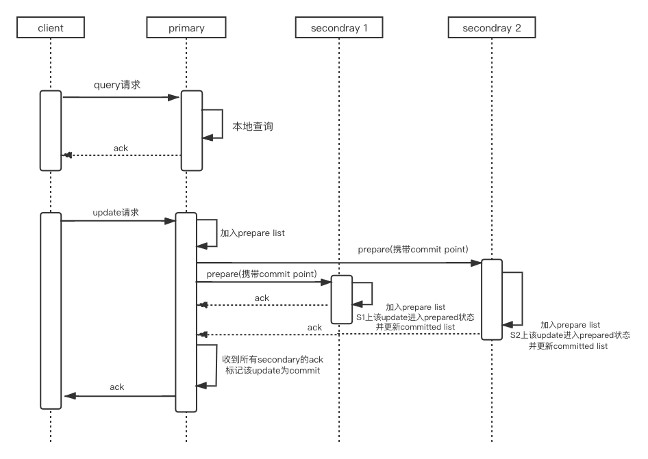
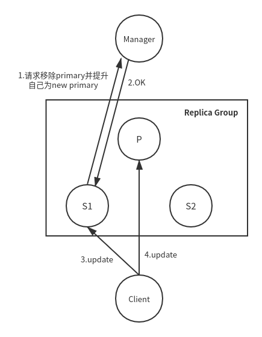

PacificA是微软实现的一款强一致性的分布式共识协议，具有简单易实现、可用性高的优点

本篇文章的内容都是从微软发布的《[PacificA: Replicationi in Log-Based Distributed Storage System](https://www.microsoft.com/en-us/research/wp-content/uploads/2008/02/tr-2008-25.pdf)》总结而来，如有疑惑请移步。

## 前提条件
对于PacificA，需要系统满足下述条件：
1. server可能发生故障，但是只有fail-stop故障，不能是fail-slow
2. message可以被丢弃或者乱序，但是不能被修改
3. 网络分区可能发生
4. 不同服务器上的时钟不一定同步，甚至不一定是松散同步的，但是时间漂移有上限

## primary/backup结构

如上图所示，PacificA采取了primary-backup结构。同时我们将客户端请求分为两种：query和update。其中query不会更新数据、而update则会更新。

当一个replica group中的所有server都按照相同的顺序处理请求时，强一致性便可以得到保证。对于update请求，primary为其分配一个单调并连续增长的sn编号，并指示所有的secondary按照编号顺序执行update请求。我们为每个replica维护了一个prepare list和commit point，该prepare list是按照sn排序的。在prepare list中commit point之前的部分叫做committed list。committed list中的数据保证不会丢失（除非系统发生不可忍受的故障，即发生了所有replica的永久性故障）。

在primary-backup模型中，所有的请求都会发送给primary。对于query请求，primary只需要本地处理就可以了，其获取当前最新的数据返回给客户端。但是对于update请求则需要所有的secondary都参与进来。其具体时序图如下：

由于：
- 只有当所有的secondary将该请求加入到prepare list中的之后，primary才会将其加入到committed list中，并且，
- 只有primary将该请求加入到committed list之后，secondary才会将其加入到committed list

所以，我们可以得到如下结论，我们称之为Commit Invariant。

***Commit Invariant***：Let p be the primary and q be any replica in the current configuration, committed(q) ⊆ committed(p) ⊆ prepared(q) holds.

在我们的replication模型里将数据管理和配置管理分割开来，接下来我们将看一下配置管理。

## 配置管理
在我们的系统中，有一个叫做global configuration manager的组件存在，他用来管理所有replica group的配置，他保存当前的配置及其版本号。

一个server可以根据failure detection探测到某个replica下线而删除某一个replica，相反也可以添加一个replica。这时该server需要将修改后的配置文件和当前配置的版本号发送给configuration manager。当版本号和configuration manager保存的版本号匹配时，新的配置将被采纳并将配置版本号+1

当发生网络分区时，配置冲突将会发生：primary尝试删除secondary；而secondary则尝试将自己提升为primary。此时configuration manager将如何处理这种情况呢？其实很简单，configuration manager只需要接收最早来的请求，而不管是primary发送来的、还是secondary发送来的。此时其接收到最早来的请求之后，会更新其本地保存的版本号，所以第二个之后来的请求都将会被拒绝。

任何遵从Primary Invariant的错误探测机制都可以用来删除一个replica:

*** Primary Invariant***: At any time, a server p considers itself a primary only if the configuration manager has p as the primary in the current configuration it maintains. Hence, at any time, there exists at most one server that considers itself a primary for the replica group.

## 租期和错误探测
即使有configuration manager来维护当前配置，但是Primary Invariant也不一定能够保证。

例如:
1. 由于网络抖动，s1将自己提升为primary，manager接受了
2. 此时old primary并不知情，仍然在处理请求
3. 假如old primary处理读，new primary在处理写，此时从old primary读取的数据有可能是旧值

这显然违反了强一致性。导致这个问题的根本原因是不同server上的配置文件的local view不一定相同，也就是说，有可能某些server上保存的是旧版本的配置文件、而没来得及更新。

为了解决这个问题采用了以租期为基础的错误探测机制。

在一个租期内，primary定期的向secondary发送beacons，并等待其acknowledge。如果在一个固定的时间(lease period)内没有收到acknowledge，那么***primary则认为自己的租期已经结束了***，此时primary将停止处理任何请求并且联系configuration manager去移除相应的secondary。由于primary及时将自己租期结束，从而避免了old primary和新primary同时存在。

另外，对于secondary如果在一定时间(grace period)内没有收到来自primary的beacon，那么其同样会通知configuration manager，令其移除primary并令自己成为新的primary。

如果lease period <= grace period，那么primary的响应一定是要早于secondary的，那么如果primary没有挂掉的话，其发送给configuration manager的配置请求总是会被接收，而secondary发送给configuration manager的配置请求将会被拒绝。也就是说: primary将自己置为不可用一定早于secondary提升自己为primary，从而避免了多primary存在，保证了***Primary Invariant***

***NOTE***: 为了减少failure detector占用过多的资源，可以将beacon和acknowledge附加在replication信息上，当数据通路空闲时再单独发送beacon。

## Reconfiguration, Reconciliation and Recovery
本协议最复杂的部分就是如何处理reconfiguration。我们将reconfiguration分为三种：移除sedondary、移除primary和增加secondary。下面我们来分别说明。

### 移除secondaries
参照上述租期的概念，当primary怀疑一些secondary上发生了错误时，便会触发移除这些secondary。此时primary会向manager发送一个新版本的配置，该配置中将其怀疑的这些secondary移除。当manager接受了配置后，primary才能继续工作（因为当发现secondary不可用时，primary先是认为自己的租期到期了，并停止处理任何请求）

### 移除primary
该过程的触发是某个secondary怀疑primary不可用，然后便会向manager发送一个新版本配置，该配置中将old primary移除并将自己提升为primary。当manager同意后，该secondary就将自己视为了new primary。但是此时该new primary还不能开始处理请求，还需要经过***reconciliation***才可以。

在reconciliation过程中，new primary将其所有prepare list中未commit的prepare发送至secondaries，令这些prepare最后commit。并令一些secondary删除其本地有、而new prmary没有的prepare。

如上图所示，A是old primary，随后B替换掉A成为new primary。上面一条线表示进行reconciliation之前的prepare lidst和committed list状态。下面一条线表示执行完reconciliation之后的状态。

由于任何一个secondary的prepared list都包含了所有committed request，因此reconciliation确保可以遵循Reconfiguration Invariant，即：

***Reconfiguration Invariant:*** 如果primary p在时间点p执行了reconciliation，那么t之前的时间，该replica group中任何replica上的committed list都是t这个时间点的commited list的前缀。

这也就说明了，任何previous primary的committed lis都是new primary的committed list的前缀。

### 添加新secondaries
在将一个新的secondary加入到replica group时，必须要保证***Commit Invariant***，这就要求新的replicas在加入replica group之前必须拥有了适当的prepared list，我们将该过程称为recovery。

一种简单的实现recovery的方法是，在new replica复制完prepared list之前，primary delay执行所有的请求，但是这在实践中是不可接受的。另一种替换方式是，该new replica在刚加入时作为candidate secondary。该candidate secondary在任何一个replica中复制prepare list，当其catch up后再令primary将其添加为secondary，然后由primary向configuration manager发送新版本配置，在该配置中将该candidate secondary添加为正式的secondary。

当然，由于candidate需要cache up prepared list, 所以recovery是很耗费资源的。但是一个从来没有在该replica group存在过的replica加入时，full state transfer是在所难免的。但是对于一个replica曾经在该replica group存在过的情况(例如由于网络分区、或者该replica曾经发生过某种错误)，则完全可以避免full state transfer，其只需要复制其本地所没有的部分prepared list就可以了。

但是这里有一点需要注意，根据Reconfiguration Invariant，任何一个old replica的committed list一定是当前committed list和prepared list的前缀，但是old replica上的prepared list却不一定是当前prepared list的前缀(这种情况是由于该replica脱离replica group之后，发生了primary切换)。因此，任何old replica只能保存其prepared list到committed point，在其之后的部分完全剪除，然后再执行cache-up recovery来获取剩余的prepared-list。

具体执行流程如下图（在这里为了简化说明，假设添加secondary过程中客户端没有update请求）：

## Discussions

### 可用性及性能
在PacificA中，对于一个有n个节点的replica group，可以允许n-1个节点挂掉而仍然可以对外提供服务。

同时，可以令Configuration manager有多个，并运用Paxos等算法来管理以实现其高可用。当然，configuration manager的不可用并不影响正常情况下的读写操作。

由于Configuration manager并不参与到正常情况下的读写操作，并且只有在replica group中的节点需要reconfiguration的时候参与进来，所以其不会成为性能瓶颈。

### replica group挂掉后的数据持久性
上面讲到，对于一个有n个节点的replica group，可以允许n-1个节点挂掉而正常对外提供服务。但是当replcia group中的所有节点都挂掉后就不能正常工作了。如果所有的节点永久性挂掉了，那么数据就丢失了。但是如果有一台节点恢复、并且Configuration Manager也恢复，那么数据将不会丢失。

为了实现replica group整体挂掉情况下的数据持久性，所有的replica都将prepared list和committed point保存到持久化存储设备上。

当一个replica从failure中恢复过来，它首先联系configuration manager，查看其是否是当前配置中的replica，如果是的话，获取其角色：如果是primary，那么它将尝试向所有的secondaries重新获取租期，如果它是secondary，它将回复当前primary的beacon信息。

### 与Paxos对比

在Paxos中，一个请求在大多数的replica节点上达到prepared状态后便可以commit，对于query请求也是如此。但是在PacificA中，对于update请求，需要所有的replica节点都达到prepared状态才能commit。但是对于读请求，只需要读primary就可以了，无需走replicationi流程，这样带来下面几个不同：

- 性能

Paxos对于少数replica的性能问题不敏感，因为他只需要大部分节点commit就可以了，其他的几个可以catch up in background。同样，少数replica的失败对性能有非常小的影响。

但是，在PacificA协议中，任何一个节点的变慢都会导致整体变慢。也就是说，***PacificA对于抖动更加敏感***。任何一个节点的失败，replica group都在reconfiguration完成后停止对外提供服务。如此一来，租期timeout值的设置就需要非常谨慎：如果设置过大，那么在reconfiguration中将有过长的时间不能提供服务；如果设置过小，将会产生false suspicion，这将导致从replica group中移除一些non-faulty但是当时只是有些慢的replica

- 可用性

当大多数的replica挂掉后Paxos便不可用了，但是在PacificA中，只要有一个节点存在便可以对外提供服务，所以PacificA可用性是好过Paxos的。

- 简单易实现

显然PacificA比起Paxos来简单的多，更容易实现

### Weakening Strong Consistency
有时候强一致性不是必要的，并且减弱一致性会带来一些性能上的提升。

强一致性有如下两个要求：
- All replicas must be executing the same set of updates in the same order.
- A query returns the up-to-date state

减弱第一条将会导致不同replica之间的state diversion。这个处理起来非常麻烦。所以我们主要从第二点入手。这里主要有两种方式来实现：

1. 第一种就是去掉租期。去掉租期的话，将会导致Primary Invariant无法保证，也就是说，可能会在某个时间，replica group中有两个primary。当查询请求发往old primary时，将有可能访问旧的数据。但是无需担心state diversion的问题，因为new primary肯定是先前配置中replica group中的一员，这样当old primary接收到update请求，若要提交必须所有secondary prepared。当发往new primary之后，他知道自己是new primary，将不会接受该prepare，导致update失败

2. 第二种便是secondary也参与处理读请求。发往secondary的请求有可能读到过期的数据。
