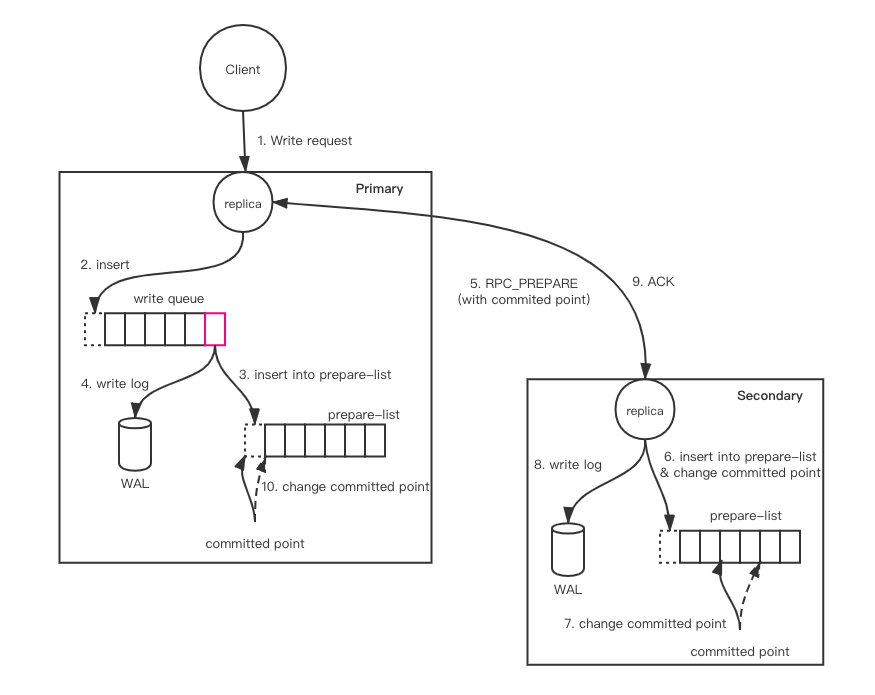

PacificA是微软实现的一款强一致性的分布式共识协议，具有简单易实现、可用性高的优点。Pegasus就是使用PacificA协议来维护多副本之间的复制。

之前有篇文章讲过PacificA的原理与理论，如有疑惑请移步PacificA(https://levy5307.github.io/blog/PacificA/)

## Read & Write
根据PacificA算法，读操作的处理是比较简单的，其只需要primary在本地读取到最新的值就可以了，secondary并不参与其中，这里不再赘述。但是对于写则会复杂很多，因为需要经过主从之间的2PC来实现，这里主要对写做一些讲解。



写入流程如上图所示。这里加几点说明：

1. 对于同一个replica的写处理是单线程的，也就是说，对于每一个replica，只有一个线程在处理写请求。

2. 上图中的WAL分为private log和shared log，其中private log保存在内存中，而shared log在磁盘上。在pegasus中，每个replica对应一个RocksDB，由于一个机器上有多个replica，那么如果打开了RocksDB的WAL的话，写入的时候将会在多个文件之间切换，导致随机写。所以在Pegasus中采用了shared log的机制来替代RocksDB的WAL。但是使用shared log也有个问题，就是当recover一个replica的时候需要做log split操作。所以Pegasus采用了shared log + private log的方式，private log保存在内存中，当添加potential secondary时，直接使用private log，对于rivate log缺失的部分通过重放shared log补全。

## failure detector

PacificA中，错误探测是通过primary定期向secondary发送beacon来实现，这里是假设primary和secondary在不同的机器上，这样发送beacon才有意义。然而在pegasus里却不满足这种条件，即：一台机器上既有primary、也有secondary，所以Pegasus对于错误探测机制这里做了一些简单的修改。beacon的发送不是在primary和secondary之间，而是修改成了在meta server和primary server之间，由primary server主动向meta server发送beacon，时间间隔默认为3s。具体执行如下图所示：

```
                             |--- lease period ----|lease IsExpired, commit suicide
                 |---- lease period ----|
    replica: ---------------------------------------------------------------->
                 \      /    \     /       _\
               beacon ack   beacon ack       x (beacon deliver failed)
                  _\/         _\/
     meta : ---------------------------------------------------------------->
                    |----- grace period -----|
                                |---- grace period -----| grace IsExpired, declare worker dead
```

对于lease period和grace period是否expired，pegasus分别在replica server和meta server的failure detector中创建了一个定时任务去定时检查，该定时任务的时间间隔会比较小，便于及时发现expired的情况。

对于meta server, 当其发现grace period过期时，meta会认为replica server已经宕机了，此时meta会将该replica server上的所有primary和secondary降级为inactive，对于primary降为inactive则需要触发cure操作
而当replica server恢复正常后，此时则仅将该replica server标记为active，等待下次进行load balance的时会将一部分primary和secondary迁移过来。

而对于replica server则比较复杂。为了实现高可用，Pegasus中会有多个meta server存在，其中一个为master。当meta server master发生切换时，meta server通过beacon ack来通知replica新的master，replica server则会将beacon发送至新的master上。当其发现lease period过期时，replica则认为meta server已经宕机了。

和PacificA算法一样，Pegasus同样令grace period > lease period，所以一定是replica server先发现beacon通信失败、而先于meta server做出响应。这样说明，当meta server达到grace period的时候，一定是因为replica server此时不可用了。

## 未完成
