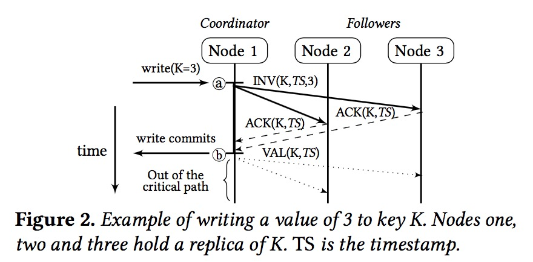

## Introduction

当今的共识协议过多的关注于吞吐throughput，而忽视了延迟latency，例如Chain Replication，便是一个典型的利用延迟换吞吐的例子。但是目前延迟已经变成一个越来越重要的指标。

Hermes便是一个兼具吞吐和延迟的共识协议，对于读操作，则可以在任何副本上进行读取；写操作，则意味着任一副本都可以启动写入。

读取实现低延迟和高吞吐的关键在于：

1. 能够在任何副本上提供读取服务 

2. 能在本地完成读取

写入能够实现低延迟和高吞吐的关键在于：

1. 去中心化：为减少网络跳数并保持整个副本集合之间的负载均衡，任何副本都必须能够发起写操作并驱动它完成(通过与剩余的副本进行通信)，同时避免集中式序列化点。例如：CR就要求在特定节点上启动所有的写操作，因此无法分散写操作

2. inter-key并发：对不同的key的独立写入应该能够并行进行，以启用内部和多线程并行请求执行。

3. 快速：快速写入需要最大程度地减少消息往返次数，避免长消息链，以及hunning techniques，否则会增加写入延迟

## 可靠的共识协议

可靠的共识协议分为两类：1. 基于多数的协议，通常是Paxos的变体；2. 要求活动节点具有问题定成员资格的协议（即：基于成员资格的协议）

基于多数的协议: 要求大多数节点进行响应才能提交写入，因此只要大多数相应，它自然可以容忍失败。但是，基于多数的协议为了高性能付出了一些代价，因为在没有所有副本响应的情况下，无法保证给定的写入已到达所有副本。这使得本地读取成为一件非常有挑战的事情。因此，大多数基于多数的协议都放弃了本地读取。但是可能支持去中心化和inter-key并发写入

基于成员资格的协议：此类协议要求副本组中的所有操作节点都响应写操作。这样做可以确保已提交的写入已到达集合中的所有副本，这自然促进了本地读取，而不妨碍写入性能。

CRAQ就是基于成员资格的协议。在CRAQ中，节点是按链组织的，写操作直接写入头部。头部沿链向下传播，直到到达尾部才完成。随后尾部向上游传播确认消息，使所有节点都知道写入的完成情况。CRAQ通过允许从所有节点本地读取来优化改善了CR。但是如果非尾结点正在尝试读服务，它已经看到了从头到尾向下游传播的写消息，但是没有看到ack消息向上传播，则其必须查询尾节点来查看写入是否已经完成。

CRAQ可以结合本地读取和inter-key并发来实现高吞吐量，但是无法满足低延迟要求：虽然读操作是本地的，因此非常快。但是写入操作必须依次遍历多个节点，从而产生了过高的等待时间开销。

## Hermes
Hemers是一种可靠的基于成员资格的广播协议，提供高吞吐和低延迟，并且同时提供线性化读取、写入和RMWs(single-key transactions)。Hemers优化了无故障的常见情况，并以当今典型的复制程度(3-7副本)、数据中心内、内存数据存储为目标。

### Overview
在Hermes中，读取操作完全在本地执行。写入操作可以由任何replica启动并快速完成、而不会发生冲突。如下图所示，写入一个key的流程如下：

