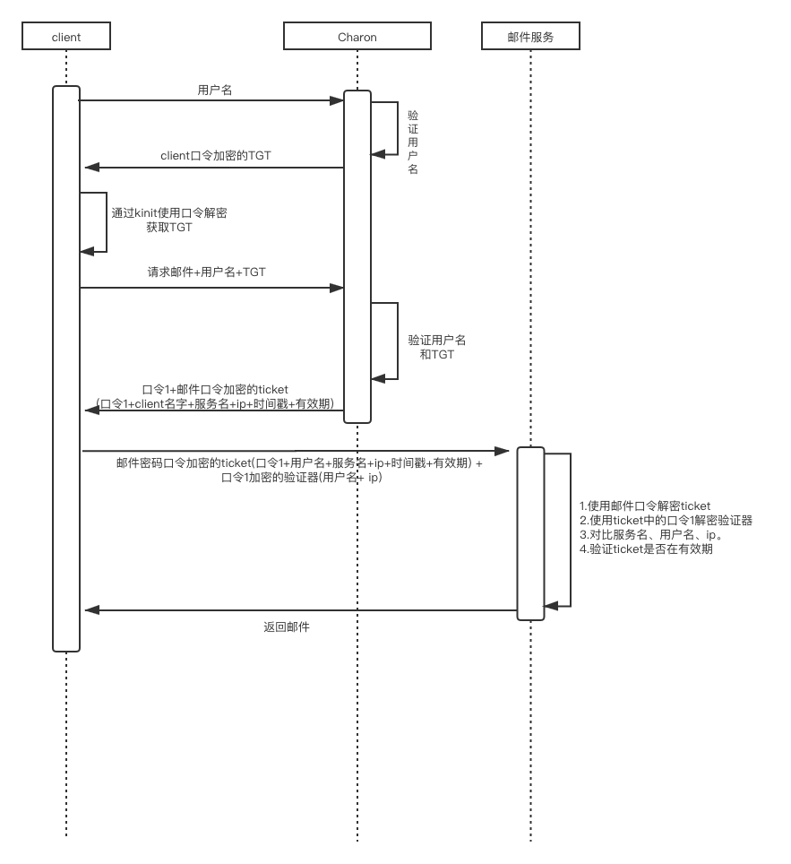
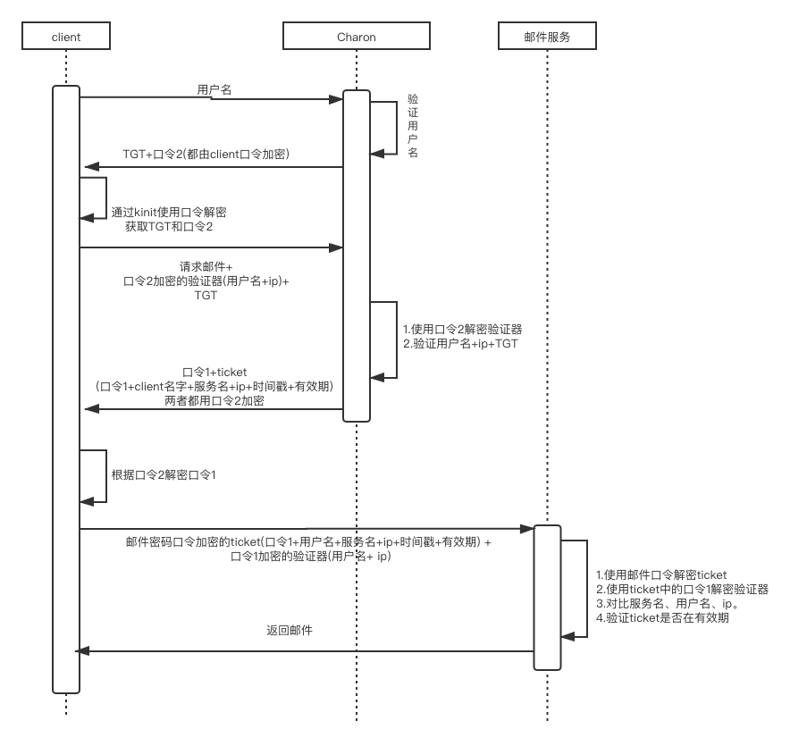
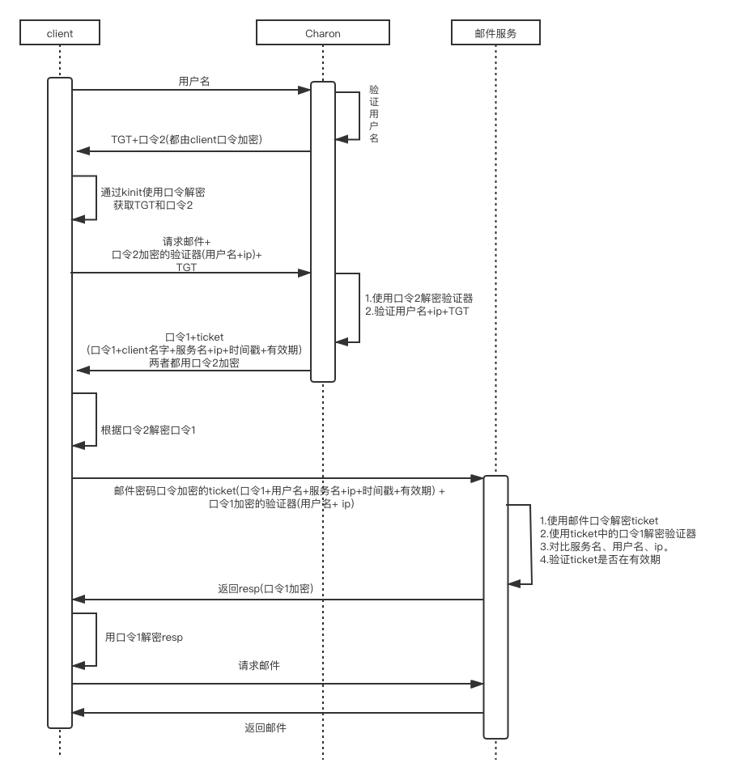

本文是根据kerberos提供的经典对话所整理出来，用以记录kerberos产生的思路。

## 最初设计

上图所示，最原始版本的权限认证过程是非常简单的：当需要某个服务的时候，就通过用户名和密码去访问该服务来进行验证。

***问题：*** 该方案的问题是每个服务都需要保存每个用户的用户名和口令，如果某用户修改口令，则需要访问所有的服务进行修改

## 增加认证服务

用户和服务有口令，另外增加一个认证服务(暂时令认证服务名为Charon)，将所有口令保存在一个单独的中央数据库中。当需要访问某个服务的时候，需要首先得到Charon的认证。

具体时序图如下：

***问题：*** 明文传输client口令，容易被截获

## 增加AS(票据授权服务)和TGT（票据授权票）

在该步骤中增加了AS，该AS仍然属于Charon的一部分。通过下图可以看出，增加了一个用户申请TGT的过程。 TGT表示票据授权表，当用户获取了TGT后，就有权通过TGT向Charon申请访问邮件服务等。

在该过程中，用户仅通过用户名去向AS申请TGT，AS收到该请求后通过用户名去对该用户进行认证，认证成功后返回一个通过用户口令加密的TGT。用户接收到后通过用户口令解密便可以获取该TGT。这样避免了用户口令在网络上传输，避免了用户密码的泄露。

***问题：*** ticket永久有效，当ticket被盗时，其他人便可以冒充该client去获取其邮件等信息并一直使用下去。

## 为ticket增加有效期

由上文可知：

1. ticket不能永久有效

2. 但是也不能是一次性的，因为这样的话会导致每次请求服务都要走一遍认证流程，复杂且低效。所以ticket必须可重用

所以为ticket增加了有效期，一定程度上避免了ticket被盗取的问题

***问题：*** 

1. 由于Charon与client和邮件服务等交互都通过了口令加密，所以可以相互认证，因此可以确认Charson发送来的信息不会是其他人冒充的。同理，由于client和服务之间没有口令，所以两者之间发送的任何信息都是不可信的

2. 在ticket有效期内，ticket仍然可能被盗取利用。

## 服务与client之间增加口令及验证器

对于上述第一点，其解决办法就是为二者之间发送口令；对于第二点，则要增加一个验证器，详见下图：

在这种方案中，只有同时盗取了ticket和加密了的验证器才能冒充该用户，两者缺一不可。所以我们想到，虽然ticket必须可重用, 但是可以设置验证器不可重用，验证器生成不像ticket一样那么复杂。这样就可以解决被盗取的问题。对于验证器的不可重用实现，kerberos v4是通过有效期实现的，v5则是通过“重演缓冲区”来实现，其保存了最近一次提交的验证器信息，如果攻击者截取并试图重用，重演缓冲区则会发现验证器已经被提交过了。

并且由Charon为client和邮件服务之间分配了口令1，所以两者之间的信息发送是可以互相认证的。

***问题：*** 口令1是明文发送的，如果口令被截获，则可以根据截获的口令自己生成验证器，这样便可以冒充该用户获取其信息了。

## 增加client与Charon之间的short-term口令

由于口令1明文发送导致容易被截取，所以我们可以通过为口令1加密的方法来解决。首先我们想到的就是通过用户口令来对其加密。但是用户口令是一个long-term口令，长期使用的话容易被解密。所以我们想到了创建一个short-term口令的方法，如下图：

在之前我们讲到过，在client和服务之间的口令1是用来双方进行认证的，但是目前的流程中，只有服务对client进行了认证，然而client却没有对服务进行认证。例如，当client请求邮件服务的时候，邮件服务被其他人调换了，内涵一系列欺诈信息，当你的ticket等信息到达该假的邮件服务时，他并不关心ticket等内容，也不去做验证，直接将假的邮件信息发送给你。这时候将会导致一些问题。所以client也需要对服务做认证。

***问题：*** client对服务没有认证

## 增加服务对client的响应

如图所示，增加了一个邮件服务向client返回的响应，该resp使用口令1加密。如果是假的邮件服务，由于无法生成正确的响应，所以client无法正确的解析。

## 参考文档

[kerberos原理--经典对话](https://blog.csdn.net/dog250/article/details/5468741)
