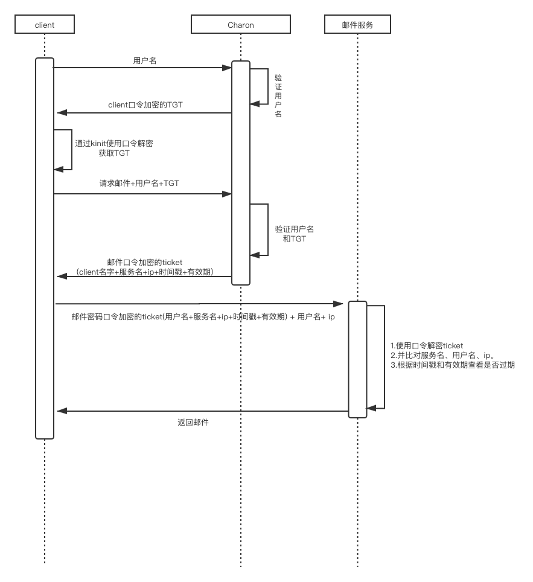

本文是根据kerberos提供的经典对话所整理出来，用以记录kerberos产生的思路。

## 最初设计

上图所示，最原始版本的权限认证过程是非常简单的：当需要某个服务的时候，就通过用户名和密码去访问该服务来进行验证。

***问题：***该方案的问题是每个服务都需要保存每个用户的用户名和口令，如果某用户修改口令，则需要访问所有的服务进行修改

## 增加认证服务

用户和服务有口令，另外增加一个认证服务(暂时令认证服务名为Charon)，将所有口令保存在一个单独的中央数据库中。当需要访问某个服务的时候，需要首先得到Charon的认证。

具体时序图如下：

***问题：*** 明文传输client口令，容易被截获

## 增加AS(票据授权服务)和TGT（票据授权票）

在该步骤中增加了AS，该AS仍然属于Charon的一部分。通过下图可以看出，增加了一个用户申请TGT的过程。 TGT表示票据授权表，当用户获取了TGT后，就有权通过TGT向Charon申请访问邮件服务等。

在该过程中，用户仅通过用户名去向AS申请TGT，AS收到该请求后通过用户名去对该用户进行认证，认证成功后返回一个通过用户口令加密的TGT。用户接收到后通过用户口令解密便可以获取该TGT。这样避免了用户口令在网络上传输，避免了用户密码的泄露。

***问题：*** ticket永久有效，当ticket被盗时，其他人便可以冒充该client去获取其邮件等信息并一直使用下去。

## 为ticket增加有效期

由上文可知：

1. ticket不能永久有效
2. 但是也不能是一次性的，因为这样的话会导致每次请求服务都要走一遍认证流程，复杂且低效。所以ticket必须可重用

所以为ticket增加了有效期，一定程度上避免了ticket被盗取的问题，

***问题：*** 

1. 在ticket有效期内，ticket仍然可能被盗取利用。
2. 由于Charon与client和邮件服务等交互都通过了口令加密所以可以认证，Charson发送来的信息不会是其他人冒充的，同理，由于client和服务之间没有口令，所以两者之间发送的任何信息都是不可信的

## 服务与client之间增加口令

所以解决办法就是为二者之间发送口令

只有同时盗取了ticket和加密了的验证器才能冒充，虽然ticket不可重用, 但是可以设置验证器不可重用，验证器生成不像ticket一样那么复杂。这样就可以解决被同时盗取的问题。

