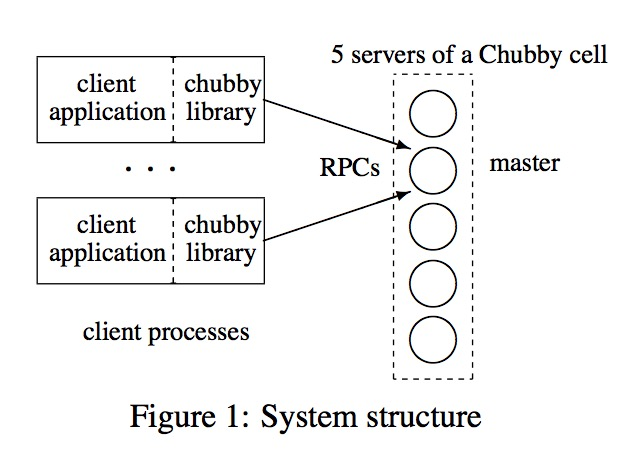
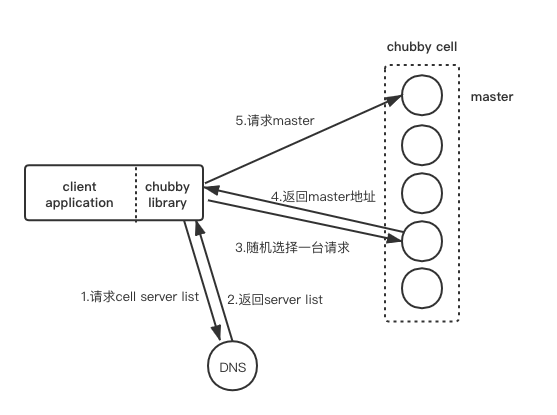
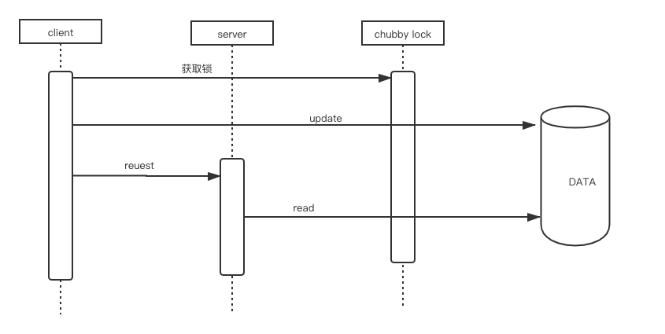
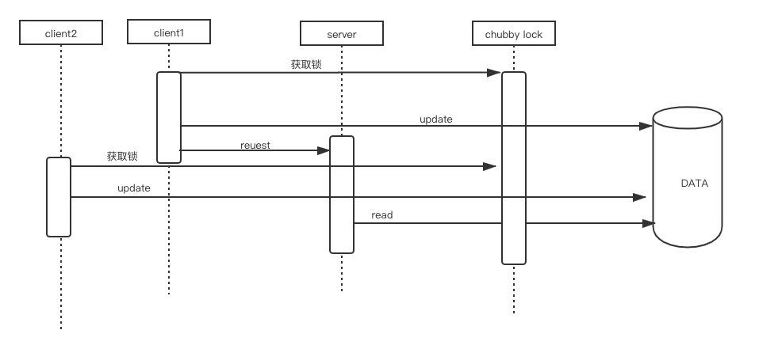
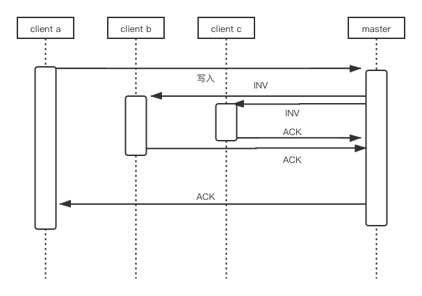
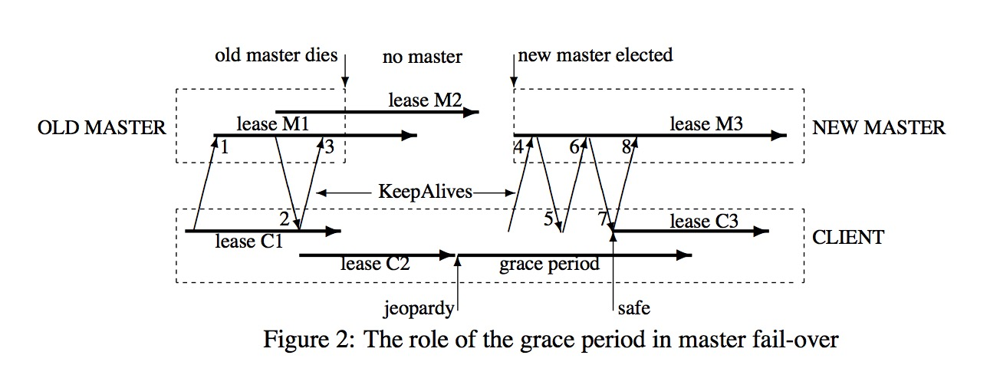
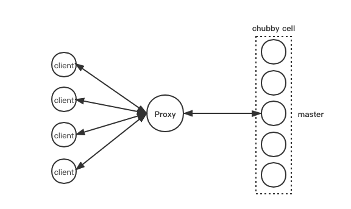
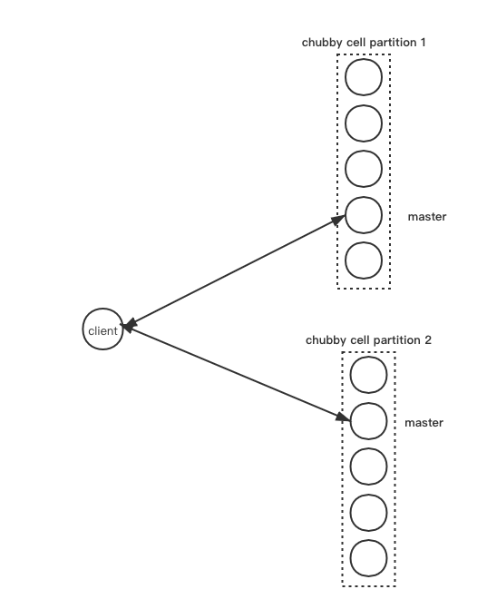

## 基本原理

### 一致性client库 or 分布式锁

chubby实现的是一个中心化锁所服务，基于其一些优势:
1. 大多数服务在刚开始写的时候并没有考虑高可用，当服务的规模越来越大时，程序员才会考虑高可用。等服务改造的时候，直接调用分布式锁服务会比改造为使用一个一致性协议要简单
2. 许多服务有小数据存储的要求，chubby提供了小数据存储
3. 对大部分程序员更熟悉锁
4. 一致性client库需要client拥有多台机器来做投票选举

### 粗粒度锁 or 细粒度锁

细粒度锁指的是只会持有锁很短的时间（秒级或更短），而粗粒度锁指的是持有比较长的时间，比如说是用于选主，通常都会是几小时甚至几天。这两种粒度的锁对锁服务提出了不同的要求。

粗粒度的锁因为隔很长的时间才需要访问锁服务一次，所以对server端的负载压力很小，并且这个负载跟client端的处理速率关联很小（意思是即使client端每秒处理很多请求，锁服务的server端收到的请求速率也不会明显增加）。另外，锁服务server端的机器故障对client的影响也比较小。

细粒度的锁就完全相反了，server端的失败可能造成很多client阻塞。性能和扩容的能力都很重要，因为server端的负载和client的处理速率密切相关。

Chubby只试图提供粗粒度的锁，客户端也可以直接根据他们的应用实现细粒度锁。

## 系统结构



Chubby主要有两个组成部分，server和client library。Chubby的一个cell中有五台server组成一个集群，其中一个master，其他为slave。五台机器按照Paxos协议选举出master，要想成为master必须得到五台中大多数的投票。master会以租约的形式运行，只要它能得到副本的同意（即续租），那么租约便能定时更新然后延长master的运行时间。



客户端会向DNS请求Chubby服务器列表，然后随机发起访问，非master服务器会依据自身的存储的集群信息向客户端反馈哪台是master，然后客户端重定向到master。

如果一个副本挂了，并且几个小时都没有恢复，一个替换系统就会选一台新机器，启动chubby服务，然后更新DNS table。master会定期从DNS table拉数据，就会得知这个变化，然后在数据库中更新cell成员的列表，这个列表也是通过普通的一致性协议在副本间维护一致性的。

与此同时，新的副本会从存储在文件系统的数据库备份中取得最近几次的拷贝，并且在活跃的的那些副本那里取得更新。等这个机器成功处理了master的一个等待commit的请求后（说明此时数据已经是最新了），这个机器就可以参与投票了。

## 文件、目录

chubby的文件与unix文件系统基本一样，这样的好处是chubby文件既可以被chubby api访问，也可以被其他文件系统（例如GFS）的api访问。

```
/ls/foo/wombat/pouch
```

ls即lock service，是所有Chubby的文件名字通用的前缀，并且代表了锁服务。第二个组件（foo）是Chubby cell的名字

有临时和永久的节点，所有节点都可以被显示的删除，临时节点当没有client打开它们时就会被自动删除，所以临时的节点可以被用来检测client是否存活。

每个节点都有各种元数据，包括三个ACLs名字，这三个ACLs用于控制读取、写入和更改ACL名字。ACLs其实是位于ACL路径之下的文件。如果文件F写了其ACL名称为foo,ACL目录包含了文件foo，该文件中有一个叫做bar的条目，那么接下来用户bar将有权限对文件F做写入。

## 强制锁 or 建议锁

每个 Chubby 文件和目录都可以充当读/写锁：一个客户端句柄可以在独占(写)模式下持有锁，或者任意数量的客户端句柄可以在共享(读)模式下持有锁

***强制锁***指的是当client没有持有锁时则不可访问资源

***建议锁***指的是只有其它client想要持有同样的锁时才会产生冲突，持有锁对于访问资源来说并不是必要的, 也就是说它们只与获取相同锁的其他请求冲突。与通常使用的mutex类似

Chubby采用的是建议锁，理由如下：

- Chubby锁常常保护其它服务的资源，而使用强制锁往往意味着要对该其他服务做额外的修改。 

- 当用户需要访问锁住的文件进行调试或管理目的时，我们并不想用户关掉程序。 

- 我们的开发者使用很常见的错误检测方式，来判断锁是否已经被其他人占用了。即写assert语句比如‘lock X is held’，所以强制锁的方式对他们来说意义不大。

## Sequence

在分布式系统中锁是复杂的，因为消息是不确定的，进程也可能会挂掉。



举个例子，一个进程持有一个锁L，然后发起一个请求R，然后挂掉。另一个进程就会去持有这个锁L，然后在R到达前做一些操作。等R到达后，它可能就会在没有锁L的保护下进行操作，潜在的会造成不一致的数据。



这里的意思是这个锁L保护了一段数据data，按理说这个R应该在这个data上进行操作的，但是由于进程挂掉，导致另一个进程修改了这个data，所以R就可能在不一致的数据上进行操作。 

Chubby提供了一种在使用锁的时候使用序列号的方法来解决这个问题。在每次获得锁后都会请求一个序列号（一个描述锁状态的字符串），client在发送请求的时候，会把这个序列号发给服务端，服务端会检测这个序列号的合法性。服务端可以通过和Chubby之间维护的cache来检测这个序列号的合法性，或者是直接和自己最近观测到的序列号比较。

尽管序列号机制很简单，但是有些协议发展的很慢，不能带上序列号，chubby因此提供了另一种不完美但是更容易的方式来解决这个问题。如果一个client是以正常的方式释放锁的，那么这个锁立刻可以被其他的client获得，但是如果一个锁是因为client挂掉或不可访问而丢掉的，锁服务器会等一段叫lock-delay的时间来防止其它的client获得这个锁

## Events

Chubby的client端可以订阅一些事件，这些事件通过回调的方式异步发送给client，包括：

- 文件内容修改

- 子结点的添加、移除、或修改。

- Chubby主节点出故障

- 一个句柄（包括它的锁）已经变得不可用

- 获得锁

- 来自其他客户端的锁冲突请求


## Cache

客户端会有自己的本地缓存，这样可以减少对Chubby的读压力。Chubby使用的是一致性的、write-through缓存。该缓存由记录有缓存的客户端列表的master发送出来的无效信号保持一致性。协议确保客户端能够互相看到一个一致的Chubby状态视图，或者是一个错误。

当文件的数据或者元数据被改变时，修改会被阻塞，直到master发送数据的无效信号到每一个可能缓存该数据的客户端上。修改只会有在服务器知道每个客户端都将缓存置为无效后才会被处理，要么是因为客户端确认了缓存的失效，要么是客户端确认其缓存的数据租约到期。



## Session and KeepAlives

Chubby的会话是指一个Chubby客户端与一个Chubby单元之间的联系；它会存在一段时间，并且通过周期性的握手（即KeepAliveb）来维护。当会话有效时，client端的handle，锁，缓存都是有效的。 

当client第一次连接cell时，它会请求一个新的会话，当client结束时会显示的终止会话，或者当这个会话一分钟内没有调用和打开handle时，也会被隐式的关闭

每个会话都有个对应的租约，master承诺在租约内不会单向的关闭会话，master可以延长这个租约，但不能减少。收到KeepAlive后，master会阻塞这个RPC，直到client的租约接近过期，然后master会允许这个RPC返回，就可以通知client新的租约超时时间。master可以任意扩展租约超时，默认是12s，但是过载的master可以指定更大的值来减少KeepAlive RPC的数量。client在收到响应后，就会马上发起一个新的KeepAlive，因此几乎总是有一个KeepAlive被阻塞在master。 除开用来扩展租约之外，KeepAlive还被用来传递事件和缓存失效给client。如果事件或者缓存失效发生了，master允许KeepAlive立刻返回。

同时客户端维护了一个本地租约过期时间，如果客户端的本地缓存租约过期了，由于此时它就无法确定 master 是否已经结束了这个 session，客户端就需要清空并禁用它的缓存，此时 session 处于 jeopardy 状态。客户端会继续等待一个称为 grace period 的时长，默认是45秒。如果在grace period 结束之前，客户端和 master 又完成了一次成功的 KeepAlive 交互，那么客户端就会再次使它的缓存有效。否则，客户端就假设 session 已过期。

Chubby的client库可以通知应用程序jeopardy事件，当会话恢复正常时，会通知应用程序safe事件，当会话超时时，会通知应用程序超时事件。这些信息使应用程序可以知道会话的状态，在不确定会话是否关闭时可以停下来等一会儿，如果只是个临时性的问题的话，就可以自动恢复而不用重启应用。这避免了应用重启的巨大开销。

## Fail-overs

在master挂掉的时候，如果master选举很快，那client可以在自己的本地超时过期前就联系上新的master；否则，client的本地超时过期后，client可以利用grace period来让会话在fail-over期间得以维持，也就是说，grace period其实增加了client端的租约超时时间。



上图是client端在master fail-over时利用grace period来保留会话的一个例子。从图中可以看到client的本地租约已经超时，client进入了jeopardy状态，在grace period期间，client成功的联系上了新的master。一旦client成功联系上新master，对应用程序而言，就像是没有失败发生一样。

## 数据库实现 && 备份

Chubby使用Berkeley DB作为其数据库

每隔几个小时，每个Chubby cell的master就会将其数据库的snapshot写入位于不同building的GFS文件服务器。使用不同的building，可以确保备份不会因为building损毁而损毁。

备份提供了灾难恢复，也提供了一种初始化新副本的的方法。

## 镜像

Chubby允许将文件集合从一个cell映射到另一个cell。由于文件很小，所以镜像非常快。如果文件被添加、删除或者修改，事件机制就会立即通知镜像进行处理。如果没有网络问题的话，这些变化将在一秒钟之内在全世界范围内的很多镜像中反应出来。如果无法访问镜像，则在连接恢复之前镜像将保持不变。

镜像最常用将配置文件复制到分布在世界各地的集群中。

有一个特殊的单元，叫做global。其包含一个子树/ls/global/master，该子树被镜像到其他每个Chubby的单元的/ls/cell/slave子树中。global单元是特殊的，因为它的五个副本位于世界上分布广泛的地方，所以它几乎总是可以从从大部分国家/地区访问。

# 扩展性

一个chubby master可能会和非常多的client直接通信(作者见过9w个client连接一个master)，因此最有效的扩展机制是减少和master之间的通信，而不是提升请求处理的速度。chubby使用了几个方法：

- 创建任意多的chubby cell，使得chubby client可以直接和附近的cell进行通信。 
- master在负载很重时可以增加租约超时时间，使得可以减少KeepAlive RPC的数目。KeepAlive RPC是目前请求中占最大部分的 
- 使用chubby client缓存。缓存file data、meta data等内容
- 使用协议转换服务器来将chubby的协议转换成更简单的协议，比如DNS和其它的一些协议。 

首先说明一下，在chubby的流量中：

写流量 ≈ 1%

读流量 ≈ 10%

KeepAlive ≈ 89%

所以减少server负载主要从KeepAlive和读流量这两个方向突破。

文中介绍了两个常用的机制，代理和分区，使得chubby可以进一步扩展。

## 代理(proxy)

chubby的协议可以被代理，将一个受信任的进程作为代理，其把请求从client端发送给server端。



代理可以通过处理Keepalive请求和读请求来减少server端的负载，但是没办法减少写的流量。但是写流量对chubby的正常负载占比不到1%。如果一个代理处理N个client，那KeepAlive的流量能够减少N倍。proxy cache能够减少读流量程度取决于读共享的平均数量，一般大约是10。不过读流量对chubby的负载占比不到10%，因此KeepAlive的流量减少才是最重要的。 

代理对于写和第一次读都会增加一次RPC，因此不可用的概率至少是之前的两倍，因为每个client现在都依赖两个机器：代理和master。

## 分区



命名空间可以根据目录进行分区，如果启用，一个Chubby的单元将由N个分区组成，每个分区有一组replica和一个master, 目录D中的每个节点D/C将存储在分区P(D/C)上

除非分区的数量N很大，否则每个客户端应该会联系大多数分区。因此，分区将任何给定分区上的读写流量减少了N倍，但不一定会减少KeepAlive流量。如果Chubby需要处理更多的客户端，应该组合使用代理和分区。
