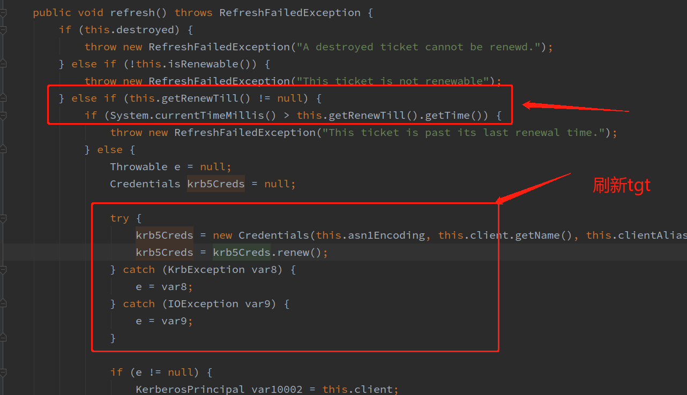

## 背景

之前看java的官方文档和mit的文档里都写到，只要将renewTGT设置为true，那么jaas内部便会对tgt进行自动更新。

[java官方文档](https://docs.oracle.com/en/java/javase/14/docs/api/jdk.security.auth/com/sun/security/auth/module/Krb5LoginModule.html)：
> *renewTGT:Set this to true, if you want to renew the TGT when it's more than half-way expired (the time until expiration is less than the time since start time). If this is set, useTicketCache must also be set to true; otherwise a configuration error will be returned.*

[mit文档](https://web.mit.edu/java_v1.5.0_22/distrib/share/docs/guide/security/jgss/jgss-tiger.html)：
> *TGT Renewals
The Java Authentication and Authorizaton Server (JAAS) Kerberos login module in JDK 5.0, Krb5LoginModule, now supports Ticket Granting Ticket (TGT) renewal. This allows long-running services to renew their TGT automatically without user interaction or requiring the services to restart.
With this feature, if Krb5LoginModule obtains an expired ticket from the ticket cache, the TGT will be automatically renewed and be added to Subject of the caller who requested the ticket. If the ticket cannot be renewed for any reason, then Krb5LoginModule will use its configured callback handler to retrieve a username and password to acquire a new TGT.
To use this feature, configure Krb5LoginModule to use the ticket cache and set the newly introduced renewTGT option to true. Here is an example of a JAAS login configuration file that requests TGT renewal.*
server {
  com.sun.security.auth.module.Krb5LoginModule required
        principal=principal@your_realm
        useTicketCache=true
        renewTGT=true;
};

但是社区同学联系我们说Pegasus当前没有针对tgt做自动更新，并且hbase实现了一个线程用于更新tgt。最初对于这位同学的说法我没有太当回事，觉得可能是他理解的问题，毕竟官方文档都这样写了。
但是想到hbase都这样做了，可能事情没有这么简单，还是要仔细调研再确认一下。所以去专门翻了下jaas的源码。

## renewTGT配置

通过查看LoginContext.login函数，确实可以看到，如果renewTGT设置为true的话，会在login的时候对tgt进行更新。
而且renewTGT这个配置仅仅是在login的时候用到，其他地方并没有使用。也就是说，这个配置仅仅会使login的时候去更新tgt，并没有文档中所说的会去持续更新。

所以可以肯定的一点是，renewTGT并不是持续更新的配置，而只是在login时做一次更新。

## tgt是否支持renew

继续看了下代码发现，tgt自身是支持自动renewal的，也就是说在tgt过期时，它会去自动刷新。


但是有一个限制：如果设置了renew till，那么如果当前时间超过了其renew till时间，就不会刷新了。当然，如果renew till设置为null，那确实也是会一直持续更新的，这样文档中也不算有问题，这时确实客户端代码无需自己实现刷新逻辑。

所以需要判断一下，这个renew till时间是怎么得来的，这个值到底有没有设置？

通过Krb5LoginModle.java中可以看到，如果tgt不存在，那么是需要通过向kdc来进行申请。
1. client向kdc发送申请，申请中携带了客户端这边配置的till时间


2. 客户端收到kdc发送回的resp，并解析获取kdc返回的renew till时间


 从这里可以看出，这个till时间是由客户端和服务端双方决定的，并不是客户端一方配置就可以决定的。也就是说，这个renew till时间我们不好掌控。这样的话，客户端代码最好实现更新的逻辑。
（翻到一篇博客讲到，这个renew till时间是取客户端till时间和kdc till时间两者的最小值：https://blog.51cto.com/caiguangguang/1383723）

另外通过查看，公司内部的这个renew till时间是10年，所以我们平时测试的话，确实不容易看出问题。
```
➜  /etc klist
Valid starting       Expires              Service principal
2021-04-01T23:03:39  2021-04-02T23:03:39 
        renew until 2031-03-30T23:02:57
```

## 结论

短期来看代码中不做renew逻辑不会有问题，但是为了可靠起见，最好还是对其进行支持。

其他文档：<https://andriymz.github.io/kerberos/authentication-using-kerberos/#keytab>
