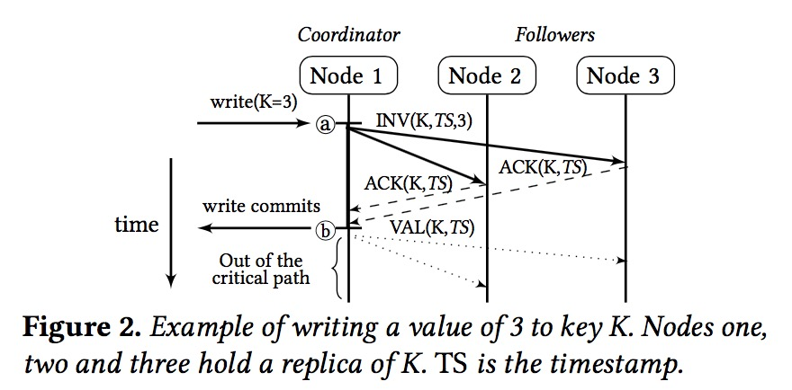

## 链式复制(Chain Replication)

写入只能将请求发送至head节点，写入流程：

读取则只能将请求发送到tail节点。tail节点一定保存的是已提交的最新值，所以从tail读取可以保证强一致性。

HDFS便是使用的CR来实现的。

***优点：***
- 简单、容易实现
- 读操作和写操作分配到不同的节点上，所以吞吐会更高
- 链式复制的每个节点（除了尾结点）都会产生写复制操作，而主从复制的写复制操作集中在主节点，这样就增加了主节点的负担
- 可用性强。要保证N个节点挂掉集群仍然可用，链式存储只要有N+1个节点就可以了，但是主从方式需要2N+1个节点

***缺点：*** 写请求需要沿链流经所有的节点，延迟会比较高。相当于延迟换吞吐。

Ref: <https://levy5307.github.io/blog/chain-replication/>

## CRAQ（Chain Replication with Apportioned Queries）

针对于CR的优化，读取操作可以发往任意的server、而非只能发往tail节点。为实现该功能，对每个key维护一个version和clean标记
写入则与CR相同，都是由head节点发起。写入流程：

读取则可以向任意server发送请求。当该server中的clean标记为dirty时，需要向tail查询当前提交的最新version，然后将该version数据返回给客户端。

***优点：***
- 除了具备CR的优点外，还可以将读请求分散到全部的server上，吞吐更高

***缺点：***
- 写请求需要流经所有的节点，延迟会比较高。
- 需要对每个key维护一个version和clean标记，更适合于内存型存储

Ref: <https://levy5307.github.io/blog/object-storage-on-CRAQ/>

## Hermes

任意节点都可以写入和读取，并且读取操作都是本地读。
写入可以任意节点发起，发起的节点则叫做coordinator。写入流程：

读取时，如果该key在当前node上的状态是val，则直接返回。如果是inv，则block住一直等到其状态变为val。

***优点：*** 任意节点都可以发起读取和写入，性能比较高，对负载均衡也更友好。

***缺点：*** 类似于CRAQ，每个key都需要维护一些数据（比如key的状态），更适合内存型数据库

Ref: <https://levy5307.github.io/blog/Hermes/>

## PacificA

该协议由Manager指定一个Replication Group中的primary，写入和读取请求都发往Primary，以此来保证强一致性。
对于写入，要求必须所有副本都写入成功才能提交。对于读取，则只需要从Primary本地读取就可以了。

***优点：***可用性高。对于拥有2N+1个节点的集群，PacificA可以容忍2N个节点挂掉（对于挂掉的节点，manager会及时将其移除，不会影响写入可用性）

***缺点：***容易抖动。由于写入需要所有节点都成功写入，所以只要有一个节点写入较慢，就会影响写入的延迟。

Ref: <https://levy5307.github.io/blog/PacificA/>

## Raft

同PacificA一样，读写都是发往Primary。与PacificA不同的是，其不用依赖额外的Manager制定primary，而是通过选举的方式选出primary。
另外，Raft要求所有写入只要有超过一半的副本写入成功就可以了。
所以相较于PacificA: 
- PacificA对延迟抖动更敏感。少数的慢节点基本不会影响Raft协议的写入，该节点可以写入完成后再同步追赶日志。
- Raft可用性不如PacificA。对于拥有2N+1个节点的集群，PacificA可以容忍2N个节点挂掉。而Raft则只能容忍N个节点挂掉（其实可以通过增加副本数来一定弥补）
- 在PacificA实现的大集群中，manager由于需要和每个server都维持心跳等通讯，其可能成为集群的瓶颈。Raft协议中不需要使用manager所以不存在这样的困惑

Ref: <https://levy5307.github.io/blog/raft/>
