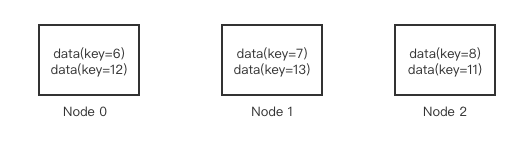
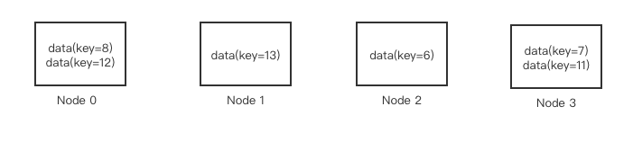
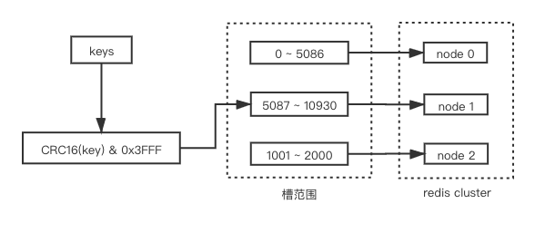
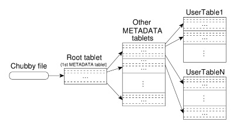

目前团队所做的kv存储，对于数据分区所采用的方式是hash分区：对key取hash值，获取的hash值再对partition取模。即：```hash(key) % partition_count```

最近在思考这种方式的实现问题。

显然，由于这种方式对于连续的key可能获取到不同的hash值, 导致并不一定能分配到同一个分片上。所以对于范围查询非常不友好，需要向多个分片发送请求才能保证获取到该范围内的所有key，并且由于跨多个节点，事务性比较难保证。为了解决这个问题，团队项目采用了两级key的方式，即将key分为hashkey和sortkey：hashkey用于分区映射，同一个hashkey下数据按照sortkey排序。这样同一个hashkey下的sortkey便可以存储于同一个partition下，并且同一个hashkey下的sortkey便可以支持范围查询。

但是这样也带来一些问题：

- hashkey+sortkey的方式并不符合主流的kv接口设计(如redis)，导致接口设计完全不同。

- 这种方式相当于一定程度上把数据分区交给了用户，也就是说，如果用户使用不当，将大量sortkey放置于同一个hashkey下，很容易产生热点partition。

- 对于跨hashkey的范围查询支持依然不够好。

基于key范围的分片方式对于范围查询的支持比较好，不过需要注意的是，该方式比较容易导致热点问题，例如：用户使用时间作为key，并且总是查询最近的数据，这样将会导致查询总是落在最新的key上面。

下面针对两种不同的分片方式进行了调研，看看行业内的实践是怎样的。

## hash分片

顾名思义，hash分片就是按照数据的某一特征（例如key），利用选定的hash算法，并将hash值与系统中的节点建立映射关系，从而将hash值不同的数据分布到不同的节点上。

其大致算法如下：
```
node index = hash(data) % server_count
```

举个例子。

在一个拥有3个节点的集群中，有如下一组数据data(key=6), data(key=7), data(key=8), data(key=11), data(key=12), data(key=13)，假设其采用的hash算法如下：`hash(data) = key`。那么`node index = key % 3`。因此当前的数据分布图如下：



这种方式的优点有：

- 实现简单，无需额外维护其他的元数据，根据公式便可以直接找到数据所在的server。

- 根据hash的特性，数据可以均匀的分布在不同的节点中，这样可以比较有效的避免数据倾斜。

当然，其缺点也是很明显的：

- 数据均匀不代表流量均匀，不同的数据实际负载并不一定相同，所以热点问题也无法完全避免。又由于映射射固定、不灵活，一个key固定映射到一个node上，导致很难做灵活的迁移、将热点的key迁移走。

- 由于数据被打散，如果要进行范围查询则是比较吃力的，如上图中，如果要查询key在[11,13]范围之间的数据，则需要分别向所有的三个node发送请求，如文章开头所讲，不仅浪费资源，事务性也很难实现。

- 由于数据的分布与节点数高度相关，那么当扩缩容时，数据的搬迁量也是很巨大的。例如当我们扩容一台机器时，其映射算法变成如下：`node index = key % 4`，其数据分布如下：



从图中可以看到，数据搬迁的量还是比较大的。所以很多采用hash分片的实现中，节点扩展需要成倍增加，这样只移动50%的数据即可（Pegasus中便是如此，partition split需要将分片数翻倍，无法做到partition数量+1或者+2）。

为了克服数据搬迁量过大的问题，不同的产品采用了不同的实现方案。

### 虚拟槽（逻辑节点）

在redis中，预先分配了16384（2^16）个卡槽，所有的key根据哈希函数映射到0 ~ 16383号槽内，其计算公式如下：
```
slot = CRC16(key) & 0x3FFF
```
将key映射到slot之后，再根据slot的范围，将不同范围的slot映射到不同的节点，如下图所示：



这样通过引用了虚拟槽屏蔽了真实的server节点，可以更加方便的添加或者移除节点。当添加或者删除节点时，key与slot的映射关系不会发生变化，这样只需要移动相应的slot到对应的节点即可。

另外，其实redis这种虚拟槽的方案，是结合了hash和范围分片（slot根据范围划分到不同的node），因此其也克服了普通hash分片中的映射固定不灵活的缺点。

### 一致性hash

针对这个问题，Dynamo则采用了一致性hash的方法来解决。

首先讲解下什么是一致性hash。



如上图所示，首先计算出每个服务器节点的hash值，将其映射到0 ~ 2^32的圆上。然后采用同样的方法求出存储数据的hash值，同样映射到圆上。然后从数据映射的位置开始顺时针查找，将数据存储在所找到的第一个服务器上。

其优点也是很明显的，即：添加或者删除节点只会影响相邻的节点，其他节点不受影响，数据搬迁也很少。

这种方式有以下几个问题：

- 成也萧何败萧何。添加节点时只会影响相邻节点，这样带来的问题就是，如果系统负载过高，添加节点只会减轻其相邻节点的负载，其他负载并不会因此减轻。

- 没有考虑到异构节点的问题。例如有些节点性能好就应该多承担些数据，有些节点性能差则应该少承担部分数据。

- 数据分布倾斜。如果其中两个节点在环上的距离过近、却与另外一个节点距离过远，则会导致数据分布不均，如下图所示：


对于上述问题，Dynamo提出了***虚拟节点***的概念，即：一个物理节点对应多个虚拟节点。当一个新节点添加到系统后，它会在环上被分配多个位置。

下图中，每个物理节点分配了3个虚拟节点。



虚拟节点会带来如下好处：

- 当一个节点不可用时（故障或例行维护），这个节点的负载会均匀分散到其他可用节点上

- 当一个节点重新可用时，或新加入一个节点时，这个节点会获得与其他节点大致相同的负载

- 一个节点负责的虚拟节点的数量可用根据节点容量来决定，这样可用充分利用物理基础设施中的异构性信息

- 数据分布相对均衡。由于一个物理节点存在多个虚拟节点，将使物理节点之间hash key范围不均衡的情况大大减少。

## 范围分片

简单来说，范围分片就是根据关键值使用连续范围分区的方法进行数据分片。

bigtable就是采用了范围分片的方式，其将数据切分成很多个tablet，每个tablet的默认尺寸是100MB到200MB，当tablet过大时将会拆分成两个不同的tablet，相反当tablet过小时，便会和其他tablet合并。

每个tablet服务器管理一个tablet集合，为了能够维护更多的tablet数量，使用了一个类似于B+树的三层架构存储tablet的位置信息，当需要查找某个tablet的位置时，则需要依次去这几层读取，当然在实现中可以在客户端加缓存，用以减少读取METADATA，具体如下图所示：



范围分片的优点：

- 范围查询更高效。由于数据是按照范围分片的，所以范围查询时无需将请求发往很多节点，通常一两个tablet就能覆盖了。

缺点：

- 热点问题，这分为两个方面：<1> 由于数据是从单tablet开始的，这会导致只有一个节点接收用户的请求；<2> 如文章开头所说，该方式比较容易导致热点问题，例如：用户使用时间作为key，并且总是查询最近的数据，这样将会导致查询总是落在最新的key上面。

- 元数据管理过于复杂（三层架构存储tablet位置信息）

## 总结

如果系统中范围查询很多时，建议使用范围分片; 另外，由于范围分片元数据管理比较复杂，以及相对hash分片有更严重的热点问题，所以其他情况推荐使用hash分片。

## Reference

[BitTable: A Distributed Storage System for Structured Data](https://research.google/pubs/pub27898/)

[Redis Cluster数据分片](https://www.huaweicloud.com/articles/38e2316d01880fdbdd63d62aa26b31b4.html)

[数据分片分析](https://www.cnblogs.com/xybaby/p/7076731.html)

[YogabyteDB分析的不同分片策略](https://zhuanlan.zhihu.com/p/107618160)

[Dynamo与一致性hash](https://zhuanlan.zhihu.com/p/107560108)

