## 背景

simple_load_balancer：主要用于cure，cure的目的是维护分片的健康（一主两备份）

greedy_load_balancer：用于生成load balancer计划。当前只有app load balance，后续要添加cluster load balance

checker_load_balancer：用于功能测试



## 重构

cure功能严格意义上来说已经不是load balance的一部分了，所以首先把simple_load_balancer中cure的功能抽出来放入一个新创建类partition_healer，专门用于cure。load balance相关的功能放入greedy_load_balancer。这样simple_load_balancer便可以删掉。


另外，由于要加入cluster load balancer，不希望将这部分功能加入greedy_load_balancer了，因为这样会导致greedy_load_balancer过于臃肿。并且加入了cluster load balancer之后，暂时先不希望把原先的load balance删掉，所以短期内两者应该会并存。

所以想将其抽出来放入一个单独的类中。

考虑了如下几种实现思路：

### 继承



将greedy_load_balancer的功能迁移到app_load_balancer中，集群负载均衡功能添加到cluster_load_balancer中。对于两者之间的公共代码，放入greedy_load_balancer。

***问题：***由于app load balance和cluster load balance策略同时存在，需要通过配置在两者之间切换，这样便将这些细节暴露给了meta_service。我希望这些细节对meta_service是透明的，load balance的问题，在自己内部解决，与meta_service无关。

### Decorator



由于原有的负载均衡策略还保留，只是新增了一个cluster负载均衡功能，自然就想到了Decorator。实现一个新类cluster_load_balancer，作为greedy_load_balancer的Decorator，其内部可以通过一个变量来配置是使用cluster_load_balancer::balance还是greedy_load_balancer::balance，该变量可以通过远程变量控制。meta_service内部创建一个cluster_load_balancer就可以了。

***问题：***cluster_load_balancer和greedy_load_balancer里有大量重复代码和公用成员变量，使用这种方式不好复用。对于这种复用的情况，最好还是用继承

### Strategy



实现一个新的接口load_balance_policy，其有两个子类，分别实现app load balance和cluster load balance，在greedy_load_balance内部通过一个变量控制使用哪个policy。
meta_service持有一个greedy_load_balancer对象，无需关心使用哪个policy

## 最后

最后实现类图如下：



## 另外

有大量的重复代码，如下：

```cpp
for (const auto &kv : apps) {
    const std::shared_ptr<app_state> &app = kv.second;
    if (is_ignored_app(kv.first)) {
        continue;
    }
    if (app->status != app_status::AS_AVAILABLE || app->is_bulk_loading || app->splitting())
        continue;

    bool enough_information = primary_balancer_per_app(app);
    if (!enough_information) {
        return;
    }
    if (!balance_checker) {
        if (!t_migration_result->empty()) {
            if (_balancer_in_turn) {
                return;
            }
        }
    }
}
```
可以使用visitor进行重构如下：
```
void for_apps_balance(const app_mapper &apps, const std::function<void(const std::shared_ptr<app_state> &)> &visitor) {
    const std::shared_ptr<app_state> &app = kv.second;
    if (is_ignored_app(kv.first)) {
        continue;
    }
    if (app->status != app_status::AS_AVAILABLE || app->is_bulk_loading || app->splitting())
        continue;

    bool enough_information = visitor(app);
    if (!enough_information) {
        return;
    }
    if (!balance_checker) {
        if (!t_migration_result->empty()) {
            if (_balancer_in_turn) {
                return;
            }
        }
    }
}
```
调用代码：
```
for_apps_balance(apps, primary_balancer_per_app);
for_apps_balance(apps, copy_secondary_per_app);
for_apps_balance(apps, move_primary_per_app);
```

***TODO:*** 其他待补充

