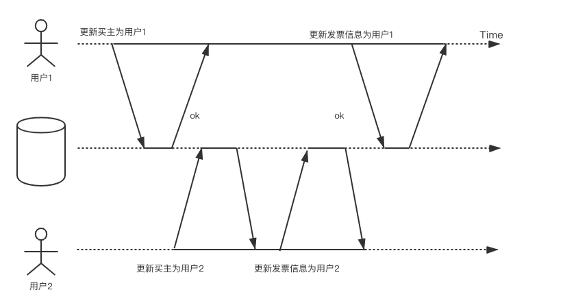

## 事务的属性

ACID，事务的4个属性，这个每个人都很熟悉。其中：

***A***代表原子性，即：事务中的操作要么全部正确执行，要么全部不执行。在分布式系统中，其主要由2pc协议来保证的（另外还有一个3pc协议，但是只停留在理论阶段，没有太多实践意义），这里有一篇文章专门介绍了[2pc](https://levy5307.github.io/blog/2pc/)的内容

***I***代表隔离性，即：多个事务并发执行时，对每个事务来说，它并不会感知系统中有其他事务在同时执行。隔离性有很多个级别，针对不同的级别有多种不同的实现方法，如：MVCC、2PL等。

***D***代表持久性，即：一个事务在提交之后，该事务对数据库的改变是持久的。持久性主要通过redo log来保证的，即如果宕机导致内存中的数据丢失了，需要通过redo log回放来进行恢复。关于持久性，需要注意的是，并不存在完美的、绝对的持久性，因为磁盘可能会坏掉，即使有多个副本，理论上也存在多个副本所在的磁盘同时坏掉的情况。多副本这些手段只是用来降低风险，并不能使之达到绝对的持久性。

***C***代表一致性。即：数据库必须保证事务的执行从一个一致性状态转移到另一个一致性状态。简单说就是数据库从一个正确的状态到另一个正确的状态。比如转账事务完成后，转账双方的总金额不能多也不能少。另外这里的一致性和多副本的一致性也不是一个概念。

多副本一致性是指：

- 查询和更新单个对象的操作按一定顺序执行

- 更新操作的效果必然反映在后续查询操作返回的结果中

在ACID中，C是目的，AID是手段，为了达到C的目的而提供的手段。AID是数据库自身的属性，C则更多的是应用层的属性，应用层利用数据库的AID的这三个特性来达到C。说到这里可能有些混乱，举个例子：

在银行系统中，A要向B转账100元，而A的账户余额只有50元，并且应用层给账户余额这一列添加了值不能小于0的约束，那么很显然这条事务会执行失败。因为50-100=-50，很显然不符合约束。此时事务会回滚，这样应用层便利用了事务的AID特性保证了一致性C。

反之，如果用户没有为账户余额这一列添加不能小于0的约束，那么事务便会执行成功，导致A的账户余额变成了-50，显然这是不正确的状态。

由此可见，一致性的保证是由应用层来保证的。

另外说一句，对于一个涉及a、b节点的分布式事务，如果节点a提交了本地事务，而节点b还没来得及提交，从而其他事务看到了其中间状态，这个问题是由隔离性来解决的。很多人误以为是一致性，其实是不对的。

## 隔离级别

严格意义上的隔离性是指假装没有发生并发，这意味着事务的最终执行结果与串行执行相同，然而这会严重影响性能。许多数据库不愿意牺牲性能，因而更多倾向于采用较弱的隔离级别。

隔离级别分为以下四种：读未提交、读已提交、可重复读、串行化。

### 读未提交（read-uncommitted）

读未提交是指允许一个事务去读取其他事务尚未提交的数据，即***脏读***。用白话说就是你读取了别人正在处理的数据。

当存在以下问题时，需要解决脏读的问题：

- 如果事务会更新多个对象，那么脏读意味着其他事务会看到部分更新这种中间状态，而非看到全部。例如当收到一封电子邮件时，需要更新收件箱以及未读邮件数。如果用户只看到了新邮件但看不到更新的邮件数，则会带来一些困扰。如下图所示：

- 如果事务中止，则所有写入操作都需要回滚。如果发生了脏读，那么可能看到了一些稍后会回滚的数据。

与脏读所对应的还有***脏写***，即：写数据库时，会覆盖未成功提交的数据。

我们举一个汽车购买的例子来说明脏写的问题。购买汽车需要两次数据库写入：网站上商品买主需要更新为新卖家；销售发票也要随之更新。在下图中，用户1和用户2试图购买同一辆车，当脏写发生时，会导致商品卖给了用户1，发票却给了用户2。

读未提交隔离级别会对写入进行加锁，因此在该隔离级别下是不存在脏写的。

由于读未提交隔离级别的性能和读已提交并没有什么太大的区别，所以实际中很少使用读未提交。

### 读已提交（read-committed）

为了解决脏读/脏写的问题，引入了读已提交。其只提供如下两个保证：

- 读数据时，只能看到已经成功提交的数据（防止脏读）

- 写数据时，只会覆盖已经成功提交的数据（防止脏写）

数据库通常使用行锁来解决脏写的问题，即当事务想要修改某个对象时，首先获取对象的锁，然后一直持有锁直到事务提交或中止。给定时刻只有一个事务可以拿到特定对象的锁，如果另一个事务尝试更新同一个对象，其必须等待，直到持有锁的事务提交或中止后，获取锁并继续。

对于脏读却不能像解决脏写问题一样简单地使用读锁，因为这样只读事务会被长时间的写事务阻塞，严重影响只读事务的延迟。所以大多数数据库都是采用了双版本的方式来解决脏读问题：对于每个待更新的对象，数据库都维护其旧值和即将更新的新值，在写事务提交之前，所有读都获取旧值；而当写事务提交之后，则读取新值。具体如下图所示：

虽然解决了脏读和脏写的问题，当时仍然有问题：

在上图中，最初账户1和账户2各有500元钱，转账者随后将100元钱从账户2转账到账户1。而小明则在其转账钱查看了账户1的金额，得到了500，又在转账完成后查看了账户2的金额，得到了400。发现两者之和为900，而非最初的1000，所以从小明看来，100元钱好像消失了一样。

这种异常现象叫做不可重复读（也叫做读倾斜），用白话说就是***你读数据的时候别人插进来对数据操作了。***

### 可重复读（repeatable read）

读提交的问题在于，只要事务提交，其所做的数据修改就可以看到，因此会有不可重复读的问题。

可重复读要求，假设一个事务多次读取同一个数据，如果该事务还没结束，其他事务不能访问该数据（这些事务包括读和写），这样在一个事务内两次读到的数据就是一样的，可以防止脏读、不可重复读，并且也能防止更新丢失和write skew（具体定义见下文）的问题。RR通过加行锁来实现的，但是由于其只加行锁不加范围锁，所以存在幻读的问题（***幻读***是不可重复读的一种特殊场景, 要求范围数据的可重复读，关注两次查询语句执行得到的结果集不同）。

目前业内普遍使用较多的实现方式是MVCC ，严格来说MVCC并不属于可重复读，其通常被定义为快照隔离级别。但是由于ANSI SQL92标准中不包含快照隔离级别，所以这里不对其进行详细讲解。而快照级别隔离与ANSI SQL92中的可重复读更为接近，所以这里将MVCC归为可重复读。相对于严格定义的可重复读，MVCC解决了幻读的问题，却引入了更新丢失和write skew的问题。

MVCC中每个事务都从数据库的一致性快照中读取，事务看到的所有数据都是最近提交的数据，即使随后数据可能会被修改。这样就避免了不可重复读的问题。其与读已提交的不同在于，对于读已提交，只需要保存数据的两个版本就够了，事务提交前读取旧版本数据，提交后则读取新版本数据。

对于同一份数据，读操作和读操作不会发生冲突，写操作和写操作一定会发生冲突，因此需要用锁来解决。读操作和写操作有时也会出现冲突，MVCC就是用来解决这个问题的。其可以保证读操作不会阻塞写，写操作也不会阻塞读。

这个目标是如何实现的呢？在update一个数据时，将创建数据项目的新版本，同时保留旧版本，并做上标记，即采用多版本的方法来解决读和写之间的冲突。由于写的时候旧版本数据不会被删除，读和写发生在了不同版本的数据上，读和写操作便不会发生冲突。

下图以上面银行转账的例子，展示了MVCC的实现。其中每个事务都有一个全局唯一且单调递增的事务ID。

当查询数据时，会列举出该数据的所有版本，然后经过一系列的筛选，获取可访问的数据。当以下两个条件都成立时，该数据对当前事务可见：

- 事务开始时，创建对象的事务已经完成了提交。

- 对象没有被标记为删除；或者即使标记了，但是删除该对象的事务在事务开始时还没有完成提交。

另外，对于脏写问题，快照级别隔离和读已提交一样，都是采用了行锁的方式来解决。

上面已经提到，虽然可重复读并不要求解决幻读的问题，但是MVCC其实已经解决了脏读、不可重复读以及幻读的问题，从这一点来看已经符合串行化的定义。但是却与事务的真正串行执行结果是不同的（更新丢失，write skew问题），从这一点来看又不符合串行化。这里主要是ANSI SQL92的各种定义的不严谨造成的，实际上ANSI SQL92现在来看有些过时了，这也造成了各个数据库厂商混乱的定义（有些数据库厂商把MVCC称为串行化隔离，比如OceanBase、而有一些则定义为可重复读，如TiDB）。

### 串行化（serializable）

对于之前的几个隔离级别，主要考虑的是***只读事务遇到并发写时的情况***，却并没有考虑***写事务并发会带来什么问题***。

#### 脏写

前面已经讲过脏写的问题，即事务更改了尚未提交的数据，这个问题在读未提交隔离级别中通过加写锁得到了解决，这里就不再赘述。

#### 更新丢失

更新丢失是一个很经典的问题，其发生在read-modify-write的场景中，即：读取旧值，修改旧值，并将新值写入。

在上图中，如果事务是顺序运行的话，最终counter应该等于300，然而在上图中，由于并发的存在，最终导致counter=200。

对于写更新，可以采用原子操作、加锁或者自动检测（先让事务并发运行，当检测到更新丢失的风险时，则中止并回退事务）等方法来解决

#### 写倾斜

脏写和写更新指的都是更新同一个对象的情况，当更新多个对象时，则会产生写倾斜的问题。

做IT的应该基本都有oncall经历，假设团队中每天至少要有一个人负责oncall。如下图所示，最开始系统中标记小张和小李负责oncall，最后由于写倾斜的存在，导致当天无人oncall。

由此可见写倾斜发生的背景和更新丢失一致，都是由read-modify-update导致的。因此写倾斜可以定义为一种广义上的更新丢失。

串行化可以用来解决上述问题。

串行化是最强的隔离级别，它保证即使事务并行运行，但是最终的结果和串行结果相同。其效果是将事务完全隔离开、好像在串行化执行。其实现方案有一下三种：

#### 真正串行执行

该办法的思路很简单：解决并发问题的最直接方法是避免并发，采用单线程循环来执行事务。

由于真正的串行化执行可以避免锁开销，所以有时甚至比只会并发的系统效率更高，但是其吞吐上限是单机单个cpu核的吞吐量。因此我们可以将数据分区，每个事务只访问一个分区内的数据。这样可以为每个分区分配一个事务线程去并发的执行线程。当然也支持跨分区事务，但是由于其要跨越所有分区加锁执行，所以要其性能要低很多、并且会阻塞所有分区上执行事务的线程，因此要严格控制其数量。

#### 2PL（两阶段加锁）

相较于真正串行执行，两阶段加锁是一个更广泛使用的串行化算法。其基本介绍如下：

- 如果事务要读取对象，必须先以共享模式获得锁。

- 如果事务要写入对象，必须先以独占模式获得锁。

- 如果事务先读取对象，再写入对象，则先获取共享锁，在写入之前将共享锁升级为独占锁。

- 可以有多个事务同时获得一个对象的共享锁，但是如果某个事务获取到了对象的独占锁，那么其他事务必须等待。也就是说，独占锁是排它的，而共享锁是非排它的。

- 将事务分成两个阶段，第一个阶段获取锁，第二个阶段释放锁。这也是两阶段加锁名字的由来

对于2PL，由于锁的存在降低了事务的并发性，所以导致其最大的问题就是性能低。其他的隔离级别都没有对读加锁，只有2PL加了读锁。

#### 可串行化的快照隔离（SSI）

顾名思义，可串行化的快照隔离基于快照隔离，即事务中的所有读取操作都是基于数据库的一致性快照。

在2PL中，其实是一种悲观处理方法，即对于所有可能发生冲突的事务，都假定会产生冲突。并将其串行执行。而SSI则是一种乐观处理方法，即对于可能发生冲突的事务，都假定其不会发生冲突，而令其并行执行。当在提交时，假如发现了冲突，则令其中止回退。

对于上面写倾斜的例子，事务是基于查询的数据决定接下来的动作，当查询的时候条件成立。而在提交之前，由于其他写事务更改了数据，使先前成立的条件现在已经不成立了，因此导致写倾斜问题的发生。在SSI中要避免这种问题，需要通过专门检测机制，来发现这种对查询结果进行修改的写事务，并使其回退。具体可见下图：

当小李的事务提交时，发现其查询的oncall信息已经修改了，数据库系统检测到已经发生了冲突，便将其事务中止与回退。

当系统中的事务冲突比较少、读事务比较多时，SSI的性能则会更好；反之，如果事务冲突较多时，SSI由于需要频繁回退，则导致其性能差强人意。（类似于乐观锁与悲观锁之间的性能差异）

### 各种隔离性总结与对比

ANSI SQL92标准中只讲到了4中隔离级别，并提到了这四种隔离级别分别用来解决脏读、不可重复读和幻读的问题。然而后面人们逐渐发现了write skew、更新丢失等ANSI SQL92中没有提到的问题。这里只对ANSI提到的问题和相应的隔离级别进行罗列。

| 隔离级别 | 脏写 | 脏读 | 不可重复读 | 幻读 |
|:----:|:---:|:---:|:-----:|:---:|
| 读未提交 | ×  | √  | √     | √  |
| 读已提交 | ×  | ×  | √     | √  |
| 可重复读 | ×  | ×  | ×     | √  |
| 串行化  | ×  | ×  | ×     | ×  |

## 行业内实践

下面研究一下行业内的数据库产品都是如何实现隔离性的。

### OceanBase

OceanBase内部实现了一个单调递增的时间戳服务，事务版本号就是从该服务获取的。OceanBase事务版本号分为两类：

- 事务提交版本号。在事务提交的时候获取时间戳作为提交版本号，用于确定不同事务提交的先后顺序。本事务所有修改的数据都会被标记上这个提交版本号

- 读快照版本号。事务在修改数据之前会先读取数据，需要决定读取哪个版本的数据，这个版本就是读快照版本。

OceanBase支持读已提交和串行化两种隔离级别，其实现都是采用的MVCC的实现方案，默认的隔离级别是读已提交。前面讲到过，MVCC其实是可重复读隔离级别，并不是串行化。所以***OceanBase里的串行化隔离级别其实是可重复读，并非真正的串行化***

OceanBase中的读已提交和串行化的实现不同主要在于读。读已提交为了实现读到所有已提交的数据，事务中的每条语句都会获取系统中最新的版本号，保证可以读取到事务开启后才提交的数据修改。而可串行化隔离几倍在事务开始时获取了读版本号之后，就只会获取该版本号之前提交的数据，保证整个事务看到的是同一个快照下的数据。

举两个例子作为对比：

对于读已提交隔离级别，可以获取到其事务开启之后所提交的数据修改。

然而对于串行化隔离级别，却获取不到其事务开启后所提交的数据修改。

对于写，OceanBase会对每个写操作加上行锁，这样保证了每个时刻最多只有一个事务在修改该记录，其他的则要进行排队。当行锁释放的时候则会通知队列里的第一个事务。不过OceanBase里的行锁有超时机制，当超过一定时间后则会报lock wait timeout

在传统的数据库实现中，可以采用时间戳作为版本号，因为时间戳是单调递增的。同样在查询时也要获取时间戳，然后根据时间戳获取可见的数据版本。

但是在分布式的实现中，由于不同机器的时间戳可能会不同，因此没办法保证时间戳是单调向前的。也许有人觉得即使不是严格单调向前的也不会有太大的问题，下面可以看一个例子：

在上图中，由于事务1和事务2所获取到的时间戳不同，导致事务1查询a时没有获取到其最新的数据。

在业界大概有两种方法解决时钟单调向前的问题：

- 利用特殊的硬件设备，如GPD和原子钟（Atomic Clock）使多态机器间的系统始终保持高度一致。这样就可以继续利用本地系统的时间戳作为版本号。典型的代表就是google的spanner，其使用GPS系统再全球多个机房之间保持时间同步。这种方式的有点是软件实现简单，但是其缺点也是很明显的：其对硬件要求比较高，另外这种方式也不能完全保证多个机器时间系统时钟完全一致

- 通过集中式的服务获取全局一致的版本号，由这个服务来保证版本号的单调向前。这种问题的缺点就是，全局时钟服务可能会导致性能瓶颈。

为了避免对特殊硬件的依赖、并且彻底根除不同机器间的时钟差异，OceanBase选择了集中式服务来提供全局统一的版本号。OceanBase将这个服务命名为全局时间戳服务（Global Timestamp Service，简称GTS）。OceanBase为每个租户维护了一个单独GTS服务。当然这个GTS是一个单点，为了解决单点问题，GTS也采用了Paxos来保证高可用。

### Greenplum 

Greenplum支持读已提交和可重复读两种隔离级别。同OceanBase一样，可重复读也是通过MVCC来实现的，所以Greenplum中的可重复读与OceanBase中的串行化隔离级别只是称呼上的不同。与OceanBase相同，Greenplum默认的隔离级别也是可重复读。

### Percolator

Percolator基于Bigtable的单行事务实现了跨行、跨表的***快照隔离级别***的事务。并且充分利用的Bigtable的timestamp，对每个数据项都维护多个版本（MVCC）以实现快照隔离。

同OceanBase一样，其依赖一个名为oracle的独立服务来提供单调向前的时间戳，并且每个事务需要获取两个时间戳：start timestamp和commit timestamp。其中start timestamp决定了该事务可以看到的snapshot，commit timestamp决定事务提交的数据的版本。

对于写入，其需要检测两种冲突：

1. 该事务开启之后对同样的row是否有新的写入，如果有则rollback。***这样可以解决更新丢失的问题***，当然，对于写倾斜还是束手无策。

2. 是否有其他事务对相同的row持有锁，如果有则rollback，***这样可以避免脏写问题***

对于读取，首先查看[0, start timestamp]范围内的锁（该范围表示当前事务可以看到的数据版本），如果有锁，说明有一个其他的事务正在同时进行写入。因此当前读事务需要等待该锁释放。如果没有锁或者所有锁已经释放，则读取该时间范围内最新的数据。

### Spanner

Spanner的事务分为三种类型，分别是：读写事务、snapshot事务以及snapshot读。其中后两者是只读事务，都是lock free的。区别在于后者是对历史数据的读取，由客户端来指定时间戳或者时间戳范围。

#### 读写事务

Spanner中的事务运行时间都比较长，所以如果频繁冲突回滚的话，性能损耗比较大。所以，对于读写事务，Spanner采用了2PL这种悲观方式并使用伤停等待（wound wait）来解决冲突的问题。通过2PL可以实现串行化事务隔离级别。

#### snapshot事务

snapshot事务提供了快照隔离级别。其首要任务是获取一个时间戳Sread，然后当成Sread时刻的快照读来执行事务读操作。这里分为两种情况：

1. 读取只由一个Paxos Group提供服务。客户端把该事务发送给Paxos group leader，该leader分配sread并执行读取操作。定义LastTS()为一个Paxos group最后一次提交的写入timestamp，那么设置sread就可以满足外部一致性要求：该事务将会看到最新的一次写入，然后排在其后面执行。

2. 读取需要由多个Paxos Group提供服务。最复杂的操作是需要做一次沟通，然后大家根据各自的LastTS()协商出sread。然而spanner根据TrueTime实现了一个更简单的方案，这个方案可以避免该沟通过程。其令sread=TT.now().latest，由TrueTime来保证各个副本中获取的时间的一致，然后使用该时刻去执行读操作。

#### snapshot读

在spanner的每个replica中，都会记录一个safe time，名叫tsafe，其代表副本更新后的最大timestamp。当该读操作所指定的时间戳t <= tsafe时，则该副本可以满足该读取操作，因为该副本最新的更新时间在该事务读取时间之后。

## Reference

[OceanBase全局数据一致](https://developer.aliyun.com/article/657843)

[硬核来了！OceanBase 2.2版本事务引擎三大核心功能全揭秘](https://zhuanlan.zhihu.com/p/114089455)

[全局唯一ID](https://maiyang.me/post/2019-10-23-global-id-in-tidb/)

[GreenPlum MVCC并发控制](https://segmentfault.com/a/1190000023880921)

