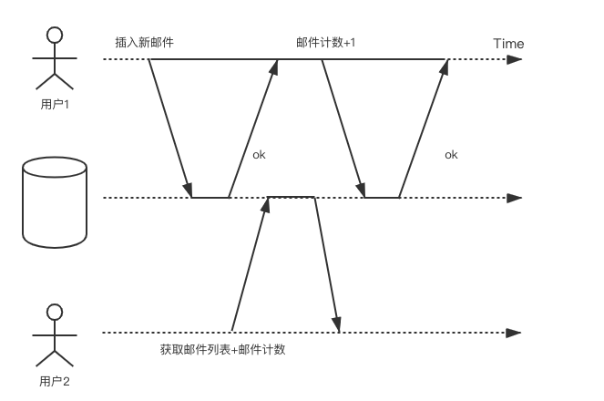

## 事务的属性

ACID，事务的4个属性，这个每个人都很熟悉。其中：

***A***代表原子性，即：事务中的操作要么全部正确执行，要么全部不执行。在分布式系统中，其主要由2pc协议来保证的（另外还有一个3pc协议，但是只停留在理论阶段，没有太多实践意义），后面我会专门写一篇文章来介绍2pc的原理以及各个产品的优化实践。

***I***代表隔离性，即：多个事务并发执行时，对每个事务来说，它并不会感知系统中有其他事务在同时执行。隔离性有很多个级别，针对不同的级别有多种不同的实现方法，如：MVCC、2PL等。

***D***代表持久性，即：一个事务在提交之后，该事务对数据库的改变是持久的。持久性主要通过redo log来保证的，即如果宕机导致内存中的数据丢失了，需要通过redo log回放来进行恢复。关于持久性，需要注意一点的是，并不存在完美的、绝对的持久性，因为磁盘可能会坏掉，即使有多个副本，理论上也存在多个副本所在的磁盘同时坏掉的情况。多副本这些手段只是用来降低风险，并不能使之达到绝对的持久性。

***C***代表一致性。即：数据库必须保证事务的执行从一个一致性状态转移到另一个一致性状态。简单说就是数据库从一个正确的状态到另一个正确的状态。比如转账事务完成后，转账双方的总金额不能多也不能少。另外这里的一致性和多副本的一致性也不是一个概念。多副本一致性是指：

- 查询和更新单个对象的操作按一定顺序执行

- 更新操作的效果必然反映在后续查询操作返回的结果中

在ACID中，C是目的，AID是手段，为了达到C的目的而提供的手段。AID是数据库自身的属性，C则更多的是应用层的属性，应用层利用数据库的AID的这三个特性来达到C。说到这里可能有些混乱，举个例子：

在银行系统中，A要向B转账100元，而A的账户余额只有50元，并且应用层给账户余额这一列添加了值不能小于0的约束，那么很显然这条事务会执行失败。因为50-100=-50，很显然不符合约束。此时事务会回滚，这样应用层便利用了事务的AID特性保证了一致性C。

反之，如果用户没有为账户余额这一列添加不能小于0的约束，那么事务便会执行成功，导致A的账户余额变成了-50，显然这是不正确的状态。

由此可见，一致性的保证是由应用层来保证的。

另外说一句，对于一个涉及a、b节点的分布式事务，如果节点a提交了本地事务，而节点b还没来得及提交，从而其他事务看到了其中间状态，这个问题是由隔离性来解决的。很多人误以为是一致性，其实是不对的。

## 弱隔离级别

严格意义上的隔离性是指假装没有发生并发，这意味着事务的最终执行结果与串行执行相同，然而这会严重影响性能。许多数据库不愿意牺牲性能，因而更多倾向于采用较弱的隔离级别。

弱隔离级别分为以下四种隔离级别：读未提交、读已提交、可重复读、串行化。

### 读未提交（read-uncommitted）

读未提交是指允许一个事务去读取其他事务尚未提交的数据，即***脏读***。用白话说就是你读取了别人正在处理的数据。

当存在以下问题时，需要解决脏读的问题：

- 如果事务会更新多个对象，那么脏读意味着其他事务会看到部分更新这种中间状态，而非看到全部。例如当收到一封电子邮件时，需要更新收件箱以及未读邮件数。如果用户只看到了新邮件但看不到更新的邮件数，则会带来一些困扰。如下图所示：

- 如果事务中止，则所有写入操作都需要回滚。如果发生了脏读，那么可能看到了一些稍后会回滚的数据。

同时，读未提交还有***脏写***的问题，即：写数据库时，会覆盖未成功提交的数据。

我们举一个汽车购买的例子来说明脏写的问题。购买汽车需要两次数据库写入：网站上商品买主需要更新为新卖家；销售发票也要随之更新。在下图中，用户1和用户2试图购买同一辆车，当脏写发生时，会导致商品卖给了用户1，发票却给了用户2。

### 读已提交（read-committed）

为了解决脏读/脏写的问题，引入了读已提交。其只提供如下两个保证：

- 读数据时，只能看到已经成功提交的数据（防止脏读）

- 写数据时，只会覆盖已经成功提交的数据（防止脏写）

数据库通常使用行锁来解决脏写的问题，即当事务想要修改某个对象时，首先获取对象的锁，然后一直持有锁直到事务提交或中止。给定时刻只有一个事务可以拿到特定对象的锁，如果另一个事务尝试更新同一个对象，其必须等待，直到持有锁的事务提交或中止后，获取锁并继续。

对于脏读却不能像解决脏写问题一样简单地使用读锁，因为这样只读事务会被长时间的写事务阻塞，严重影响只读事务的延迟。所以大多数数据库都是采用了双版本的方式来解决脏读问题：对于每个待更新的对象，数据库都维护其旧值和即将更新的新值，在写事务提交之前，所有读都获取旧值；而当写事务提交之后，则读取新值。具体如下图所示：

虽然解决了脏读和脏写的问题，当时仍然有问题：

在上图中，最初账户1和账户2各有500元钱，转账者随后将100元钱从账户2转账到账户1。而小明则在其转账钱查看了账户1的金额，得到了500，又在转账完成后查看了账户2的金额，得到了400。发现两者之和为900，而非最初的1000，所以从小明看来，100元钱好像消失了一样。

这种异常现象叫做不可重复读（也叫做读倾斜），用白话说就是你读数据的时候别人插进来对数据操作了。另外，我们线上经常遇到的一个补课重复读的场景：在做冷备的过程中的数据写入。这样得到的备份数据既有部分旧版本数据，也有部分新版本数据，具有不可重复读的特性。

### 可重复读/快照级别隔离（repeatable read）

读提交的问题在于，只要事务提交，其所做的数据修改就可以看到。可重复读在这一点对其进行了优化。

可重复读也叫快照级别隔离。顾名思义，快照级别隔离是说每个事务都从数据库的一致性快照中读取，事务看到的所有数据都是最近提交的数据，即使随后数据可能会被修改。这样就可以避免不可重复读的问题。

快照级别隔离采用了与读已提交隔离级别解决脏读问题类似、但更通用的方法来解决不可重复读。因为系统中可能存在多个事务，那么这些事务可能会在不同的时间点查看数据库的状态，所以需要保留多个不同的提交版本。该技术叫做多版本并发控制（MVCC）。然而对于读已提交，则只需要保存数据的两个版本就够了，事务提交前读取旧版本数据，提交后则读取新版本数据。

下图以上面银行转账的例子，展示了MVCC的实现。其中每个事务都有一个全局唯一且单调递增的事务ID。

当查询数据时，会列举出该数据的所有版本，然后经过一系列的筛选，获取可访问的数据。当以下两个条件都成立时，该数据对当前事务可见：

- 事务开始时，创建对象的事务已经完成了提交。

- 对象没有被标记为删除；或者即使标记了，但是删除该对象的事务在事务开始时还没有完成提交。

另外，对于脏写问题，快照级别隔离和读已提交一样，都是采用了行锁的方式来解决。

### 串行化（serializable）

对于之前的几个隔离级别，主要考虑的是只读事务遇到并发写时的情况，却并没有考虑写事务并发会带来什么问题。

#### 脏写

前面已经讲过脏写的问题，即事务更改了尚未提交的数据，这个问题在读已提交隔离级别中得到了解决，这里就不再赘述。

#### 写更新

更新丢失是一个很经典的问题，其发生在read-modify-write的场景中，即：读取旧值，修改旧值，并将新值写入。

在上图中，如果事务是顺序运行的话，最终counter应该等于300，然而在上图中，由于并发的存在，最终导致counter=200。

对于写更新，可以采用原子操作、加锁或者自动检测（先让事务并发运行，当检测到更新丢失的风险时，则中止并回退事务）等方法来解决

#### 写倾斜

脏写和写更新指的都是更新同一个对象的情况，当更新多个对象时，则会产生写倾斜的问题。

做IT的应该基本都有oncall经历，假设团队中每天至少要有一个人负责oncall。如下图所示，最开始系统中标记小张和小李负责oncall，最后由于写倾斜的存在，导致当天无人oncall。

由此可见写倾斜发生的背景和更新丢失一致，都是由read-modify-update导致的。因此写倾斜可以定义为一种广义上的更新丢失。

串行化可以用来解决上述问题。

可串行化是最强的隔离级别，它保证即使事务并行运行，但是最终的结果和串行结果相同。其效果是将事务完全隔离开、好像在串行化执行。

## 未完待续

