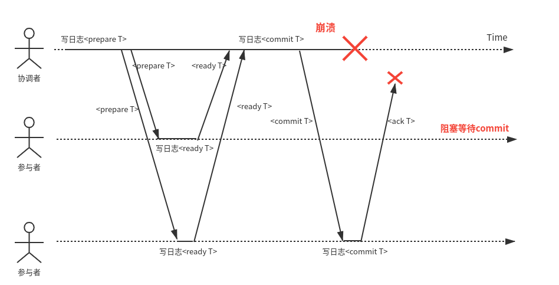
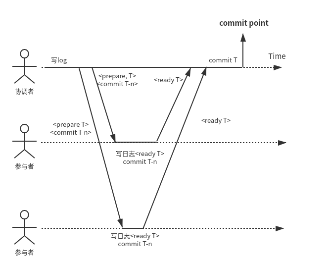

在分布式事务中，不能简单的向所有节点发送提交请求，然后各个节点去独立的执行事务提交。例如：

- 某些节点检测到违反约束或者冲突因而决定终止，而其他节点则可能成功提交

- 发送给某些节点的提交请求可能因为网络原因丢失，而发往其他节点的请求则顺利通过

- 某些节点可能在日志记录写入之前发生崩溃，然后再恢复时回滚，而其他节点成功提交

因为部分节点提交成功、而其他一些节点提交失败的情况，将会破坏原子性。

之前的[文章](https://levy5307.github.io/blog/distributed-transaction/)讲到过，分布式事务的原子性是由2pc来保证的。

## 2pc的基本流程

2pc全称two-phase commit，即两阶段提交，它将事务的提交分为两个阶段。

阶段1：协调者（即事务管理器）发送prepare request至所有的参与者。询问其是否可提交，并跟踪参与者的回应。

在这个阶段，当参与者回复ready之前，需检查是否存在违反约束或者冲突，并要确保任何情况都可以提交，这是***参与者所作出的承诺***。

阶段2：协调者获取到所有参与者的回答后，根据具体情况判断提交与否：

- 如果所有参与者回复ready，表示他们已经准备好提交，则协调者会发出commit request给参与者，进行实际的提交。

- 如果有至少一个参与者回复abort，表示该参与者无法正确提交，协调者就会向参与者发送放弃请求。

在这个阶段中，协调者根据所有参与者的回复获取事务提交与否的最终决定，并需要将最终决定落盘。这个时刻称为***提交点***。在落盘之后，需要向所有参与者发送提交请求，即使发生了超时等失败，也要一直重试直到成功。这是***协调者所作出的承诺***。

***这里协调者和参与者的两个承诺是不可撤销的，必须严格贯彻。也正是这两个承诺才保证了2pc的原子性***。

上图是事务T的正常流程，从图中可以看到，2pc需要协调者经过2次日志落盘，参与者2次日志落盘，以及2次rpc往返才能返回给客户端响应。

上图中展示的是参与者由于检测到违反冲突而导致事务失败。可以看出其流程与正常的事务流程一样，也是需要协调者2次落盘，参与者2次落盘，以及2次rpc往返才能给客户端响应。

## 阻塞式协议

从上面的基本流程可以看出来，2pc是一个阻塞式协议。当参与者回复prepare ready之后，需要阻塞一直等待协调者的最终决定。如果在决定到达之前协调者发生故障，则参与者只能等待协调者恢复。这里主要是由于获取不到协调者的最终决定，参与者不知道下一步该如何操作，因为有可能有其他参与者返回了abort而导致协调者最终放弃事务。

上图是2pc执行过程中协调者宕机的情况，此时参与者会一直等待协调者恢复。而由于协调者的事务执行过程都有日志落盘，所以当协调者恢复后，可以继续执行事务过程。

对于上述问题，在实践中多采用2pc和Paxos等共识协议结合的方式，由Paxos来保证协调者的高可用。

不过参与者发生故障却不会导致阻塞。例如：

- 如果prepare到来之前或者prepare ack发送之前参与者故障，那么协调者将取消事务。

- 如果参与者回复了parepare ack为ready，协调者决定提交事务时参与者发生故障，那么协调者将一直重试向参与者发送commit请求。

## 2pc的缺点

通过上文描述的2pc的基本过程，我们可以知道2pc有以下几个缺点：

- 单点问题。很显然协调者是一个单点，只要协调者宕机，系统则无法运转

- 阻塞式协议。具体参见上一节

- 效率低。用户感知到的提交延时是***2次协调者写日志、2次参与者写日志以及2次rpc往返耗时***

## 业内的优化实现

下面我们看看针对以下问题，业内实际产品是怎么解决的。

### PacificA

分布式共识协议PacificA在主从复制时也使用了2pc来实现，其具体流程如下：

在PacificA中，每个分片的primary作为coordinator发起2pc流程。

1. primary在接收到客户端的写请求后，先在本地做相应检查，查看是否符合提交条件。如果符合，则先在本地写入log，并向所有的secondary发送prepare请求。

2. secondary收到prepare请求时，同样也在本地做检查，查看是否符合提交条件。同样，如果符合则再本地写入log，并向primary发送ack

3. 当primary收到所有的secondary的prepare ack之后，就在本地进行提交操作。这里与2pc不同的一点是，primary提交成功之后就向客户端返回写入成功，而无需等待第二阶段的提交过程。

那问题在于，图里只有一个prepare阶段，并没有第二阶段的提交过程，那secondary如何进行提交呢？这里PacificA做了优化，其在下一次prepare请求中会携带上当前primary的commit point，secondary在收取到该commit point之后进行本地提交就可以了。

同时，也不用担心primary挂掉之后的，secondary由于没有提交而产生的一致性问题，因为在PacificA的reconciliation过程中，会推动secondary中没有提交的日志进行提交，关于这一点，可以参考我之前写的PacificA的文章。

所以，PacificA由于减少了等待commit过程，将客户端感受到的提交延迟降低为***2次协调者写日志、1次参与者写日志(commit和写<ready T>合并成一次写入)以及1次rpc往返***。

另外，前面提到，2pc还有一个问题是协调者是单点的问题。前面曾经提到，对于这一点业内通常是采用多副本共识协议搭配2pc来解决其单点问题的。而PacificA就是一款分布式共识协议，当primary挂掉之后，其manager可以再选取出一个secondary晋升为primary，这样便解决了2pc中协调者的单机问题。

这里提一点，其实虽然primary和secondary的日志复制是同步的，但是提交操作却异步的，secondary的提交在下一次的prepare req到来之时进行提交。这里可以对其进行***优化***：添加一个新的commit rpc，在prepare阶段之后，由primary向secondary发送，secondary收到该请求后进行commit操作，这样便可以免去secondary commit操作对2pc的延时。具体如下图：

### Percolator

Percolator是依赖BigTable的单行事务来实现的跨行跨表的分布式事务，并且充分利用了Bigtable的timestamp机制。客户端是作为协调者存在的，服务端有一个row作为primary（拥有primary lock），其他的是secondary。其将2pc两个阶段称为prewrite和commit。

- prewrite阶段。首先向primary row发送prewrite请求。其首先检查是否存在冲突（两种冲突场景详见Percolator论文）。如果不存在冲突则上锁（向lock列写入），并将数据写入row中（向data列写入）。如果primary执行成功，则依次向所有的secondary row执行相同步骤。需要注意的一点是，这里的data列和lock列，都是向start timestamp对应的版本写入。

- commit阶段。在该阶段，首先获取commit timestamp。然后检查primary是否还持有对应于start timestamp的lock。如果有，则向commit timestamp对应版本写入write record（向write列写入），并释放锁。这里如果执行成功，就代表事务已经提交了。此时可以向客户端返回成功，后面异步的向secondary发送提交请求即可。

具体执行时序图如下：

对于异步向secondary发送请求之后，如果客户端挂掉了，是否secondary就无法成功提交了呢？答案是否定的，在Percolator中有失败处理机制，可以通过其他事务来检测当前事务的执行情况，并进行roll forward或者roll back。具体可以参考Percolator论文。

总结：从上面的描述中可以看到，在percolator中，客户端感受到的提交延迟***为2次协调者写入、1次参与者写入以及n+1次rpc往返***。

### OceanBase

OceanBase中将第一个出现的参与者选为协调者，其他的作为参与者。其2pc实现搭配了分布式共识协议Paxos，协调者和参与者分别都有三个副本，这样便可以完美解决了协调者的单点问题。

对于2pc流程，OceanBase做了比较极致的优化。众所周知，2pc过程中协调者和参与者的写日志主要是用于宕机后查看事务执行的状态。OceanBase将协调者的日志省略，主要依靠比对所有参与者的日志，判断事务是否执行成功。其中，只要有一个参与者的日志标记事务失败，则代表事务执行失败。具体流程如下图：

通过上图可以看到，oceanbase中的2pc将用户感受到的提交延迟降低为***1次rpc、1次参与者写日志。*** 当然，其缺点也是比较明显的，即当发生故障，需要比对所有参与者的日志来查看事务执行过程，相较于传统的2pc流程，恢复过程会慢一些。

## Reference

[PacificA](https://levy5307.github.io/blog/PacificA/)

[Percolator](https://levy5307.github.io/blog/percolator/)

[OceanBase事务的本质](https://b23.tv/lyerY9)

