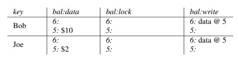
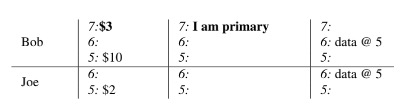
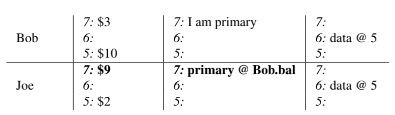
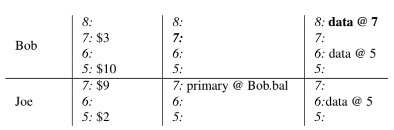
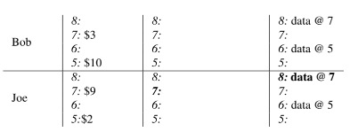

## Background

在Google公司内部，对于海量索引数据的创建和实时更新是必须面对的问题。Map Reduce解决了海量索引数据的批量创建问题，但是却不能支持对增量数据的实时更新，每次需要对全量索引数据进行一次重新创建。并且由于文档在Google上能否被检索到取决于全量索引的创建时间，因此导致其被检索到的时间间隔较长。

综上，Google内部缺少一个支持海量数据存储、支持并行随机读写、支持跨行事务的分布式数据库。Percolator便因此而生。

## Design

Percolator为大规模的增量计算提供了两个抽象：基于随机访问仓库的的ACID事务、以及用于组织增量计算的observers

一个Percolator系统由三个二进制文件组成，他们在集群中的每台机器上运行：

- 一个Percolator Worker。所有的obserers都链接到Percolator Worker，Percolator Worker用于scan Bigtable的修改的column，并唤醒对应的observers。

- 一个Bigtable tablet server。observer通过向Bigtable的tablet server发送读写RPC来执行事务。

- 一个GFS chunkserver。Bigtable tablet server将其读写请求发送至GFS chunkserver，因为Bigtable是使用GFS做存储层，具体可查看bigtable论文

此外，Percolator还依赖两个小服务：时间戳oracle和轻量级锁服务。时间戳oracle用于提供严格线性增长的timestamp，snapshot隔离级别协议需要该线性增长的timestamp。轻量级锁服务使搜索dirty notification更加高效。

在程序员的视角来看，Percolator是由少量的table组成。table是由行和列索引的单元格cell组成。每个cell都对应一个value，该value是由一组uninterpreted bytes组成。（在Percolator内部，为了支持snapshot隔离级别，每个单元格内包含由一系列时间戳索引的values）

Percolator的设计基于两个前提：

1. 运行在大规模数据上

2. 并不要求非常低的延迟。不严格的延迟要求允许我们采用一种懒惰的做法来清理在失败机器上运行的事务所遗留的锁。这种懒惰的做法比较容易实现，但是可能会让事务提交延迟数十秒。这种延迟在OLTP系统上通常是难以接受的，但是在构建web索引的增量处理系统中是可以容忍的。

Percolator缺少一个中央总控用于事务管理，尤其它缺少一个全局的死锁检测器。这增加了产生冲突事务的延迟，但是却允许系统可以扩展到上千台机器。

Percolator是基于Bigtable构建的，它需要将一些元数据存储在旁边特殊的列中，其实现的挑战主要在于提供Bigtable所没有的功能：多行事务和observer framework

### 事务

***Percolator提供了跨行、跨表的ACID快照隔离级别***的事务。其充分利用的Bigtable的timestamp，对每个数据项都维护多个版本（MVCC）以实现快照隔离，快照隔离可以有效的解决写-写冲突：拥有较大提交版本号的事务将会正确提交，另外一个则会回滚。另外，***Percolator并不提供串行隔离***。根据之前的文章中介绍，MVCC并不能解决write skew的问题，但是其相对于串行隔离的优势是性能更高，具体可以参考[分布式事务](https://levy5307.github.io/blog/distributed-transaction/)。

Percolator需要维护锁，其对锁有如下几个要求：

- 锁必须是持久化的，以应付宕机导致锁失效

- 锁服务一定要支持高吞吐量，因为可能会有几千台机器并行请求锁

- 由于每个Get()操作都会申请读锁，因此锁服务一定要是低延迟的，以最大化降低锁服务带来的延迟

- 高可用。需要冗余备份，以防异常故障

基于这些要求，Percolator采用了Bigtable，将锁和数据存储在同一行，采用特殊的列来存放锁。在访问某行数据时，Percolator将在一个Bigtable行事务中对同行的锁执行读取与修改。

下表展示了Percolator中名为c的column在Bigtable中所对应的columns

| Column   | Use                                  |
|----------|--------------------------------------|
| c:lock   | 未提交的事务才会写入该cell, 包含primary lock的位置   |
| c:write  | 已提交的事务才会写入。存储bigtable中data的timestamp |
| c:data   | data itself                          |
| c:notify | Hint: Observers可以开始运行了               |
| c:ack_O  | Observer “O”已经运行过了。存储其最后一次运行成功的时间戳   |

在percolator的事务中，每个事务有两个对应的timestamp：start timestamp和commit timestamp。分别代表事务开始时间和事务提交时间。start timestamp决定了该事务的Get()操作可以看到的数据snapshot。commit timestamp决定了只有在该timestamp之后开始的事务才能读取到该事务的写入。

下面流程展示了事务执行过程中bigtable中的data和metadata的布局: 

- 初始状态，Joe的账户中有2元，Bob的账户有10元



- 该事务获取其start timestamp: 7。并且获取Bob这一行的锁（该锁是primary lock），同时向该start timestamp中写入数据3



- 该事务现在为Joe这一行加锁，并且写入Joe新的余额，该锁是一个secondary lock，其包含一个指向primary lock的引用。当事务crash时，该事务需要清理，此时其需要获取primary lock。



- 此时，该事务达到commit point。此时事务获取其commit timestamp: 8。并且清空primary lock，并在timestamp 8的行的balance:write列中写入一条record，该record记录了data在哪个timestamp行中存储。这样commit point之后开始的的事务便可以读取到Bob的新余额3



- 该事务完成向Joe这一行中balance:write列中写入record以及删除锁



如下是事务实现的伪代码：

```cpp
class Transaction {
    struct Write { Row row; Column col; string value; };
    vector<Write> writes ;
    int start ts ;
    Transaction() : start_ts_(oracle.GetTimestamp()) {}

    void Set(Write w) { writes .push back(w); }
    bool Get(Row row, Column c, string* value) {
        while (true) {
            bigtable::Txn T = bigtable::StartRowTransaction(row);
            // Check for locks that signal concurrent writes.
            if (T.Read(row, c+"lock", [0, start ts ])) {
                // There is a pending lock; try to clean it and wait
                BackoffAndMaybeCleanupLock(row, c);
                continue;
            }

            // Find the latest write below our start timestamp.
            latest write = T.Read(row, c+"write", [0, start ts ]);
            if (!latest write.found()) return false; // no data
            int data ts = latest write.start timestamp();
            *value = T.Read(row, c+"data", [data ts, data ts]);
            return true;
        }
    }
    // Prewrite tries to lock cell w, returning false in case of conflict.
    bool Prewrite(Write w, Write primary) {
        Column c = w.col;
        bigtable::Txn T = bigtable::StartRowTransaction(w.row);
        
        // Abort on writes after our start timestamp . . .
        if (T.Read(w.row, c+"write", [start ts , ∞])) return false;
        // . . . or locks at any timestamp.
        if (T.Read(w.row, c+"lock", [0, ∞])) return false;
        
        T.Write(w.row, c+"data", start ts , w.value);
        T.Write(w.row, c+"lock", start ts , {primary.row, primary.col}); // The primary’s location.
        return T.Commit();
    }
        
    bool Commit() {
        Write primary = writes [0];
        vector<Write> secondaries(writes .begin()+1, writes .end());
        if (!Prewrite(primary, primary)) return false;
        for (Write w : secondaries)
            if (!Prewrite(w, primary)) return false;
        
        int commit ts = oracle .GetTimestamp();
        
        // Commit primary first.
        Write p = primary;
        bigtable::Txn T = bigtable::StartRowTransaction(p.row);
        if (!T.Read(p.row, p.col+"lock", [start ts , start ts ]))
            return false; // aborted while working
        T.Write(p.row, p.col+"write", commit ts, start ts ); // Pointer to data written at start ts .
        T.Erase(p.row, p.col+"lock", commit ts);
        if (!T.Commit()) return false; // commit point
       
        // Second phase: write out write records for secondary cells.
        for (Write w : secondaries) {
            bigtable::Write(w.row, w.col+"write", commit ts, start ts );
            bigtable::Erase(w.row, w.col+"lock", commit ts);
        }
        return true;
    }
} // class Transaction
```

在事务的构造函数中，向timestamp oracle获取一个start timestamp。如前面所说，其决定了Get()接口可以获取到的数据snapshot。

#### Set操作

对于Set()操作的调用将在commit之前一直缓冲在本地。对于缓冲的writes的提交是由2pc来完成的，其中client作为协调者。不同机器上的本地事务是通过bigtable的行事务来执行的。

***prewrite阶段***

在prewrite阶段，我们将尝试获取所有将要写的cell的锁（其中一个锁是primary lock）。首先，该事务先读取metadata查看是否有冲突存在，这里一共有两种冲突：

1. 如果其看到一个在其start timestamp之后的write record，则abort。这代表在该事务开启之后有其他的事务执行了写入。***这样可以解决更新丢失的问题，当然，对于写倾斜还是束手无策。***

2. 如果该事务看到一个任意timestamp的锁，同样会abort。这代表有其他事务给该cell加了锁。

如果没有冲突，则写入data以及lock（代表获取锁），并且将会开始执行第二阶段（commit阶段）

***commit阶段***

在commit阶段开始，先从oracle获取commit timestamp，并且commit timestamp > start timestamp。

- 向write列中写入数据，数据的时间戳为commit timestamp，内容为start timestamp，通过该start timestamp，readers可以查找到实际写入的数据。

- 对于每一个cell，释放获取的lock

如果primary提交失败，那么事务就需要回滚。而如果primary提交成功，则可以***异步***提交secondaries, 流程和primary提交一致。不过不同的一点是，secondary提交失败了不会回滚。这意味着，***一旦primary的写入可见之后事务就提交了，因为其使得写入操作对readers可见***。

***Questions:*** 

Q:  为什么primary commit失败就要回滚？按照percolator的说法，primary和secondary都是参与者，根据2pc协议，参与者失败了只要后续重试就可以了。

A: 只要primary commit写入了，后续可以通过失败处理让secondary也commit成功。这样可以免去client重试，详情可见下文失败处理-客户端在第二阶段挂掉了

Q: secondary提交失败了并没有重试操作，这样如何保证最终secondary的成功提交？

A: 同样参照失败处理-客户端在第二阶段挂掉了

#### Get操作

Get()操作首先查看[0, start timestamp]范围内的锁（该范围表示当前事务可以看到的数据版本），如果有锁，说明有一个其他的事务正在同时进行写入。因此当前读事务需要等待该锁释放。如果没有锁，那么Get()操作读取该时间范围内最新的write record并且根据write record内容获取该其对应的数据。

#### 失败处理

由于客户端存在失败的可能，所以导致事务的处理过程变得复杂了。如果当一个事务正在进行提交时（prewrite或者commit阶段）失败了，那么其持有的锁将会一直持有。Percolator必须清理掉这些锁，否则它将导致其他的事务永远的hang住。Percolator采用了lazy的处理方式来清理这些锁：当事务A遇到了锁冲突（这些锁由事务B持有），事务A必须判断事务B是否已经失败、并且清理这些锁。

不过让事务A很自信的判断事务B挂掉是很难的，因此我们要正确处理事务A的清理与（事实上没有失败的）事务B的提交之间的竞争情况。Percolator通过指定事务中的一个cell作为synchronizing point，该cell的lock作为primary lock。清理与提交操作需要修改该primary lock（获取该primary lock）。由于该修改时基于Bigtable的单行事务的，所以只会有一个清理或者提交能够成功执行。明确地说就是：在B提交之前，它必须先检查其是否还持有primary lock，如果持有，则将primary lock替换为一个write record；在A清除B的事务之前，必须检查primary lock看事务B是否已经提交，如果primary lock仍然还在，则可以安全的清除该锁。

当客户端在提交的第二阶段（commit）挂掉了，一个事务将错过commit point，并且仍然持有一些锁。对这种事务，我们必须执行roll-forward。当其他事务遇到这些被遗弃的锁时，可以通过primary lock来区分这两种情况：

1. 如果primary lock已经被替换为一个write record，则写入此锁的事务肯定已经提交了，此锁必须被roll forward

2. 否则，该事务应该被回滚（因为事务总是会先提交primary lock，如果primary lock没有被提交，则说明事务没有提交，此时回滚肯定是安全的）

在执行roll forward时，执行清理的事务也会将这些被遗弃的锁替换为一个write record。

因为对于清理操作是由primary lock同步的，所以清理活跃客户端所持有的锁是安全的。然而回滚会强迫事务abort，这样会严重影响性能。因此，一个事务将不会清理一个锁除非它猜测这个锁属于一个挂掉的事务。Percolator使用Chubby服务来协助判断事务是否存活。运行中的事务会向Chubby锁服务中写一个token，其他事务会将改token的存在代表当前事务处于alive（如果事务退出，该token会被自动清除掉）。为了处理事务alive但是没有working的情况，需要向锁中写一个wall time。如果该锁的wall time太老，即使token有效也会被清理。有些事务可能需要运行很长时间才会提交，在这种情况下，该事务需要周期性的更新wall time。

### Timestamps

时间戳Oracle是一个用于分配单调递增时间戳的服务。由于每个事务需要调用oracle两次，因此这个服务必须有很好的伸缩能力。Oracle会定期分配出一个时间戳范围，并将范围中的最大值写入稳定的存储。当范围确定后，oracle便从内存中原子递增来快速分配时间戳，因此查询时只需要内存、而无需访问磁盘。当oracle重启后，首先会向稳定存储中读取上次范围的最大值。由于该值之前的值可能分配出去了、也可能没有分配出去，而该值之后的值肯定是没有分配出去的。所以接下来要从该值作为开始值继续分配。为了缓解PRC消耗，Percolator中的worker会和oracle维持一个场链接，并低频率地、批量的获取时间戳。当oracle负载增加后，worker可以通过增加每批获取的量来缓解负载压力。

事务协议使用严格单调递增的时间戳来保证Get()能够返回所有在start timestamp之前已提交的写操作。举个例子，考虑一个事务R在时间戳T(R)执行读取操作，一个写事务W在时间戳T(W) < T(R)执行了提交。如何保证R能看到W提交的写操作？由于T(W) < T(R)，我们知道oracle肯定是在T(R)之前或相同的批处理中给出T(W)；因此，W是在R收到T(R)之前请求了T(W)作为提交时间戳。我们知道R在收到T(R)之前不能执行读取操作，而W在它的提交时间戳T(W)之前必定完成了锁的写入；因此，上面的推理保证了W在R做任何读之前就写入了它所有的锁；R的Get()要么看到已经完全提交的写记录，要么看到锁，在看到锁时R将阻塞直到锁被释放（锁被替换为写记录）。所以在任何情况下，W的写对R的Get()都是可见的。

### Notifications

Percolator中，用户可以编写代码（observers），这些代码可以在table的变化时触发。每一个observer向Percolator注册一个function以及其感兴趣的一些column，当这些column中的任意一个发生变化时便去唤醒该function。

Percolator应用就是由一系列的observer组成的。每个observer完成一个任务，然后对相应的table执行写操作，从而触发下游的observer。

Percolator应用其实包含很少的观察者，Google索引系统大概有10个观察者。每个观察者都是在worker程序的main函数中构造的，所以很清楚哪些观察者是活跃的。可能有多个observers需要观察同一个列，但是在Percolator中禁止了这种行为，也就是说只允许一个列最多只允许一个observer观察，这样就可以很清楚的知道当一个特定的column改变后哪个obeserver将运行。不过***用户需要担心通知的无限循环（Infinite cycles）***，Percolator对此没有做过多考虑。

我们提供***一个保证***：每一个被观察列的每次改变，至多一个observer的事务被提交。反之则不然：一个被观察的列的多次写可能只会触发一次observer事务。我们称这个特性为***消息重叠***，它可以避免不必要的重复计算。比如，对http://google.com页面来说，周期性的通知其变化就够了，不需要每当一个新链接指向它时就触发一次

每个observed column为每个observer都有一个"acknowledgment" column（详见图1的ack_O列），包含这个observer最新运行的时间戳。当observed column写入时，Percolator启动一个事务来处理通知。该事务读取observed column和对应的acknowledgment列。分两种情况：

1. 如果observed column发生写操作的时间戳在acknowledgment列的最新时间戳之后，就运行observer逻辑，并设置acknowledgment列为新的时间戳

2. 反之，则说明已经有观察者被运行了，所以我们不重复运行它。

这里需要注意的时，如果Percolator偶然的对一个特定的通知并发启动了两个事务，由于Bigtable的单行事务，可以保证其中一个将取消运行，因为他们会在acknowlegment列上产生写冲突，从而保证每个通知至多一个观察者可以提交。

为了实现notificatioins，Percolator需要高效找到被观察的脏的cell。该搜索是很复杂的，因为notifications往往是稀疏的：我们的表有万亿的cell，但是notifications可能只有百万个。并且，observer代码运行在一大批分布式的、跨大量机器的客户端进程上，因此这代表脏cell的搜索也必须是分布式的。

为了鉴别dirty cells，Percolator在Bigtable维护了一个特殊的名叫"notify"的列，当一个事务写入observed cell时，它同时会设置对应的notify cell。系统中有些workers来对notify列执行分布式扫描，用以找到脏cell。在observer被触发并且对应的事务提交成功之后，我们将删除该notify cell。由于notify column仅仅是一个Bigtable column，而非Percolator column，它没有事务属性。它仅仅作为一个暗示，用以提醒scanner检查acknowledgment列来决定是否运行observer。***由此可以看到，这些observers是被异步调用执行的***。

为了使扫描高效，Percolator将notify column存储在一个单独的Bigtable locality group，因此扫描时仅仅需要读取百万个dirty cell，而不是万亿个cell。每个Percolator worker指定几个线程来扫描。对每个线程，worker选取table一部分的一部分来扫描：首先随机选取一部分Bigtable tablet，然后随机选取tablet中的一些key，最后从那个位置开始扫描该table。因为每个线程随机扫描table中共的一个范围，我们担心两个worker会扫描到同一行、c从而并发的运行同一行上的observer。虽然由于notifications的事务本性，这样不会导致正确性问题，但是这样是不高效的。为了避免这个情况，在遍历一个row之前，每个worker需要从轻量化锁服务中获取一个锁。这个锁服务不需要持久化状态，因此可伸缩性很强。

该随机扫描机制还需要一个额外的优化：在最初部署时，我们注意到扫描线程都倾向于集中到table中的少量region上，这严重影响了扫描的并行效果。这种现象经常在公交系统中看到，被称为***"platooning"或者"bus clumping"***。当某一个bus因为某种原因速度减慢（比如客流增大），将导致它到达后续车站的时间延后。由于每个车站的乘客数量是随着时间增长的，于是便会导致越来越慢（类似于滚雪球效应）。这导致该bug与其后面的bus时间间隔缩短、这个慢的bus后面的bus速度则会提高，因为它在每个站装载的乘客数量减少了。最终的结果就是在后续的车站，多辆公交车将会同时到达。我们的扫描线程工作机制类似：一个扫描线程运行的observer减慢导致之后的线程快速跳过已经被处理的cell，并逐渐与最开头的thread狙击在一起，但是却没能超过零头的线程，因为线程堆积导致该tablet服务器过载。为了解决这个问题，我们做了一个公交系统不能实现的优化：当一个扫描线程发现了它和其他的线程在扫描相同的行时，它就会在table中重新选择一个随机定位继续扫描。这就好比在公交系统中，公交车（扫描线程）为避免clumping而时空穿梭到一个随机的车站（table中的某个位置）

### Discussion

相对于MapReduce-based系统，Percolator一个不高效的点就是每个work-unit发送的RPC数量。MapReduce通常只对GFS执行一个大型的read操作以获取所有需要的数据，而Percolator处理一个文档就需要执行大约50个单独的Bigtable操作。导致RPC太多的其中一个因素发生在commit期间。当写入一个锁时就需要两个Bigtable的RPC：一个为查询冲突锁或写记录，另一个来写入新锁。为减少负载，我们修改了Bigtable的API将两个RPC合并。按这个方法，我们会尽量将可以打包批处理的RPC调用都合并以减少RPC总数。比如将锁操作延缓几秒钟，使它们尽可能的聚集以被批处理。因为锁是并行获取的，所以每个事务仅仅增加了几秒的延迟；这附加的延迟可以用更强的并行来弥补。批处理增大了冲突发生的时间窗口，但是通过有效的事务、通知机制，我们的环境中竞争并不强烈，所以不成问题。

从table读取时我们也利用了批处理：每个读取操作都被延缓，从而有一定几率让相同tablet的读取操作打包成批处理（类似buffer的原理）。这样会延缓每次读取，也可能增加不少的事务延迟。为了解决这个问题，我们采用了预取机制。实验证明从同一行里读取一个数据和读取多个数据所产生的消耗相差不大，因为Bigtable都要从文件系统读取一整个SSTable块并解压缩。Percolator尝试在每次读取某一行的某一列时都做预测，在本事务中，会不会稍后就要读取该行的其他列。预测是根据过去的行为记录而做出的。通过此方法，降低了几乎10倍的read次数。

在之前的Percolator的实现中，所有API调用都会阻塞，然后通过调高每台机器的线程数量来支持高并发、提升CPU利用率。相比异步、事件驱动等方案，这种thread—per-request的同步模型的代码更易编写。异步方案需要花费大量精力维护上下文状态，导致应用开发更加困难。根据我们的实际经验，thread—per-request的同步模型还是可圈可点的，它的应用代码简单，多核机器CPU利用率也不错，同步调用下的堆栈跟踪也很方便调试，所遭遇的资源竞争也没有想象中那么恐怖。不过它的最大缺点是可伸缩性问题，linux内核、Google的各种基础设施在遭遇很高的线程数时往往导致瓶颈。不过我们有in-house内核开发小组来帮助解决内核问题。

