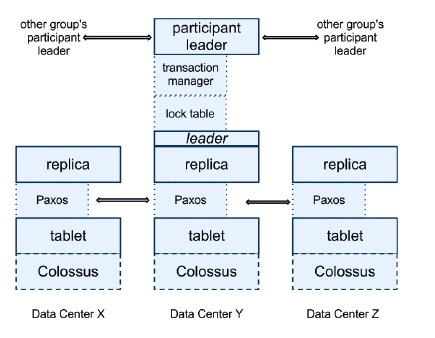
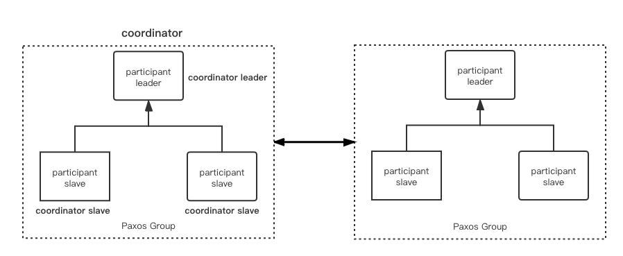
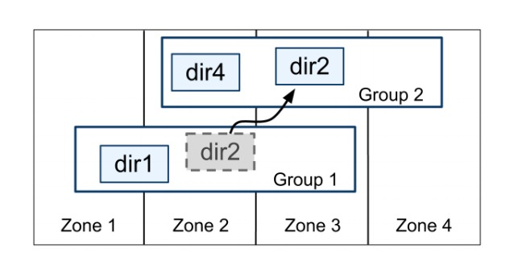
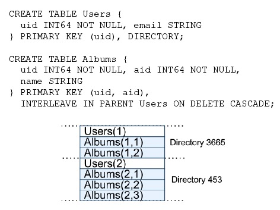
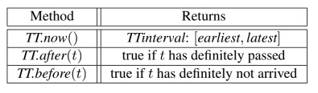

Spanner是谷歌开发的一款可扩展的、全球分布式的数据库，其复制技术可以用来服务于全球可用性和地理局部性。

其提供了几个特性：

- 在数据的副本配置方面，应用可以在一个很细的粒度上进行动态控制。应用可以详细规定哪些数据中心包含哪些数据，数据距离用户有多远（控制用户读取数据的延迟），不同数据副本之间距离有多远（控制写操作的延迟），以及需要维护多少个副本（控制可用性和读操作性能）。数据也可以被动态和透明地在数据中心之间进行移动，从而平衡不同数据中心内资源的使用。

- Spanner有两个重要的特性，很难在一个分布式数据库上实现，即Spanner提供了读和写操作的外部一致性，以及在一个时间戳下面的跨越数据库的全球一致性的读操作。这些特性使得Spanner可以支持一致的备份、一致的MapReduce执行[12]和原子模式变更，所有都是在全球范围内实现，即使存在正在处理中的事务也可以。

之所以可以支持这些特性，是因为Spanner可以为事务分配全球范围内单调向前的commit timestamp，即便事务可能是分布式的。这些时间戳反映了事务串行化的顺序。除此以外，这些串行化的顺序满足了***外部一致性***的要求：如果一个事务T1在另一个事务T2开始之前就已经提交了，那么T1的commit timestamp就要比T2的commit timestamp小。Spanner是第一个可以在全球范围内提供这种保证的系统。实现这种特性的关键技术就是一个新的TrueTime API及其实现，这个在后面将会详细讲解。

## 实现

一个Spanner部署被称为一个universe。一个universe由如下部分组成：

- 许多个zone。zone是管理部署的基本单元。当新的数据中心加入服务、或者老的数据中心被关闭时，zone可以被加入到一个运行的系统、或者从系统中移除掉。同时，zone也是物理隔离的单元，在一个数据中心中，可能有一个或者多个zone。

- 一个universe master。universe master主要是一个控制台，它显示了关于所有zone的各种状态信息，这些信息主要用于调试。

- 一个placement driver。placement driver用于提供zone之间的以分钟为单位的数据移动。placement driver会周期性的与spanserver进行沟通，用以发现需要移动的数据，以满足更新副本约束或者load balance需求。

其中，每个zone包含：

- 一个zonemaster。zonemaster用于把数据分配给spanserver

- 一百至几千个spannserver。spanserver把数据提供给客户端

- 若干个location proxy。local proxy用户给客户端定位数据所在的spanserver

下图展示了一个spanner universe的所有服务器。


### Spanserver Software Stack

这一节主要关注spanserver的实现，来解释replication和分布式事务是如何实现的。



每个spanserver负责管理100-1000个tablet。这里的tablet类似于Bigtable中的tablet，同样实现了下面的映射：

```
(key:string, timestamp:int64) -> string
```

与Bigtable不同的是，spanserver会把时间戳分配给数据，使得spanner更像是一个多版本数据库、而非kv存储。

一个tablet的状态是存储在类似于B-树的文件集合以及WAL中，所有这些最终都会被保存到一个分布式文件系统中，即Colossus。

为了支持replication，spanserver会为每个tablet之上实现一个Paxos状态机（早期的spanner实现可以支持在每个tablet上实现多个Paxos状态机，这样允许更灵活的replication配置，但是过于复杂，因此该方式被放弃了）。每个状态机都在其相应的tablet上保存metadata和log。我们的Paxos实现支持基于time-based租约的long-lived leader，其租约的默认时间是10秒。当前的spanner实现对每个Paxos写入操作都进行两次log写入：一次在tablet的log中，另一次在Paxos的log中。当然，这只是一个权宜之计，后续我们会对其进行优化。

众所周知，Paxos是用来实现一致性复制的。每个副本的kv键值对都存储在相应的tablet上。写操作必须在leader上开始初始化Paxos协议，读操作可以访问任意副本，只要它足够新。副本的集合称为一个Paxos group。

相较于其他副本，每个leader副本有两个特殊实现：

- 对每个leader副本，spanserver实现了一个lock table用以实现并发控制，lock table存储了2PL的locking状态。其将一定范围的key映射到锁状态（注意，long-lived Paxos leader对于高效的管理lock table是至关重要的）。在Spanner中，我们设计了长时间运行的事务（例如，对于报表生成可能需要几分钟），当遇到冲突时，采用乐观并发控制可能会性能很差，因此需要采用2PL这种悲观并发控制方式。对于需要同步的操作，例如事务性读，需要在lock table中获取锁，其他的操作则不用。

- 对每个leader副本，spanserver实现了transaction manager来支持分布式事务。该transaction manager用于实现一个participant leader，该group的其他副本则作为participant slave。每个transaction manager的状态将被存储在其底层的Paxos group中，同样该数据也是被复制多份的。

对于分布式事务的实现分两种情况：

- 如果一个事务只涉及一个Paxos group，则完全可以绕过transaction manager，因为lock table和Paxos二者可以一起保证事务性。

- 如果一个事务包含了多个Paxos group，那这些group的leader副本则会互相协调合作完成2PC。其中的一个Paxos Group将被选为coordinator，该组的participant leader将被称为coordinator leader，该组的participant slave将被称为coordinator slave。



### Directories and Placement

在一系列key-value之上，spanner实现了一个名为directory的bucket抽象，其包含一些拥有公共前缀的连续key的集合（取名叫directory是一个历史原因，实际上更好的名字应该叫bucket）。



directory是数据放置的基本单位，所有在一个directory的数据拥有相同的replication configuration。当数据在Paxos group之间移动时，移动的是directory。spanner移动directory出于以下几个原因，例如：

- 减轻一个Paxos group的负载

- 将总是同时访问的directory放入同一个Paxos group

- 将directory放在离访问者更近的Paxos group

在客户端操作的同时可以进行directory迁移操作。一个50M的directory可以在几秒钟内迁移完毕。

一个Paxos group可能包含***多个directory***，这意味着spanner中的tablet和Bigtable中的tablet是不同的。一个Spanner tablet没有必要是一个连续空间内按照词典顺序的连续的分区，相反，他可以是多个连续分区（每一个代表一个directory）。我们这样做的目的是***为了让多个经常同时访问的directory可以放置到一起***。

Movedir是一个用于在不同Paxos group之间进行directory迁移的background task。同时由于spanner不支持在Paxos内部修改配置，所以对一个Paxos group增删副本需要通过将其复制到一个新的Paxos group来实现，因此为Paxos group增删副本也是用Movedir实现的。为了避免Movedir阻塞读写操作，Movedir没有作为一个事务来实现。Movedir实现先进行注册，表明它要迁移数据，然后在后台进行数据迁移，当数据几乎快要迁移完时，会启动一个事务来迁移剩余的少量数据，并更新这两个Paxos group的metadata

directory是客户端配置geographic-replication属性的最小单位。spanner的replication配置管理进行了职责划分：

- Administrator控制两个维度：1.副本的数量和类型，2.这些副本的地理位置。并为这两个维度配置创建了一系列的option。

- Applicatioin可以通过为数据库或者单独的directory配置这些option来决定数据是如何复制的。例如：可能会使用户A的数据在欧洲有3个副本，用户B的数据在北美有5个副本。

这里为了表达更清晰，我们做了一些简化。实际上，当一个directory变得太大时，spanner会将其分成若干个fragment。这些fragment可能会被放置在不同的Paxos group中，并且Movedir实际上移动的是fragment而并非整个的directory。

### Data Model

Spanner会把下述特性暴露给用户：

- 基于模式化的半关系表（schematized semirelational）的数据模型

- 查询语言。Spanner支持SQL类型的查询语言。

- 通用事务。在Paxos上运行2pc解决了可用性的问题。

application data model位于directory的上层。一个应用会在一个universe中创建一个或者多个database。每个database可以包含无穷数量的结构化table。spanner中的table和关系数据库的表类似，具有行、列和版本值。我们不会详细介绍spanner的查询语言，它看起来很像SQL，只是针对protocol-buffer的支持做了一些扩展。

spanner的data model不是纯粹的关系型，因为spanner要求所有的row都必须有名字。更准确的说，每个表都需要包含一个或者多个有序的主键集合。这种需求让spanner看起来更像是kv存储：这些主键形成了一个行的名称，每个表都定义了从主键列到非主键列的映射。当一个行存在时，需要给该行的所有key都赋予一个值，即便该值是NULL。采用这种结构是有用的，它使得应用程序可以通过选择这些key来控制数据的局部性（locality）



上图是一个Spanner的schema实例，它以每个用户、每个相册为基础存储图片的metadata。该schema language和Megastore类似，只是额外增加了要求：每个database必须***由客户端切割成表的（一个或者多个）层级结构***。客户端在database的schema中通过INTERLEAVE IN语句定义层次结构。在最顶层的表是一个directory table，directory table中具有键K的行，与其子孙表中所有以K开始的行（按字典顺序排序），共同组成一个directory。这种表的交织层次来组成directory的方式意义重大，因为***它允许客户端来描述存在于多个表之间的位置关系***，这对于一个分片的分布式数据性能而言非常重要。没有它的话，spanner则没办法知道这些最重要的位置关系。

ON DELETE CASCACDE表示在删除directory table中的一个row时级联删除所有相关的子孙行。另外，这个图也解释了这个database的交织层次，例如：Albums(2,1)代表了来自Albums表的、对应于user_id=2和album_id=1的行。

## TRUETIME

本节描述了TrueTime API以及他们的实现。下表中列出了这些API方法。TrueTime将时间定义为`TTinterval`，代表一个时间区间，其区间端点是`TTstamp`类型。TT.now()方法会return一个`TTinterval`类型的对象，其时间区间中包含了TT.now()调用时的准确时间（absolute time）。这个时间和具有闰秒涂抹的UNIX时间类似。在这里将瞬时误差边界定义为ε，平均误差边界定义为bar{ε}。另外的两个函数TT.after()和TT.before()是关于TT.now()的封装。



在底层，TrueTime是采用GPS和原子钟来实现的。这里采用两种形式是因为GPS和原子钟有不同的失败模式。GPS的弱点是天线和接收器失败、局部电磁干扰和相关失败（比如设计上的缺陷导致无法正确处理闰秒和电子欺骗），以及GPS系统运行失败。原子钟也会失败，但是与GPS无关，和其他原子钟的失败也无关。不过由于频率误差，在经过一段很长的时间后，原子钟时间会产生明显的偏移。

TrueTime是由每个数据中心的很多time master机器和每个机器上的一个timeslave守护进程（Daemon）组成的。大多数的master拥有一些具有专用天线的GPS接收器，这些master是物理隔离的，用以减少天线失败、电磁干扰以及电子欺骗带来的影响。剩余的master则装备有原子钟，这些装备原子钟的master我们称为Armageddon masters。一个原子钟并没有那么昂贵，一个Armageddon master的价格是和GPS master是一个数量级的。***所有master的时间基准是需要经常和其他master之间互相比对的***。每个master也会交叉检查时间参考值和本地时间的比值，如果相差太大，它就会将自己驱逐出去。在同步期间内，Armageddon master会表现出一个逐渐增加的时间不确定性，这是比较保守的应用了最坏情况下的时钟漂移的情况。GPS master所表现出的时间不确定性几乎趋近于0。

每一个守护进程（Daemon）都会从许多master那里收集投票，获取时间参考值，从而减少从一个master那里获取的错误隐患。这些master包括三个来源，分别是：

1. 从附近的一些datacenter选取的一些GPS master

2. 从远处的datacenter选取的一些GPS master

3. 一些Armageddon master

Daemon会使用Marzullo算法的变种来探测和拒绝liars，并且同步本地时钟为non-liars的时钟。为了免受坏的本地时钟的影响，我们会根据组件规范和运行环境确定一个worst-case界限，如果机器的本地时钟误差频繁超出这个界限，这个机器就会被驱逐出去。正确性取决于确保执行了worst-case界限

总结来说就是，Daemon会定期从time master拉取时钟，并拒绝liars，获取相对准确的时钟值，并同步更新local clock。TT.now()这些API获取的是local clock。另外对于clock master，大部分采用GPS，GPS master时间是比较准的。但是GPS可能会产生失败的情况，所以剩下一小部分采用原子钟，因为原子钟产生错误的原因与GPS完全不相关。但是原子钟有一个缺点就是时间会有偏移，不如GPS那么准确。

在同步期间，一个daemon会表现出逐渐增加的时间不确定性。ε是从保守应用的最差时钟漂移中得到的。ε也取决于time master的不确定性，以及与time master之间的通讯延迟。在我们的线上应用环境中，ε通常是一个关于时间的锯齿形函数。在每个投票间隔中，ε会在1到7ms之间变化，因此在大多数情况下，ε的平均值是4ms。ε的来源主要包括以下两个方面：

- Daemon的投票间隔，在当前是30秒，当前使用的时钟漂移比率是200微秒/秒，二者相乘意味着0到6ms的锯齿形边界。

- 剩余的1ms主要来自到time master的通讯延迟。

在失败的时候，超过这个锯齿形边界也是有可能的。例如，偶尔的time master不确定性，可能会引起整个数据中心范围内的ε值的增加。类似的，过载的机器或者网络连接，都会导致ε值偶尔地局部增大。即使这样，正确性也不会受到影响，因为Spanner会等待这种不确定性结束，但是如果ε增长过多性能将会受到影响。

## Concurrency Control
 
这一节描述了TrueTime如何用来保证并发控制的正确性属性，以及这些属性如何被用来保证外部一致性事务、无锁只读事务以及non-blocking读。这些特性可以保证，在时间戳t的数据库读操作，一定只能看到在t时刻之前已经提交的事务。
 
进一步说，将Paxos写和客户端写进行区分是很重要的，例如，2pc在prepare阶段会产生一个Paxos写，但是并没有对应的客户端写。
 
### Timestamp Management

| Operation                              | Concurrency Control | Replica Required                   |
|----------------------------------------|---------------------|------------------------------------|
| Read-Write Transaction                 | pessimistic（悲观的）    | leader                             |
| Snapshot Transaction                   | lock-free           | leader for timestamp; any for read |
| Snapshot Read, client-chosen timestamp | lock-free           | any                                |
| Snapshot Read, client-chosen bound     | lock-free           | any                                |

上表列出了Spanner支持的操作。Spanner支持读写事务、只读事务（预先声明的快照隔离事务）以及snapshot读。单独的写操作被实现为读写事务。单独的非snapshot读被实现为只读事务。这些操作都是内部支持重试的，这样客户端无需写重试逻辑。
 
一个只读事务具备快照隔离的性能优势。只读事务必须事先声明不包含任何写。它并不是简单地的不包含写的读写事务。只读事务中的读操作会在一个系统选择的timstamp执行，并且不加锁，因此不会阻塞写。只读事务中的读可以在任何足够新的副本上去执行。
 
Snapshot读是针对历史数据的读取，同样在读取的过程中无需加锁。客户端可以指定一个timestamp，或者提供一个想要获取数据的timestamp上限，让Spanner选择具体的timestamp。不管是什么情况，snapshot读可以在任何足够新的副本上读取。
 
对于只读事务和snapshot读，一旦一个timestamp被选定时，提交是不可避免的。除非在那个timestamp的数据已经被垃圾回收了。因此，客户端可以不用在retry loop中缓存结果。当一个server失败时，客户端可以使用该timestamp和当前读位置去继续查询另外一个server
 
#### Paxos leader leases

Spanner的paxos实现采用了基于时间的任期，用以保证long-lived leadership（默认10s）。potential leader将会在定时任期投票中发送requests。当接受到超过指定人数的投票时，leader就知道它获得了任期。当期任期快结束时，它会发起任期延长投票。一个leader的任期由其发现其获取了指定数量的投票时开始，直到它不再持有指定数量的投票。Spanner依赖于***disjointness invariant:*** 即对于每一个Paxos group，每个Paxos leader的任期与其他leader都是disjoint（不相交的)
 
Spanner的实现中，允许Paxos leader通过释放其slave来退位。为了保持disjointness invariant，Spanner对于退位做了一些约束。假设s<sub>max</sub>定义为一个leader使用过的最大timestamp，在退位之前，一个leader必须等待TT.after(s<sub>max</sub>)是真，其实这样做也是为了保证disjointness invariant，通过等待偏差时间来消除时间不确定性带来的影响。
 
#### Assigning Timestamps to RW Transactions

事务性读写使用了2PL。只要获取了全部锁，并且在任一锁释放之前，都可以给事务分配timestamp。对于一个给定的事务，Spanner设置其timestamp为Paxos写的timestamp，它代表了事务的提交时间。

Spanner依赖于***monotonicity invariant：***在任一Paxos group中，Spanner会以单调增加的顺序给每个Paxos写操作分配时间戳，即使是跨越多个leader。单个领导者可以很容易的以单调增加的方式分配时间戳。在跨越leader时，该monotonicity invariant通过利用disjointness invariant在跨越多个leader中强制执行：一个leader只能分配其任期时间范围内的时间。

Spanner同样强制外部一致性（external-consistency invariant）: 如果如果一个事务T2在事务T1提交以后开始执行，那么事务T2的提交时间戳一定比事务T1的提交时间戳大。由下面两个规则来保证外部一致性。

首先定义几个符号：

e<sub>i</sub><sup>start</sup>: 表示事务T<sub>i</sub>的开始事件

e<sub>i</sub><sup>commit</sup>: 表示事务T<sub>i</sub>的commit事件

s<sub>i</sub>: 表示事务T<sub>i</sub>的提交timestamp

e<sub>i</sub><sup>server</sup>：表示一个coordinator leader对事务T<sub>i</sub>发出提交请求的事件

- Start

对于写入事务T<sub>i</sub>相对应的coordinator leader分配一个commit timestamp s<sub>i</sub>，其值不小于TT.now().latest，TT.now().latest的值是在e<sub>i</sub><sup>server</sup>事件之后获取的。另外需要注意participant leaders在这里不起作用。

- Commit Wait

coordinator leader保证在TT.after(s<sub>i</sub>)为true之前，客户端不能看到事务T<sub>i</sub>提交的任何数据。Commit Wait保证了s<sub>i</sub>小于T<sub>i</sub>的绝对提交时间，即s<sub>i</sub> < t<sub>abs</sub><sup>commit</sup>

下面是外部一致性的***推导过程***：

由于commit wait，可以得到：
s<sub>1</sub> < t<sub>abs</sub>(e<sub>1</sub><sup>commit</sup>)

根据假设，可以得到：
t<sub>abs</sub>(e<sub>1</sub><sup>commit</sup>) < t<sub>abs</sub>(e<sub>2</sub><sup>start</sup>)

并且根据因果关系，提交事件发生肯定在事务开始事件发生之后：
t<sub>abs</sub>(e<sub>2</sub><sup>start</sup>) < t<sub>abs</sub>(e<sub>2</sub><sup>server</sup>)

由于Start规则：
t<sub>abs</sub>(e<sub>2</sub><sup>server</sup>) < s<sub>2</sub>

因此可以得到：
s<sub>1</sub> < s<sub>2</sub>

#### Serving Reads at a Timestamp

在上一节描述的monotonicity invariant，使得Spanner可以正确的确定一个副本是否足够新，从而可以满足读请求。每个replica都会记录一个safe time，名叫t<sub>safe</sub>，它代表副本更新后的最大timestamp。如果t <= t<sub>safe</sub>，一个副本可以满足时间戳为t的读取操作，因为该副本最新的更新时间在该事务读取时间之后。

#### Assigning Timestamps to ReadOnly Transactions

一个只读事务分成两个阶段执行：分配一个时间戳s<sub>read</sub>，然后当成s<sub>read</sub>时刻的快照读来执行事务读操作。快照读可以在任何足够新的副本上面运行。

### Details

### Read-Write Transactions

如同Bigtable，一个事务的写，在该事务提交之前是缓存在客户端中的。这样的结果就是，事务中的读无法看到该事务中的写。这样的设计在Spanner中也能正常工作，因为读操作会返回所读取数据的timestamp，但是没有提交的写入还没有分配timestamp

在一个read-write事务中的读取使用了伤停等待（wound-wait）来避免deadlock。客户端对一个合适的Paxos group的leader副本发起读操作，该leader副本需要首先获取读锁，然后便会读取最新的数据。当一个client transaction保持活跃时，它会发送keepalive消息，防止那些participant leader让事务过期。当客户端完成了所有读操作，并缓存了所有的写入时，它便开始两阶段提交。客户端会选择一个coordinator group，并且发送提交信息给该所有参与者(participant)的leader，该信息会携带coordinator身份以及所有缓冲的写入。

这些接收提交信息的participant包括非coordinator参与者和coordinator。

- 一个非coordinator的参与者首先会获取写锁。然后它会选取一个prepare timestamp，该timestamp必须比它之前分配给其他事务的任何时间戳都要大，以保证单调性。并且通过Paxos写入一个prepare record。然后每个参与者将自己的prepare timestamp发送给coordinator。

- coordinator也会首先获取写锁，但是会跳过prepare阶段。它在收到所有participant的的消息时，会为事务选取一个timestamp。这个时间戳必须大于或者等于所有的prepare timestamp。大于coordinator收到commit信息时的TT.now().latest（Start条件），大于其分配给先前事务的所有时间戳（monotonicity invariant）。然后coordinator通过Paxos记录一个commit record。

只有Paxos leader会获取锁。只有在事务的prepare阶段才会去记录lock state。在prepare之前，当任意锁丢失时（由于超时、deadlock避免或者Paxos leader变更），participant将会abort。Spanner会保证所有的锁都在持有状态时，才会写入prepare record或者commit record记录。当发生Paxos leader变更时，新的leader会在接收新的事务之前，为已经prepare但是没有commit的事务恢复锁状态。

