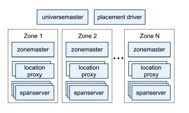

Spanner是谷歌开发的一款可扩展的、全球分布式的数据库，其复制技术可以用来服务于全球可用性和地理局部性。

其提供了几个特性：

- 在数据的副本配置方面，应用可以在一个很细的粒度上进行动态控制。应用可以详细规定哪些数据中心包含哪些数据，数据距离用户有多远（控制用户读取数据的延迟），不同数据副本之间距离有多远（控制写操作的延迟），以及需要维护多少个副本（控制可用性和读操作性能）。数据也可以被动态和透明地在数据中心之间进行移动，从而平衡不同数据中心内资源的使用。

- Spanner有两个重要的特性，很难在一个分布式数据库上实现，即Spanner提供了读和写操作的外部一致性，以及在一个时间戳下面的跨越数据库的全球一致性的读操作。这些特性使得Spanner可以支持一致的备份、一致的MapReduce执行[12]和原子模式变更，所有都是在全球范围内实现，即使存在正在处理中的事务也可以。

之所以可以支持这些特性，是因为Spanner可以为事务分配全球范围内单调向前的commit timestamp，即便事务可能是分布式的。这些时间戳反映了事务串行化的顺序。除此以外，这些串行化的顺序满足了***外部一致性***的要求：如果一个事务T1在另一个事务T2开始之前就已经提交了，那么T1的commit timestamp就要比T2的commit timestamp小。Spanner是第一个可以在全球范围内提供这种保证的系统。实现这种特性的关键技术就是一个新的TrueTime API及其实现，这个在后面将会详细讲解。

## 实现

一个Spanner部署被称为一个universe。一个universe由如下部分组成：

- 许多个zone。zone是管理部署的基本单元。当新的数据中心加入服务、或者老的数据中心被关闭时，zone可以被加入到一个运行的系统、或者从系统中移除掉。同时，zone也是物理隔离的单元，在一个数据中心中，可能有一个或者多个zone。

- 一个universe master。universe master主要是一个控制台，它显示了关于所有zone的各种状态信息，这些信息主要用于调试。

- 一个placement driver。placement driver用于提供zone之间的以分钟为单位的数据移动。placement driver会周期性的与spanserver进行沟通，用以发现需要移动的数据。用于满足更新副本约束或者load balance需求。

其中，每个zone包含：

- 一个zonemaster。zonemaster用于把数据分配给spanserver

- 一百至几千个spannserver。spanserver把数据提供给客户端

- 若干个location proxy。local proxy用户给客户端定位数据所在的spanserver

下图展示了一个spanner universe的所有服务器。



### Spanserver Software Stack

这一节主要关注spanserver的实现，来解释replication和分布式事务是如何实现的。


每个spanserver负责管理100-1000个tablet。这里的tablet类似于Bigtable中的tablet，同样实现了下面的映射：

```
(key:string, timestamp:int64) -> string
```

与Bigtable不同的是，spanserver会把时间戳分配给数据，使得spanner更像是一个多版本数据库、而非kv存储。

一个tablet的状态是存储在B-树的文件集合以及WAL中，所有这些最终都会被保存到一个分布式文件系统中，即Colossus。

为了支持replication，spanserver会为每个tablet之上实现一个Paxos状态机（早期的spanner实现可以支持在每个tablet上实现多个Paxos状态机，这样允许更灵活的replication配置，但是过于复杂，因此该方式被放弃了）。每个状态机都在其相应的tablet上保存metadata和log。我们的Paxos实现支持基于time-based租约的long-lived leader，其租约的默认时间是10秒。当前的spanner实现对每个Paxos写入操作都写入两次log：一次在tablet的log中，另一次在Paxos的log中。当然，这只是一个权宜之计，后续我们会对其进行优化。

众所周知，Paxos是用来实现一致性复制的。每个副本的kv键值对都存储在相应的tablet上。写操作必须zaileader上开始初始化Paxos协议，读操作可以访问任意副本，只要它足够新。副本的集合称为一个Paxos group。

对每个leader副本，spanserver实现了一个lock table用以实现并发控制，lock table存储了2PL的locking状态。其将一定范围的key映射到锁状态（注意，long-lived Paxos leader对于高效的管理lock table是至关重要的）。在Spanner中，我们设计了长时间运行的事务（例如，对于报表生成可能需要几分钟），当遇到冲突时，采用乐观并发控制可能会性能很差，因此需要采用2PL这种悲观并发控制方式。对于需要同步的操作，例如事务性读，需要在lock table中获取锁，其他的操作则不用。

对每个leader副本，每个spanserver实现了transaction manager来支持分布式事务（非leader副本没有transaction manager）。该transaction manager用于实现一个participant leader，该组内的其他副本则作为participant slave，每个transaction manager的状态将被存储在其底层的Paxos group中。对于分布式事务的实现分两种情况：

- 如果一个事务只涉及一个Paxos Group，则完全可以绕过transaction manager，因为lock table和Paxos二者可以一起保证事务性。

- 如果一个事务包含了多个Paxos group，那这些group的leader副本则会互相协调合作完成2PC。其中的一个Paxos Group将被选为coordinator，该组的participant leader将被称为coordinator leader，该组的participant slave将被称为coordinator slave。

