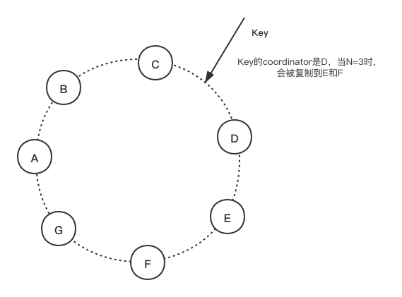
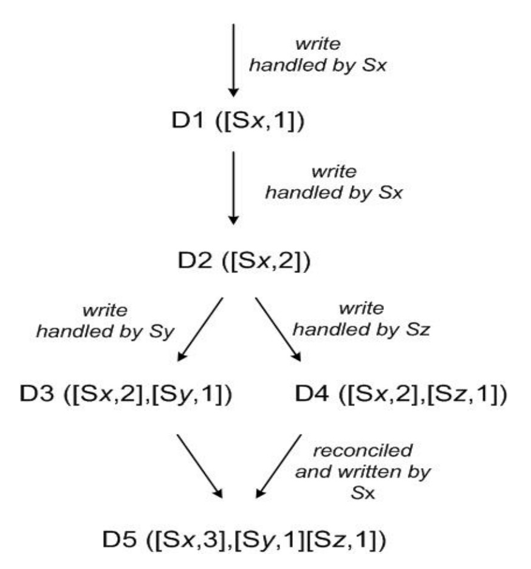

Dynamo是Amazon实现的一款KV存储。为了支持Amazon大规模且持续增长的用户，具有高可用、高扩展性的特性。Dynamo有一个重要的设计目标：允许应用自己控制自己的系统特性（例如持久性和一致性）让应用自己决定如何在功能、性能和成本效率之间取得折中。

## Background

我们对我们的存储服务有如下几个要求：

- Query Model: 通过唯一的key来对数据进行读写。状态以二进制的形式存储，并以唯一的key标识。没有操作跨越多个data item，并且没有relational schema。该需求是基于我们观察到很大部分的Amazon内部的服务只需要加单的query model、而不需要relational schema。Dynamo面向的是存储数据小于1MB的应用。

- ACID properties: ACID是一组保证数据库事务可靠执行的特性。在数据库领域，对数据的单词逻辑操作成为事务。在Amazon的经验表明，让数据仓库支持ACID会使得它的可用性非常差。Dynamo不提供任何隔离保证，并且只允许单个key的操作。

- Efficiency: 系统需要运行在通用硬件上。Amazon内部对服务的延迟有着严格的要求，通常使用p999来衡量。另外，服务需要有配置Dynamo的能力，以便能满足服务的延迟和吞吐要求。最终在性能、成本效率、可用性和持久性之间取得折中。

- Other Assumptions: Dynamo仅仅在Amazon内部使用，因此假设其运行环境是安全的，因此没有authentication和authorization方面的需求。另外，每个服务使用其自己独立的Dynamo集群，因此我们的初始设计中，Dynamo的存储规模是几百个存储节点。

### Design Considerations

商业系统中的数据复制都是同步的，这样可以提供一个强一致的数据访问接口。为了达到这种级别的一致性，这些算法强制牺牲了在某种错误场景下的可用性。其实对于服务器和网络故障比较容易出现的场景，可以通过使用乐观复制技术来提高可用性。在这种复制技术中，数据变更在后台同步到其他节点，并发更新和网络失联也是可以容忍的，这种方式也叫做异步复制，其无法满足强一致性。***Dynamo设计为最终一致性的存储服务，即所有的更新最终会到达所有的副本***。但是这种模式的挑战在于如何检测和解决冲突。而解决冲突也会带来两个问题：何时解决冲突以及谁来解决冲突。

1. 何时解决冲突

一个非常重要的设计考虑是决定何时执行解决更新冲突，例如，是在读的时候还是写的时候去解决冲突。一些传统的数据仓库是在写的时候解决冲突，这样可以保证读流程足够简单。在这种系统中，如果写入不能到达全部或者大多数的副本，写入将会被拒绝。与此相反，***Dynamo被设计为永远可写的数据仓库***。对于Amazon的许多服务来说，拒绝写入会导致非常差的客户体验。例如，尽管在发生网络或者服务器故障的时候，也应该允许用户向购物车中添加或者删除商品。***这种需求导致我们将冲突解决放在了读取操作，以保证写入永远不会被拒绝。***

2. 谁来解决冲突

下一个问题在于，谁来执行冲突解决。存储和应用都可以解决这件事情。如果是由存储来做，那么选择将会相当受限，因为存储系统只能选用比较简单的策略，例如：最新写入有效。另外一方面，应用更加理解其data schema，其可以选择一个更适合自己的冲突解决方案。例如，购物车可以选择合并冲突的版本，返回一个合并后的购物车。不过尽管这样会带来很大的灵活性，但是很多应用并不想实现自己的一套冲突解决机制，因此这种情况下可以由存储系统来解决，采用一些简单的策略，例如前面所说的最新写入有效。

另外，还有一些其他的关键设计：

- Incremental scalability（增量扩展性）: Dynamo应该可以逐台机器的扩容，并且对系统及其运维人员的影响尽量小。

- Symmetry（对称性）：每个节点的职责应该是相同的，不应当出现某些节点承担特殊角色或者特殊职责。根据我们的经验来说，对称性简化了系统的交付和运维。

- Decentralization（去中心化）：去中心化是Symmetry的扩展，系统应该是去中心化、点对点的，而不应该是中心化的。在过去中心化导致了很多故障，现在的设计目标应该是尽量避免它。去中心化使得系统更加简单、更容易扩展并且更加高可用。

- Heterogeneity（异构性）：系统要能够利用到基础设施的异构性。例如，负载的分布要和存储节点的能力成正比。对于逐步加入能力更强的新节点、且一次性升级现有节点的情况下，异构性支持是至关重要的。

## System Architecture

生产环境的存储系统的架构是很复杂的。除了数据持久化之外，系统还要为以下组件设计高扩展与健壮的解决方案，这些组件包括：负载均衡、成员管理、故障检测、故障恢复、副本同步、过载处理、状态转换、并发与任务调度、请求压缩、请求路由、系统监控和报警、以及配置管理。在这篇文章里主要关注Dynamo使用到的、分布式系统中的几个核心技术：分区、复制、版本化（versioning）、成员管理、错误处理、规模扩展（scaling)。

### System Interface

Dynamo使用key通过一个非常简单的接口来访问对象，它提供两个操作：

- get(key): 该操作会定位到该key对应的所有的副本，并返回单个对象或者一个包含冲突版本的对象列表，以及一个context上下文。

- put(key, context, object):该操作先根据key获取该object的存放位置，然后将其写入磁盘。

其中context包含了对象相关的元数据，例如对象的版本。其对调用方是不透明的。context信息和对象时存储到一起的，这样可以很容易验证put请求的context是否是合法的。

Dynamo将调用方提供的key和对象都视为不透明的字节序列。它对key应用MD5 hash产生一个128bit的ID，并根据该ID计算应该存储到哪个节点。

### Partitioning Algorithm

Dynamo的设计核心需求之一就必须支持增量扩展（scale incrementally）。这要求需要有一个机制将数据动态分散到系统中的不同节点上。Dynamo的数据分片机制依赖于一致性hash。在一致性hash中，hash函数的输出范围通常作为一个固定的环。每个节点会随机分配一个落在该环上的值，其代表了该节点所在环上的位置。对一个数据项，通过如下步骤找到对应的存储节点：

1. 首先对key取hash值

2. 在环上沿着顺时针方向找到第一个所对应的hash值比该key的hash值更大的节点。

因此，每个节点都负责环上它的前继节点与自己范围内的区域。一致性hash的好处在于，添加或者删除节点只会影响相邻的节点，其他节点不受影响。

但是基础的一致性hash有如下缺点：

- 给每个节点随机分配一个位置会导致数据和负载的非均匀分布。 

- 没有考虑到节点的异构因素，导致性能不理想。

为了克服这些问题，Dynamo使用了一致性hash的变种，即：每个节点并不是映射到环上的一个点、而是多个点（Cassandra采用了一致性hash的另一个变种，具体可以参考）。Dynamo使用虚拟节点的概念。一个虚拟节点看上去和一个普通节点一样，但是一个实际节点对应的不止一个虚拟节点。具体来说货，当一个新的节点添加到系统后，它将会被分配环上的多个位置。

虚拟节点会带来如下好处：

- 当一个节点不可用时（故障或例行维护），这个节点的负载会均匀分散到其他可用节点上

- 当一个节点重新可用时，或新加入一个节点时，这个节点会获得与其他节点大致相同的负载

- 一个节点负责的虚拟节点的数量可用根据节点容量来决定，这样可用充分利用物理基础设施中的异构性信息

### Replication

为了实现高可用和持久性，Dynamo将数据复制到多个节点上。每个数据被复制到N个节点上，这里的N是由每个Dynamo集群自己配置的。每一个key都会被分配到一个coordinator节点，coordinator节点负责落到它管理范围内数据的复制。它除了自己复制一份之外，还会向环上沿着顺时针方向的N-1个节点上存储一个副本。因此每个节点都要负责从自己开始向前N个前继节点的数据范围。

如上图所示，当N=2时，Key的coordinator是节点D，但是其也会被复制到E和F。所以对于节点F，其负责的key范围是(A, F]。

存储某个特定key的所有节点组成一个列表，成为preference list。另外需要注意，由于Dynamo引入了虚拟节点，所以存储一个key的N个preference list，其物理节点可能少于N个，为了避免这个问题，***preference list在选择节点的时候会跳过一些位置，以保证preference list里面的节点都在不同的物理节点上。***另外，为了应对节点失败的情况，preference list会包含多于N个节点。

### Data Versioning

Dynamo提供了最终一致性，所有更新都会异步的复制到所有副本。put()操作可以在应用到所有副本之前返回给调用者，因此将会导致紧接着的get()操作可能获取不到最新的数据。在没有故障的情况下，更新传播都是有一个时间上限的。然而在某些特定的故障场景下（服务器故障或者网络分区），更新可能在限定的时间内无法传递到所有副本。

Amazon有些场景可以容忍这种不一致性，并且可以在这种场景下继续运行。例如，购物车应用要求所有的“Add to Cart”操作永远不能丢失或者被拒绝。如果购物车当前最新的状态不可用，那么用户可以在一个稍老的版本上做修改，并且这种修改也是有意义的、并且需要保留。但是他不能取代购物车最新的状态，因为最新的状态也有一些改变同样需要保留，并由随后的步骤来解决冲突。在这里需要注意的是，“add to cart”和“delete iter from cart”在Dynamo中都是使用put请求。

为了提供这种保证，Dynamo将每次修改结果都作为一个新的不可变的数据版本。它允许系统中同时存在多个版本。冲突解决分两种方式：

- syntactic reconciliation。在大部分情况下，新版本都包含老版本的数据，系统自己可以决定权威版本。这叫做syntactic reconciliation

- semantic reconciliation。在发生故障并且存在并发更新的场景下，会发生版本分叉，从而导致冲突的对象版本。系统本身无法处理这种情况，需要客户端的接入来将多个分支合并成一个。这叫做semantic reconciliation。一个典型的例子是合并不同版本的购物车，有了这种调和机制，“add to cart”操作将会永不失败。但是这种情况会导致已经删除的商品偶尔又在购物车中冒出来。

有很重要的一点需要注意：某些特定的故障会导致存在多个冲突的版本，而不仅仅是两个。服务器故障或网络分裂会导致一个对象有多个版本，每个版本有各自的子历史（version sub-histories），随后要由系统来将它们一致化。这需要将应用设计为显式承认数据多版本存在的可能性，以避免丢失任何更新。

Dynamo使用vector clock来跟踪同一对象不同版本之间的因果性。一个vector clock就是一个(node, counter)列表，其关联了一个对象的所有版本，可以通过它来判断对象的两个版本是否在并行的分支上，或者它们是否有因果关系。 如果对象的第一个clock上的所有节点的counter都小于相应的第二个clock上的counter，那第一个clock就是第二个的祖先，可以安全的删除；否则，这两个修改就是有冲突的，需要reconciliation。

在Dynamo中，客户端更新一个对象时，必须指明基于哪个版本进行更新。流程是先执行读操作，拿到context，其中包含了vector clock信息，然后写的时候带上这个context。在处理读请求时，如果Dynamo能够访问到多个分支，并且不能够通过syntactically reconciliation，那么将会返回所有版本的object，以及在context中携带相应的版本信息。一个携带了该context的更新操作将被视为冲突解决操作，其将多个分支合并成一个唯一的新版本。

我们可以通过上图为例来展示vector clock是如何工作的。

1. 客户端写入一个新的对象（object）。节点Sx处理该写入，增加key的序列号，并用该序列号创建对象的vector clock。系统便有了一个对象D1和他的vector clock [Sx, 1]。

2. 同样的客户端更新该对象，假设同样的节点（即Sx）处理了该请求。系统便拥有了对象D2和它对应的vector clock是[Sx, 2]。由于D2是D1的后代，因此可以覆盖D1。然而，可能会有些副本还没有看到D2，而只有D1。

3. 假设还是同一个客户端，更新了该对象，并且一个不同的server Sy处理了该请求，系统中当前有了数据D3以及其对应的vector clock是[(Sx,2), (Sy,1)]。

4. 接着假设一个其他的客户端，读取到了D2并尝试更新它，并且另外一个节点Sz处理了该请求，当前系统中拥有了D4（继承自D2），它的vector clock是[(Sx,2), (Sz,1)]

此时版本就有了不同的分支。

- 当一个节点知道D1和D2，在它收到D4和它的vector clock后，可以断定D1和D2已经被新数据覆盖了，因此可以安全对D1和D2进行垃圾回收，这也就是syntatic reconciliatioin过程。

- 当一个节点只知道D3，那它收到D4后就看不出D3和D4之间的版本关系，即：D3和D4的各自改动并没有反应在对方之中，因此这两个版本应当被保留，然后由客户端执行semantic reconciliation。

现在，假设一些客户端把D3和D4都读到了（context显示在该read操作中，所有的value都被发现）。读操作返回的context综合了D3和D4的clock，即[(Sx, 2), (Sy, 1), (Sz, 1)]。如果客户端执行reconciliation，并且节点Sx执行该写入，Sx会更新自己在vector clock中的序列号。最终新生成的数据D5的vector clock格式如下：[(Sx, 3), (Sy, 1), (Sz, 1)]。

***vector clock的一个可能问题是***，如果有多个节点先后执行对同一个对象的写操作，那这个对象的vector clock会变得很长。但在实际中这不太可能发生，因为写操作只会由preference list中前N个节点中的一个来执行。只有在网络分裂或多台服务器挂掉的情况下，写操作才可能由非preference list前N个节点来执行，导致vector clock变长。在这种情况下应该要限制vector clock的长度。Dynamo采用了一种clock截断方案（clock truncation scheme）：对每个 (node, counter) 都保存一个相对应的时间戳，记录对应的节点最后一次更新该记录的时间。当vector clock里的(node, counter)数量达到一个阈值（例如，10）时，就删除最老的一项。显然，这种截断方案会给reconciliation带来一定问题，因为截断后可能无法精确判断部分后代的因果关系。但到目前为止，我们还没有在生产环境遇到这个问题，因此没有继续深入研究下去。

### Execution of get() and put() operations

在Dynamo中，任何存储节点都可以接受任何key的get和put操作请求。为了简单起见，在本节先介绍无故障场景下这些操作是如何执行的，下一节介绍有故障的场景。

客户端有两种策略用于选择一个节点：

- 将请求转发到load balancer，然后由load balancer将会根据负载信息选择一个节点。这种方式的好处在于客户端不需要了解Dynamo的代码实现。

- 使用partition-aware的客户端，将请求直接转发到相应的coordinator节点。这种方式的好处在于延迟更低，因为跳过了一次潜在的转发步骤。

负责处理读或写请求的节点称为coordinator。通常情况下，这是preference list内前N个节点中的第一个节点。如果请求是经过负载均衡器转发的，那这个请求可能会被转发到环上，在这种情况下，如果收到请求的节点不是preference list的前N个节点中的一个，那它就不会处理这个请求，而是将其转发到preference list前N个节点中的第一个节点。

读和写操作会涉及到preference list中的前N个健康的节点，如果有down或者inaccessible的节点，则需要跳过。如果所有的节点都是健康的，则去preference list中的前N个节点。如果发生节点故障或者网络分裂，则优先访问preference list中排在前面的节点。

为了保证副本的一致性，Dynamo使用了一种类似仲裁系统（quorum systems）的一致性协议。这个协议有两个配置参数：R和W：

- R：允许执行一次读操作所需成功参与的最少节点数量

- W：允许执行一次写操作所需成功参与的最少节点数量

令R + W > N就得到了一个类似仲裁的系统。在这种模型下，一次get（或put）的延迟由R（或W）个副本中最慢的一个决定。因此为了降低延迟，R和W通常设置的比N小。

当收到一个put()请求后，coordinator会为新版本生成vector clock，并将其保存到节点本地；然后，将新版本（及对应的新vector clock）发送给N个排在最前面的、可到达的节点。只要有至少W-1个节点返回成功，这次写操作就认为是成功了。

类似地，对于一次get()请求，coordinator会向排在最前面的N个可访问的节点请求这个key对应的数据的所有版本，等到R个节点响应之后就将结果返回给客户端。如果coordinator收集到了多个版本，它会将所有它认为没有因果关系的所有版本返回给客户端。然后客户端需要对版本进行reconcile（调解），合并成一个最新版本并将结果写回Dynamo。

### Handling Failures: Hinted Handoff

如果使用传统仲裁算法，Dynamo无法在服务器宕机或网络分裂的时候仍然保持可用，而且在遇到最简单故障情况下，持久性（durability）也会降低。为了缓解这个问题，Dynamo并没有强制使用严格的仲裁机制，而是使用了一个宽松的机制：所有的读和写在preference list的***前N个健康节点***上执行，通常这前N个健康节点不一定是前N个节点，因为遇到不健康的节点，会沿着一致性哈希环的顺时针方向顺延。

对于Replication一节所示的图中，假设N=3，当节点D有故障时，key的写入就应该顺延至G。这样设计的目的是为了保证期望达到的可用性和持久性。发送到G的副本的元数据中会提示（hint）这个副本本来应该发送给谁（这里是D），然后这个数据会被G保存到本地的一个独立数据库中，并且有一个定期任务不断扫描，一旦D可用了就将这个数据发送回D，然后G就可以从本地数据库中将其删除了，这样系统内的副本数还是保持不变。

使用这种hinted handoff的方式，Dynamo保证了在节点或网络发生临时故障时读和写操作不会失败。希望可用性最高的应用可以将W设为1，这样可以保证只要一个节点完成写，这次写操作就被系统接受了。因此除非全部节点都不可用，否则写操作就不会被拒绝。但实际上，大部分Amazon的应用都是设置一个比1大的值，以达到期望的持久性（durability）等级。

高度可用的存储系统必须能够处理整个数据中心挂掉的情况。掉电、制冷失效、网络故障以及自然灾难都会导致整个数据中心发生故障。Dynamo可以配置向多个数据中心同步副本，只要将preference list里的节点分散到不同数据中心。这些数据中心之间通过高速网络互连，这使得我们可以在整个数据中心挂掉的情况下仍然可以提供服务。

### Handing permanent failures: Replica synchronization

在节点成员变动较小、节点故障只是短时的情况下，hinted handoff方式工作良好。但也有一些场景，在hinted副本移交给原本应该存储这个副本的节点之前，该hinted副本就不可用了。为了解决这个问题，以及其他威胁到持久性的场景，Dynamo实现了一种anti-entropy的副本同步协议来保证副本的同步。

