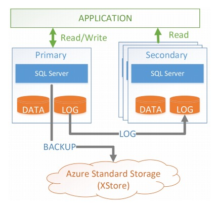

当前，越来越多的企业和组织将数据托管在云上。同时其对DB系统提供了更高的要求。这些要求包括高安全性、高可用性、支持超大规模数据、低价及灵活的付费（pay-as-you-go）、以及高性能。此外，服务需要是弹性的，可以随着负载的变化自动增长或者收缩，使得用户可以利用pay-as-you-go的模式来节省成本。

事实证明，在云上使用传统的、整体架构的database架构是无法满足这些需求的：

- 为了充分利用集群中的计算资源，增大某些节点吞吐及减少某些节点吞吐，可能需要在节点间搬移数据，然而这对于传统database的代价非常高昂。

- 支持大规模数据量和高可用之间是矛盾的。高可用需要一个很短的恢复时间，然而这在传统的数据库中需要非常小的数据量才能实现。该问题在内部部署的传统数据库并不存在，因为其使用了特殊的、昂贵的硬件来支持高可用。然而这些硬件在云上是不可能提供的。

- 内部部署可以控制软件的更新时间并且可以仔细规划停机时间，这在云上也是无法满足的。

为了解决这些问题，过去十年有很多对于OLTP database上云的研究。一个主要的idea是将计算功能和存储功能解耦，并且分别去部署计算资源与存储资源。第一个使用该idea的商业系统是Amazon Aurora。

当前论文描述了Socrates，一个新的OLTP database架构，其通过微软在Azure数以百万计的database的经验得来。Socrates将计算层与存储层分离开来，另外Socrates还将database log和存储分离，并将log模块作为一个一级模块。日志与存储分离也意味着持久性（由日志层实现）和可用性（由存储层实现）分离。持久性是为了防止数据库数据丢失的基础特性。可用性是在故障存在的场景下提供高质量服务所需要的。传统的实现通常将持久性实现和高可用性耦合在一起。其中高可用性是通过维持多个副本来实现。然而将两者分离是很有意义的：

1. 与高可用性相反，持久性不需要在fast storage上维护多个copies。

2. 与持久性相反，高可用性不需要固定数量的副本。

分离两者使得Socrates可以采取更合适的机制来处理。具体来说，Socrates相比于其他市面上的database，需要更少的存储在本地昂贵快速存储上的副本数量、更少的整体的副本数量、更少的网络带宽以及更少的计算资源来维护副本更新。

|             | **Today**          | **Socrates**       |
|:---------------:|:------------------:|:------------------:|
| Max DB Size     | 4TB                | 100TB              |
| Availability    | 99.99              | 99.999             |
| Upsize/downsize | O(data)            | O(1)               |
| Storage impact  | 4x copies(+backup) | 2x copies(+backup) |
| CPU impact      | 4x single images   | 25% reduction      |
| Recovery        | O(1)               | O(1)               |
| Commit Latency  | 3ms                | < 0.5ms            |
| Log Throughput  | 50MB/s             | 100+MB/s           |

上表列出了Socrates在可扩展性、可用性、弹性、资源消耗以及性能的优异表现。如何做到这些是本篇论文的主题

## State Of The Art

这一节介绍一些市面上常用的接触DBaaS系统。

SQL DB是微软Azure上的一款DBaaS。其基于HADR来构建。HADR是基于日志复制的状态机实现，其拥有一个Primary用户处理所有的update事务，并将update log同步至所有的Secondary节点。日志复制是分布式数据库系统中保持副本一致性的标准做法。另外，Primary会周期性的备份数据到Azure的XStore存储服务上：

- 每5分钟备份一次日志

- 每天做一次整个数据库的增量备份

- 每周做一次数据库的完全备份

下图所示为HADR的架构图:

Secondary节点只处理只读事务，当一个Primary挂掉时，其中一个Secondary会被选为新Primary。使用HADR架构，SQL DB需要四个节点（一个Primary和三个Secondary）用以保证高可用和高持久性。但是由于日志每5分钟备份一次，如果所有的4个节点都挂了，是会存在数据丢失的。

HADR有如下优点：

1. 在Azure上部署了上百万个database，成熟稳定

2. 每个计算节点都有database的全量本地数据拷贝，性能比较高

HADR的缺点：

1. 由于每个计算节点都有database的全量本地数据拷贝，database的数据量无法超越单机存储上限

2. 当运行一个long-running的事务时，当日志的增长超过了磁盘容量的上限，在事务提交之前并不能截断该日志。

3. O(size-of-data)问题，扩建一个新节点的代价与数据量大小成线性关系，Backup/Restore和扩容/缩容的代价与数据量大小成线性关系。

这就是为什么SQL DB的容量上限被限制在4TB。

另外一个基于日志复制状态机的云数据库系统的例子是Spanner。具体可以参考[Google Spanner](https://levy5307.github.io/blog/spanner/)

在过去十年，很多关于云数据库的研究都提出了一个名叫shared disk的架构。在这个架构中将计算和存储进行了划分。AWS Aurora是第一个采用该架构的商业化DBaaS。在Aurora中，一个Primary Compute节点处理update事务，并且每个log record会被传输到6个用于持久化数据的Storage Server。这6个Storage Server会被分不到3个可用的地区。当该6个Storage Service中的4个已经成功持久化后，该事务就可以提交。为了提高扩展性，在存储层将数据和log进行了分区。

## Important SQL Server Features

Socrates构建在一些基础之上，这些基础在SQL Server中也有所呈现。这一节介绍了独立于Socrates开发、但对Socrates至关重要的一些SQL Server特性。

### Page Version Store

为了在同时有写的情况下提供读snapshot的能力（也就是snapshot隔离级别），SQL为database的record维护了多个版本。在HADR架构中，所有的版本都是存储在本地临时存储中。但是Socrates并没有这样做，它把所有版本的数据都存储在了共享存储层，这样所有的计算节点可以共享所有的数据版本。

### Accelerated Database Recovery

SQL的Accelerated Database Recovery(ADR)利用了上述的持久化version store。在ADR之前，SQL Server使用RIES-style恢复模式：

1. 首先，分析日志

2. 对于最后一次checkpoint以后的未提交且成功的事务，回放其redo日志

3. 对于最后一次checkpoint以后的未提交且失败的事务，回放其undo日志

在这种模式下，对于一个长时间运行的事务，undo阶段可能会变得无限长。使用多版本存储可以优化这种情况：在一个共享的、持久性的version store中，系统可以在宕机重启后立马访问已经提交的版本，系统在很多情况下可以忽略undo阶段的影响, 在分析和redo阶段后马上变得可用，这是一个很短的常量时间（该常量时间由checkpoint的interval决定）。

### Resilient Buffer Pool Extension

在2012年，SQL Server发布了一个叫做buffer poll extension(BPE)的功能，其将buffer poll从内存延伸到了本地SSD磁盘上（在内存和磁盘上使用相同的生命周期和驱逐策略）。在Socrates中扩展了这种思想，使得buffer pool具有可恢复性，例如故障后的恢复。这个组件叫做RBPEX，他作为对数据页的缓存机制服务于存储层和计算层。这种方式使得宕机后节点可以快速恢复到之前的性能：如果宕机时比较短暂的（例如软件升级后的机器重启），相比传统的从远程server读取缓存的page，读取和回放更新日志记录的代码会更小，提高了可用性。

### RBIO protocol

Socrates将数据库引擎的组件分布在多层之中。为了支持更丰富的计算分布，扩展了传统的SQL Server网络层（称为Unified Communication），使用了一种新的协议，称为Remote Block I/O，简称RBIO。RBIO是一种无状态协议，强类型，支持自动版本控制，对短暂性故障具有可快速恢复性，并且对最佳副本选择具有QoS支持。

### Snapshot Backup/Restore

当数据库文件存储在Azure中时，SQL Server 2016引入了快速备份的能力。这个feature依赖于XStore实现的blob snapshot的特性，XStore是一个日志结构的存储系统，备份几乎是实时的，因为它只需要维护一个指针(时间戳)指向当前日志的头部。Socrates扩展了这个feature，将备份/恢复的工作完全使用XStore snapshot。因此，Socrates可以不用消耗计算层的CPU和IO就可以在常量时间内完成备份或者恢复。在XStore的快照机制下，一个数百TB的大数据库也可以在分钟内完成备份。

当然，apply log使机器状态恢复到正确、启动机器、对restore的database刷新其cache都需要一些时间，但是这些时间与data size无关。Bacup/restore是Scorate消除了size-of-data操作的一个显著例子。

### I/O Stack Virtualization

在I/O栈的最低层，SQLServer使用一个叫作File Control Block(FCB)的抽象层作为。FCB层抽象了底层设备的细节，提供给上层I/O的能力，支持多个文件系统、多样的存储平台和I/O模式。Socrates通过实现新的FCB instance广泛的使用了这个IO虚拟化层，该FCB instance在计算过程中隐藏Socraetes的存储层次结构。这种方法帮助我们再不改变太多SQL Server组件的情况下实现Socrates。大多数组件相信它们是一个独立的、独立的数据库系统的组件，而在FCB层之上的任何组件都不需要处理分布式、异构系统的复杂性（Socrates实际上是这样的系统）

## Socrates Architecture

在介绍Socrates的架构之前，我们首先看一下Socrates的设计原则和目标。

### Design Goals and Principles

1. Local Fast vs Cheap, Scalable, Durable Storage

快速的存储设备（SSD）主要用于获取高性能，而慢速存储设备（hard disk）主要用于大量数据的持久性和可扩展性。在云上，每台机器上都会有本地的SSD，这些SSD是高速的、容量有限的并且是non-durable的，也就是说当机器永久地挂掉之后，数据就丢失了。另外，像Azure这样的云厂商都会提供一个远端的存储，这些存储比较便宜、容量无上限并且是durable的。

为了实现高性能、高扩展性以及持久性，Scorates使用了上述两种存储来提供了分层的、scale-out的存储架构。这种架构的特点在于，它避免了高速增长的数据量导致的动态存储分配所带来的大量数据搬迁的花销。

2. Bounded-time Operations

Socrates的设计目标之一是支持100TB级别的数据量。很不幸的是，当前的HADR的很多操作的性能都和数据量有关。快速创建新副本的操作决定了系统的恢复时间，而恢复时间则直接影响了可用性。避免任何size-of-data操作促使我们针对很多重要的功能开发了新的机制。

3. From shared-nothing to Shared-disk

HADR架构的一个基础原则是每个副本维持了数据的一份拷贝，这与我们要设计100TB级别的large database的目标背道而驰。尽管单台机器的存储有可能达到这个级别，但是存储仍然是一个限制因素以及重要标准。当一个100TB的database拥有非常轻量的workload时，CPU资源将会被极大的浪费。

这促使我们从shared-noting向shared-disk进行转换。在这种架构中，所有（执行事务和查询的）计算节点都访问同一个存储服务。在不同的数据库节点间贡献数据在不同的层级对data version进行支持，Socrates依赖了前面所讲到的[page version store](https://levy5307.github.io/blog/microsoft-socrates/#page-version-store)。

依托于[accelerated database recovery](https://levy5307.github.io/blog/microsoft-socrates/#accelerated-database-recovery)和Page Version Store，使得新的计算节点可以快速启动，并且令Scorates的读请求boundary达到了HADR所不可企及的高度。

4. Low Log Latency, Separation of Log

log是OLTP数据库系统的一个潜在性能瓶颈，每一个事物在提交之前必须写入log，并且该log需要传输到所有的副本上。在Socrates中提供了一个独立的log服务，这样的话，我们便可以基于其访问特性对其进行针对性的优化：

- 首先，Socrates对log进行持久化，并为了实现fault-tolerant，对其进行复制。一旦该log进行了持久化之后，事务就可以提交了。***我们这种实现机制比在状态机里实现仲裁的效率要高的多***。

- 将log组件与其他组件分离，使得读取和传输log records更加灵活和可伸缩。Scorates利用了日志访问的不对称性，即：最新创建的log records的访问需求比较高、而老的log records仅仅在一些异常情况下才需要访问（例如abort或者redo一个长时间运行的事务）。因此，Socrates将最近的log保存在内存中、并将其以一种可伸缩的方式进行分布（通常是分布到数百台机器）。老的log records将会转出，并仅在需要的时候获取。

- 将log分离使得我们可以站在巨人的肩膀上，这样可以使用外部的存储服务来实现log组件。这已经其了作用：Socrates可以利用Azure storage的最新的创新，而无需修改Socrates的架构。这使得Socrates可以在无需实现log shipping、gossip quorum protocol、log storage system的情况下实现较低的commit延迟。

5. Pushdown Storage Functions

shared-disk的一个优势在于，其可以将一些功能从计算层offload到存储层。这样的话，Socrates可以实现很明显的性能提升。更重要的是，每一个可以offload到存储层的功能（backup/checkpoint/IO filtering等等）***都可以减轻Primary Compute节点以及log组件的压力，而这两者是系统的瓶颈。***

6. Reuse Components, Tuning, Optimization

SQL Server具体有很丰富的生态系统，具有很多工具、库和应用程序。现存的数百万数据库实例应用必须无缝迁移到Socrates上。Socrates需要向后兼容SQL Server，并且重复造轮子的代价也非常大，因此SQLServer的重要组件像查询优化器、查询执行器、security、事务管理和恢复等都被复用保持不变。

### Architecture Overview

上图展示了Socrates的架构图，Socrates遵循了如下设计原则：

- 存储计算分离

- 分层和可扩展存储

- bounded-time operations

- Log与计算和存储层分离

- 将功能下沉到存储层

- 复用已有组件

从整体上来看，Socrates的架构由四层组成。分别是：计算节点、XLOG日志服务层、存储层pager server及XLog存储服务层：

Applications与计算节点相连接。与HADR一样，只有一个Primary计算节点，它用于处理所有的读事务和写事务，并且有一些Secondary只处理只读事务。计算节点实现了查询优化、并发控制、security以及支持T-SQL。如果Primary宕机，一个Secondary将会被提升为Primary。所有的计算节点都在内存和SSD的弹性buffer poll extention中缓存data pages。

Socrates架构的第二层是XLOG service。这一层遵循“log独立”的原则，该原则是Socrates与其他的云数据库（例如Aurora）的主要区别。log分离实现了低commit延迟以及存储层的好的扩展性。由于只有Primary处理写入请求，所以只有Primary向log写入。单个writer保证了写入log的低延迟和高吞吐。所有的Secondary采用异步的形式消费log，以保持其数据的更新。

第三层是存储层，该层是由Page Server实现的。每个Page Server保存数据库一个分片的数据拷贝。Page Server扮演两个重要角色：

1. 向计算节点提供pages。每个计算节点都可以向Page Server请求pages。我们当前正在Page Server实现bulk operations（例如：bulk loading、index creation、DB reorgs、deep page repair和table scan）来为计算节点减负。

2. 在XStore中checkpoint data pages以及创建备份。

如同计算节点一样，Page Servers在内存和SSD中保存所有数据，以达到快速访问的目的。

第四层是Azure Storage Service（XStore），它是由Azure提供的独立的服务。XStore是基于hard disk的高扩展、持久性和廉价的存储服务。数据访问是远程的，所以这限制了吞吐和延迟。将采用本地快速磁盘的Page Servers与持久化、可扩展的、廉价存储进行分离是前面所讲到的设计原则。

***计算节点和Page Servers是无状态的。***他们可以在任意时间宕机、而不会有任何的数据损失。真正的数据保存在XStore和XLOG中。XStore是高可靠的，在Azure服务了多年并从没导致过数据丢失，Socrates利用了这种健壮性。XLOG是我们为Socrates构建的新服务，它具有高性能、可扩展、价格可承受，并且不会有任何数据丢失。

### XLOG Service

