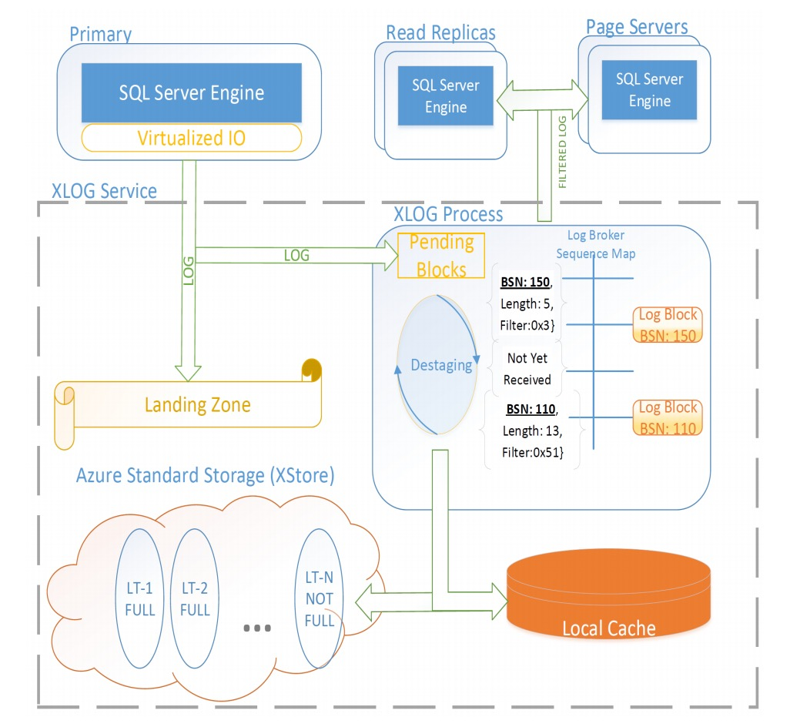

当前，越来越多的企业和组织将数据托管在云上。同时其对DB系统提供了更高的要求。这些要求包括高安全性、高可用性、支持超大规模数据、即买即用（pay-as-you-go）、以及高性能。此外，服务需要是弹性的，可以随着负载的变化自动增长或者收缩，使得用户可以利用pay-as-you-go的模式来节省成本。

事实证明，在云上使用传统的、整体架构的database架构是无法满足这些需求的：

- 为了充分利用集群中的计算资源，增大某些节点吞吐及减少某些节点吞吐，可能需要在节点间搬移数据，然而这对于传统database的代价非常高昂。

- 支持大规模数据量和高可用之间是矛盾的。高可用需要一个很短的恢复时间，然而这在传统的数据库中需要非常小的数据量才能实现。该问题在内部部署的传统数据库并不存在，因为其使用了特殊的、昂贵的硬件来支持高可用。然而这些硬件在云上是不可能提供的。

- 内部部署可以控制软件的更新时间并且可以仔细规划停机时间，这在云上也是无法满足的。

为了解决这些问题，过去十年有很多对于OLTP database上云的研究。一个主要的idea是将计算功能和存储功能解耦，并且分别去部署计算资源与存储资源。第一个使用该idea的商业系统是Amazon Aurora。

当前论文描述了Socrates，一个新的OLTP database架构，其通过微软在Azure数以百万计的database的经验得来。Socrates将计算层与存储层分离开来，另外Socrates还将database log和存储分离，并将log模块作为一个一级模块。日志与存储分离也意味着持久性（由日志层实现）和可用性（由存储层实现）分离。持久性是为了防止数据库数据丢失的基础特性。可用性是在故障存在的场景下提供高质量服务所需要的。传统的实现通常将持久性实现和高可用性耦合在一起。其中高可用性是通过维持多个副本来实现。然而将两者分离是很有意义的：

1. 与高可用性相反，持久性不需要在fast storage上维护多个copies。

2. 与持久性相反，高可用性不需要固定数量的副本。

分离两者使得Socrates可以采取更合适的机制来处理。具体来说，Socrates相比于其他市面上的database，需要更少的存储在本地昂贵快速存储上的副本数量、更少的整体的副本数量、更少的网络带宽以及更少的计算资源来维护副本更新。

|             | **Today**          | **Socrates**       |
|:---------------:|:------------------:|:------------------:|
| Max DB Size     | 4TB                | 100TB              |
| Availability    | 99.99              | 99.999             |
| Upsize/downsize | O(data)            | O(1)               |
| Storage impact  | 4x copies(+backup) | 2x copies(+backup) |
| CPU impact      | 4x single images   | 25% reduction      |
| Recovery        | O(1)               | O(1)               |
| Commit Latency  | 3ms                | < 0.5ms            |
| Log Throughput  | 50MB/s             | 100+MB/s           |

上表列出了Socrates在可扩展性、可用性、弹性、资源消耗以及性能的优异表现。如何做到这些是本篇论文的主题

## State Of The Art

这一节介绍一些市面上常用的接触DBaaS系统。

SQL DB是微软Azure上的一款DBaaS。其基于HADR来构建。HADR是基于日志复制的状态机实现，其拥有一个Primary用户处理所有的update事务，并将update log同步至所有的Secondary节点。日志复制是分布式数据库系统中保持副本一致性的标准做法。另外，Primary会周期性的备份数据到Azure的XStore存储服务上：

- 每5分钟备份一次日志

- 每天做一次整个数据库的增量备份

- 每周做一次数据库的完全备份

下图所示为HADR的架构图:


Secondary节点只处理只读事务，当一个Primary挂掉时，其中一个Secondary会被选为新Primary。使用HADR架构，SQL DB需要四个节点（一个Primary和三个Secondary）用以保证高可用和高持久性。但是由于日志每5分钟备份一次，如果所有的4个节点都挂了，是会存在数据丢失的。

HADR有如下优点：

1. 在Azure上部署了上百万个database，成熟稳定

2. 每个计算节点都有database的全量本地数据拷贝，性能比较高

HADR的缺点：

1. 由于每个计算节点都有database的全量本地数据拷贝，database的数据量无法超越单机存储上限

2. 当运行一个long-running的事务时，当日志的增长超过了磁盘容量的上限，在事务提交之前并不能截断该日志。

3. O(size-of-data)问题，扩建一个新节点的代价与数据量大小成线性关系，Backup/Restore和扩容/缩容的代价与数据量大小成线性关系。

这就是为什么SQL DB的容量上限被限制在4TB。

另外一个基于日志复制状态机的云数据库系统的例子是Spanner。具体可以参考[Google Spanner](https://levy5307.github.io/blog/spanner/)

在过去十年，很多关于云数据库的研究都提出了一个名叫shared disk的架构。在这个架构中将计算和存储进行了划分。AWS Aurora是第一个采用该架构的商业化DBaaS。在Aurora中，一个Primary Compute节点处理update事务，并且每个log record会被传输到6个用于持久化数据的Storage Server。这6个Storage Server会被分不到3个可用的地区。当该6个Storage Service中的4个已经成功持久化后，该事务就可以提交。为了提高扩展性，在存储层将数据和log进行了分区。

## Important SQL Server Features

Socrates构建在一些基础之上，这些基础在SQL Server中也有所呈现。这一节介绍了独立于Socrates开发、但对Socrates至关重要的一些SQL Server特性。

### Page Version Store

为了在同时有写的情况下提供读snapshot的能力（也就是snapshot隔离级别），SQL为database的record维护了多个版本。在HADR架构中，所有的版本都是存储在本地临时存储中。但是Socrates并没有这样做，它把所有版本的数据都存储在了共享存储层，这样所有的计算节点可以共享所有的数据版本。

### Accelerated Database Recovery

SQL的Accelerated Database Recovery(ADR)利用了上述的持久化version store。在ADR之前，SQL Server使用RIES-style恢复模式：

1. 首先，分析日志

2. 对于最后一次checkpoint以后的未提交且成功的事务，回放其redo日志

3. 对于最后一次checkpoint以后的未提交且失败的事务，回放其undo日志

在这种模式下，对于一个长时间运行的事务，undo阶段可能会变得无限长。对于线上数百万台机器的数据库而言，这将是一个很重要的问题。使用version store可以优化这种情况：在一个共享的、持久性的version store中，系统可以在宕机重启后访问已经提交的版本，这使得系统在很多情况下可以忽略undo阶段的影响, 在分析和redo阶段后马上变得可用。这将是一个很短的常量时间（该常量时间由checkpoint的interval决定）。

### Resilient Buffer Pool Extension

在2012年，SQL Server发布了一个叫做buffer pool extension(BPE)的功能，其将buffer pool从内存延伸到了本地SSD磁盘上（在内存和磁盘上使用相同的生命周期和驱逐策略）。在Socrates中扩展了这种思想，使得buffer pool具有可恢复性，例如故障后的恢复。这个组件叫做RBPEX，他作为对数据页的缓存机制服务于存储层和计算层。这种方式使得宕机后节点可以快速恢复到之前的性能：如果宕机是比较短暂的（例如软件升级后的机器重启），相比传统的从远程server读取缓存的page，读取和回放更新log records会更轻量，使得恢复时间更短，而更短的恢复时间提高了可用性。

### RBIO protocol

Socrates将数据库引擎的组件分布在多层之中。为了支持更丰富的计算分布，扩展了传统的SQL Server网络层（称为Unified Communication），使用了一种新的协议，称为Remote Block I/O，简称RBIO。RBIO是一种无状态协议，强类型，支持自动版本控制，对短暂性故障具有可快速恢复性，并且对最佳副本选择具有QoS支持。

### Snapshot Backup/Restore

当数据库文件存储在Azure中时，SQL Server 2016引入了快速备份的能力。这个feature依赖于XStore实现的blob snapshot的特性，XStore是一个日志结构的存储系统，备份几乎是实时的，因为它只需要维护一个指针(时间戳)指向当前日志的头部。Socrates扩展了这个feature，将备份/恢复的工作完全使用XStore snapshot。因此，Socrates可以不用消耗计算层的CPU和IO就可以在常量时间内完成备份或者恢复。在XStore的快照机制下，一个数百TB的大数据库也可以在分钟内完成备份。

当然，apply log使机器状态恢复到正确、启动机器、对restore的database刷新其cache都需要一些时间，但是这些时间***与data size无关***。***Bacup/restore是Scorate消除了size-of-data操作的一个显著例子***。

### I/O Stack Virtualization

在I/O栈的最低层，SQLServer使用一个叫作File Control Block(FCB)的抽象。FCB层抽象了底层设备的细节，提供给上层I/O的能力。使用该虚拟层，SQL DB支持多个文件系统、多样的存储平台和I/O模式。Socrates通过实现新的FCB实例而广泛的使用了这个IO虚拟化层，该FCB实例在计算过程中隐藏Socraetes的存储层次结构。这种方法帮助我们在不改变太多SQL Server组件的情况下实现Socrates。大多数组件相信它们是一个整体的、独立的数据库系统，而在FCB层之上的任何组件都不需要处理分布式、异构系统的复杂性。（即实现了一个实例，实现了该抽象层，并屏蔽Socrates的存储层次等信息，使得上层可以屏蔽Socrates复杂的结构信息）

## Socrates Architecture

在介绍Socrates的架构之前，我们首先看一下Socrates的设计原则和目标。

### Design Goals and Principles

- Local Fast vs Cheap, Scalable, Durable Storage

快速的存储设备（SSD）主要用于获取高性能，而慢速存储设备（hard disk）主要用于大量数据的持久性和可扩展性。在云上，每台机器上都会有本地的SSD，这些SSD是高速的、容量有限的并且是non-durable的，也就是说当机器永久地挂掉之后，数据就丢失了。另外，像Azure这样的云厂商都会提供一个远端的存储，这些存储比较便宜、容量无上限并且是durable的。

为了实现高性能、高扩展性以及持久性，Scorates***使用了上述两种存储来提供了分层的、scale-out的存储架构***。这种架构的特点在于，它避免了高速增长的数据量导致的动态存储分配所带来的大量数据搬迁的花销。

- Bounded-time Operations

Socrates的设计目标之一是支持100TB级别的数据量。很不幸的是，当前的HADR的很多操作的性能都和数据量有关。快速创建新副本的操作决定了系统的恢复时间，而恢复时间则直接影响了可用性。***避免任何size-of-data操作***促使我们针对很多重要的功能开发了新的机制。

- From shared-nothing to Shared-disk

HADR架构的一个基础原则是每个副本维持了数据的一份拷贝，这与我们要设计100TB级别的large database的目标背道而驰。尽管单台机器的存储有可能达到这个级别，但是存储仍然是一个限制因素以及重要标准。当一个100TB的database拥有非常轻量的workload时，CPU资源将会被极大的浪费。

这促使我们从shared-noting向shared-disk进行转换。在这种架构中，所有（执行事务和查询的）计算节点都访问同一个存储服务。在不同的数据库节点间共享数据需要在不同的level对data version进行支持，Socrates依赖了前面所讲到的[page version store](https://levy5307.github.io/blog/microsoft-socrates/#page-version-store)。

依托于[accelerated database recovery](https://levy5307.github.io/blog/microsoft-socrates/#accelerated-database-recovery)和Page Version Store，使得新的计算节点可以快速启动，并且令Scorates的读请求boundary达到了HADR所不可企及的高度。

- Low Log Latency, Separation of Log

log是OLTP数据库系统的一个潜在性能瓶颈，每一个事务在提交之前必须写入log，并且该log需要传输到所有的副本上。在Socrates中提供了一个独立的log服务，这样的话，我们便可以基于其访问特性对其进行针对性的优化：

1. 首先，Socrates对log进行持久化，并为了实现fault-tolerant，对其进行复制。一旦该log进行了持久化之后，事务就可以提交了。***我们这种实现机制比在状态机里实现仲裁的效率要高的多***。

2. 将log组件与其他组件分离，使得读取和传输log records更加灵活和可伸缩。Scorates利用了日志访问的不对称性，即：最新创建的log records的访问需求比较高、而老的log records仅仅在一些异常情况下才需要访问（例如abort或者redo一个长时间运行的事务）。因此，Socrates将最近的log保存在内存中、并将其以一种可伸缩的方式进行分布（通常是分布到数百台机器）。老的log records将会转储，并仅在需要的时候获取。

3. 将log分离使得我们可以站在巨人的肩膀上，这样可以使用外部的存储服务来实现log组件。这已经其了作用：Socrates可以利用Azure storage的最新的创新，而无需修改Socrates的架构。这使得Socrates可以在无需实现log shipping、gossip quorum protocol、log storage system的情况下实现较低的commit延迟。

- Pushdown Storage Functions

shared-disk的一个优势在于，其可以将一些功能从计算层offload到存储层。这样的话，Socrates可以实现很明显的性能提升。更重要的是，每一个可以offload到存储层的功能（backup/checkpoint/IO filtering等等）***都可以减轻Primary Compute节点以及log组件的压力，而这两者是系统的瓶颈。***

- Reuse Components, Tuning, Optimization

SQL Server具体有很丰富的生态系统，具有很多工具、库和应用程序。现存的数百万数据库实例应用必须无缝迁移到Socrates上。Socrates需要向后兼容SQL Server，并且重复造轮子的代价也非常大，因此SQLServer的重要组件像查询优化器、查询执行器、security、事务管理和恢复等都被复用保持不变。

### Architecture Overview


上图展示了Socrates的架构图，Socrates遵循了如下设计原则：

- 存储计算分离

- 分层和可扩展存储

- bounded-time operations

- Log与计算和存储层分离

- 将功能下沉到存储层

- 复用已有组件

从整体上来看，Socrates的架构由四层组成。分别是：计算节点、XLOG日志服务层、存储层page server及XLOG存储服务层：

Applications与计算节点相连接。与HADR一样，只有一个Primary计算节点，它用于处理所有的读事务和写事务，并且有一些Secondary只处理只读事务。计算节点实现了查询优化、并发控制、security以及支持T-SQL。如果Primary宕机，一个Secondary将会被提升为Primary。所有的计算节点都在内存和SSD的resilient buffer poll extention(RBPEX)中缓存data pages。

Socrates架构的第二层是XLOG service。这一层遵循“log独立”的原则，该原则是Socrates与其他的云数据库（例如Aurora）的主要区别。log分离实现了低commit延迟以及存储层的好的扩展性。由于只有Primary处理写入请求，所以只有Primary向log写入。单个writer保证了写入log的低延迟和高吞吐。所有的Secondary采用异步的形式消费log，以保持其数据的更新。

第三层是存储层，该层是由Page Server实现的。每个Page Server保存数据库一个分片的数据拷贝。Page Server扮演两个重要角色：

1. 向计算节点提供pages。每个计算节点都可以向Page Server请求pages。我们当前正在Page Server实现bulk operations（例如：bulk loading、index creation、DB reorgs、deep page repair和table scan）来为计算节点减负。

2. 在XStore中checkpoint data pages以及创建备份。

如同计算节点一样，Page Servers在内存和SSD中保存所有数据，以达到快速访问的目的。

第四层是Azure Storage Service（XStore），它是由Azure提供的独立的服务。XStore是基于hard disk的高扩展、持久性和廉价的存储服务。数据访问是远程的，所以这限制了吞吐和延迟。将采用本地快速存储的Page Servers与持久化、可扩展的廉价存储进行分离是前面所讲到的设计原则。

***计算节点和Page Servers是无状态的。***他们可以在任意时间宕机、而不会有任何的数据损失。真正的数据保存在XStore和XLOG中。XStore是高可靠的，在Azure服务了多年并从没导致过数据丢失，Socrates利用了这种健壮性。XLOG是我们为Socrates构建的新服务，它具有高性能、可扩展、价格可承受，并且不会有任何数据丢失。

### XLOG Service



上图显示了XLOG服务的内部实现。从图中的左上角开启，Primary计算节点向landing zone(LZ)中写入log blocks，LZ是一个快速的持久化存储服务，其提供了很强的数据一致性、弹性和一致性保证。

landing zone是由Azure Premium Storage服务（XIO）来实现的。XIO为所有数据维护了三个副本来保证持久性。对每个存储服务，有performance、cost、availability和durability之间的tradeoff。

为了尽可能的达到最低的提交延迟，Primary直接同步地向LZ写入log blocks。***LZ是小而快的（有可能比较贵）***。LZ组织成一个环形缓冲，日志格式采用的与（所有Microsoft SQL服务和产品中使用的）传统SQL Server日志格式向后兼容扩展的形式。并且log format与现有的SQL Server log格式保持向后兼容，这里遵从了两条设计原则：不重复造轮子、以及保持Socrates与其他SQL Server产品间的兼容性。该日志的一个关键能力是它允许在写存在时可以并发读，并且通过读取可以获取一致性的信息，而且不需要任何的同步(beyond wraparound protection)。最小化同步使得系统更具伸缩性和弹性。

Primary同样会向一个特殊的XLOG Process写入所有的log blocks，该进程会将这些log blocks传播到Page Servers和Secondary。***该写入是异步的、而且是不可靠的***。采用这种方式是基于如下想法：

1. ***Socrates向LZ中同步且可靠地写入LZ以保证持久性***

2. ***异步的向该XLOG进程写入以保证可用性***

Primary向LZ和该XLOG进程中并行写入。没有同步机制的话，有可能会导致log block到达Secondary早于LZ，当出现故障的时候，可能会出现不一致以及数据丢失的情况。为了避免这种情况，XLOG仅仅传播hardened log blocks（hardened log blocks是指已经在LZ中持久化的blocks）。其步骤如下：

1. Primary首先将log blocks写入到XLOG进程的pending area

2. Primary通知XLOG所有的harden log blocks

3. 一旦某block已经hardened，XLOG便将其从pending area移动到LogBrocker，LogBroker会将该block传播，同时会做空缺填充以及排序等工作。

为了分发和归档日志块，XLOG进程实现了一个存储层次结构。一旦一个日志块移动到LogBroker中，一个称为destaging的内部XLOG进程就会将日志移动到固定大小的本地SSD缓存以实现快速访问，并移动到XStore以实现长期保留。XStore使用廉价存储，价格便宜、耐用，但速度慢。将此日志块的长期存档称为LT。

如果未特别指定，SQL DB将日志记录保留30天，用于指定时间点恢复和模糊备份的灾难恢复。在LZ中保留30天的日志记录的成本非常高（因为LZ是一项低延迟、昂贵的服务)，因此需要使用LT来降低成本。

destaging pipeline必须进行很仔细的调优，因为当LZ存满了log records（没有及时进行转储），Socrates将无法处理update事务。

虽然这个分层体系结构很复杂，但不需要其他日志备份过程，在LZ和LT（XStore）之间，所有日志信息都是持久存储的。而且，这个层次结构满足了Socrates对延迟（LZ实现快速提交）和成本的要求（XStore用于大容量存储）。

消费者（Secondary和page server）从XLOG服务中拉取日志。这种方式下架构的可伸缩性更强，因为LogBroker不需要维护日志消费者（可能会有数百个page server）。

1. 在最上层，LogBroker在内存中维护了一个日志块的hashmap（上图中的Sequence Map），在理想情况下，所有的日志请求都在Sequence Map中得到回应。

2. 如果Map中没有找到，则查找XLOG进程中的本地SSD缓存。本地的SSD缓存是日志尾部的另一个环形缓冲区。

3. 如果请求者需要的块也不在SSD缓存中，则需要从LZ中拿取。

4. 如果还是没有找到则从最后一层存储LT中拿取，最后一层确保log block可以被找得到。

XLOG进程也实现了一些其它的分布式DBaaS系统的通用功能：日志生命周期租约、LT Blob清理、备份/还原、日志使用统计、block filter等。

### Primary Compute Node

数据库实例本身感知不到其它副本的存在，以及不知道它的存储是远程存储、以及log不是本地文件管理的。相反，HADR架构下的Primary非常清楚复制状态机的参与者，并且实现仲裁机制来完成日志的持久化和事务提交。而且，HADR的Primary以一种紧密耦合的方式获取备的信息，相比来看，Socrates的Primary在实现上更加简单。

不过两种架构下的主计算节点所实现的核心功能是相同的：处理读写事务和产生日志。与on-premise部署（企业内部部署）的SQL Server有几个显著的差异：

1. 存储层的操作，例如：checkpoint、backup/restore、page repair等，委托给了Page Servers或者更低的存储层来做

2. Socrates Primary使用虚拟文件系统机制来向LZ中写入log

3. Socrates Primary使用RBPEX缓存。RBPEX成为虚拟I/O层之上透明的一层

4. 最大的差异是socrates的Primary不再保存数据库全量的数据，它只将较热的那部分数据放入内存和SSD(RBPEX)中

最后的差异是Primary可以获取没有被缓存在本地的page。这个机制称为`GetPage@LSN`。GetPage@LSN机制是一个RPC，其由Primary使用RBIO协议从FCB I/O虚拟化层发起。
其函数原型如下：
```
getPage(pageId, LSN)
```
pageId唯一地标识Primary需要读取的页，LSN代表page log sequence number，其值至少要与该page中的的最大PageLSN相同。page server返回已应用此LSN或者更新的page version。

为了理解这种机制，考虑如下场景：

1. Primary更新了Page X在其本地缓存中

2. Primary由于内存压力或者积压将Page X从本地缓存中驱逐出去。在驱逐之前，Primary将描述Page X修改的日志写入到XLOG中

3. Primary再次读取Page X

在这个场景中，Primary在第三步中获取最新版本的Page X是很重要的。通过指定X-LSN来请求getPage(X, X-LSN)保证了可以获取到该page的最新版本。Page Server通过如下步骤来处理getPage(X, X-LSN)请求

1. 等待所有直到X-LSN的日志都从XLOG中确认了。

2. 返回Page X

这个简单的协议确保了page server不会将page X的旧版本返回。

目前为止我们还没有描述Primary如何获取X-LSN来发送getPage(X, X-LSN)请求。理想状态下，X-LSN是Page X中最新的LSN。然而，Primary并不会知道已经驱逐出去的Page的最新LSN。因此Priary根据pageId构建了一个hashmap，用于确定getpage中使用的lsn，hashmap记录了每一个被淘汰page的最大LSN

### Secondary Compute Node

遵循复用的设计原则，Socrates Secondary共享与HADR中相同的apply日志功能。但是有两个不同点：

1. Socrates不需要保存和持久化log blocks，这是XLOG所负责的。

2. Socrates是一个松耦合的架构，Secondary不需要知道谁产生的日志。

如同HADR，Socrates Secondary只处理只读事务。另外，一些重要的组件例如query processor、security manager和transaction manager这些都没有修改。

同Primary一样，最显著的差异是Socrates不需要保存数据库的完整备份。这点对于支持大型数据库、以及使计算节点无状态的设计目标至关重要。但是这会导致当Secondary处理一个log record时，该log record相对应的page并没有在缓存中（memory和SSD中都不存在）。针对这个问题有不同的处理策略：

1. 一个可能的策略是从底层fetch page并且应用log，这种方式下，Secondary与Primary的缓存大致保持一致。当failover并导致Secondary晋升发生时，其性能可以更加稳定。

2. 令一个策略是当前SQL DB Hyperscale当前采用的，即简单忽略掉不在cache中的pages。这个策略会导致一个问题，Secondary处理只读事务时的GetPage请求与判断page是否存在于cache中存在并发性问题。为了解决这个冲突，Secondary必须在实际调用之前先注册GetPage请求，Secondary的apply-log线程将GetPage请求相关的log records进行排队。当所有的page被加载进来之后，才进行实际的调用。

另一个问题出现在Secondary执行B树遍历来处理只读事务时。Secondary使用与Primary相同的GetPage协议，但是在同一时刻Secondary的LSN可能会比Primary中最新写入的LSN小，这会带来不一致问题。考虑下面B-Tree遍历的部分场景：

1. Secondary读取了B-tree的结点P，LSN为23(Secondary回放到23的日志)。

2. 下一个节点C，是P的子结点，没有在缓存中。Secondary发出一个getPage(C, 23)的请求。

3. PageServer返回LSN为25的Page C

根据GetPage的协议，PageServer可能会返回一个更新的page，这导致了不一致问题。不过这种不一致比较容易甄别。如果在遍历过程中检测出了不一致，它会暂停一会儿等待日志apply。之后再次启动B-Tree的遍历，以到达一致的结果。

### Page Servers

Page Server主要负责三件事：

1. 维护数据库的一个partition，通过apply log的方式

2. 相应Compute Node的GetPage请求

3. 完成分布式的checkpoints和执行backup操作

遵从复用的原则，PageServer apply日志与Secondary处理日志的过程是类似的。相比Secondary需要关心所有有关数据库修改的日志记录和需要消费所有的log blocks的特性，PageServer仅仅需要关心特定Page Server中的partition相关的log blocks。为此，Primary为每个log block增加充分的注释信息标明日志块中的日志记录需要应用到哪些partition中。XLOG利用这些过滤信息仅仅分发相关的日志块到对应的Page Server中。

服务GetPage@LSN请求也很简单。Page Server也使用RBPEX（SSD扩展可恢复缓存）。这个机制与Compute Node相同，但是策略不同。Compute Node缓存hot pages以达到最好的性能，其缓存是稀疏的。相比而言，Page Server缓存所有那些不足以放入Compute Node缓存中的页面，即该Page Server负责partition的所有page全部存储在Page Server的RBPEX中。

此外，Socrates将page server的RBPEX组织在一个保持跨距的布局中，使得来自Compute Node的覆盖多个页面范围的单个I/O请求在Page Server上转换为单个I/O请求。因为Page Server的缓存是密集的，相比Compute Node的RBPEX不会带来读放大。这个特性对于性能是非常重要的，尤其是对于那些查询多达128个page的场景。

Page Server缓存的另外一个重要特性是当XStore无法提供服务时，Page Server继续以这样一种模式运行：page仅仅写入RBPEX中并记录不在XStore中的页面。当XStore重新联机时，重新恢复checkpointing（并捕获XStore）。相同的机制允许Socrates聚集多次I/O一次性写到XStore中，以便在底层存储服务中获得尽可能高的吞吐。

另外，当一个Page Server启动时，RBPEX以异步的方式建立，而同时Page Server已经可用并且能够服务请求和应用日志。将这种long running操作解耦出来是Socrates的重要设计原则

最后，Page Server通过与XStore交互进行checkpoint和backup操作。

### XStore for Durability and Backup/Restore

如前所述，数据库真正的数据是保存在XStore中的。XStore是cheap(基于硬盘)、durable(由于跨可用性区域的高度复制，几乎没有数据丢失)，提供高效备份和恢复。***XStore扮演传统数据库中硬盘和磁盘相同的角色，而Compute Node的主存和SSD缓存(RBPEX)扮演传统数据库内存的角色。***

对于checkpointing，Page Server定期将修改过的pages发送到XStore。

备份是使用XStore的snapshot实现，通过简单地记录时间戳来实现，使得可以在常数时间内创建备份。

