在以往的Pegasus版本中，我们没有实现安全认证，这就意味着任何人只要知道Pegasus集群的地址，就可以访问Pegasus中的数据并对其进行修改，显然这会带来很大的安全隐患。所以我们在2.2.0版本中发布了Pegasus安全认证功能。
安全认证分为两个部分：身份认证和权限控制。身份认证用于识别用户的身份，对于非认证用户拒绝访问。而权限控制则基于身份认证获取到的用户身份，确定该用户拥有什么样的权限。

## 身份认证

Pegasus的身份认证功能是基于Kerberos实现的。Kerberos是由MIT提出的一种身份验证协议，通过使用密钥加密技术为客户端/服务器应用程序提供强身份验证。但是它的缺点在于接口很琐碎，对用户不是十分友好。针对这个问题，我们采用了SASL+Kerberos的方式，Kerberos提供安全认证机制，而SASL在Kerberos上层提供一个更为通用的标准接口。

于SASL支持多种不同的mechanism，因此Pegasus需要实现客户端和服务端之间的沟通机制，用于获取双方都支持的mechanism，并根据指定的mechanism和客户端的身份信息进行身份认证，其具体执行流程图如下：

从上图中可以看到，我们将客户端与服务端的沟通分为三个stage：

stage 1主要用于交换双方都支持的mechanism，并最终选取一个双方都支持的mechanism。

stage 2主要用于对客户端的身份进行认证，这一段是SASL所规定的行为，具体可以参考SASL规范，这里不再赘述。

stage 3则是身份认证成功后，客户端与服务端之间的正常rpc调用。

这里需要注意的是，在stage 1和stage 2中如果发生了错误，则会导致认证失败、连接断开，也就无法开展后续的rpc调用。

在身份认证的执行过程中，客户端可能会发送请求到服务端。对于这些请求，由于身份认证还没执行完，服务端不可以立即对其响应，否则会有安全隐患。然而也不能直接拒绝，这会导致客户端大量的请求失败。为了解决这个问题，我们实现了客户端的缓存机制，如果身份认证没有成功，则在客户端对这些请求进行缓存。当认证成功后再按序发送这些请求，确保在不损失强一致性的前提下，正确响应身份认证过程中的请求。

另外，为了提供server端身份认证的执行效率，我们使用了credential cache，用于缓存server端的credential信息。然而由于kerberos的credential是有生命期限的，因此我们需要在credential失效之前对缓存的credential进行更新。为了实现这个功能，我们开启了一个后台定时任务对credential更新，当然，该定时周期也是根据当前credential的剩余生命时间计算而来。

## 权限控制

有了身份认证，我们解决了“用户是谁”的问题，然而对于“用户拥有什么样的权限”的问题，身份认证是无能为力的。为此，我们实现了一套基于用户身份信息的权限控制策略。

|              | super user | 表owner | 其他用户 |
|--------------|:----------:|:-------:|:--------:|
| 查看集群信息 |      √     |    √    |     √    |
| 表读写       |      √     |    √    |     ×    |
| 集群控制     |      √     |    ×    |     ×    |

在Pegasus权限控制中，我们将用户的请求分为三类：

- 查看集群基本信息，包括查询集群名字、集群所拥有的表等

- 表读写

- 集群控制，包括建表删表、执行负载均衡等操作

同时，将用户的角色分为三类：

- super user。其拥有上述所有三种操作权限，这里设立一个super user主要是为了我们运维人员以及开发的内部工具对集群进行访问与操作。

- 表owner。表owner代表的是申请表的用户，其拥有表的读写权限和查看集群信息权限。

- 其他用户。其他用

## 总结

实现了身份认证和权限控制功能，Pegasus便拥有了很高的安全性。这样一些对数据隐私要求高的用户便可以放心的接入Pegasus，而不用担心数据被读取和篡改的问题发生。

