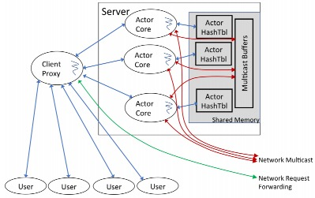
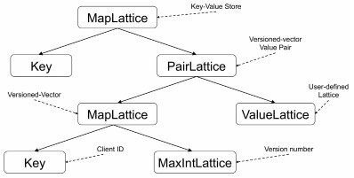

## 设计目标

在现在KV存储系统中，有些设计成全球范围内分布式的，有些设计成单机的。然而在近些年都逐渐收敛到云上。基于这个背景设计了一个可以在任何scale上都运行的很好的KV系统。针对该KV系统有四个设计需求：

- partition。为了实现data scaling当然需要partition。但是Anna实现partition不仅需要云上跨机器的，也需要跨cpu核以提供更高性能。

- multi-master replication。为了实现workload scaling，需要实现multi-master replication使用多线程来同时响应读写请求。

- wait-free execution。为了更大化使用多核机器的硬件使用率和性能，需要实现wait-free execution。这意味着每个线程都是在做有意义的工作，而无需等待其他线程。

- coordination-free一致性模型。为了支持更广范围的应用，需要实现一个广泛范围的coordinator-free一致性模型。

这篇论文描述了Anna的设计和实现，***其通过采用lattice + Actor model的方式：***

- lattice主要用于实现最终一致性

- Actor Model主要用于避免同步，从而减少了同步开销。

## Lattice

如果要实现最终一致性，需要满足以下几个条件：

- 结合律：a + b + c = a + (b + c)

- 交换律：a + b = b + a

- 幂等律：a + a = a

如果满足了以上三点，就可以克服异步网络造成的丢包、乱序等问题，从而实现副本间的最终一致性。lattice就是这样一种数据结构。 

## Limitations of shared-memory

大多数multi-core kv系统使用共享内存将整个存储状态在多线程间共享：每个线程都可以进行读或者写。这需要对读和写操作进行同步以防止冲突产生。同步可以通过有锁或者无锁的方式来实现，然而不管是否有锁都会有性能开销。latice并没有改变上述情况，如果使用了共享内存，一样会有相应的同步开销。

***通过采用Actor Model，可以避免采用shared-memory，从而节省了同步开销***。Anna论文里讲到，Masstree仅仅使用了4%~5%的CPU时间在请求处理上，而Anna由于避免了同步开销可以达到90%左右。

## Message-passing

message-passing结构由一系列的actor组成，每个actor运行在一个单独的cpu核上。每个actor维护自己的状态且其他actor不可访问。actor运行一个loop，循环从input queue中获取客户端的请求以及其他核发来的消息进行处理。由于每个actor只会处理自己的local state，所以避免了共享内存，因此也避免了同步操作

message-passing有两种管理key的选择：single-master和multi-master replication。

- single-master replication。在该模式下，每个key都会指派给一个单独的actor。这防止了对一个key的同时修改，因此而保证了一致性。但是这将一个key的更新频率限制在了单个actor的更新频率。

- multi-master replication。一个key会被复制到多个actor，每个actor读取或者更新其本地副本。这也分为两种：

1. coordination。当更新一个key时，actors可以参与协调控制，使得update按照一个全局的顺序，尽管多个actor可以处理updates，然而全局有序的广播使得每个actor都将这些update按照相同的顺序进行处理，当然，同步操作发生在请求处理的关键路径上，会影响性能。

2. coordination-free。每个actor在本地处理请求，并且不会引入inter-actor communication。所有update的communication在timer被触发、或者actor的请求负载减少的情况下进行。

coordination-free multi-master模式性能最高，但是由于副本将会以不同的顺序处理请求，会导致副本间的不一致。***前面已经讲到，借助lattice可以避免不一致的情况***

## Anna architecture

上图所示为单个机器上的Anna的架构。

- 每个核绑定了一个线程，用于运行coordination-free actor。线程数不会超过CPU核数，以免线程切换带来的性能损耗。

- 用户通过Client Proxy与Anna相连，Client Proxy负责在不同的server、以及同一个server间不同核上的load balance。

- 线程间的通信通过内存中的Multicast Buffer，以避免使用共享内存等同步机制。而server间的通信通过Network Multicast

### Anna Actor Event-Loop

整体流程如下：

1. Anna接收来自于Client Proxy的请求，服务这些请求，并记录变更到change-set中（change-set记录了一个multicase epoch内的所有变更）

2. 在multicast epoch到期后，将从属于其他Actor的key的更新广播至该Actor

3. 同时，也会接收来自于其他Actor的广播

由于lattice的作用，即使不同的Actor收到同一个key的更新的顺序不同，也不会出现不一致的现象。

另外，Anna采用了一个merge-at-sender的优化：对于同一个key的更新，在发送端进行合并，然后发送至其他Actor，以节省带宽。

这一点是由lattice的结合律来保证的，即：

t + u1 + u2 + u3 + ... + un = t + (u1 + u2 + u3 + ... + un)

## Flexible Consistency

Anna采用了lattice composition：如果每个组成composition的模块都符合ACI特性，并且组合逻辑也是ACI的，那么lattice composition也是ACI的。

利用上述原理，Anna为每个Actor维护了一个private state，类型为MapLattice:

- key: 任意类型，immutable

- value: lattice type，即ValueLattice

当一个PUT请求来时，如果待插入的key不在MapLattice中，则插入；否则需要使用value的lattice的merge函数进行合并。类似于Cassandra可以令用户自定义冲突解决方法，Anna也支持用户自定义ValueLattice的实现

### Causal Consistency

对于因果一致性，常用的模型就是vector clock。因此Anna也采用了vector clock。

上图所示为Anna实现Causual Consistency的示例。

- 最下端，MapLattice结构实现了vector clock，key是client proxy id，每个发送数据的client proxy不同且唯一。

- MaxIntLattice是Anna提供的预置lattice，它的merge方法就是比较两个数谁大，merge的结果就是大的那个数。因此，MaxIntLattice是单调递增的，可以表示单调递增的version number。

- 再往上，PairLattice是Anna提供的另一种结构，其key是一个vector clock，value是对应与Key的数据，也是一个ValueLattice结构（merge方法由用户提供）。对于两个PairLattice P(a, b)和Q(a, b)，如果P.a > Q.a，那么P(a, b)在因果上follow Q(a, b)，那么写入结果则是P(a, b)，否则就是Q(a, b)。如果P.a和Q.a无法比较，则需要对PairLattice的key和value分别采用merge函数进行合并。

- 最后，图中最顶层的MapLattice结构，其Key是用户提供的key。

通过组合各种Anna内置的数据结构及lattice，用户可以很轻易的实现各种一致性模型。

## Replication

Anna沿用了Dynamo的设计，使用consistency hash来对数据进行分片。每个Actor都有一个唯一的ID，并通过CRC32哈希将其映射到环上的一个位置。同时对key采用同样的hash，以确定负责该key的actor，并对每个key在顺时针方向上的后继actor上复制N-1次（N为复制因子）

当集群负载发生变化时，可以动态的添加或者删除Actor。

### 添加Actor

当一个new Actor加入集群时：

1. 首先将其ID通知到所有的Actor

2. 当现有的Actor收到new Actor的ID时，首先更新其本地consistency hash ring，并获取需要传送给new Actor的kv pairs转发过去。此后当其收到这些key的请求时，就将请求转发给new Actor

3. 当new Actor收到所有现有Actor的kv pairs时，便将其ID转发给所有client proxy，以使client proxy更新路由信息

4. 当client proxy收到new Actor的ID时，更新其consistency hash ring。从此所有相关的请求都会转发至new Actor

### 删除Actor

当一个Actor离开集群时：

1. 首先确定每个其他Actor应该负责的kv pairs，并将其转发过去

2. 当其他Actor收到消息后，将kv pairs进行ingest，并将该Actor从consistency hash ring中移除掉

3. 离开的Actor向所有的client proxy发送离开的消息，使其更新路由信息

4. 当client proxy收到Actor的离开信息时，更新其consistency hash ring。从此请求不会再路由至该Actor

