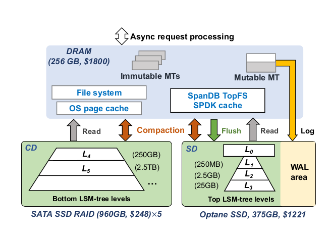
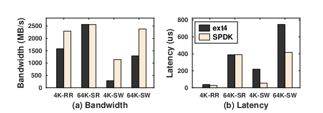

## NVMe 

NVMe: 即Non-Volatile Memory Express，是专为固态存储器设计的新型传输协议。SATA (Serial Advanced Technology Attachment) 并非专为固态硬盘等闪存存储器设计，相比之下，NVMe使硬盘的性能得到极大的提升。

[NVMe参考文档](https://en.wikipedia.org/wiki/NVM_Express)

## SpanDB

最近读paper时发现了SpanDB。根据SpanDB的描述，将WAL和lsm tree的前几层放在NVMe中，可以有效提高性能和吞吐，同时也能兼顾成本

[SpanDB Paper](https://www.usenix.org/conference/fast21/presentation/chen-hao)

[SpanDB Paper解读](https://levy5307.github.io/blog/spandb/)

[SpanDB项目地址](https://github.com/SpanDB/SpanDB)

### SpanDB的架构

1. 将磁盘分为SD和CD。SD意为speed disk，即高速磁盘，这里是指NVMe。CD意为capacity disk，是低速大容量盘。

  - 将WAL和LSM的top n层放到SD里，因为WAL直接影响写请求的延迟和吞吐，而LSM的top n层是热数据。这里的n是根据负载和吞吐情况动态自适应的。

  - 将LSM的剩余层放入CD中，这一部分数据大多是冷数据，且数据量大。将这一部分数据放入CD主要是基于成本考虑

2. 通过SPDK通过使用SPDK直接访问NVMe SSD设备，绕过文件系统和Linux IO stack。SPDK意为Storage Performance Development Kit，其通过引入以下技术，实现高性能存储技术:

  - 将存储用到的驱动转移到用户态，避免系统调用

  - 支持零拷贝

  - 避免在IO链路上使用锁

  - 使用轮询硬件，而不是中断。断模式带来了不稳定的性能和延时的提升

[SPDK官方文档](https://spdk.io/doc/)

下图是采用NVMe盘，不同场景下采用ext4和SPDK的吞吐和延迟对比

3. 为了使RocksDB兼容SPDK，在SPDK上实现了一个轻量级自带缓存的文件系统TopFS

### SpanDB的优点

1. 性能高。SpanDB相较于RocksDB，吞吐提升了8.8倍，延时降低了9.5%-58.3%。

2. 具备无缝替代原生RocksDB的能力，这样可以方便我们做测试。然而生产环境不推荐用SpanDB替换，社区不成熟。

## Pegasus借鉴与优化

Pegasus可以借鉴SpanDB的优化方案：

1. 将shared log放入一个NVMe盘中（后期如果移除掉shared log的话，可以把这个节约一个NVMe盘）

2. 另外选取一个NVMe盘存储private log和lsm-tree的top n层，n的选取根据负载和吞吐动态自适应。（这里需要修改RocksDB的实现）

3. lsm-tree的其他几层的cold data存放在SATA SSD盘中

4. 使用SPDK访问NVMe盘，进一步提升io性能。可能需要像SpanDB一样在SPDK之上实现一个文件接口层。

这样优化后，***可以使Pegasus降低读写延迟，提高系统吞吐，提高的吞吐可以促进降低成本。***

另外，从硬件上来说，Pegasus需要2块NVMe的小盘，其他的盘均使用普通的SSD。

