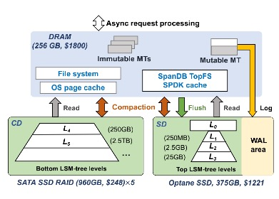
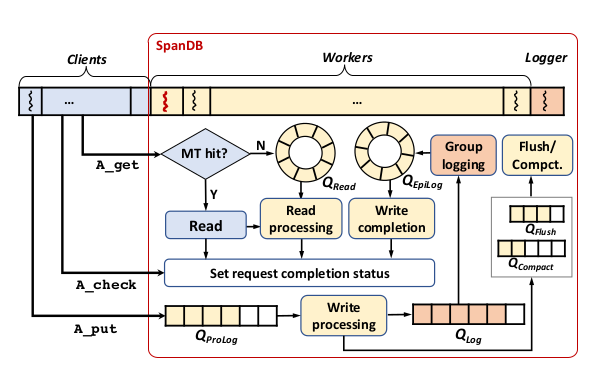
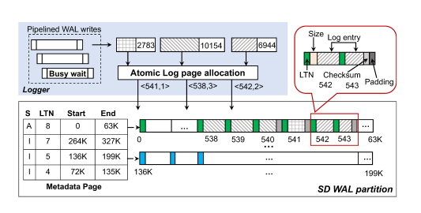

KV存储支持了很多关键应用和服务。他们在内存中执行快速处理，但是仍然经常受到IO性能的限制。最新出现的高速商用NVMe SSD推动了新的KV系统设计，以利用其超低延迟和高带宽的优势。同时，将整个数据库扩展到该高端SSD需要很多资金。并且我们的研究表明，当前基于LSM的KV存储并未完全发挥NVMe的潜力，例如在50%写负载的情况下，在Optane PX4800X上部署的RocksDB与SATA SSD相比吞吐仅仅提高了23.58%。特别的，普通的KV存储设计的IO路径很严重的未充分利用超低延迟的NVMe SSD，尤其是对于small write。例如，通过ext4带来的延迟比通过英特尔SPDK接口高6.8-12.4倍。

在这个背景下，SpanDB出现了。它允许将大量数据托管在更便宜、更大的SSD上，同时将WAL和LSM-tree的前几层定位在更小、更快的NVMe上。为了更好的利用NVMe，SpanDB通过SPDK提供高速、并行的WAL写入，并启用异步请求处理以减轻线程间的同步开销，并通过基于polling-based IO高效工作。

## SpanDB Overview



上图为SpanDB的整体架构图

1. 将磁盘分为SD和CD。SD意为speed disk，即高速磁盘，这里是指NVMe。CD意为capacity disk，是低速大容量盘。
  - 将WAL和LSM的top n层放到SD里。因为WAL直接影响写请求的延迟和吞吐，而WAL通常是GB级别的，并且LSM的top n层（相对剩余层次的来说）是热数据（其实这里准确来说应该是最新写入的数据，未必就是热数据，只是相对剩余层次来说，热数据的概率和比例会更高），所以这两者放入SD。这里的n是根据负载情况动态自适应的，并非将CD简单的作为溢出层。
  - 将LSM的剩余层放入CD中，这一部分数据大多是冷数据，且数据量大。将这一部分数据放入CD主要是基于成本考虑
2. 通过SPDK通过使用SPDK直接访问NVMe SSD设备，绕过文件系统和Linux IO stack。SPDK意为Storage Performance Development Kit，其通过引入以下技术，实现高性能存储技术:
  - 将存储用到的驱动转移到用户态，避免系统调用
  - 支持零拷贝
  - 避免在IO链路上使用锁
  - 使用轮询硬件，而不是中断。断模式带来了不稳定的性能和延时的提升

***我个人理解***，将top n层放入SD中带来的优化主要是由于：

1. 在读取时，回去逐层查找sstfile，然后找该file的data block，然后查询该data block的bloom filter，上述这些步骤是在内存中的，但是由于假正率的存在，导致当bloom filter中显示该数据存在时，数据不一定真的存在，这会导致在该level多了一次读磁盘。

2. 由于top n层执行compaction的频率更高，所以是新生成的sst文件的概率也就更高，这样导致block cache命中率偏低，导致读磁盘的可能会更高。

基于上述两点，如果top n层使用SD，对读取速度会有一些优化。另外，虽然说top n层相对偏热，但是其实是有些牵强的，因为这个需要看具体的业务场景。

## Design And Implementation

### Asynchronous Request Processing

在慢速设备的时代，我们通常使用多线程技术，采用远多于CPU核心数的线程数量，尽可能避免慢速设备造成的较长时间的等待。进入NVMe SSD时代，在SPDK技术加持下，线程间的同步比IO本身更耗时。在这种情形下，传统的多线程 IO技术在IO吞吐量、延迟和CPU资源利用上都不具备优势。

因此SpanDB采用了异步请求处理。很多KV系统都使用了嵌入式的DB处理，所有foreground thread都被当成客户端。在n核机器上，用户将客户端线程的数量配置为N<sub>client</sub>，每个线程占用一个核。剩下的n - N<sub>client</sub>个核心处理SpanDB内部服务线程，内部线程相应地被分为两个角色：loggers和workers。 

- loggers主要执行WAL写入

- Workers处理后台任务处理（flush/compaction）以及一些非I/O任务，例如Memtables的写入和更新、WAL日志项的准备、事务相关的加锁与同步。

根据观察到的写强度，head-server线程自动自适应地决定logger的数量，这些logger被绑定到分配了SPDK队列的核上，从而保证WAL的写带宽。



***Asynchronous API*** 

SpanDB提供了简单的异步API。对于RocksDB现存的get和put接口，实现了相应的异步接口A_get和A_put，以及A_check来查看请求的执行状态。另外scan和delete接口也有相应的异步实现。

以下是客户端代码片段。客户端采用了异步处理的精髓：在等待时间去做其他的active work。它首先发送了一个A_put请求，然后去检查已发送请求的状态（如果有请求执行完了，则调用响应的处理流程），然后再去发送另外的请求。当IsBusy状态被设置时，该请求将会被暂时拒绝，不过该请求后面会被客户端重新执行。

```
Request *req = null;
while(true) {
    if(req == null)
        req = GenerateRequest();
    LogsDB->A_put(req->key, req->value, req->status);// issue async req

    if(!(req->status->IsBusy())) {
        pending_queue->enqueue (req);
        req = null; // ready to generate next req
    }
    for(Request* r in pending_queue) {
        if (A_check(r->status)==completed) { // check outstanding reqs
            pending_queue.remove(r);
            custom_process(r);
        }
    } // end for
}
```

***SpanDB request processing***

- asynchronous read：client线程会首先尝试进行memtable读取，如命中则可直接获取返回结果。如未命中，则将读取请求放入到Q_read中，随后通过获取请求状态接口获取结果。worker线程会随后读取并执行Q_read中的读请求，并设置读取结果。

- asynchronous write：client线程直接将写请求压入Q_ProLog队列，随后通过获取请求状态接口获取结果。worker线程读取Q_ProLog写入请求，序列化得到WAL entry并压入到Q_log。Q_ProLog队列和Q_Log队列是设计用于实现batched logging。logger线程会一次性读取Q_log队列中所有的请求，执行group logging，并将写入请求压入到Q_EpiLog队列。worker线程会从Q_EpiLog线程读取请求，执行最终的memtable更新操作。

***Task scheduling***

为减少线程调度的上下文切换造成的不必要资源占用。SpanDB默认启动1个logger，根据写入负载在1-3个logger间浮动。基于foreground任务优先的原则，根据写入队列的请求响应时间，SpanDB也会控制相应队列的容量上限实现动态负载均衡。

### High-speed Logging via SPDK

SpanDB使用SPDK向raw NVMe SSD设备flush log，绕过了文件系统和Linux IO stack。SpanDB的WAL写入依然采用了group logging机制。RocksDB原始的WAL写入通过选取排在第一的作为leader，而SpanDB则选取了指定的loggers线程，这些loggers线程从Q<sub>Log</sub>获取能够读取的所有请求，并发地执行写入。



SpanDB在SD的WAL area预先分配若干个逻辑page，每个page有一个唯一的LPN(Log Page Number)。其中一个page作为metadata page。若干个连续的page组成一个log page group，每个group对应一个memtable，容量足够容纳一个memtable的WAL。当memtable flush完成后，log group将会被回收重用。meta data page记录每个log page group的起始LPN。

SpanDB配置了多个logger并发写入，每个logger有单独的WAL data buffer。为实现并行写入，每个logger通过原子操作分配得到下一个写入位置。当memtable写满时，meta data page会记录其对应的log page group。

### Offloading LSM-tree Levels to SD

SpanDB 将顶部的部分 level 数据迁移到 SD 中，充分利用 SD 的硬件性能。

***Data area storage organization***

通过SPDK访问NVMe SSD有一个约束：整个设备都必须与内核驱动解绑，并且不能通过传统的IO stack访问。因此不能将SD进行分区，通过SPDK写入WAL到一个区域，而其他的区域安装文件系统进行访问。

为减少对RocksDB代码的侵入，在SPDK I/O的基础上，SpanDB实现了一个简单的文件系统TopFS，在SPDK之上提供了一系列熟悉的文件接口。由于LSM-tree文件的append only以及immutable属性、及其single-writer的访问模式，简化了TopFS的设计。例如，文件大小在创建时是已知的（对于flush，由于immutable MemTable的大小是固定的）、或者是有已知limit（对于compaction）。另外，每个SST文件都只会通过一个线程写一次，不管是通过flush还是compaction。TopFS可以确保文件在关闭时进行了持久化。

Metadata的管理是很简单的：通过一个hash table，通过file name索引，记录每个文件的开始和结束LPN

***Ensuring WAL write priority***

因为background flush/compaction任务会影响foreground写入，并且flush/compaction对延迟基本没什么影响。而WAL则会对写入延迟有直接影响，因此应该将SD资源向WAL写入倾斜。通过以下措施来保证写入的优先级：

- 对每个logger分配专门的队列

- RocksDB默认的flush/compaction请求大小是1MB，SpanDB将其降低为64KB，从而减少与foreground的写争用

- 限制flush/compaction的线程数量

***SpanDB SPDK cache***

SPDK bypass OS page cache的特点让其无法使用系统的page cache。在TopFS之上，SpanDB实现了一个自有的cache。

在SpanDB初始化时，会在hugepage中申请一大片内存用作cache。当一个SST文件创建时，SpanDB为其预留一定数量的连续的64KB的buffer作为block cache（上文提到过，文件的大小或者文件大小的上限是已知的）。

***Dynamic level placement***

我们可以的动态的调整存放到SD中的lsm-tree的层数()。最初，我们采用了一个分析模型来直接计算最优的SD-CD之间的lsm-tree层次划分，从而最大限度地提高整个系统的吞吐量，并通过观察SD和CD之间持续的资源利用水平的不平衡来进行动态调整。

head-server thread监控SD的带宽使用情况，当前低于BW<sub>L</sub>时，触发SST文件的relocation，直到其达到BW<sub>H</sub>或者SD空间满了，其中BW<sub>L</sub>和BW<sub>H</sub>是两个配置项。

这里并不是将文件从SD与CD之间进行搬迁，而是随着compaction进行，将新创建的文件放置到相应的位置。有一个指针来表明该lsm-tree的哪一层应该放入NVMe，例如：当该指针指向3时，表明top 3层应该放入NVMe。然而，该指针仅仅只是代表新创建的文件的目的位置，有可能出现新创建的L3层的文件在SD，而老的L2层文件在CD。当然这种情况比较少见，因为高层的文件更小，他们会更频繁的被compaction

## Reference

[论文](https://www.usenix.org/conference/fast21/presentation/chen-hao)

[论文阅读](https://www.jianshu.com/p/c7bcba398259)
