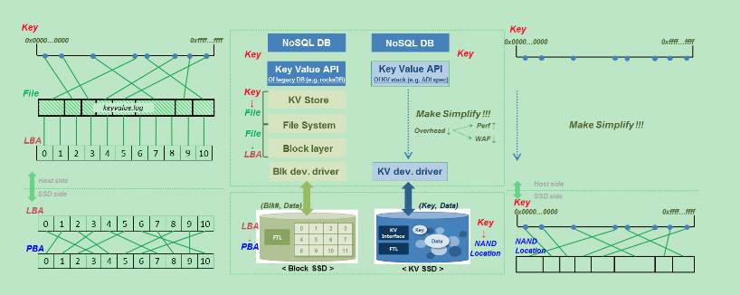
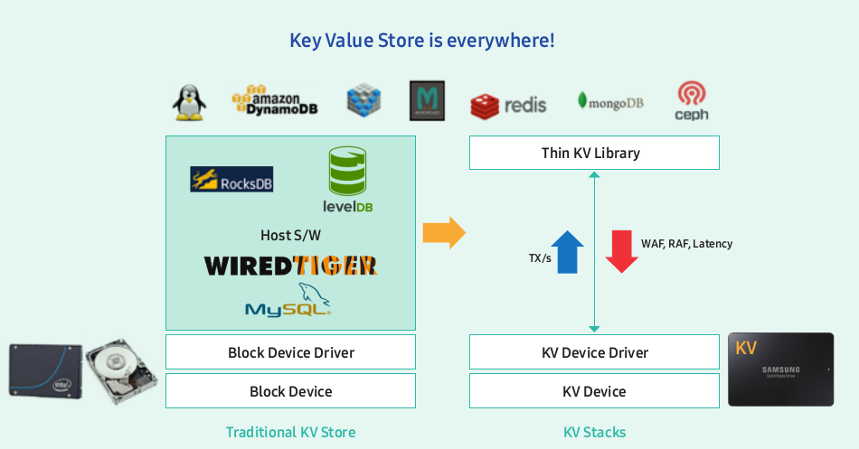
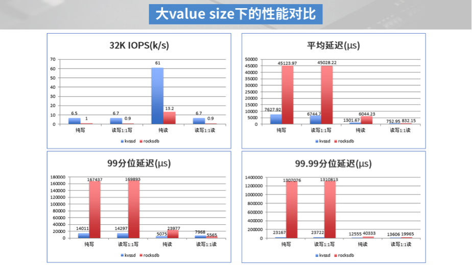
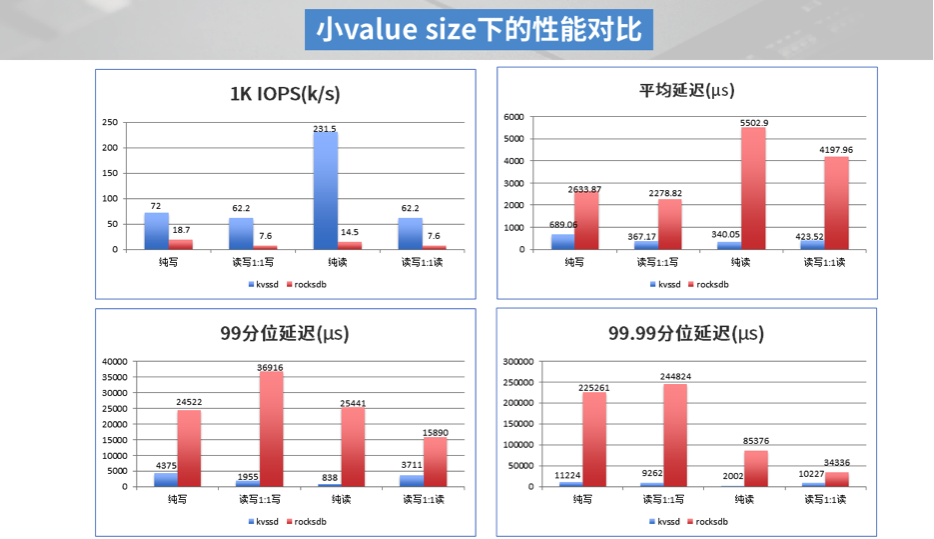

## Block SSD

传统的SSD硬盘以块设备的形式存在。当在传统SSD之上实现KV存储系统时，如果写入或者读取键值对，需要先完成从KV到文件的转换，再实现文件到logic block的转换，然后将logic block映射到physical block，这种层层转换无疑是性能很低的。

并且为了适应块设备，当前很多KV系统采用了LSM-Tree的方式来实现，但是其有如下几个问题：

1. 写放大。由于compaction机制的存在，一份数据被反复的compaction到LSM-Tree中的多层，造成非常大的写放大。

2. 读放大。当没有命中block cache时，可能需要读取LSM-Tree中的多层才能够获取数据

3. compaction造成的IO浪费。由于compaction的存在，使得处理业务实际请求的IO远远小于磁盘能够提供的IO能力

4. 空间使用率低。在数据被compaction之前，可能会保存多份，造成了空间的浪费。

## KV SSD

目前业界提出了一种新的解决方案：KV SSD。在KV SSD中，通过固件对外提供了一个KV的接口，应用可以绕过内核与文件系统，通过SSD提供的KV接口向其写入数据。

下图所示为Block SSD和KV SSD的对比：

另外通过KV SSD，可以不必使用LSM-Tree，从而避免了LSM-Tree带来的读写放大、IO浪费等问题。分布式KV存储可以基于一个thin KV引擎来构建，如下图所示：

## 现状

当前百度携手宝存科技，已经实现上了上述方案，并且在百度内部接入了多个应用。根据百度的测试发现，其性能（吞吐和延迟）比基于Block SSD的KV存储有了数十倍的提升

## 后续

和百度那边负责KV SSD的团队进行了一次技术交流，总结如下：

1. KV SSD的性能是毋庸置疑的，相比RocksDB，性能可以提升上百倍。

2. KV SSD的缺点也很多，例如：

- 方案不成熟，KV存储只是存储领域很小的一个分支，很多硬件厂商也不愿意花费精力去维护。百度内部现在也基本上不怎么推动了，他们现在有些已有的问题都没有解决

- 非通用硬件，绕过内核文件系统，导致不利于运维，查bug很困难

- 数据搬迁很复杂。原来有文件系统通过文件进行搬迁就可以了，现在需要把相应的数据从SSD中逐一读取出来再进行搬迁

## 参考文档

[论文](https://cseweb.ucsd.edu/~y7jin/papers/KAML17_Yanqin.pdf)

[Samsung KV SSD](https://www.samsung.com/semiconductor/global.semi.static/Samsung_Key_Value_SSD_enables_High_Performance_Scaling-0.pdf)

[Key Value Storage Standard Final](https://www.snia.org/sites/default/files/ESF/Key-Value-Storage-Standard-Final.pdf)

[百度Open-Channel KV](http://www.dostor.com/p/64402.html)

[2019开放数据中心峰会亮点之KV SSD](http://www.odcc.org.cn/news/p-1160060784686317569.html)

