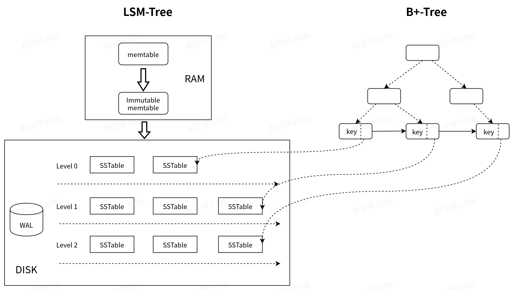

## 现状

当前Pegasus中，读操作尤其是范围读性能很差，并且线上Pegasus的抖动通常是由读导致的。所以需要找到一个方式对其进行优化。

## 思考

LSM-tree的核心思想是牺牲读性能来换取顺序写，提高写性能。所以，读性能低是LSM-tree based存储系统的通病，因为多level存在会引起读放大。

因为现在Pegasus线上经常读导致抖动，所以之前考虑过用B+-tree的存储引擎来替换RocksDB，但是这样迁移成本太高，而且会导致不兼容。

因此希望在尽量减少现有引擎改动的情况下，去优化读性能。所以想到可以结合LSM-tree和B+-tree两者的优点，即：

- 使用LSM-tree来优化写，提高写性能。

- 另外维护B+-tree，以提高读以及范围读性能。

B+-tree的结构如下：

- B+-tree叶子节点保存key，及其对应的location info

- location info包括：SST file ID，block offset，用于定位具体的data block

- 由于B+树的叶子节点是串联且有序的，可以根据叶子节点进行scan操作

- 在immutable memtable flush的时候，去更新该B+-tree。compaction过程同理。

- B+-tree只索引存储在SST文件中的key。对于immutable memtable和memtable中的key不去索引（而且也没必要索引，内存足够快）。只有在更新完B+-tree之后，才能更新MANIFEST文件（表示该LSM-tree的修改完成）

## 问题

1. B+-tree可以保存在内存中，但是这样会带来一个问题：recovery过程需要读取所有的key以构建B+-tree，所以会很慢。解决办法：将该B+-tree保存在PMEM中，免去恢复过程中的重建。

2. 对于key比value大很多的情况不适用，太占用内存。

## Reference

[SLM-DB](https://www.usenix.org/conference/fast19/presentation/kaiyrakhmet)

[B+ tree](https://en.wikipedia.org/wiki/B%2B_tree)

