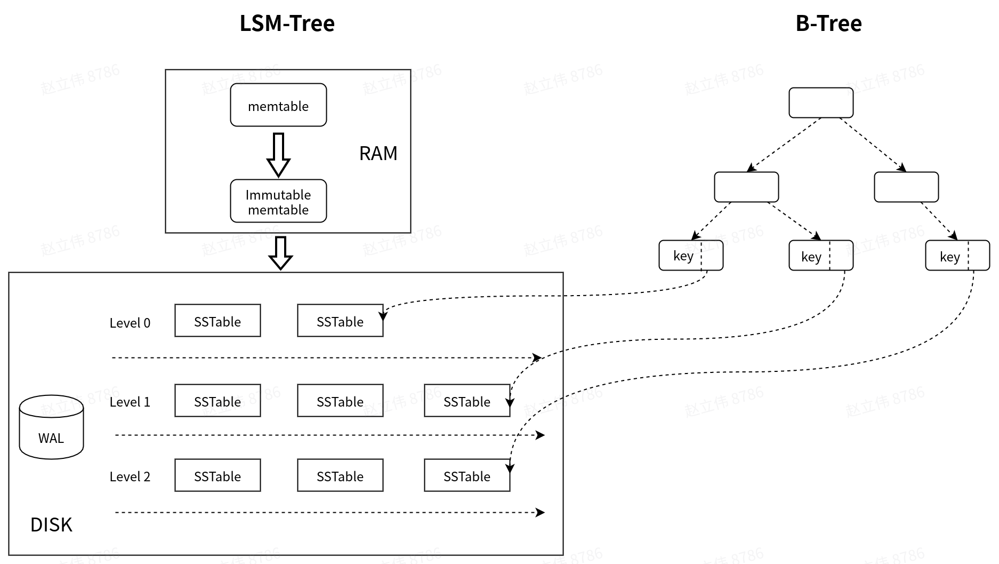

## 现状

当前Pegasus中，读操作尤其是范围读性能很差，并且线上Pegasus的抖动通常是由读导致的。所以需要找到一个方式对其进行优化。

## 思考

LSM-tree的核心思想是牺牲读性能来换取顺序写，提高写性能。所以，读性能低是LSM-tree based存储系统的通病，因为多level存在会引起读放大。

因为现在Pegasus线上经常读导致抖动，所以之前考虑过用B-tree的存储引擎来替换RocksDB，但是这样迁移成本太高，而且会导致不兼容。

因此希望在尽量减少现有引擎改动的情况下，去优化读性能。所以想到可以结合LSM-tree和B-tree两者的优点，即：

- 使用LSM-tree来优化写，提高写性能。

- 另外维护B-tree，以提高读以及范围读性能。

B-tree的结构如下：

- B-tree叶子节点保存key，及其对应的location info

- location info包括：SST file ID，block offset，用于定位具体的data block

- 在immutable memtable flush的时候，去更新该B-tree。compaction过程同理。

- B-tree只索引存储在SST文件中的key。对于immutable memtable和memtable中的key不去索引（而且也没必要索引，内存足够快）。只有在更新完B-tree之后，才能更新MANIFEST文件（表示该LSM-tree的修改完成）

- 如果担心B-tree更新的过程影响读，可以采用COW，更新完后切换，只需给切换的过程加锁。

## 问题

B-tree可以保存在内存中，但是这样会带来一些问题：

1. recovery过程需要读取所有的key以构建B-tree，所以会很慢。

2. 占用的内存太大。

针对第二个问题，SLM-DB提出的解决方案是将B-tree保存在PMEM中，这样便可以免去重启过程中构建B-tree的过程。但是其占用内存大的问题仍然没有得到解决。

在SpanDB中，其将LSM-tree的top n层放入NVMe，以此提高读写性能。我们可以借用SpanDB的灵感，只为LSM-tree的top n层构建B-tree索引，由于LSM-tree的层与层之间的空间比例是10，所以top几层所占用的内存空间不会太大，而且重启时的构建速度也会很快，可以解决上述两个问题。

## Reference

[SLM-DB解读](https://levy5307.github.io/blog/SLM-DB/)

[SLM-DB](https://www.usenix.org/conference/fast19/presentation/kaiyrakhmet)

[SpanDB](https://levy5307.github.io/blog/spandb/)

[B-tree](https://en.wikipedia.org/wiki/B-tree)

