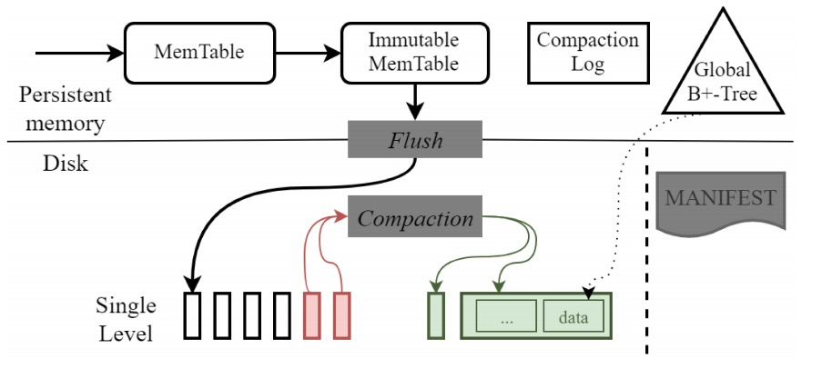

SLM-DB全名Single-Level Key-Value Store with Persistent Memory。是使用了Persistent memory对LSM-tree based存储引擎进行了一系列优化。

## LSM-tree的缺点

1. 读放大。由于读放大存在导致读取操作需要遍历LSM-tree多层，比较耗时

2. 写放大。写放大高达十倍至多，占用磁盘空间。

## SLM-DB

上图为SLM-DB的整体架构图。其主要使用了Persistent Memory进行了如下优化。

### 写优化

MemTable保存在Persistent Memory中，省去了WAL的写入

### 读优化

实现了一个B+-tree，用以索引key，其每个叶子节点保存key及其对应的location info，该location info格式为[SST file id, data block offset, block size]。该B+-tree同样保存在Persistent Memory中

当将immutable memtable flush时，或者进行compaction时，需要同时对B+-tree进行更新。在SLM-DB中创建了两个线程，一个用于Compaction创建新文件，另外一个用于更新B+-tree。当新创建文件被flush到磁盘时，其内部的key便会发送到一个mq里，而更新B+-tree的线程作为该mq的消费者，获取这些key并对B+-tree进行更新。当更新完B+-tree之后，才会去更新MANIFEST文件，代表compaction完成。

通过B+-tree便可以直接定位到key对应的data block，完全消除了读放大。另外对于范围读，由于B+-tree的特性，只要找到第一个key，随后沿着叶子节点横向指针遍历就可以了。

### Selective Compaction

在SLM-DB中也是需要compaction的，compaction的目的主要有两个：

1. 删除过期数据

2. 提升KV键值对的顺序性，使得范围查询的key落在尽量少的SSTable中，提升范围查询性能。

其触发时机有如下几个：

- 当SSTable文件的组织结构发生变化时（例如flush）

- 对一个确定的SSTable文件出现了多次seek

- 在compaction candidate list中的文件数量超过某个阈值时

不过，在SLM-DB并不是一个多层的LSM-tree，而是单层的，所以compaction策略与RocksDB也不太一样。
