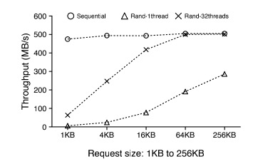
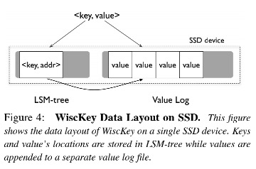
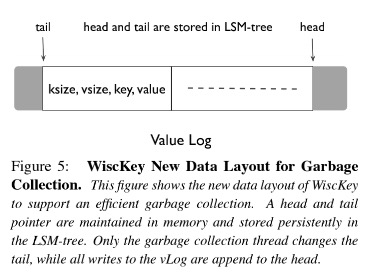
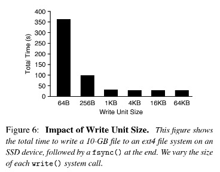

## Background

目前最优秀的存储系统，很多有依赖于LSM-tree来构建。LSM-tree通过提高IO放大换取顺序写，以提升写入性能，这对于HDD磁盘这种random IO比sequential IO慢100倍的情况具有很大的优化效果。然而对于SSD却不一定有这么明显的效果，主要原因有三：

- SSD的random IO和sequential IO性能相差不想HDD那么大。因此像LSM-tree这样通过大量顺序写来减少随机写的实现方式，可能会浪费磁盘带宽

- SSD内部实现由很大的并行性，基于SSD的LSM-tree将会伤害这种并行性

- LSM-tree由于比较大的写放大，会显著减少SSD磁盘寿命

基于上述几个因素，在SSD至上运行LSM-tree将会影响SSD性能，减少90%的吞吐并增加10倍的写入负载。尽管在SSD上运行LSM-tree比在HDD上会更快一些，但是SSD的潜能并没有被完全开发出来。

## WiscKey

为了充分利用SSD的潜能，WiscKey有如下4个重要的ideas:

1. 即将key和value分开，value存储在vLog中，key及对应的value地址存储在LSM-tree

2. 为了处理范围查询过程中导致的value非顺序读，WiscKey充分利用了SSD多线程并行随机读性能高的特点，具体如下图，32线程随机读性能在请求64KB大小时，已和顺序读相差无几。

3. WiscKey实现了crash-consistency和garbage-collection技术以高效管理vLog

4. WiscKey移除了LSM-tree的WAL，提升了写入性能，并且不会影响一致性。

### Design Goals

- Low write amplification. 写放大会引入不必要的写，会消耗很多磁盘带宽（高达90%），并且会降低SSD的使用寿命。

- Low read amplification. 读放大会有两个危害：1. 查询的吞吐会严重下降；2. 过多的数据加载到内存中，降低了cache的效率。

- SSD optimized. WiscKey根据SSD的特性进行了优化。

- Feature-rich API.

- Realistic key-value size. 对KV存储来说，key一般偏小，而value则会变化比较大（从100B到4KB），WiscKey设计以对这种现实场景提供高性能。

### Key-Value Separation

WiscKey的思想很简单：将key和value分开存储，value单独存放在其他位置，key和value的地址存储在LSM-tree上。如下图所示：

因为key通常比value小很多，这样可以大幅降低写放大。

***写入：*** 当插入一个数据时，value先被append到vLog中，然后key和value的地址被插入到LSM-tree中。当删除一个数据时，只需要在LSM-tree上删除数据，不用管vLog。当一个value在LSM-tree上可以找到对应的key时，该value就是有效的，其他无效的数据会在后续的gc过程中被清除掉。

***读取：*** 当读取时，先在LSM-tree上查找该key，如果找到了，再根据value地址去vLog中获取value。由于读取时需要额外多一次获取value的操作，很多人可能认为WiscKey会比LevelDB慢。然而，由于WiscKey的LSM-tree明显小于LevelDB，那么查找所需要查找的层数也会更小，并且会有更多的LSM-tree部分被缓存，缓存命中率也会增高。

### Challenges 

由于key-value分离，导致范围查询时有过多的随机IO，并且带来garbage collection和crash consistency挑战

#### Parallel Range Query

在LevelDB中，由于key和value是一起按顺序存放的，所以范围查询是顺序读的。然而在WiscKey中，由于Key和Value分开存放，范围读会导致大量的随机读，导致性能比较低下。

前面讲到过，单线程随机读是性能很低的，但是并发随机读一些足够大的请求时，可以更好的使用SSD的并行性，与顺序读的性能相当。WiscKey利用了SSD的这个特性，通过从vLog中预期value，以实现范围查询。当用户发起范围查询时，WiscKey从LSM-tree中读取多个key以及其相应的value地址，然后多个线程会同时通过这些地址去vLog中查询value。

#### Garbage Collection

在传统的LSM-tree based存储系统是通过compaction来回收被删除或者被覆写的数据。在WiscKey中，仅仅无效的key可以被compaction回收，value却需要通过额外的gc机制进行回收。

一个简单的方法是遍历LSM-tree，获取所有有效的value address，在vLog中所有没有被索引的value将会被回收，但是这个操作太重了。

WiscKey采用了一个更加轻量级的方法。其实现是通过更改了vLog的data layout：[key size, value size, key, value]。具体如下图所示：

图中的head代表vLog的末尾，新的value会被append到此处，而tail则代表gc的开始点。head和tail都会在LSM-tree中进行持久化，并且仅仅在head和tail之间才包含有效的value。

在gc过程中，WiscKey先从tail部分读取一块（chunk）kv pairs（例如几MB），然后通过LSM-tree查看哪些value是有效的，然后将有效的value append到head处，最后释放掉该chunk并更新tail。

为了防止在gc过程中crash发生导致数据丢失，WiscKey必须保证在实际释放空间之前，先将new value和new tail持久化，通过如下步骤实现：

1. 将new value append到vLog，并对vLog调用fsync()，如果此时发生了crash，不会产生影响，因为该写入的new value在LSM-tree上找不到对应的key，后续会被gc掉

2. 同步的将new value地址和new tail加入到LSM-tree中，tail的格式为：<"tail", tail-vLog-offset>

3. 释放vLog中被回收的空间

#### Crash Consistency

WiscKey利用了文件系统的一个特性来保证crash consistency。该特性是指：在crash过程中，如果vLog中的一个value X丢失了，那么在value X之后的数据也一定丢失了。同样，如果一个value X没有丢失，那么在value X之前的数据也一定没有丢失。

对于读取，分为如下两种情况：

1. 如果在LSM-tree查询不到key，那么其行为将和LevelDB一样。即使value被写入了vLog中，该value也会在随后被gc掉。

2. 如果在LSM-tree中查询到了key，WiscKey首先验证该key对应的value address是否是vLog的有效范围，并且查询到的value是否与key匹配。如果验证失败了，那么WiscKey则假设数据丢失了，从LSM-tree中删除该key，并且通知用户key没有找到。由于vLog中记录了key和value，那么验证其是否匹配是可行的。

对于写入，WiscKey通过以下步骤实现：

1. 写入vLog，并且flush vLog

2. 对LSM-tree进行同步insert

### Optimizations

#### Value-Log Write Buffer

对于WiscKey，每个Put()请求都会向vLog中appen一个value。然而，对于insert-intensive负载来说，大量的small write会带来很大的开销，如图所示：

为了减少这种开销，WiscKey引入了vLog buffer，缓冲写入数据，当其大小超过其threshold时或者用户执行synchronous insertion时，才会对buffer进行flush。因此WiscKey仅仅会执行大的写入，并减少了write()系统调用的次数。当查询时，先从vLog buffer查询，如果没有找到，再去vLog中查找。很显然，这种机制会导致在crash发生时，一些缓冲的数据丢失（similar to LevelDB）。

#### Optimizing the LSM-tree Log

在传统的LSM-tree based存储系统中，使用了WAL来保存最新插入的数据，用于故障恢复时恢复数据。在WiscKey中，为了gc，vLog中保存了写入的key和value，当crash发生时，可以通过scan vLog来恢复数据。因此WAL可以被省去，并且不会影响数据的可靠性。

为了实现这个特性，WiscKey会周期性的将head写入到LSM-tree中，其格式如下：<"head", head-vLog-offset>。当发生故障恢复后，从LSM-tree中获取head位置，并从head位置开始读取数据，直到vLog结尾，然后将这部分数据插入到LSM-tree中。head位置之前的vLog中的数据不用读取，因为LSM-tree可以保证在"head"插入之前插入的数据可以被持久化，只需要从head位置开始读取vLog即可。

