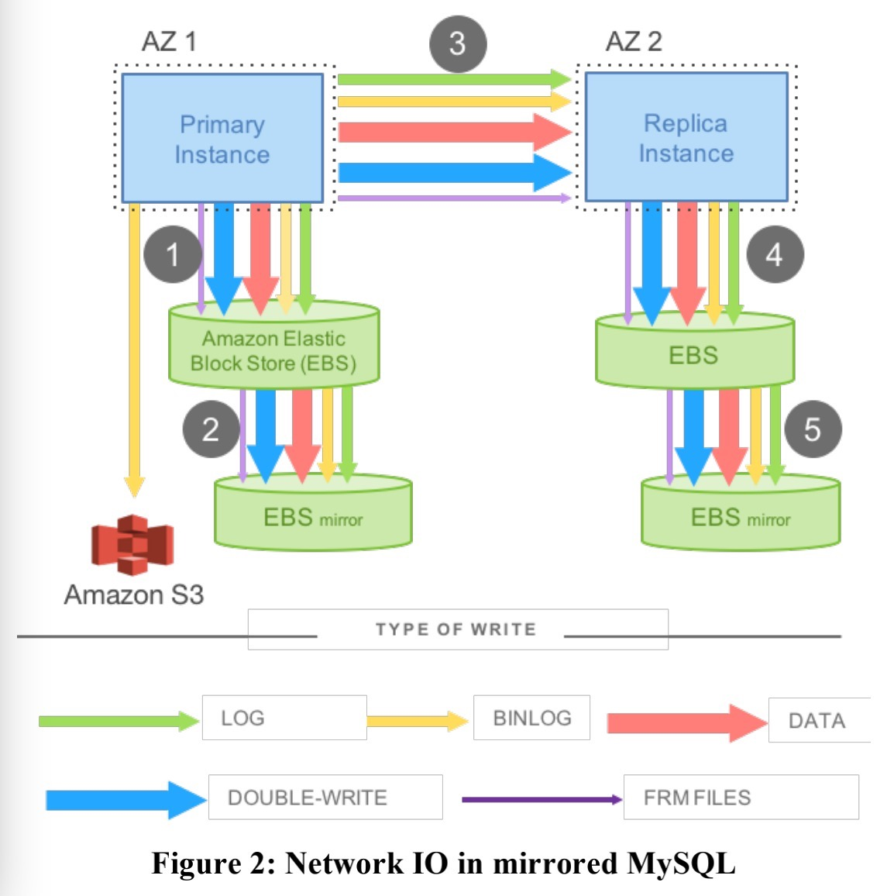
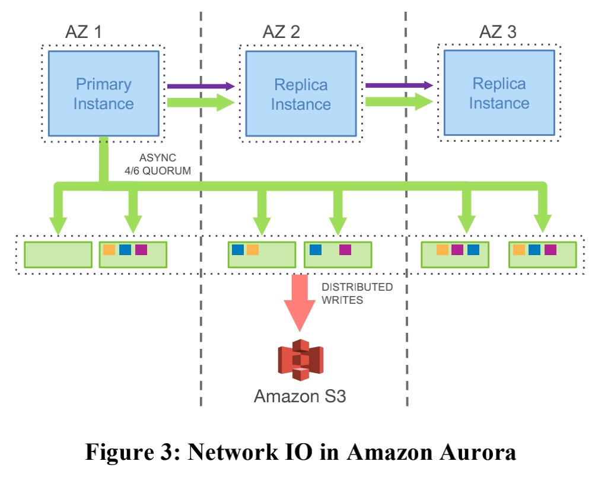
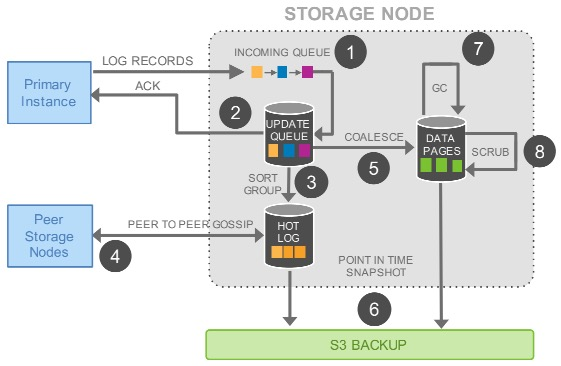
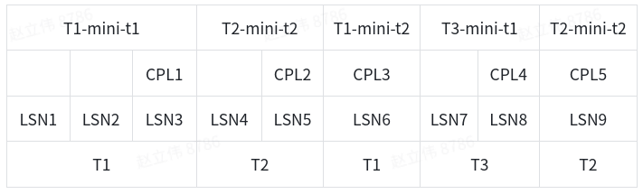
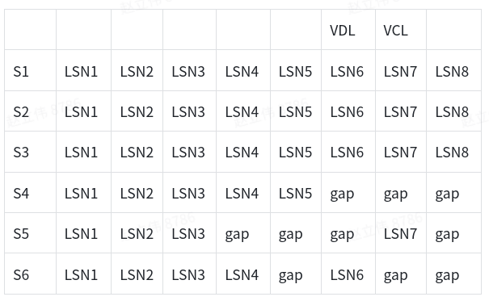
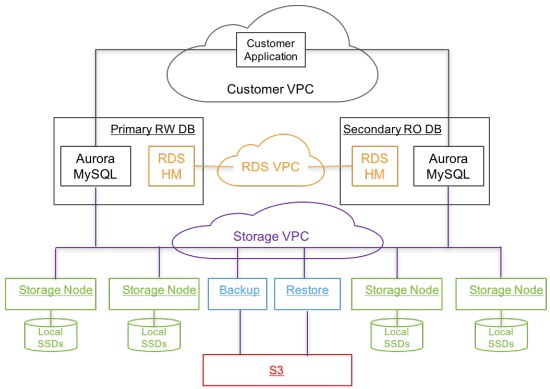

Aurora是亚马逊开发的一款OLTP数据库，可以100%兼容MySQL协议。并采用存算分离、redo log下沉、减少数据传输、异步化处理等方式来大幅提高性能。其精髓是log is the database。

> 存算分离架构的本质是拆解系统功能，让各个独立组件的功能更加内聚。功能拆解后，原本有可能争抢资源而互相影响的功能分解开了。另外，由于不同功能组件对硬件资源的要求不一样，拆分也能使整体的资源利用率更高。

## Introduction

在当前的分布式云服务中，存算分离提供了弹性和扩展性。但是仍然存在几个问题：

- 当前的瓶颈变为了存储和计算层之间的IO。传统数据库当前面临的IO瓶颈已经发生了变化，因为IO可以分布在多个节点和多个磁盘上，因此单个的磁盘和节点不再过热

- 数据库将并行地向存储系统发出写操作，这将导致流量放大的问题

- 很多时候我们需要同步操作，这将导致stall和上下文切换。例如: 当缓存未命中所导致的磁盘读取操作，当读取完成之前，该读取线程无法继续执行；提交一个事务时的暂停可能会阻碍其他事务的进展

相较于传统的数据库服务，Aurora的架构有如下三个显著的优点：

1. 使用了一个独立的、错误容忍并自我修复的跨数据中心storage服务，保证了database不受网络层或数据存储层问题的影响。

2. 在数据存储中，只写入redo log记录，可以从量级上减少网络IOPS。

3. 将耗时复杂的功能从一次昂贵的操作转变为连续的异步操作，保证这些操作不会影响前台处理

## Quorum Model

在大规模的云环境中，将会持续的存在来自节点、磁盘和网络的backgroup noise。每次失败可能有不同的持续时间和不同的爆炸半径。例如，一个节点可能暂时网络不可用，重新启动时临时停机，或者磁盘、节点、机架或主干网络交换机甚至数据中心的永久性故障。分布式数据库必须以某种形式复制以提供故障恢复能力。

在replicated system中容忍故障的一种方法是使用quorum-based投票协议。对于一个V个副本的数据，为了实现一致性必须遵守两个规则：

1. 每次读取必须知道最新的写入，公式为：R + W > V。该公式确保用于读取的节点集与用于写入的节点集相交

2. 每次写入必须知道最近的写入以避免写入冲突。公式为：W > V / 2

容忍单个节点丢失的常见方法是令(R，W，V) = (3, 2, 2)。然而，Aurora认为这是不够的。

要了解原因，让我们首先了解AWS中可用区(AZ)的概念。AZ是Region的一个子集，通过低延迟链路连接到该Region中的其他AZ，但对大多数故障（包括电源、网络、软件部署、泛洪等）与其他AZ是隔离的。跨AZ分布数据副本可确保典型的大规模故障模式只影响一个数据副本。这意味着可以简单地将三个副本中的每一个放置在不同的AZ中，并且除了较小的单个故障之外还可以容忍大规模事件。

然而，在大型存储群中，故障的background noise意味着，在任何给定的时间，某些磁盘或节点子集可能已经发生故障并正在修复中。这些故障可能独立地分布在每个AZ A、B和C中的节点上。但是，由于火灾、屋顶故障、洪水等原因，这样background noise与AZ故障一起将会破坏仲裁模型，导致无法正确读取与写入。***仲裁模型需要容忍AZ故障以及同时发生的background noise故障***。

在Aurora中，我们需要满足一下两点：

1. 整个AZ故障加上一个额外节点故障（AZ+1），不会导致数据丢失

2. 整个AZ故障不会影响数据写入

Aurora的仲裁模型使用6个副本，跨越3个AZ，每个AZ有两个copies。即(R，W，V) = (3, 4, 6)，在这种模型下，***即使一个AZ+1发生仍然可以读；即使两个节点故障（或者整个AZ故障）仍然可写。***

### Segment

另外，在故障发生时，需要在故障修复期间尽量没有新的故障发生。即MTTF(Mean Time to Failure) > MTTR(Mean Time to repair)。如果双故障发生的概率足够高，这样当遇上AZ故障时，将会破坏仲裁模型。降低MTTF是很困难的，Aurora专注于降低MTTR。Aurora采用的策略如下：将数据分区成固定大小（10GB）的segment，每个segment有6个副本（称为一个PG: Protection Group），分布在3个AZ中。数据存储在带有SSD的EC2上（亚马逊的虚拟服务器）。***Segment就是系统探测失效和修复的最小单元***。10GB的分段数据在10Gbps的网络连接上只需要10s就能传输完毕。

### Operational Advantages of Resilience

如果一个系统设计为可以适应long failures，那它自然的就可以适应shorter failures。例如，如果一个系统可以处理长时期的AZ故障，那么同样可以处理短期的停电故障或者因为软件问题而导致的回滚。

由于整个Aurora的设计针对故障保证了高可用性，那么利用这个高可用性也可以做很多运维操作。例如回滚一次错误的部署；标记过hot节点上的segment为已损坏，由系统重新将其数据分配到colder节点中去；以及停止节点为其打上系统和安全补丁。打补丁时会一个个AZ依次进行，保证同一时间同一PG内最多只有一个副本（所在节点）进行打补丁操作。

## THE LOG IS THE DATABASE

***The log is the database***是Aurora设计的精髓。

### The Burden of Amplified Writes

下图所示为MySQL主备的工作模式



在图中，AZ1有一个active MySQL实例，其拥有一个位于EBS的网络存储。AZ2中有一个standby的MySQL实例，同样其也拥有位于EBS的网络存储。向primary EBS的写入会使用software mirroring的方式同步至standby EBS。

从图中可见，上述实现方式有如下两个问题：

1. 操作是以链式执行的，延时高且遇到毛刺的概率也高

2. 写了太多数据，有很严重的写入放大。对IO影响比较大。

### Redo Log下沉

MySQL中的两个问题，Aurora采用了针对性的方法来解决：

- 对于第一个问题，将链式改成了星式

- 对第二个问题，Aurora中通过唯一跨网络的写入是redo log来解决，从来没有从datatabase层写入pages。

伴随着redo log，log applicator也被下推到存储层，存储节点以此将redo log变成data page。

对于redo log的apply，Aurora采用叫做lazy materialization的处理方式：redo log来到之后，不会直接apply生成data page。只有当某个page修改过多、或者读取该page时，才会去apply对应的redo log。这样做有两个好处：

1. 每个事务的IO减少了。并为每个redo log都apply生成data page，大幅减少了IO

2. 故障恢复更快了。在故障恢复的时候，并不需要将所有的redo log都apply完才能提供服务，而是可以立即提供服务，当读取的时候进行lazy apply

另外，Aurora之所以能够采用lazy materialization，是由于log is the database，而data page只不过是log的缓存罢了，所以什么时候apply log生成data page无所谓，不影响数据的正确性。



经过实验对比，Aurora优化达成了其同一时间处理的事务量提高到了35倍，优化前每个事务处理的I/O数量是优化后的7.7倍，以及更多数据上的性能提高。性能的提高也意味着系统可用性的升级，降低了故障恢复时间。

另外，在Aurora中，Primary Instance是可读可写的，而Replica Instance是只读的（Aurora中的副本数量最多可达15个）。

从图中可以看出，日志不单发往存储节点，也发往只读database副本。如果日志记录指向cache中缓冲的一个页面，只读副本则将该redo log apply到该缓存页面上，否则直接忽略。当然，副本apply log也需要遵循以下两个规则：

- 仅仅当该log record的LSN <= VDL时，才对其apply

- 对于一个min事务的所有log records，需要原子地进行apply，以保证副本中的缓存提供一个consistent view

从写入者的角度来说，只读副本是异步的消费这些日志记录的。这意味着，从只读副本中获取的数据，有可能不是最新的，因为同步是有一定延迟的(<=20ms)

## Storage Service



上图所示为Aurora Storage Service的工作步骤：

1. 接收log record，并将其放入in-memory队列中

2. 将其持久化到磁盘上。在这一步执行完之后，就可以返回ACK了，表示本次操作完成，剩下的操作在后台完成。

3. 组织records，并且识别出由于丢失而导致的log中的gaps

4. 与其他的storage节点通过gossip协议，对gap进行补足

5. 将log records合并到新的data pages中。如前面讲到，这里是lazy materialization的

6. 周期性将log和data page备份到S3

7. 周期性对old version数据进行garbage

8. 周期性进行CRC验证

为了降低前台操作的延迟，Aurora的storage service将大部分操作放在后台操作。如上图所示，只要在1和2执行完之后就可以返回，其他的操作全部在后台进行。

## The Log Marches Forward

在Aurora中，每个log record都拥有一个Log Sequence Number，即LSN。LSN是由database生成、且单调递增的。另外还有几个与LSN有关的定义

- CPLs: Consistency Point LSN, 表示mini事务产生的最后一条log record LSN。每个mini事务对应一个CPL。一个事务由多个mini事务组成，每个mini事务可有多个日志，同一个事务的日志未必相邻。但是每个mini事务的最后一个日志的LSN就是一个CPL。

如下表所示，T1-min-t1是LSN3，表示T1事务的第一个min事务的一致性点。



- VCL: Volume Complete LSN，表示通过quorum最新写入成功的log record LSN，在VCL之前的log都是写入成功的。

- VDL: Volume Complete LSN，比VCL小的最大CPL。commit LSN小于VDL的事务都可以认为是完成的

- SCL: Segment Complete LSN, 每一个存储节点对应的最大连续LSN，利用SCN与其它节点Gossip交互，填补丢失的日志记录。每个存储节点都会有其自己的SCL，如下图中所示，S1的SCL是LSN8，S4的SCL则是LSN7



### Read & Write & Commit

为了流控，会为写操作控制LSN上限，即：VDL + LAL。其中LAL代表LSN Allocation Limit，是一个常数。

Aurora对于提交的处理是异步的，当客户端提交事务时，处理事务的线程将“commit LSN”放入待提交队列中，然后去处理其他工作。后台会有一个专门的线程处理真正的提交工作，当VDL > 某事务“commit LSN”时，变对该事务进行提交。

对于读操作，与传统数据库一样，会先去访问Cache，如果没有命中再去访问storage service，并置换page。不过，与传统数据库不同的是，传统数据库对于被驱除的dirty page，需要写回storage service。而Aurora无需写回，主要是基于Aurora的精髓思想***log is the database***，true data永远在log里。

## 整体架构

截止到2017年初，AWS全球有16个区域即Region，有42个可用区AZ，每个Region至少有2个AZ。而每个AZ由两到多个数据中心组成，数据中心不跨AZ，每个AZ内部的数据延迟低于0.25ms，AZ之间的延迟低于2ms通常小于1ms。其对应关系如下：

```
Region ------> AZ ------> 数据中心
 16个   2~n   42个 2~n
```

Aurora的计算节点和存储节点分离，分别位于不同的VPC（Virtual Private Cloud）中。如下图所示：

- 用户的应用通过Customer VPC接入，然后可以读写位于不同AZ(Availability Zone)的database。

- database的部署，是一主多从的集群架构，主从节点可以位于不同的AZ（最多位于3个VPC，需要3个AZ）但需要位于同一个Region内。节点通过RDS (Relational Database Service)来交互。RDS是由位于每个节点上的称为HM(HostManager)的agent服务，其提供主从节点的状态监控，以应对主节点fail over以便进行HA调度、以及某个从节点fail over需要被替换等问题。

- storage服务，其与database进行分离，数据缓冲区和持久化的“数据”（对于Aurora实则是日志和由日志转化来的以page为单位的数据，而不是直接由数据缓冲区刷出的page存储的数据，还是那句话：log is the database）位于storage VPC中，这样和计算节点在物理层面隔离



