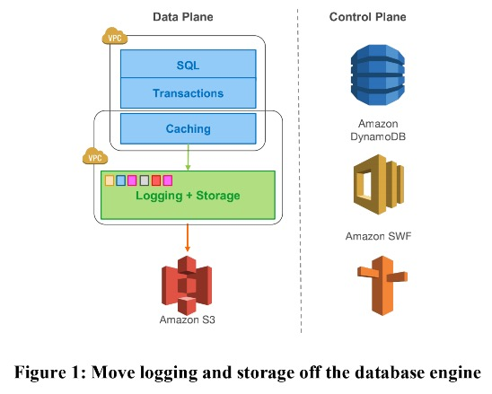

## Introduction

IT workloads正在逐渐向公有云上迁移，这种迁移的重要原因在于能够按需提供灵活容量的能力。在当前的分布式云服务中，弹性和扩展性是由存储和计算层分离来实现的。

传统数据库当前面临的IO瓶颈已经发生了变化，因为IO可以分布在多个节点和多个磁盘上，因此单个的磁盘和节点不再过热，***当前的瓶颈变为了存储和计算层之间的IO***。除了基本的每秒包数(PPS)和带宽瓶颈之外，由于性能，数据库将并行地向存储系统发出写操作，这将导致流量放大的问题。离群存储节点、磁盘或网络路径的性能可能会影响响应时间。

尽管很多数据库操作可以互相重叠，但是很多视乎我们需要同步操作，这将导致stall和上下文切换。例如，当缓存未命中所导致的磁盘读取操作，当读取完成之前，该读取线程无法继续执行。cache miss同样会导致其他penalty，例如cache evict和flush dirty page，以安置new page。background processing例如checkpointing和dirty page writing可以减轻这种penalty的发生，但是同样会导致stall，context switch和resource contention。

事务提交是另一个干扰源，提交一个事务时的暂停可能会阻碍其他事务的进展。在cloud-scale的分布式系统中，使用多阶段同步协议(如两阶段提交2PC)处理提交是一个挑战。这些协议不能容忍故障，而大规模分布式系统有持续不断的硬故障和软故障。同时它们还具有高延迟的问题，因为大规模系统分布在多个数据中心。

在这篇paper中，我们提出了Aurora，一个通过在分布式云环境利用redo log，而解决了上述问题的数据库服务。我们使用了一种新颖的面向服务的体系结构，并使用了一个多租户扩展存储服务，该服务抽象了一个虚拟化的分段redo log，并与数据库实例松散耦合。尽管每个实例依旧包括传统数据库内核的大部分组件（query processor, transactions, locking, buffer cache, access methods and undo management），很多功能（redo logging, durable storage, crash recovery, and backup/restore）都off-load到了存储层。

相较于传统的数据库服务，Aurora的架构有如下三个显著的优点：

1. 使用了一个独立的，能容忍错误并自我修复的跨数据中心storage服务，保证了database不受网络层或数据存储层问题的影响。

2. 在数据存储中，只写入redo log记录，可以从量级上减少网络IOPS。

3. 将耗时复杂的功能从一次昂贵的操作转变为连续的异步操作，保证这些操作不会影响前台处理

## Durability at Scale

据库系统必须满足数据一旦写入就可以读取的约定，然而并不是所有的系统都是这样。在本节中，我们将讨论quorum模型背后的基本原理，为什么要对存储进行分段，以及如何将这两种方法结合起来，不仅提供持久性、可用性和减少抖动，而且还帮助我们解决大规模存储的管理操作问题。

### Replication and Correlated Failures

instance生命周期与storage生命周期没有很好的相关性。实例失败、客户关闭了它们、根据负载调整它们的大小，这些原因有助于将存储层与计算层分离。这样做的话，这些存储节点和磁盘同样也可能出现故障。因此，它们必须以某种形式复制以提供故障恢复能力。在大规模的云环境中，将会持续的存在来自节点、磁盘和网络的backupgroup noise。每次失败可能有不同的持续时间和不同的爆炸半径。例如，一个节点可能暂时网络不可用，重新启动时临时停机，或者磁盘、节点、机架或主干网络交换机甚至数据中心的永久性故障。
