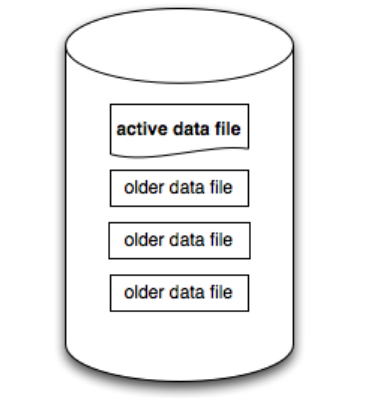
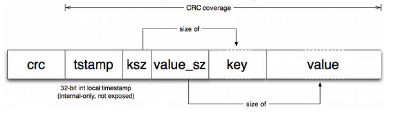
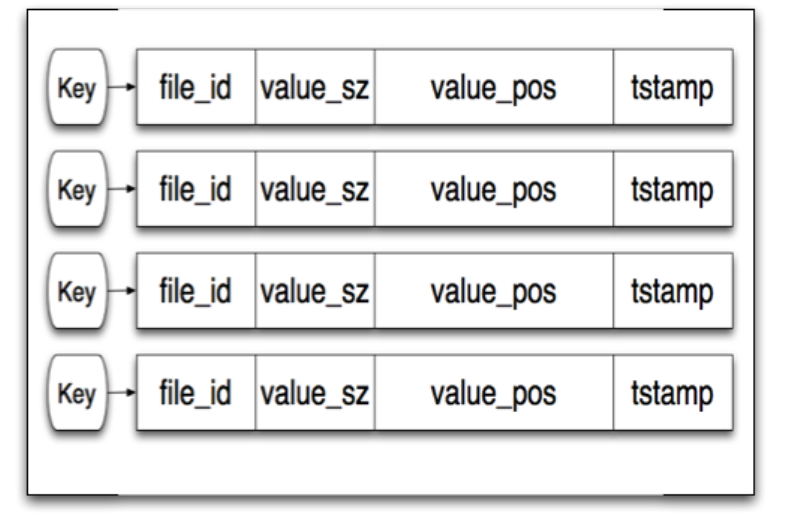
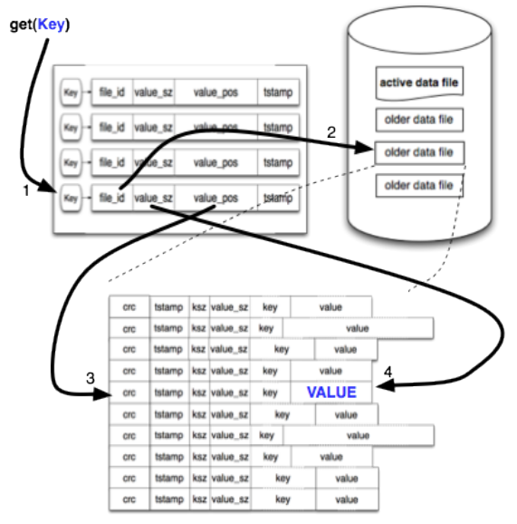
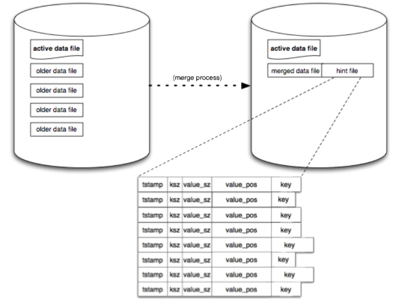

Bitcask的起源与Riak分布式数据库的历史密切相关。在Riak kv集群中，每一个节点使用可插拔式的本地存储引擎，几乎一切kv形式的存储引擎都可以被使用。

在设计BitCask时，有如下几个目标：

- 每个item读或写低延迟

- 高吞吐量，尤其是随机写入

- 有处理比RAM大得多的dataset的能力，并且不会降级

- 崩溃友好，可以快速恢复并且数据零丢失

- 易于备份和恢复

- 一份相对简单、易于理解的代码结构和数据格式

- 在高访问负载或大容量的情况下的行为可预测

- 允许在Riak中轻松默认使用的许可证

实现部分上述目标很简单，但是实现所有目标则很难。

对于上述所有目标，现存的KV引擎，没有一个是理想的。因此这促进了BitCask的开发。

BitCask的模型在概念上非常简单。Bitcask实例是一个目录，我们强制在给定时间只有一个操作系统进程（可以将该进程视为database server）会打开Bitcask进行写操作。在任何时候，该目录中只有一个文件是active状态的，供服务器写入。当该文件大小达到阈值时，它将被关闭，并创建一个新的active文件。一旦一个文件被关闭，无论是有意的还是由于服务器退出，它都被认为是不可变的，并且永远不会再打开进行写入。

active文件只通过追加方式写入，这意味着***顺序写入***，不需要磁盘查找。每个kv entry的格式很简单：

## 写入流程

1. 首先，将写入entry追加到active文件中。

需要注意的是，删除只是写了一个特殊的标记，其将在下一次合并的时候被移除掉。所以，Bitcask data file只不过是这些entry的线性序列。

2. 当追加active文件完成后，一个内存中叫做keydir的数据结构将会被更新。

当写操作发生时，keydir会被原子式的修改，将其修改为指向新的data地址。此时旧的数据不会被移除，仍然保留在磁盘上。但是此后的读取都只会读取最新的数据。最终这些旧的数据是通过compaction流程来给移除掉。

keydir是一个hash table，其将BitCask中的所有key映射到该key对应的数据结构中，该数据结构包括：该key所在的文件、文件偏移、以及写入的entry大小。具体如下图所示。

## 读取流程

读取操作最多只需要一次磁盘读取

1. 首先在keydir中查询该key，

2. 并根据第1步获取到的data file、文件偏移以及entry大小去读取文件。

在这里，由于操作系统中文件系统的read-ahead cache的存在，使得读取文件的操作比预期的会快一些。BitCask内部也讨论过添加一个BitCask-internal的读缓存，但是还不清楚这能带来多少回报

## compaction

上面降到，该模型会导致存在空间放大，因为每次写入都是追加一个新的entry，旧的却不删除。所以会有compaction流程来处理该问题。其扫描所有的non-active文件（这些文件是immutable的），并在扫描过程中产生两种文件：

1. 一些新的data file，在新的文件里，只会包含数据的最新版本。

2. 还在每个data file旁边创建一个hint file。它们本质上类似于数据文件，但与值不同的是，它们包含相应数据文件中值的位置和大小。

当compaction执行完后，这些扫描过的non-active文件就可以删除了。

***Note:*** hint file只在compaction过程中产生，因此对于写入流程创建的data file是没有hint file的

## 重启流程

1. 当一个Erlang进程打开一个Bitcask时，它会检查同一个VM中是否已经有另一个Erlang进程在使用那个Bitcask。如果是，它将与该进程共享keydir。

2. 如果不是，它将扫描目录中的所有data file以构建一个新的keydir。对于任何具有hint file的data file，将扫描该hint file（代替扫描data file）以获得更快的启动时间。

## 目标回顾

回顾一下文章最初制定的目标:

- 每个item读或写低延迟

Bitcask很快。我们计划很快进行更彻底的benchmark，但是在早期的测试中，其medium latency在亚毫秒级，我们有信心它能够满足我们的速度目标

- 高吞吐量，尤其是随机写入

在使用慢速磁盘的笔记本电脑上的早期测试中，我们看到每秒写5000-6000次。

- 有处理比RAM大得多的dataset的能力，并且不会降级

上面提到的测试在问题系统上使用了一个大于10倍RAM的数据集，并且上没有显示出行为改变的迹象。考虑到Bitcask的设计，这与我们的预期是一致的。

- 崩溃友好，可以快速恢复并且数据零丢失

因为Bitcask中的data file和commit log是一样的，所以恢复是很简单的，没有必要进行回放。hint file可以用来加快启动过程。

- 易于备份和恢复

由于切换后的文件都是immutable的，因此backup和restore是很简单的，只需要简单的将data file放置（拷贝出）到指定的位置

- 一份相对简单、易于理解的代码结构和数据格式

Bitcask概念简单，代码简洁，data file易于理解和管理。我们很乐意支持一个基于Bitcask的系统。

- 在高访问负载或大容量的情况下的行为可预测

在高访问负荷下，我们已经看到Bitcask做得很好。到目前为止，它的容量只有千亿字节，但我们很快会用更大的数据量来测试它。我们不期望BitCask在更大的容量下有太大的不同，这里有一个限制，就是keydir结构所占用的内存不能随着key的数量增长而变的很大，必须完全适合RAM。这种限制在实践中是很小的，因为即使有数百万个key，当前实现中，其使用的内存也低于GB。

## Summary

Log-Structured Hash Table v.s. B+-tree v.s. LSM-tree

1. Log-Structured Hash Table读最多只需要一次磁盘操作，不存在读放大，所以读比LSM-tree快（可能会读多层）。

2. Log-Structured Hash Table写只需要一次磁盘操作，但是是顺序写，所以写比B+-tree快（非顺序写），但是比LSM-tree慢（写入内存）

3. Log-Structured Hash Table由于keydir需要缓存所有key及其value所在的位置，当key过多时，相比LSM-tree与B+-tree需要占用的内存比较多

4. Log-Structured Hash Table与LSM-tree一样，存在空间放大情况。需要进行background compaction，而compaction又导致写放大。

5. Log-Structured Hash Table其实本质还是Hash，无法进行顺序扫描，而B+-tree和LSM-tree则有序数据总是相邻存储，可以进行顺序扫描。

## 开源实现

[豆瓣beansdb](https://github.com/douban/beansdb)

[Riak](https://github.com/basho/riak)

