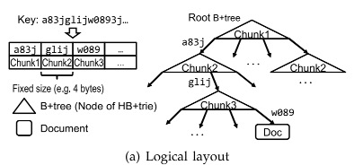

## Background

### B+-Tree和Prefix B+-Tree

B+-Tree有两种节点：leaf节点和index节点（non-leaf节点）。并且不像B-Tree和其他的二叉查找树，B+-Tree仅仅在leaf节点保存数据，index节点保存指向其child节点的指针。通常一个节点中会保存多于两个的key-value（或者key-pointer），保存的key-value或者key-pointer数量叫做fanout。通常fanout会配置成一个很大的值，这样使得某个节点可以装入一个（或者多个blocks）。fanout越大key-value平均磁盘访问数越少。

然而fanout是受到key长度影响的。为了减少这种开销而提出了Prefix B+-Tree。其主要思想是保存key中不同的部分、而非全部key，以提高fanout。在Prefix B+-Tree中，index节点保存可以区分不同child的key的最小前缀，而leaf节点则越过key之间的共同前缀，只保存不同部分。

下图所示为一个B+-Tree及其对应的Prefix B+-Tree:

***B+-Tree的优点：*** 减少IO的平均磁盘访问数量。

***B+-Tree的缺点：*** B+-Tree的随机磁盘访问可能会带来较低的性能。尤其当B+-Tree运行较长时间时，其节点将散列分布在磁盘上。

现代key-value数据库例如BerkeleyDB、Couchbase、InnoDB和MongoDB使用B+-Tree

### LSM-Tree

上面讲到B+-Tree由于随机磁盘访问可能会导致性能较低，但是其他树形结构可能也会有类似的问题，因为其不能像B+-Tree一样减少磁盘访问数量。然而我们却通过arrange磁盘写入模式的方式来提高写入性能。这就是LSM-Tree。

在LSM-Tree中，***不管是wal append还是compaction的merge操作，都是执行顺序写，因此其写入性能是比B+-Tree强的。然而，读取却可能需要遍历LSM-Tree的多层，所以其读性能是不如B+-Tree的。***

注意，当key长度变大时，每层所能存储的key的数量就会变少，因此compaction就会变的频繁。由于compaction会涉及大量的磁盘IO，整体的性能就会变低。

很多最新系统例如LevelDB、RocksDB、SQLite、Cassandra和BigTable使用LSM-Tree或者其变种

### Couchstore

Couchstore是Couchbase的存储引擎，其使用了B+-Tree的变种，其将B+-Tree改良成了一种append-only的形式。

Couchstore将key均分成了一定数量（该数量是由用户自定义的）的key ranges，每个key range称为一个vBucket，而每个vBucket拥有其自己的DB file。

DB file保存如下数据：

- 对应vBucket中的key-value，其中key是任意长度的字符串，value是一个json document

- B+-Tree。为了检索DB file中的json document，B+-Tree保存key及其对应的json document在DB file中的偏移。

前面讲到，Couchstore使用在DB file中追加的方式来实现update操作。下图是一个update操作的示例：

在图中，A, B, C代表B+-Tree节点，而D1, D2, D3代表json document。如果document D1更新了，new document D1'将会追加到DB file中，而非通过修改D1的方式实现。此时，由于document的位置发生了改变，node B将会修改为B'，当然也是通过追加的形式修改。类似的，修改会追加到root节点，即：A'也会追加到DB file中。

***优点：***相比传统B+-Tree update-in-place的实现方式，append-only B+-Tree可以实现较高的写入吞吐，因为写入是***顺序写***。同时，由于读取的方式与原始B+-Tree一样，所以在这里并没有丧失读性能。

***缺点：***相比传统B+-Tree update-in-place的实现方式，其***磁盘空间消耗会比较大***，因此需要周期的回收stale data占用的磁盘空间。

该回收是通过Compaction流程来实现的。当stale data大小超过一个配置的值时，该compaction将会被触发：

1. 所有有效的document将会移动到一个新的DB file中

2. 当compaction执行完时，旧的DB file将会被移除。

在compaction执行过程中，***所有的写入都会被block住，而读取则不用***。另外需要注意，在同一时间，一次只有一个DB file执行compaction操作。

当key长度变大时：

1. 与传统B+-Tree一样，当key长度变大时，树的高度将变大。

2. 情况比传统B+-Tree更糟的是，因为append-only的方式每次更新的写入数据与树的高度成正比（因为要写入node节点）。这将导致compaction会被触发的更加频繁，因此性能会变得更差。

另外，这种append-only的优化方式有助于实现MVCC。

### 总结

kv存储引擎的吞吐量和延迟受存储访问时间的限制，而该存储访问时间由两个因素决定：

- 每次kv操作所访问的block数量。其由索引结构和特征所决定的

尽管上述树型结构目前已经很成功了，***但是相较于固定长度key，当key长度可变时其表现的就很差了***。因为：

1. 当key长度变长时，如果node大小不变，那么fanout degree将会减少（fanout degree是指一个节点中的key-pointer对数量），因此对于维持相同的数据量，***树的高度则会变高***，树的高度变高IO数量则会增大

2. 如果想要保持相同fanout degree，那么node大小则会变大，因此***每个node所需要读取或者写入的磁盘block数量也会变多***。

由于平均磁盘访问数量和树的磁盘空间占用，直接受树的高度和节点大小的影响，因此随着key变长，其性能也跟着降级。

为了解决这个问题，BerkeleyDB和LevelDB使用了前缀压缩技术，然而，这很大程度上受到key模式的影响。如果key在key空间随机分布，那么key剩余的未压缩空间仍然很长，因此前缀压缩带来的收益很小。因此需要设计一种更有效的方法来索引变长key。

- 磁盘访问模式，其由数据是如何读取及写入引擎有关。

update-in-place提供随机写，损失写性能，因此不适合写密集型应用。因此，很多数据库使用append-only或者WAL来顺序写入磁盘block。这种设计可以达到很高的写吞吐，但是却要遭到compaction带来的开销。这种开销的大小与每个索引操作的平均访问block数和索引结构所占用的总体空间密切相关，因为在compaction过程中执行了许多合并操作。

针对这些问题，Couchbase团队提出了ForestDB，用于下一代Couchbase的KV存储引擎。为了以高效利用时间和空间的方式检索变长key，ForestDB使用了Hierarchical B+-Tree-based trie（HB+-trie）。为了实现高读取和写入吞吐，以及支持高并发访问，索引更新以append-only的形式写入存储设备中。这同样简化了on-disk结构，以实现MVCC。其吞吐显著高于LevelDB、RocksDB和Couchstore

## ForestDB

ForestDB是为了高效检索变长key而产生的，用来作为Couchstore的替代品。两者之间的架构是类似的，只是有如下两个不同：

1. ForestDB使用了HB+-trie，HB+-trie相比与传统的B+-Tree对变长key更加高效。

2. 通过使用log-structured write buffer，ForestDB具有更高的写入吞吐。log-structured write buffer的原理与LSM-Tree中的write buffer+WAL是类似的，但是并不需要LSM-Tree中write buffer向LSM-Tree的merge操作。

上图是ForestDB的整体架构图。类似Couchstore，每个vBucket对应一个ForestDB实例。每个ForestDB包含一个in-memory write buffer和一个HB+-trie。所有的document update追加在DB file末尾，并在write buffer记录document在磁盘上的位置。当write buffer中entry的数量超过某上线时，其将会被flush进HB+-trie并永久的存储在DB file中。

另外，和Couchstore一样，在ForestDB中会有一个compaction流程，当stale data size超过上限时，其将被触发，所有有效数据将通过compaction迁移至新的DB file。

### HB+-Trie

上图展示了HB+-trie的逻辑布局。HB+-Trie内所有B+-Tree的leaf节点存储内容分为两种：

1. 其sub-tree的root节点

2. document数据

B+-tree节点和document都是以追加的形式写入DB file，因此这些DB file是互相交织的，并以MVCC形式维护。下图展示如何以MVCC形式在磁盘上存储node节点

HB+-Trie将key切割成固定大小的chunk（该chunk大小是可配置的），在检索一个key时，首先通过第一个chunk检索root B+-tree，我们将得到一个offset：

- 如果document存储在这个位置，那么搜索就完成了。

- 如果该位置存储的是sub-tree的root地址，将继续使用下一个chunk来检索该sub-tree

持续重复以上检索过程，直到找到目标document。

HB+-Trie有如下几个***优点***：

- 由于chunk大小是固定的，并且小于key长度，所以HB+-Trie中B+-tree的fanout比原始B+-tree大很多，因此每个B+-tree的高度都小很多。

论文中说对于变长key HB+-Trie性能很好，是因为HB+-Trie不单单对长key性能好：对于短key，通常只需要查询root B+-tree，性能较好。而对于长key，由于HB+-Trie中的fanout大，所以性能也会好。

- key之间的common branch代表共享的common前缀，这部分数据将被skip和压缩，无需重复保存。

***在HB+-trie中，只有至少两个branch穿过某tree时，才会为其创建一个sub-tree***。并且在HB+-trie中保存的数据将以能够与其他数据区分的、最少的chunk数量来索引（如图中root B+-tree中非指向sub-tree的另外几个指针，只需要一个chunk就可以检索到数据），这样可以避免后续chunk的检索，提高性能。

上图展示了向HB-trie插入数据的示例。有如下几个假设：

- chunk size是一个字节，即一个字符

- 每个三角代表HB+-trie中的一个sub B+-tree

- 每个B+-tree中的文字代表：1. 作用于该tree的chunk number；2. 被skip的共同前缀

(a)展示了初始状态。此时仅仅索引了一个key `aaaa`。尽管在`aaaa`中有4个chunk，该document仍然由第一个chunk `a`在root B+-tree树中索引，因为`aaaa`是由`a`为开头的唯一的key。我们可以确保当input key的第一个chunk是`a`时，与该input key对应的只有一个key，即`aaaa`。***因此对应于后续chunk的sub tree的检索可以避免***。

(b)展示了当`aaab`插入时HB+-trie的状态。此时一个新的sub B+-tree将会被创建，因为`aaab`同样由chunk a为开头。由于`aaaa`和`aaab`之间的最长common prefix是`aaa`，所以新sub-tree使用第四个chunk来检索他们，并在tree中存储`aa`，该`aa`是作为parent tree（即root B+-tree）和sub tree（即新创建的tree）之间的skipped prefix。

(c)展示了当`aabb`插入时HB+-trie的状态。尽管`aabb`以chunk `a`开头，但是其却不能与skipped prefix `aa`匹配，因此一个新的sub tree在root和现存的sub tree之间产生。新的sub tree使用第三个chunk来作为检索，因为`aabb`和其他现在的common prefix `aaa`之间的的common prefix是`aa`。而skipped prefix `a`则存储在新sub tree中，而现存的sub tree中保存的skipped prefix则被清楚掉，因为在这两者之间已经没有skipped prefix了。

这个例子中可以看到，***当common prefix足够长时，HB+-trie是很有利的。***

***另外，当key的分布很均匀、不存在common prefix，其仍然很有利***。上图展示了chunk size是2字节时均匀分布的例子。由于key之间没有共同前缀，因此每个key都可以通过第一个chunk来检索。因此，该HB+-trie仅仅只有一个sub B+-tree。

假设chunk大小是n bit，并且key是随机均匀分布的，那么将有高达2n个key（n bit，每个bit是0或者1，所以有2n个不同值）可以在root B+-tree中检索，相比于传统的B+-tree，这将很大程度上减少该index structure所带来的空间占用（基本差一个数量级）。这种优势主要来自于，HB+-trie是由第一个chunk来检索，而传统B+-tree则需要整个key来进行检索。

***总结：***在以下两个场景中，HB+-trie可以高效减少多余tree tranversal所带来的磁盘访问次数:

1. common prefix足够长

2. 他们的分布是随机的、均匀的，因此没有common prefix

### 避免倾斜

由于trie是非平衡结构，所以在一些特定情况下，HB+-trie是有可能产生倾斜的。下图展示了chunk size是一字节时两种倾斜的例子：

(a)中展示的是一个chunk不断重复的例子：b, bb, bbb。随着倾斜的分支变大，磁盘访问的数量也增加了。

(b)中展示的是0/1的双字符排列，即每个chunk只有两种选择：0和1。其fanout远远小于传统B+-tree。并且像图中第二层很多B+-tree都是空的（不指向document数据），所以不论是空间消耗还是磁盘访问，其都不及传统B+-tree

对于上述两个场景，B+-Tree是不会有性能问题的。因此为了解决倾斜的问题，文章里提出了一种优化。该优化结合二者的优点，即对于该情况中的sub tree使用传统B+-tree

定义***leaf B+-tree***：一个B+-tree没有sub-tree，并且其不是root B+-tree。leaf B+-tree与其他B+-tree的不同在于，其对应的chunk大小是可变的（其他的B+-tree的chunk大小都是固定的）。并且leaf B+-tree对应的chunk是其parent B+-tree对应chunk的剩余后缀。

同时将key space分成两类：

1. ***skew region***：由leaf B+-tree索引的key，该部分使用normal B+-tree来索引

2. ***normal region***：除skew region之外的所有key，该部分使用定长chunk B+-tree来索引

上图展示了leaf B+-tree的组织架构。在图中最左边的leaf B+-tree分别使用`aaa`, `aabc`, `abb`索引了`aaaa`, `aaabc`和`aabb`。这样即使我们插入了一个会导致倾斜的key pattern，也不会导致额外的sub-tree创建，因此多余的tree遍历得以避免。

#### Leaf B+-Tree Extension

由于leaf B+-tree继承了B+-tree的一切缺点，所以需要当其容纳的key数量超过一个给定的上限时，对其进行扩展：

1. 首先，计算写入到目标B+-tree中key最长公共前缀

2. 一个新的non-leaf B+-tree将会被创建，使用第一个不同的chunk对这些document重新索引

3. 如果有超过1个的key共享相同的chunk，然后将会使用上一步中所使用的chunk之后的sub string来创建一个新的B+-tree

下图所示为，从上图的状态插入一个`aabb`之后，由于达到了extension threhold而触发extension之后的场景：

其执行流程如下：

1. `aaaa`, `aaabc`和`aabb`之间的最大公共前缀是`aa`

2. 一个新的non-leaf B+-tree被创建，其使用第三个chunk `b`来索引`aabb`

3. 然而`aaaa`和`aaabc`还共享第三个chunk `a`，因此使用该chunk之后的sub string（`a`和`bc`）来创建一个新的leaf B+-tree

由于native HB+-tree在产生倾斜时会非常低效，因此我们需要仔细设置该extension threshold，以避免倾斜的key pattern包含在normal regiona。

通过推算，得到以下公式：

1. n > b * fL

2. b >= fL

当两者都满足时，则对leaf B+-tree进行extension。其中：

- n代表document数量

- b代表对于给定key pattern的，对应每个chunk的唯一分支数量。

- fL代表leaf B+-tree的节点fanout

### Log-Structured Write Buffer

尽管HB+-trie可以减少树的高度以及空间消耗，但是每次写入操作都会导致多个B+-tree节点写入DB file。为了减少每次写入操作所需要append的数据，ForestDB采用了log-structured write buffer。其于LSM-tree中的write buffer和WAL类似，***但是却不需要与main DB进行merge***。

在上图中：

- 白色的Docs：代表存储documents的一系列连续blocks

- 浅灰色的Index nodes：代表构成HB+-trie的所有B+-tree节点

- 深灰色的H：当一个commit操作发生时，一个包含DB header的单独block追加在文件尾部，即H

***当更新操作发生时：***

1. 更新的document追加在文件的末尾（对于HB+-trie的更新则推后）

2. 更新内存中的write buffer index（WB index)。该WB index索引所有的在DB file中、却没在HB+-trie索引的document

***当读操作发生时：***

1. 首先在write buffer index中查询该key

2. 如果在上一步没有找到，则去HB+-trie中查找

***write buffer index刷新时机：***

1. 当commit操作发生时

2. commit的log数量超过某阈值（例如1024个documents）

当两者同时满足时，write buffer index则被刷新，并原子的映射到HB+-trie中。***在刷新时：***

- index nodes仅仅需要追加到DB file尾部

- 如前面所述，当刷新(flush)发生时documents本身不需要移动或合并，只需要通过更新的索引节点链接，因为ForestDB已经使用了一个log-structured结构，这大大降低了刷新写缓冲区所需的总成本。例如：当commit时，block H会被写入，此时便可以找到HB+-trie的root节点，然后根据Index nodes就可以构建整个HB+-trie，而刷新的整个过程并没有执行任何的merge操作，只是将WB index追加到DB file里

如果flush发生之前，机器宕机了（此时WB index由于在内存中，已经丢失），***构建WB index的步骤：***

1. 从DB文件的末尾开始反向扫描每个block，直到遇到恰好在index nodes之后的第一个DB Header（即H）

2. 使用该H之后写入的所有document来重建WB index

此外，对每个document都维护有一个32位的CRC，用以检测document是否损坏，仅仅有效的才会用于重建。

通过使用log-structured write buffer，许多index更新会被批量处理，以便大大减少每次document更新所导致的磁盘I/O数。这使得ForestDB的写性能与基于lsm-tree的存储引擎基本相当，甚至更好。

## 总结

ForestDB采用了HB+-trie，其针对变长key比其他树形结构（key越长性能越差）有更高的性能。但是range scan性能稍差，因为数据是以append形式追加的，这导致逻辑上相邻的数据在物理上并不相邻。不过compaction操作会使得逻辑相邻的数据相邻的存储在新的文件中，因此在compaction操作之后的range scan性能还是很高的。

