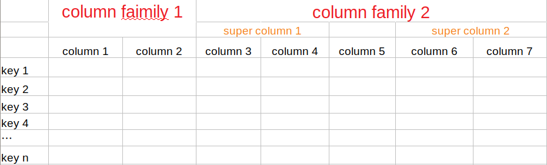

之前抽时间研究了下当前比较火热的两款表格存储，BigTable和Cassandra。这篇文章主要对两者做一个对比概括。

## Architecture

Bigtable是中心化架构，其有一个特殊的角色Master。该Master通过向Chubby抢锁的方式来实现，Master负责很多工作，例如：负载均衡、为tablet server分配tablets等等。

而Cassandra是中心化架构，集群中的所有server都是相同的角色，这样的架构更简单、便于管理。

另外，Bigtable是shared-disk架构，其所有的true data都存储在GFS上。而Cassandra是shared-nothing架构，数据存储在本地。shared-disk架构更具有扩展性，不会收到本地磁盘空间的限制。

## Data Model

Cassandra的数据模型如下图所示：

Cassandra有两种column family，分别是Simple column family和Super column family。其中Super column family可被视为在一个column family之中的column family。column family中的任一column都需要通过column_family:column的形式来访问。在一个super column family中的列需要通过column_family:super_column:column的形式来访问。

bigtable数据模型：(row:string, column:string,time:int64)->string

其中，column命名语法为：{列族：限定词}。同时bigtable支持时间戳，可以用时间戳来索引同一数据的不同版本。

同Cassandra一样，BigTable对于单行数据的读写是原子的。

## Partition

Cassandra采用的是一致性hash搭配负载分析的做法，其中负载分析主要用于解决一致性hash可能带来的负载不均的情况。而BigTable采用的是数据范围分片，起初系统只有一个tablet，当tablet足够大时则进行分裂。

由此可以看出，Cassandra能够更好的解决热点问题，而BigTable对于范围查询则更加友好。

## Replication

在Cassandra中，并没有使用一致性协议来进行replication，其将数据复制到N个节点上，并当发生故障或者网络分区的时候，通过放宽quorum的方式来提供持久化保证，所以Cassandra是一个最终一致性的系统。

同样，在Bigtable中也没有实现一致性协议。其WAL和数据全部存储在GFS上，通过GFS来保证强一致性。并通过Chubby保证对于一个tablet，同一时间只有一个tablet server作为primary。

## MemberShip

Cassandra由于是非中心化架构，其利用一种反熵的Gossip协议在对等成员间判断某个节点是否下线，该Gossip协议其相对于简单的PING-PONG式的Gossip协议，准确性更高。

Bigtable由于是中心化架构，其通过Master向Chubby查询tablet server对应的文件是否存在，以及与tablet server通信来判断该tablet server是否下线。

## 对外部组件的依赖

Bigtable依赖了Chubby，通过Chubby来选出Master，以及判断一个tablet server是否存活。而数据文件依赖于GFS，并通过GFS来保证强一致性。

Cassandra在Rack Aware模式和Datacenter Aware下需要依赖于ZK，ZK主要用于选举出一个leader，而该leader告诉所有的tablet server，每个tablet副本分别在哪个tablet server上。而在Rack Unaware模式下，则不需要依赖ZK，tablet副本存储在coordinator及其环上后续的N-1个tablet server上（如果复制N份的话）

## 参考文档

[Cassandra](https://levy5307.github.io/blog/Cassandra/)

[Bigtable](https://levy5307.github.io/blog/bigtable/)

