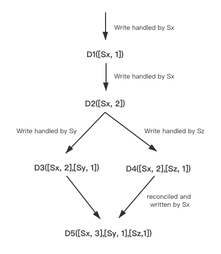

之前专门花时间调研过各种[强一致性的分布式协议](https://levy5307.github.io/blog/consensus-protocol-summary/)，却并未对弱一致性进行过深入研究，然而前段时间学习论文时候发现，其实很多存储系统还是采用的弱一致性，以获取较高的性能或者可用性。所以这里决定研究一下弱一致性。

## Dynamo

Dynamo是由Amazon开发的一款分布式KV存储，其设计目标是：

- 高可用性

为了提高可用性，Dynamo放弃了强一致性，采用最终一致性模型。当然最终一致可能会带来冲突的问题

- 永远可写

因为Amazon有很多购物场景，对于像“加入购物车”这种行为，Amazon肯定希望永远执行成功，因此其需要底层存储系统永远可写。

另外前面讲到，最终一致模型可能会带来冲突问题，所以何时解决冲突是需要考虑的一个问题。这里有两个选择：写时解决和读时解决。写时解决大部分系统所采取的方案，在这种方案中，读流程是比较简单。不过在这种系统中，如果写入不能到达全部或者大部分副本，写入将会被拒绝（如果只写入一个节点，冲突永远不会被发现）由于Dynamo需要保证永远可写，因此冲突解决是由读来完成的。

另外，为了保证永远可写，Dynamo还采用了[Hinted Handoff](https://levy5307.github.io/blog/Dynamo/#handling-failures-hinted-handoff)等处理方法。

### 仲裁模型

在Dynamo中，每个数据都会复制到集群中的N个节点上（N是可配置的），其仲裁模型为：R + W > N。其中，

- R代表允许执行一次读操作所需成功参与的最少节点数量

- W代表允许执行一次写操作所需成功参与的最少节点数量

该模型中，读和写所到达的节点肯定会有交集，因此大部分场景下读都会获取到最新的数据。

但是这是否代表着其是强一致模型呢？答案当然是否定的。因为W有可能远小于N/2，只有写入到达大多数节点时，才有可能是强一致模型。（例如W=1, N=3，由于每次只要写入一个节点就算写入有效，当发生脑裂时仍然可以写入，强一致性就被破坏了）

那是否设置W > N / 2就一定可以满足强一致性呢？答案也是否定的。因为Dynamo为了实现高可用性，允许在某些节点故障时加入一些新的节点来服务。因此有可能所有写入的副本都宕机了，选取一些新的节点来进行服务（例如前面所讲的Hinted off），强一致性仍然得不到满足。

那是否不加入新的服务节点就可以满足强一致性呢？答案当然也是否定的。因为当W > N / 2时，可能只有一个节点拥有ture data。当该节点挂掉的时候，如果没有合理的同步机制，其他节点也是无法获取全部数据的，此时仍然不满足强一致性。

然而实际Dynamo中是没有W > N / 2及不允许新服务节点加入这两个要求的。

### 冲突解决

前面讲到，对于弱一致性的系统是有可能出现冲突的。例如A节点将一个object设置为1，B节点将其设置为2，此时该object的值就产生了冲突，解决冲突的过程就是确定该object最终是什么值的过程。

对于冲突的解决有两个问题：

1. 什么时候解决冲突。对于这个问题，前面已经讲到了，为了达到永远可写的要求，冲突是由读来解决的。

2. 谁来解决冲突。这里可以选择客户端（即业务应用）或者Dynamo内部来解决。目前常用的方法如下：

- 为每个写入分配唯一ID。例如时间戳，这样便是保留最新写入

- 为每个副本分配一个唯一ID，通过指定的规则，例如，序列号号的副本写入有效

- 以某种方式将这些值合并在一起。例如，按字母顺序排序，然后拼接在一起

- 利用预定义好的格式来记录和保留冲突相关的所有信息，然后依靠应用层的逻辑，时候解决冲突。

前三种其实是存储服务内部解决，最后一种则交给应用层来处理。由于存储服务内部解决的方案比较单调，并且用户更理解其逻辑行为，可以选择更适合他们自己的解决方案。所以Dynamo采用了让应用来解决冲突的方案。

当然，冲突其实也分两种：

1. 大部分情况下，新版本的数据都包含老版本的数据，这种情况下，由Dynamo服务端来解决就可以了，也叫做syntactic reconciliation

2. 在发生故障或者并发更新的场景下，可能会发生版本分叉，从而导致冲突，这种情况下就需要应用来介入了，这叫做semantic reconciliation

为了区分冲突是syntactic reconciliation还是semantic reconciliation，Dynamo采用了vector clock。

- vector clock格式：[node, counter]

- 对于两个clock：clock1和clock2，如果clock1和clock2上所有node对应的counter，counter1都小于counter2，那么clock1就是clock2的祖先，可以通过syntactic reconciliation来解决冲突。否则就需要semantic reconciliation。

我们可以通过上图为例来展示vector clock是如何工作的。

1. 客户端写入一个新的对象（object）。节点Sx处理该写入，增加key的序列号，并用该序列号创建对象的vector clock。系统便有了一个对象D1和他的vector clock [Sx, 1]。

2. 同样的客户端更新该对象，假设同样的节点（即Sx）处理了该请求。系统便拥有了对象D2和它对应的vector clock是[Sx, 2]。由于D2是D1的后代，因此可以覆盖D1。然而，可能会有些副本还没有看到D2，而只有D1。

3. 假设还是同一个客户端，更新了该对象，并且一个不同的server Sy处理了该请求，系统中当前有了数据D3以及其对应的vector clock是[(Sx,2), (Sy,1)]。

4. 接着假设一个其他的客户端，读取到了D2并尝试更新它，并且另外一个节点Sz处理了该请求，当前系统中拥有了D4（继承自D2），它的vector clock是[(Sx,2), (Sz,1)]

此时版本就有了不同的分支。

- 当一个节点知道D1和D2，在它收到D4和它的vector clock后，可以断定D1和D2已经被新数据覆盖了，因此可以安全对D1和D2进行垃圾回收，这也就是syntatic reconciliatioin过程，不需要应用参与解决。

- 当一个节点只知道D3，那它收到D4后就看不出D3和D4之间的版本关系，即：D3和D4的各自改动并没有反应在对方之中，因此这两个版本应当被保留，此时需要由应用来解决semantic reconciliation。

现在，假设一些客户端把D3和D4都读到了（context显示在该read操作中，所有的value都被发现）。读操作返回的context综合了D3和D4的clock，即[(Sx, 2), (Sy, 1), (Sz, 1)]。如果应用执行semantic reconciliation，并且节点Sx执行该写入，Sx会更新自己在vector clock中的序列号。最终新生成的数据D5的vector clock格式如下：[(Sx, 3), (Sy, 1), (Sz, 1)]。***NOTE:*** 这里的行为是由应用来定义的（即最终写入[(Sx, 3), (Sy, 1), (Sz, 1)]），正如前面讲到semantic reconciliation是交给客户端（即业务应用）来处理。

## Redis

Redis相对来说其实就很简单了，它就是一个缓存系统，对于丢数据完全不care。这里介绍Redis主要是因为几年前曾花费很多精力专门研究了Redis。

Redis采用的也是弱一致性系统，主要原因是其采用了异步复制技术。如下图所示：

当写入master成功后，就返回给客户端写入成功。随后master再异步的将写入同步到slave中。这样可以获取更低的写入延时，但是损失的是强一致性。即当sentinel发现当前master失联之后，会选取一个slave做为新的master，此时没有同步到该slave的数据就丢失了。尽管选取新master的过程会尽量选取一个包含更多数据的slave，但是总归是和master之间有数据没同步完的，只是多少的问题。

## Reference

[Amazon Dynamo](https://levy5307.github.io/blog/Dynamo/)

Redis设计与实现

