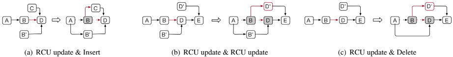

从阿里巴巴内部观察来看，50%~90%的请求只访问1%的数据。热点现象越来越严重，有如下几个原因：

1. 线上活跃用户数越来越多。一个实时时间（例如降价促销、爆炸性新闻）会在短时间内对少量数据带来大量的访问。

2. 应用所依赖的底层架构越来越复杂，一个小的bug有可能导致重复访问同一个数据。

当前有许多数据结构用于实现KV存储服务，例如：skip list、Masstree及hash。但是没有大多数的数据结构没有意识到热点，其对于热点的访问和其他数据一样，需要同样的访问次数，这会严重影响系统的性能。例如，Hash是KV存储中使用最多的场景，下图中有一个hash table，另外对每个hash entry都有一个collision chain。上面讲到hash是对热点无意识的，所以热点会散落在collision chain上，如果一个热点数据存放在链的最末尾，那么每次都热点数据的操作都需要很多次内存访问，从而降低整体性能。

针对这种情况，目前有两种方法：

1. CPU缓存。CPU缓存可以提高对热点数据的访问，然而CPU缓存量很小的，只能保存很少量的数据。

2. Rehash。通过扩大该hash的容量，并进行rehash来减少collision的长度。但是当该hash占据内存空间已经很大时，则不可以采用该方法了。

因此目前的解决方法都很局限，所以一种hotspot-aware的数据结构是很有必要的。当然，要实现它有几个挑战：

- Hotspot Shift

访问模式会随着时间不断变化，因此我们需要一种轻量级的方法来跟踪热度的变化。

针对这一点，该论文中避免了对collision chain的重排序，而是通过移动头指着的方式来实现。为了确保头指针移动后，桶中的所有项都是可访问的，其将collision chain替换为有序环结构，即HotRing

- Concurrent Access

每个热点都被大量并发请求访问。因此为了保持令人满意的性能，对读/写操作都支持高并发是至关重要的。

对于这一点，无锁结构是一个经典的解决方案，其避免了锁和同步操作带来的开销。HotRing对hotspot shift、头指针移动以及rehash都采用了无锁方案。

## HotRing设计

### Ordered-Ring Hash Index

上面已经讲到，HotRing将collision chain改造成了环状链表结构，其有如下几个特点：

- 不同于collision chain必须指向第一个item，环状链表结构可以指向环上的任意节点。这样可以通过将其指向hot item的方式来加速访问。

- 环上的item是有序的。

但是如果不加以控制，对环的遍历则可以是无穷无尽的。HotRing对目标元素查找结束的标志是（为了增加减少对字符串的比较，为每个item增加了一个tag，即orderi = (tagk, keyk)）：

- item存在：

orderi = orderk

- item不存在，需要满足下面任一条件：

orderi-1 < orderk < orderi 

或者

orderk < orderi < orderi-1

或者

orderi < orderi-1 < orderk

下图中分别对这几种情况进行了演示：

D(5, 68)代表命中

D(4, 35)符合条件orderi-1 < orderk < orderi 

D(1, 45)符合条件orderk < orderi < orderi-1

D(9, 10)符合条件orderi < orderi-1 < orderk

***通过这种设计，无需遍历链表中所有元素即可提前终止遍历，平均情况下查找数可以达到n/2 + 1***

### Hotspot Shift Identification

由于热点会平均分配到不同的Hash桶中，所以这篇paper主要考虑的是桶内热点的处理。由于Hash碰撞因此一般在5~10之间，如果热点率在10%~20%之间的话，那每个桶中平均约有1个热点。因此仅需要将头节点指向该热点就可以了。

为了评估热点发现算法的优劣，这里定义了两个metric：

- identification accuracy: 通过识别出的热点比例来衡量

- reaction delay: 一个热点产生至发现之间的时间。

HotRing设计了两种方案来实现热点发现，分别是:

- random movement。其reaction delay非常低，当然identification accuracy也偏低。

- statistical sampling。其reaction delay相对前者偏高，但是identification accuracy也更高。

#### Random Movement Strategy

random movement策略非常简单，其在每个线程内部维护一个thread-local变量，用于记录该线程执行了多少个用户请求。当R个请求执行完时，判断是否执行head pointer movement:

- 如果第R个请求访问的是hot item，则无需操作。

- 否则，将head pointer指向第R个请求访问的item。

如果R设置的过小，reaction delay将会比较小，但是会导致频繁的、低效的head pointer movement。HotSpot默认设置R为5，可以获取较低的reaction delay并且几乎不会带来性能影响。

有如下两个场景会导致random movement非常低效：

- 没有热点或者说热点不明显

- 有多于1个热点

这两个情况都会导致head pointer频繁的改变，降低性能。

#### Statistical Sampling Strategy

***Index Format***

由于现代计算机只需要48位作为地址，而CAS操作可以操作整个64位值，因此可以将该64位地址中的其余16位用于记录meta信息。

head pointer结构包括：

- Active(1-bit)：用于标记是否使用statistical sampling

- Total Counter: 记录了该冲突环上所有item的总访问次数

- Address: 热点item的地址

item结构中：

- Rehash标记是否在进行rehash

- Occupied用来保证并发的正确性

- Counter用于标记该item的访问次数

***Statistical Sampling***

hash table中有227 ~ 230个bucket，如果所有的环同时更新统计计数的话，将会导致性能下降。HotRing通过周期性采样来解决这个问题。

同random movement一样，每个线程维护一个thread-local的变量，用于记录处理的请求数量。每当R个请求完成时：

- 如果第R个请求访问的是hot item，则说明当前的hotspot identification仍然精准，无需重新采样。

- 否则，表明hotspot已经转移，需要开始重新采样。

同样，R也是设置为5。当Active位被设置时，接下来的请求都会被Total Counter和item中的Counter记录。该采样操作需要CAS操作，因此会导致效率降低。为了减少性能降低的时间，HotRing将采样的数量设置为该环中item的数量。

***Hotspot Adjustment***

前面讲到访问计数已经被统计到了，当采样执行完时，最后一个线程用于进行hotspot adjustment：

1. 首先，其通过CAS将Active位设置为false，这样可以保证仅仅只有一个线程可以执行下面的工作。

2. 计算每个item的访问频率。item k的访问频率是nk / N。其中，N是head节点中记录的总计数，nk是item k的访问计数

3. 计算每个item作为hot item的income。

4. 选取出具有最小income的节点作为hot item，通过CAS移动head pointer指向它。

5. reset所有的计数，准备下一次的采样

income的计算公式如下：

通过这种策略，不仅可以应对单hotspot，对多个hotspot也同样有效，它可以选取出最优的位置，而无需频繁在多个hotspot之间移动。

***Write-Intensive Hotspot with RCU***

由于当前计算机最大支持8字节的原子更新，因此对于小于8字节数据支持in-place更新。

假设要修改的是item k，因此，需要修改item k的前继节点的指针指向该新item。如果每次更新的都是写密集热点，那么需要遍历整个环，以找到其前继节点。这意味着，前继节点多了一次访问。因此这里将统计算法改为，增加前继节点的统计计数（而非修改节点的计数）。这使得对于写密集的hotspot，使head指针指向该hotspot的前继节点，使update操作更快。

#### Hotspot Inheritance

热点继承是指hot item更新或者删除时应该如何处理。如果环中只有一个item，那处理是很简单的，只需要修改或者删除它就可以了。如果环中有多个item：

1. 对于head item更新，那么更新后的head item会有更大的可能被访问到，因此将head pointer指向新的head item

2. 对于head item删除，则只需要将head pointer指向其下一个item。

### Concurrent Operations

***Read***

前面已经讲到过了，不需要额外的操作。

***Insertion***

插入操作需要创建一个新的item，并令前继节点的next指针指向该item。为了解决并发插入的问题，使用CAS操作，确保同时只有一个操作成功。如上图(a)的Insert部分

***Update***

Update操作分为两种：

- in-place-update operation

这种情况下就比较简单了，通过CAS操作可以确保不影响其他操作。

- RCU operation

这种情况下需要创建新的item，这样会有并发问题。如图(a)，insert和update虽然都执行成功了，但是有与B已经无法访问到，即使C插入成功了，也无法访问，这样肯定是有问题的。同样(b)中也存在同样的问题

为了解决这个问题，使用了item中Next Item Address中的Occupied位，将更新操作分为两步，以图(a)的Update & Insert为例：

1. 更新item B的Next Item Address的Occupied位，设置为已占用，那么item C的插入肯定失败、并在稍后重试

2. item A的Next Item Address设置为B'，并reset上面的Occupied位。此后item C的插入操作便可以执行了

***Deletion***

与上面情况类似，Deletion操作利用了被删除项的Occupied位，以图(c)的Update & Delete为例：

1. 更新item B的Next Item Address的Occupied位，设置为已占用，那么Item D的Update操作（即插入D'）肯定失败、并在稍后重试

2. item A的Next Item Address设置为D，并reset上面的Occupied位。此后item D的Update操作便可以执行了

***Head Pointer Movement***

同样是利用Occupied位，分三种情况：

1. identification strategy导致的head pointer movement

当head pointer指向一个新item时，需要设置该新item的Occupied位，以确保该item不会在head pointer move过程中被删除或更新

2. head item更新

这种情况下，head pointer指向new version head item。因此需要设置该new version item的Occupied，以防止其在head pointer move过程中被删除或更新

3. head item删除

不但需要设置head item的Occupied位，还需要设置其next item的Occupied位，因为如果不设置next item的Occupied位，有可能next item在这个过程中被删除，会导致head pointer指向一个invalid item

### Lock-free Rehash

传统的rehash策略是在load factor（即链的平均长度）达到某值时进行rehash，但是这样没有考虑到热点的情况，HotRing采用了access overhead（访问某item的平均内存访问次数），且是lock-free的。

首先需要说明，对于一个item的hash值，其前k位用作哈希表定位，后t位用作tag。

HotRing创建一个后台线程，这个线程会做一下工作：

- 新建一个原有哈希表2倍大小的新哈希表。并创建一个rehash node，其包含两个子rehash item，如上图中的(b)

由于哈希表扩大了2倍，就需要k+1位的哈希值，因此tag位则缩小为t-1位。即原有属于tag的1 bit给了哈希值。并且由于哈希表扩大了2倍，所以根据tag那1 bit将环切成了两个。通过这个关系，环状链表在扩容时可根据tag值一分为二：按[0, range/2)和[range/2, range)划分为两个新的环，对应新哈希表上两个slot。

- 将这两个rehash item insert入环中，它们作为tag范围和遍历的边界。如上图中的(c)

当insert完成后，新的哈希表就会生效。由于没有item复制和迁移，整个过程大部分操作都是通过无锁CAS操作完成的，开销比较低。

- 在确认所有的旧hash表访问结束后，先删除旧hash表，然后清理rehash node。如上图中的(d)

