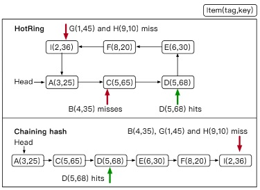

从阿里巴巴内部观察来看，50%~90%的请求只访问1%的数据。热点现象越来越严重，有如下几个原因：

1. 线上活跃用户数越来越多。一个实时时间（例如降价促销、爆炸性新闻）会在短时间内对少量数据带来大量的访问。

2. 应用所依赖的底层架构越来越复杂，一个小的bug有可能导致重复访问同一个数据。

当前有许多数据结构用于实现KV存储服务，例如：skip list、Masstree及hash。但是没有大多数的数据结构没有意识到热点，其对于热点的访问和其他数据一样，需要同样的访问次数，这会严重影响系统的性能。例如，Hash是KV存储中使用最多的场景，下图中有一个hash table，另外对每个hash entry都有一个collision chain。上面讲到hash是对热点无意识的，所以热点会散落在collision chain上，如果一个热点数据存放在链的最末尾，那么每次都热点数据的操作都需要很多次内存访问，从而降低整体性能。

针对这种情况，目前有两种方法：

1. CPU缓存。CPU缓存可以提高对热点数据的访问，然而CPU缓存量很小的，只能保存很少量的数据。

2. Rehash。通过扩大该hash的容量，并进行rehash来减少collision的长度。但是当该hash占据内存空间已经很大时，则不可以采用该方法了。

因此目前的解决方法都很局限，所以一种hotspot-aware的数据结构是很有必要的。当然，要实现它有几个挑战：

- Hotspot Shift

访问模式会随着时间不断变化，因此我们需要一种轻量级的方法来跟踪热度的变化。

针对这一点，该论文中避免了对collision chain的重排序，而是通过移动头指着的方式来实现。为了确保头指针移动后，桶中的所有项都是可访问的，其将collision chain替换为有序环结构，即HotRing

- Concurrent Access

每个热点都被大量并发请求访问。因此为了保持令人满意的性能，对读/写操作都支持高并发是至关重要的。

对于这一点，无锁结构是一个经典的解决方案，其避免了锁和同步操作带来的开销。HotRing对hotspot shift、头指针移动以及rehash都采用了无锁方案。

## HotRing设计

### Ordered-Ring Hash Index

上面已经讲到，HotRing将collision chain改造成了环状链表结构，其有如下几个特点：

- 不同于collision chain必须指向第一个item，环状链表结构可以指向环上的任意节点。这样可以通过将其指向hot item的方式来加速访问。

- 环上的item是有序的。

但是如果不加以控制，对环的遍历则可以是无穷无尽的。HotRing对目标元素查找结束的标志是（为了增加减少对字符串的比较，为每个item增加了一个tag，即orderi = (tagk, keyk)）：

- item存在：

orderi = orderk

- item不存在，需要满足下面任一条件：

orderi-1 < orderk < orderi 

或者

orderk < orderi < orderi-1

或者

orderi < orderi-1 < orderk

下图中分别对这几种情况进行了演示：

D(5, 68)代表命中

D(4, 35)符合条件orderi-1 < orderk < orderi 

D(1, 45)符合条件orderk < orderi < orderi-1

D(9, 10)符合条件orderi < orderi-1 < orderk

***通过这种设计，无需遍历链表中所有元素即可提前终止遍历，平均情况下查找数可以达到n/2 + 1***

### Hotspot Shift Identification

由于热点会平均分配到不同的Hash桶中，所以这篇paper主要考虑的是桶内热点的处理。由于Hash碰撞因此一般在5~10之间，如果热点率在10%~20%之间的话，那每个桶中平均约有1个热点。因此仅需要将头节点指向该热点就可以了。

为了评估热点发现算法的优劣，这里定义了两个metric：

- identification accuracy: 通过识别出的热点比例来衡量

- reaction delay: 一个热点产生至发现之间的时间。

HotRing设计了两种方案来实现热点发现，分别是:

- random movement。其reaction delay非常低，当然identification accuracy也偏低。

- statistical sampling。其reaction delay相对前者偏高，但是identification accuracy也更高。

## Random Movement

random movement策略非常简单，其在每个线程内部维护一个thread-local变量，用于记录该线程执行了多少个用户请求。当R个请求执行完时，判断是否执行head pointer movement:

- 如果第R个请求访问的是hot item，则无需操作。

- 否则，将head pointer指向第R个请求访问的item。

如果R设置的过小，reaction delay将会比较小，但是会导致频繁的、低效的head pointer movement。HotSpot默认设置R为5，可以获取较低的reaction delay并且几乎不会带来性能影响。

有如下两个场景会导致random movement非常低效：

- 没有热点或者说热点不明显

- 有多与1个热点

这两个情况都会导致head pointer频繁的改变，降低性能。

## Statistical Sampling

