用户自定义compaction策略，顾名思义，就是用户可以按照自己的逻辑，定义特定的compaction策略，用于更新或者删除部分数据。

开发这个功能的初衷是因为，我们在线上运维的过程中发现很多用户对数据没有设置合理的ttl，导致很多不需要的数据仍然持续存在。这会加大磁盘空间的占用，导致表越来越大、难以维护。

## 当前实现

如下图所示，该功能主要分如下两个部分：

- Compaction Rule，用于找到对应的数据，以对其执行相应的Compaction Operation。现在支持如下几种：

  - Hashkey Rule：支持Hashkey前、中、后缀匹配

  - Sortkey Rule：支持Sortkey前、中、后缀匹配

  - TTL Rule：支持TTL Range匹配以及匹配没有TTL的数据

- Compaction Operation，当所有的Compaction Rule都匹配成功时，执行该Compaction Operation。当前支持如下几种：

  - Delete：表示将匹配的数据删除

  - Update TTL：用于更新匹配数据的TTL。对于待更新的TTL，可以支持如下几种情况：

    - 基于时间戳更新，即待更新TTL = {value} 

    - 基于当前时间更新，即待更新TTL = current time + {value}

    - 基于old TTL，即待更新TTL = old TTL + {value}

其中value来自于Update TTL命令。

为了帮助理解，这里举一个示例：用户想要删除以"hash"为hashkey前缀，"sort"为sortkey后缀，且TTL大于30天的数据。

对于数据匹配方法，这里有三个：

- 以"hash"为hashkey前缀，需要使用Hashkey Prefix

- 以"sort"为sortkey后缀，需要使用Sortkey Postfix

- TTL大于30天，需要使用TTL Range

而由于用户是想要删除数据，所以需要采用的数据操作是Delete。

所以最终的compaction策略为：

- Compaction Rule: Hashkey Prefix + Sortkey Postfix + TTL Range

- Compaction Operation: Delete

## 后期扩展

考虑到上述Compaction Rule和Compaction Operation可能无法满足线上所有场景，所以该功能在设计之初就考虑到了扩展性，未来可以轻易的添加新的策略。

如下图所示，当需要添加New Rule或者New Operation时，只需要按照Compaction Rule和Compaction Operation接口实现相应的类即可，无需侵入式修改。

