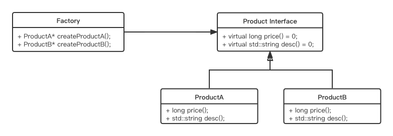
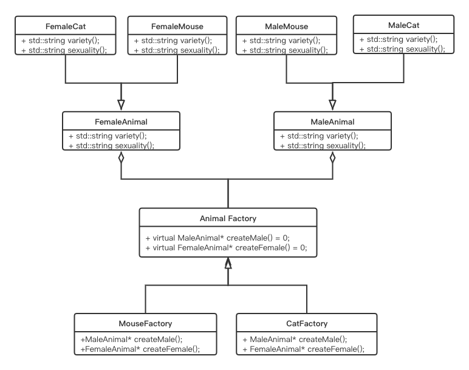
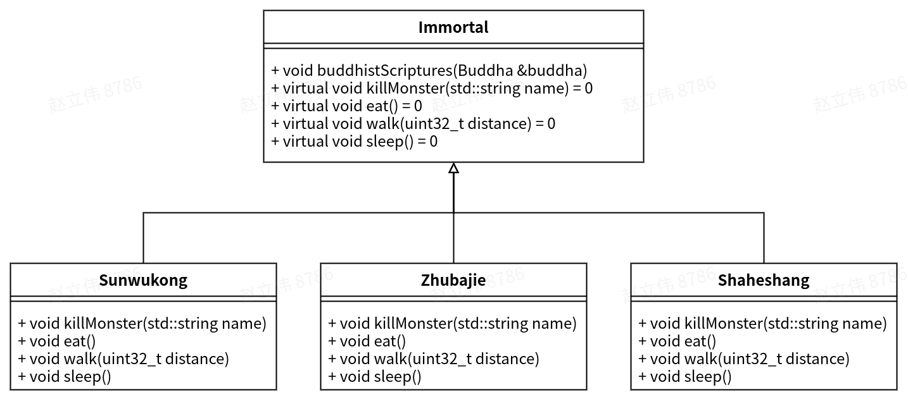
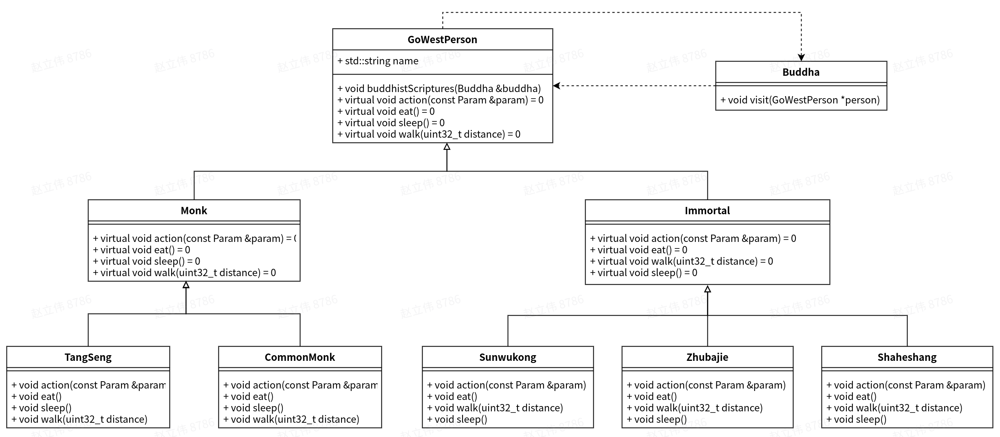
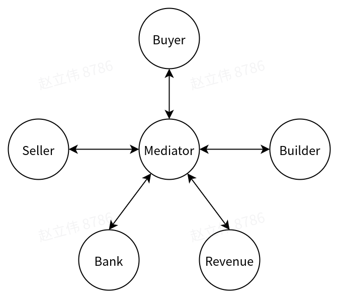
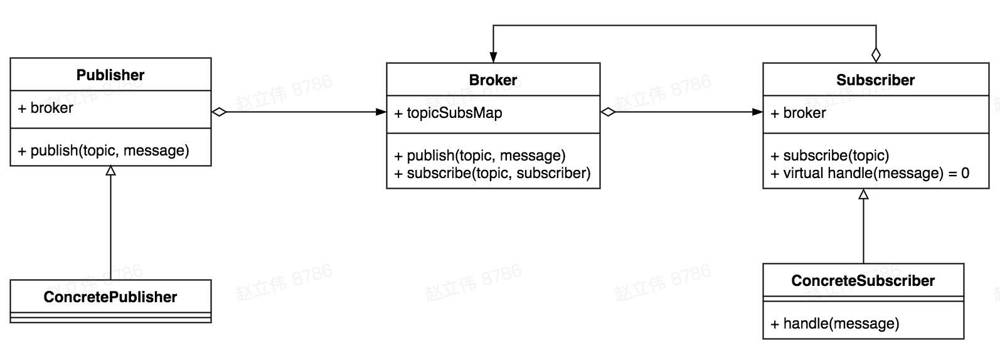

过去几年里做了很多重构相关的工作，所以一直想写一篇关于代码重构的文章。但是国内互联网公司环境下，重构工作其实是不太被老板们重视的。因为不管重构做不做，功能一直都是有的，重构本身并没有带来什么比较亮眼的功能点，反而容易带来bug（除非重构工作带来很多性能的提升，当然绝大多数重构工作并不会带来这种功效）。所以一度对于重构这一块是很灰心的，颇有种老顽童想要拼命忘记九阴真经的感觉，因此文章也一直放着没写。现在我想明白了，人嘛，更重要的是要为自己负责，所以看到不顺眼的代码还是会去改。而且代码重构本身是非常有意义的，比如之前Pegasus的load balance模块，那块真的是太乱了，如果不重构后面完全无法添加新的负载均衡策略。

所以下面主要针对本人的重构经验进行总结和反思。

## 设计模式

其实提到重构，不得不说的就是设计模式。之前有同事跟我讲：设计模式这个东西没什么用，因为很少有机会能够套用上这些所谓的模式。我个人认为，设计模式这个东西本来就不是用来生搬硬套的，学习设计模式更多的是学习其中的思想和精髓，就如同武侠小说中的武功心法。比如郭靖常年研习九阴真经里的内功心法，并融入到降龙十八掌里，使其刚中有柔，因此在大战金轮法王+蒙古三杰时能够愈战愈勇并逐渐占据上风。与乔峰在少室山中一味刚猛而无法久战相比，自然是高明的多了。我在工作中也经常遇到一个场景，即在重构某部分代码时，压根就没有想过去用什么设计模式。等设计完、画完类图之后才恍然大悟，原来早已在无形中用上了。

### 单例模式

单例模式是一个非常常用的设计模式，主要用于一个类只有一个对象的场景。它有两种实现方式：

- 饿汉式

懒汉式是指，对于该类的单例对象，不管日后是否使用，都事先创建一个对象，其代码如下：

```
class Singleton
{
public:
    static Singleton& instance()
    {
	return instance;
    }

private:
    Singleton() = default;
    Singleton(const singleton &) = delete;
    Singleton &operator=(const singleton &) = delete;

    private Singleton instance;
};
```

该方式的缺点在于，对于某个类，即使永远没有调用过`instance()`函数，该单例对象也早已创建完，造成资源的浪费。

其优点也很明显，即线程安全。

- 懒汉式

懒汉式是指，对于该类的单例对象，只有在获取的时候才去创建，其常见写法如下：

```
class Singleton
{
public:
    static Singleton *instance()
    {
	if (nullptr == instance) {
	   instance.reset(new Singleton());
	}
	return instance.get();
    }

private:
    Singleton() = default;
    Singleton(const singleton &) = delete;
    Singleton &operator=(const singleton &) = delete;

    private std::unique_ptr<Singleton> instance;
};
```

这样做的好处是，当某个类的`instance()`从没有调用过时，便可以不用创建该类的对象，减少不必要的资源浪费。其缺点也很明显，该方式不是线程安全的，原因在于instance()函数的`if (nullptr == instance)`这一行。

对于非线程安全这一点，可以通过以下几种方法来解决：

1. 加锁。对if语句进行加锁可以实现线程安全，但是这样对性能的开销很大

2. 利用"C++11中静态变量的初始化时线程安全的"这一条特性。具体实现代码如下：

```
class Singleton
{
public:
    static Singleton& instance()
    {
	static Singleton instance;
	return instance;
    }

private:
    Singleton() = default;
    Singleton(const singleton &) = delete;
    Singleton &operator=(const singleton &) = delete;
};
```

上述实现集合了不浪费资源、又线程安全两大优点。

另外，仔细看上面的代码，不管是懒汉式还是饿汉式，都使构造函数对外不可见。这是为了防止有代码直接`new Singleton`，从而破坏了一个类只有一个对象的约定。

### 工厂模式

工厂模式也是普遍采用的一种设计模式，其优点主要有如下几个：

- 解耦。假如class A要获取Class B的各种不同子类的对象，只需要通过传参给工厂，工厂根据参数返回具体的子类对象，并使用Class B类型指针返回。此时Class A无需知道Class B的子类情况，达到了屏蔽的效果。

- 降低代码重复。如果创建对象的过程很复杂，需要大量的代码，那么将创建对象的过程封装到工厂中，可以显著减少重复代码。

#### 简单工厂

最常用、也最简单的工厂模式就是简单工厂模式，其类图如下所示：


上图中的Product只有一种，因此类图很简单。当Product有多种，且是固定数量时，同样也可以使用简单工厂模式。只不过是Factory类针对不同的产品，提供不同的接口。



那么当Product数量不固定时，简单工厂还能满足需求吗？

答案是否定的。因为由于Product数量不固定，所以每当增加一个Product时，都需要侵入式修改Factory代码（不符合开闭原则），非常不优雅。

#### 工厂方法模式

对于Product数量不固定的这种情况，需要使用工厂方法模式。其思路也很简单，就是避免侵入式修改（符合开闭原则）。那么避免侵入式修改的最简单的方法就是，通过增加工厂子类来应对增加的Product。其类图如下：


如图中所示，Factory是一个接口类，其有不同的子类，每个子类对应一个具体的Product。当增加Product时，只需要增加Factory的子类即可。

#### 抽象工厂模式

有时产品会有两个维度，例如猫狗老鼠、公和母。此时使用简单工厂模式和工厂方法模式都不能满足需求，此时就需要使用抽象工厂模式了。

其原理在于，对于产品的两个维度，首先区分出哪个容易变化、哪个不容易变化。如前面举得例子，公和母是不会发生改变的，自然界中只有这么两种可能。然而动物种类则是可能发生变化的，最开始系统中只有猫狗和老鼠，后面可能会增加兔子、鸵鸟等等。

其次，对于选取出的不易变化变化的维度，采用简单工厂中的方法，即增加创建函数的方法；而对于容易发生变化的维度，前面讲过，如果采用增加创建函数的方法的话，很容易带来侵入式修改，因此需要采用工厂方法中的方式，即增加子类的方式。

具体类图如下：



### Builder模式

Builder模式也是一种创建型设计模式，其主要应用场景有如下两个：

- 类的构造函数参数特别多，其中一部分是必要的，另外还有很多参数是可选的。这样会导致需要创建很多个构造函数。例如：

```
class Example {
public:
    Example(int a);
    Example(int a, int optional1);
    Example(int a, std::string& optional2);
    Example(int a, int optional1, std::string& optional2);

private:
    int a;
    int optional1;
    std::string optional2;
};
```

在上面的例子中，有1个必要参数，2个可选参数，导致构造函数需要创建4个。如果参数数量再增多的话，其复杂程度可想而知。因此需要采用Builder模式，其大概实现如下：

```
class Example {
public:
    Example(int a, int optional1, std::string& optional2);

    class Builder {
    public:
        Builder(int a);

        Builder& setOptional1(int optional1);
        Builder& setOptional2(std::string optional2);
        Example* build() {
            return Example(a, optional1, optional2);
        }

    private:
        int a;
        int optional1;
        std::string optional2;
    };

private:
    int a;
    int optional1;
    std::string optional2;
};
```

这里有很多同学会问，就只使用必选参数来实现一个构造函数`Example(int a)`，其他使用set函数来实现不可以吗？

当然是不可以的，这里有两个原因：

1. 这些参数有可能是const类型的，不支持set函数

2. 即使支持set函数，当调用完`new Example(int a)`之后，会获取一个“半成品” 对象。这样需要用户代码逻辑来保证不会错误的使用这种“半成品”对象，导致系统不够健壮的。

- 对象的创建需要对给出的参数进行合法性检查，当检查失败时不进行创建。 

这种情况可以参考本人之前做[Pegasus load balance重构时的实现](https://github.com/XiaoMi/rdsn/pull/908/files?diff=unified&w=0#diff-c013463d4991b89fb5d5328eb8894552e0c655d1973fa800a0bb2a5e9d347c0aR98)

其大致代码如下：

```
std::unique_ptr<ford_fulkerson> build()
{
    // do some caculate
    ...

    if (0 == higher_count && 0 == lower_count) {
        return nullptr;
    }
    return dsn::make_unique<ford_fulkerson>(higher_count, lower_count);
}
```

如上所示，在`build()`函数中对一些参数进行了校验，当校验失败时不进行创建。而这些校验无法在构造函数中进行。很显然，在这种情况下使用set函数也是很不合理的，因为这会导致一些本不应该创建的对象，作为“半成品”被创建出来。

### 原型模式

最近在读西游记，里面有一个片段让人印象深刻：

> 拔一把毫毛，丢在口中嚼碎，望空中喷去，叫一声“变”，即变做三二百个小猴，周围攒簇。

原型模式就有类似的功效，即克隆复制。下面为代码示例：

```
class Monkey {
public:
    Monkey(uint32_t height, uint32_t weight) {
        this->height = height;
        this->weight = weight;
    }
    Monkey(const Monkey& monkey) {
        this->height = monkey.height;
        this->weight = monkey.weight;
    }

    Monkey* clone() {
        return new Monkey(*this);
    }

private:
    uint32_t height;
    uint32_t weight;
};
```

通过调用`monkey->clone()`，即可复制出与monkey一模一样的小猴子:

```
void doBussiness(Monkey *monkey) {
    auto monkey1 = new Monkey(180, 80);
    auto monkey2 = monkey1->clone();
    auto monkey3 = monkey1->clone();
}
```

可能有人会问，直接用new创建不行吗？比如下面这样：

```
void doBussiness(Monkey *monkey) {
    auto monkey1 = new Monkey(180, 80);
    auto monkey2 = new Monkey(180, 80);
    auto monkey3 = new Monkey(180, 80);
}
```

这样当然是不好的，因为有大量的重复代码，重复代码往往意味着bad smell，因为一旦修改，就要修改很多处地方，非常不优雅。

另外clone函数最终调用的也是拷贝构造函数，那直接使用拷贝构造函数不可以吗？

当然是不可以的。有两个原因：

1. 因为clone函数可以实现多态，而拷贝构造函数不可以。使用多态可以自动识别出其具体类型，调用实际子类的clone函数 

2. 使用拷贝构造函数需要知道具体类的类型，这样会带来耦合（不符合开闭原则）。比如Monkey有多个子类，需要知道其具体是属于哪个子类，然后去调用其拷贝构造函数，带来了耦合性。

举个例子：

猴子其实是一个大类，具体可以分为猕猴、金丝猴等等。

```
class Monkey {
public:
    Monkey(uint32_t height, uint32_t weight) {
        this->height = height;
        this->weight = weight;
    }
    Monkey(const Monkey& monkey) {
        this->height = monkey.height;
        this->weight = monkey.weight;
    }
    virtual ~Monkey() = 0;

    virtual std::unique_ptr<Monkey> clone() = 0;

protected:
    uint32_t height;
    uint32_t weight;
};
```

猕猴有一个特性，即有些猕猴是没有尾巴的，所以其多一个参数`hasTail`

```
class Macaque : public Monkey {
public:
    Macaque(uint32_t height, uint32_t weight, bool hasTail)
    : Monkey(height, weight) {
        this->hasTail = hasTail;
    }
    Macaque(const Macaque& monkey) : Monkey(monkey) {
        this->hasTail = monkey.hasTail;
    }

    std::unique_ptr<Monkey> clone() {
	return std::make_unique<Macaque>(*this);
    }

private:
    bool hasTail;
};
```

而金丝猴在某些公司特指比较重要的员工，一般都是领导层，所以有一个参数`officialRank`

```
class GoldenMonkey : public Monkey {
public:
    GoldenMonkey(uint32_t height, uint32_t weight, uint16_t officalRank)
    : Monkey(height, weight) {
        this->officalRank = officalRank;
    }
    GoldenMonkey(const GoldenMonkey& monkey) : Monkey(monkey) {
        this->officalRank = monkey.officalRank;
    }

    std::unique_ptr<Monkey> clone() {
	return std::make_unique<GoldenMonkey>(*this);
    }

private:
    uint16_t officalRank;
};
```

当我们使用拷贝构造函数进行复制时： 

```
void doBussiness(Monkey *monkey) { 		// monkey实际是猕猴 
    // How to copy? 
    // 1. 根本不知道monkey的类型，不知道该调GoldenMonkey拷贝构造函数还是Macaque的拷贝构造函数。
    // 2. 即使知道是猕猴，也会带来对Macque的耦合
}
```

而使用clone函数就比较简单了，它支持多态，可以自动根据实际类型来调用具体子类的clone函数，并且完全不会带来耦合（符合开闭原则）： 

```
void doBussiness(Monkey *monkey) {
    auto monkey1 = monkey->clone();
    auto monkey2 = monkey->clone();
    auto monkey3 = monkey->clone();
}
```

### 享元模式

享元，故名思议，就是分享元数据的意思。在讲享元模式前，还是先举一个西游记中的例子：

> 玉帝大恼，即差四大天王，协同李天王并哪吒太子，点二十八宿、九曜星官、十二元辰、五方揭谛、四值功曹、东西星斗、南北二神、五岳四渎、普天星相，共十万天兵，布一十八架天罗地网，下界去花果山围困，定捉获那厮处治

这里的十万天兵天将，不是先从老百姓中征兵、训练，然后再出征，等出征完后各回各家各找各妈，因为这样效率实在太低了。而是事先准备好的军队，等用的时候直接从军队中调遣。正所谓养兵千日用兵一时。

这就是享元模式的基本思想。下面看一下具体的代码示例：

```
class Solider {
public:
    Solider(std::string name, std::string desc) {
        this->name = name;
        this->desc = desc;
    }
    virtual ~Solider() = 0;

    virtual void fight() = 0;
    const std::string& getName() const {
        return this->name;
    }

private:
    std::string name;
    std::string desc;
};

// 天王
class HeavenlyKing : public Solider {
public:
    HeavenlyKing(std::string name, std::string desc) : Solider(name, desc) {}

    void fight() {
        // 天王战斗逻辑
    }
};

// 哪吒
class Nezha : public Solider {
public:
    Nezha(std::string name, std::string desc) : Solider(name, desc) {}

    void fight() {
        // 哪吒战斗逻辑
    }
};

```
上面代码中实现了一个Solider的虚基类，其有天王和哪吒等几个子类。

```
class Army {
public:
    Army() {
        Solider *liudehua = new HeavenlyKing("刘德华", "德艺双馨");
        soliders[liudehua->getName()].reset(liudehua);

        Solider *zhangxueyou = new HeavenlyKing("张学友", "歌神");
        soliders[zhangxueyou->getName()].reset(zhangxueyou);

        Solider *nezha = new Nezha("哪吒", "三太子");
        soliders[nezha->getName()].reset(nezha);
    }

    Solider* getSolider(const std::string &name) {
        const auto &iter = soliders.find(name);
        if (iter != soliders.end()) {
            return iter->second.get();
        } else {
            return nullptr;
        }
    }

private:
    std::unordered_map<std::string, std::unique_ptr<Solider>> soliders;
};
```

上面创建了一个Army对象，代表军队。这里使用了享元模式，预先创建出了天王、哪吒等对象，放入其成员变量soliders中。当需要使用solider时，可以通过`getSolider`来获取具体的对象，而无需现场创建。

### 装饰器模式

装饰器模式主要用于现有的类的包装，向一个现有的对象添加新的功能，同时又不改变其结构、不作侵入式修改（符合开闭原则）。

下面还是以西游记为例，介绍一下Decorator的作用：

```
class Team {
public:
    virtual ~Team() = 0;

    // 念经
    virtual void chantScriptures() = 0;
    // 打妖怪
    virtual void killMonsters() = 0;
};

class Tangseng : public Team {
public:
    void chantScriptures() {
	// 打坐
        sit();
	// 念经
        sing();
    }
    void killMonsters() {
        // do nothing
    }

private:
    void sit();
    void sing();
};
```

最开始，西游取经队伍只有唐僧一人。唐僧路上需要不断念经来提高佛学造诣，但是有个问题是，他不会杀怪，所以总是有各种妖怪来骚扰，很难静下心来学习念经。

后续随着剧情推进，孙悟空出现了，这货法力高强可以杀怪。唐僧正好欠缺这部分能力，需要孙悟空来增强。这里，Decorator可以发挥作用了：

```
class Sunwukong : public Team {
public:
    Sunwukong(std::unique_ptr<Team> team) {
        this->team = std::move(team);
    }

    void chantScriptures() {
        team->chantScriptures();
    }

    void killMonsters() {
        // kill monsters easily
    }

private:
    std::unique_ptr<Team> team;
};
```

当唐僧需要念经时，先命令孙悟空扫清妖怪，然后便可以安心打坐念经了：

```
auto tangseng = std::make_unique<Team>();
auto sunwukong = std::make_unique<Team>(std::move(tangseng));
sunwukong->killMonsters();
sunwukong->chantScriptures();
```

如下所示为相关类图：


可能有人会问，可不可以让唐僧自己获取打妖怪的能力？当然是不可以的，原因如下：

1. 唐僧就是一个和尚，就是念经用的，一个和尚打打杀杀像什么话。（单一职责）

2. 如果唐僧去完真经，李世民没玩够，又派了唐僧2号再去取一遍，那唐僧2号是不是也要修习杀妖怪的本领？显然这就是重复实现了。Decorator可以将一些功能独立抽象出来。

另外，我在设计[重构Pegasus负载均衡时](https://levy5307.github.io/blog/load-balance-refactor/)，也考虑过使用Decorator模式。

### 代理模式

唐王李世民想要去西天取经，以普度众生。但现实中有两个问题：

1. 李世民身为一国之君，肯定不能亲自去啊，毕竟还有国家需要治理，而且去西天取经也要经历九九八十一难，实在没有精力（单一职责）。

2. 李世民又不是佛教众人，人家如来佛也不愿意给你（隐藏被代理对象）

所以最终李世民选择唐僧代替他去西天取经。这就是一个典型的代理模式，而唐僧就是李世民西天取经的代理。

实例代码如下：

```
class BookKeeper {
public:
    virtual ~BookKeeper() = 0;

    virtual void getBook() = 0;
};

class WestHeaven : public BookKeeper {
public:
    void getBook() {
        // 发放真经
    }
};

class TangSeng : public BookKeeper {
public:
    TangSeng() {
        keeper.reset(new WestHeaven);
    }

    void getBook() {
        walkToWest();
        keeper->getBook();
        goBack();
    }

private:
    void walkToWest();
    void goBack();

    std::unique_ptr<BookKeeper> keeper;
};
```

而李世民，只要在想去求取真经的时候，委派代理（也就是唐僧）去就可以了。

```
class Lishimin {
public:
    Lishimin() {
        keeper.reset(new TangSeng);
    }
    void getBook() {
        keeper->getBook();
    }

private:
    std::unique_ptr<BookKeeper> keeper;
};
```

类图如下所示：


### 装饰器模式 vs 代理模式

有很多人分不清装饰器模式和代理模式的区别，这里说明一下：

- 其实通过前面讲的西天取经的例子就很容易分辨了：对于装饰器模式，是孙悟空和唐僧一起去西天取经，以增强其杀怪能力，强调的是“跟我来”；而代理模式，是李世民将西天取经的事情委托给了唐僧，强调的是“给我冲”。即装饰器模式关注于在一个对象上动态的添加功能与方法，然而代理模式关注于控制对对象的访问。换句话说，用代理模式，代理类（proxy class）可以对它的客户隐藏一个对象的具体信息（例如唐僧对李世民隐藏了西天取经的具体细节）。

- 当使用代理模式的时候，我们常常在一个代理类中创建一个对象的实例（代理模式的Class Tangseng），毕竟代理类代理的是谁自己应该知道。而当我们使用装饰器模式的时候，我们通常的做法是将原始对象作为一个参数传给装饰者的构造函数（装饰器模式的Class Sunwukong），

- 因为装饰类可以装饰不同的对象，例如孙悟空可以保唐僧取经，也可以保唐僧2号。这就带来另外一个区别：使用代理模式，代理和真实对象之间的的关系通常在编译时就已经确定了，而装饰者能够在运行时被构造。

### 桥接模式

桥是用来将河的两岸联系起来的，而设计模式中的桥是用来将两个独立的结构联系起来，而这两个被联系起来的结构可以独立的变化。

我在实现Pegasus的用户自定义compaction策略的时候，曾经用过桥接模式。因为用户自定义策略有两个维度的变量：

1. compaction operation会增多、减少或者修改

2. compaction rule也会增多、减少或修改

对于这种两个独立变化的维度的情况，使用桥接模式可以对其很好的解耦。具体可以参考我之前的[设计文档](https://levy5307.github.io/blog/user-specified-compaction/#%E5%90%8E%E6%9C%9F%E6%89%A9%E5%B1%95)。

### Facade模式

Facade模式是一个很常用的设计模式，其主要用于隐藏系统的复杂性，向客户端提供一个易于访问的接口。

例如，厨房里有面粉、鸡蛋、水和牛奶。根据不同的配比可以做出面包、蛋糕、馒头等等。但是记住这些不同的配比对用户来说太复杂了，所以可以给用户提供一系列的配料表，例如面包配料表，给出了制作面包所需要的原料配比，蛋糕和馒头同理。这样便屏蔽了面包等产品的具体配比等底层复杂信息，简化了客户的操作。这里的配料表就是Facade。

具体代码如下：

```
class Water {
public:
    static std::string get(uint32_t num) {
        return fmt::format("水：{}克", num);
    }
};

class Flour {
public:
    static std::string get(uint32_t num) {
        return fmt::format("面粉：{}克", num);
    }
};

class Egg {
public:
    static std::string get(uint32_t num) {
        return fmt::format("鸡蛋：{}个", num);
    }
};

class Milk {
public:
    static std::string get(uint32_t num) {
        return fmt::format("牛奶：{}克", num);
    }
};

class BurdenSheetFacade {
    std::string bread() {
        std::string burden;
        burden = Flour::get(100) + Egg::get(1) + Water::get(50) + Water::get(20);
        return burden;
    }

    std::string cake() {
        std::string burden;
        burden = Flour::get(100) + Egg::get(3) + Water::get(30) + Milk::get(30);
        return burden;
    }

    std::string maddo() {
        std::string burden;
        burden = Flour::get(100) + Water::get(80);
        return burden;
    }
};
```

通过`BurdenSheetFacade`，可以轻松获取各种不同的配料表，用户操作起来就简单了很多，无需自己去记忆或者查找配料表。这就是Facade的精髓，给客户端提供便利、易操作的接口，屏蔽底层的复杂实现。

### 策略模式

在《设计模式之禅》中，对策略模式的定义如下：

> 定义一组算法，将每个算法都封装起来，并且使他们之间可以互相交换

其类图如下所示：


其中class Context用于屏蔽具体的ConcreteStrategy。而前面定义中的"算法之间互相交换"是通过将算法抽象化（Strategy）以利用多态来实现的。

在重构Pegasus的load balance代码时，我曾经使用过策略模式。其背景如下：

Pegasus原本有app级别的load balance功能，其认为，只要每个表在集群中负载均衡，那整个集群就是负载均衡的。然而实际线上运维中，我们发现现实情况往往不是这样。因此想要开发集群级别负载均衡功能。最终通过设计选型，我将这部分功能实现如下：


图中的`greedy_load_balancer`就是class Context，其向上层屏蔽了具体的policy细节，并通过配置来切换使用`app_balance_policy`或者`cluster_balance_policy`

关于load balance重构，可以参考[Pegasus load balance重构](levy5307.github.io/blog/load-balance-refactor/#strategy)

### 命令模式

很多资料中都会讲到，命令模式是一种将命令的请求和命令的执行解耦的模式，并列举出一些例子。很多没有实际工程经验的人，看完其实理解的并不深刻。其实这也是设计模式所面临的问题：学生时期有大把的时间学习、确没有实际经验相结合的精力；工作了以后，很多岗位对代码质量要求也不高，也就很少有人再去深入研究了。

这里希望能够通过逐步分析，帮助了解命令模式最终形态的演进过程。

有这么一个熟悉的场景：小明在操作word，输入一些命令，word文件便会进行不同的操作。例如：输入字符'h'即是普通的输出，而输入Ctrl+C则是复制操作。这里的大概结构如下图：


如图中所示，用户将一些输入数据传递给Computer，Computer根据用户输入，转化成具体的操作系统内部可识别的command信号，并发送给对应的软件（vim或者word）。一个简单的实现如下：

```
class Word {
public:
    Word() = default;

    void handInput(const std::string& input) {
        switch (input) {
            case "J":
		// write "J" to currentFile
		break;
            case "Ctrl+C":
		// do copy operation in currentFile
		break;
        }
    }

private:
    std::string currentFile;
}
```

而小明，在这个例子里也就是客户端，通过直接调用Word类的handleInput来操作文件：

```
class Client {
public:
    Client() = default;

    void process() {
        Word word;
        std::string str = 'J';
        word.handInput(str);

        str = "Ctrl+C";
        word.handInput(str);
    }
};
```

对于当前的简单的功能需求，上述代码是可以满足了。但是它有一个很严重的问题：Word类和具体的命令耦合。当我们需要新添加命令时，需要修改Word实现，可维护性太差了。并且，我们知道很多操作系统是支持自定义按键的，那么当用户修改按键对应的命令时，handleInput的代码也需要修改。

对于耦合，解耦最好的方式就是抽象出来。这里我们可以实现一个虚拟的Command类，其有很多不同的子类，代表着不同的命令，以便将Word类与命令解耦。

```
class File {
public:
    void executeCtrlC() {
        // do copy operation
    }

    void executeJ() {
        std::cout << "J" << std::endl;
    }
};

class Command {
public:
    virtual ~Command() = 0;

    virtual void execute()  = 0
};

class CommandJ : public Command {
public:
    void execute(File *file) {
        file->executeJ();
    }
};

class CommandCtrlC : public Command {
public:
    void execute(File *file) {
        file->executeCtrlC();
    }
};
```

我们再看Word类的实现：

```
class Word {
public:
    Word() {
        // 这里可以采用从配置文件加载的方式来获取input和command的具体对应，以满足用户的自定义按键功能
        // init commands
    }

    void handInput(char input) {
        auto command = getCommand(input);
        command->execute(currentFile);
    }

    void selectFile(File *file) {
        // 这里应该先判断文件是否存在
        currentFile = file;
    }

    File* createFile() {
        files.push_back(new File());
        return files.rend()->get();
    }

private:
    Command* getCommand(char input) const {
        const auto &iter = commands.find(input);
        if (iter != commands.end()) {
            return iter->second->get();
        } else {
            return nullptr;
        }
    }

    File *currentFile;
    std::map<char, std::unique_ptr<Command>> commands;
    std::vector<std::unique_ptr<File>> files;
};
```

客户端代码如下：

```
class Client {
public:
    Client() = default;

    void process() {
        Word word;
        auto file = word.createFile();
        word.selectFile(file);
        word.handInput("J");
        word.handInput("Ctrl+C")
    }
};
```

其对应类图如下：


这里的Word类已经不和任何其他实现耦合了，通过实现Command类，我们将命令的请求者（Word）和命令的执行者（File）隔离开了。这样当我们增加/修改命令时，可以做到不修改class Word实现。

这里可能有人会问，让Client直接操纵File文件不可以吗？如下所示：

```
class Client {
public:
    Client() = default;

    void process() {
        Word word;
        auto file = word.createFile();
        file->executeJ();
        file->executeCtrlC();
    }
};
```

答案当然是不可以了，原因有二：

- Client只关注其自己的输入，对于Word内部执行的是什么命令、Client输入怎么转换成的命令、调用file哪个接口，这些应该是系统内部的实现，应该对客户端进行屏蔽。如果实在不理解，可以想象Word是一个独立的服务，客户端通过网络对其连接，并向Word服务发送输入信息。至于Word服务的内部实现，客户端不应该知道。


- 用过Word的人都知道，其内部有很多各种各样的功能，比如命令回退、重做、信息统计等。有些功能不应该属于File（因为有很多操作是跨File的），通过直接操纵File文件是很难实现这些复杂功能的。例如，我们要增加一个记录Word中所有文件的命令执行记录统计，具体如下所示：

```
class Word {
public:
    Word() {
        // 这里可以采用从配置文件加载的方式来获取input和command的具体对应，以满足用户的自定义按键功能
        // init commands
    }

    void handInput(char input) {
        auto command = getCommand(input);
        command->execute(currentFile);

	// 统计文件操作命令记录
        commandHistory[currentFile].push_back(command);
    }

    void selectFile(File *file) {
        // 这里应该先判断文件是否存在
        currentFile = file;
    }

    File* createFile() {
        files.push_back(new File());
        return files.rend()->get();
    }

    void statistic() {
        for (const auto &file : histories) {
	    for (const auto &command : file) {
		// print command to a statistic file
	    }
        }
    }

private:
    Command* getCommand(char input) const {
        const auto &iter = commands.find(input);
        if (iter != commands.end()) {
            return iter->second->get();
        } else {
            return nullptr;
        }
    }

    File *currentFile;
    std::map<char, std::unique_ptr<Command>> commands;
    std::vector<std::unique_ptr<File>> files;
    std::map<File*, std::vector<Command*>> commandHistory;
};
```

另外举一个例子，在游戏中的回放功能，其实现也不应该放在游戏角色（Actor）上，因为回放功能不只回放这一个游戏角色的执行命令，而应该是所有角色的命令。

### 模板方法模式

模板方法模式的意图是：定义一个操作中算法的骨架，而将一些步骤延迟到子类中。不改变算法的结构而重新定义它的步骤。其主要应用于如下情况：

1. 将各子类中的公共行为提取出来，放入到父类中，以避免重复

2. 将算法的可变部分放入子类

下面举一个本人重构load balance的例子。

在Pegasus的表级负载均衡实现中，分为move primary、copy primary和copy secondary三个步骤。其中copy primary和copy secondary的主要逻辑骨架都是一样的，只是有些细微处不同，比如一些条件判断等等。如果我们分别为copy primary和copy secondary都实现一套逻辑骨架的话，显然会有很多重复实现（当然之前的实现就是这样的）。

在文章的前面讲到过，重复代码往往意味着bad smell。因此，这种场景可以使用模板方法模式：在父类（copy_replica_operation）中实现逻辑骨架，子类（copy_primary_operation和copy_secondary_operation）中实现一些针对copy primary和copy secondary的细节实现。这样就可以避免了重复代码。类图如下：


具体情况可以参考[代码实现](https://github.com/XiaoMi/rdsn/blob/master/src/meta/load_balance_policy.h#L220)

### 责任链模式

责任链模式是指，将处理请求的对象形成一条链，使链上多个对象都有机会处理请求。如果某个节点处理完了可以根据实际需求传递给下一个节点、或者返回处理完毕。

这里举一个例子：在某保密单位，打印文件需要根据文件的不同密级，去获得不同等级的领导审批，具体如下表所示：

|   -   | Leader | Manager |  Boss  |
|-------|--------|---------|--------|
| 秘密级 |    ✔️   |    ✔️    |    ✔️   |
| 机密级 |    ×   |    ✔️    |    ✔️   |
| 绝密级 |    ×   |    ×    |    ✔️   |

当打印秘密级文件时，只需要直属Leader审批就可以了；机密级文件，则只需要经过Manager审批；而绝密级文件，则必须经过老板审批。

针对这个场景，可以使用责任链模式，将Leader、Manager和Boss的处理逻辑链接起来。具体代码如下：

```
class SecretHandler {
public:
    virtual ~SecretHandler() = 0;

    SecretHandler* setNext(SecretHandler *next) {
        this->next = next;
        return next;
    }
    virtual bool handle(const enum FileSecret fileSecret) = 0;

protected:
    SecretHandler *next;
};

class Leader : public SecretHandler {
public:
    bool handle(const enum FileSecret fileSecret) {
        if (fileSecret <= MIMI) {
            std::cout << "Leader审批通过" << std::endl;
            return true;
        }

        if (next != nullptr) {
            return next->handle(fileSecret);
        } else {
            std::cout << "Leader审批拒绝" << std::endl;
	    return false;
        }
    }
};

class Manager : public SecretHandler {
public:
    void handle(const enum FileSecret fileSecret) {
        if (fileSecret <= JIMI) {
            std::cout << "Manager审批通过" << std::endl;
            return true;
        }

        if (next != nullptr) {
            return next->handle(fileSecret);
        } else {
            std::cout << "Manager审批拒绝" << std::endl;
	    return false;
        }
    }
};

class Boss : public SecretHandler {
public:
    void handle(const enum FileSecret fileSecret) {
        if (fileSecret <= JUEMI) {
            std::cout << "Boss审批通过" << std::endl;
            return true;
        }

        if (next != nullptr) {
            return next->handle(fileSecret);
        } else {
            std::cout << "Boss审批拒绝" << std::endl;
	    return false;
        }
    }
};
```

客户端代码执行如下：

```
void main() {
    auto leader = std::make_unique<Leader>();
    auto manager = std::make_unique<Manager>();
    auto boss = std::make_unique<Boss>();
    leader->setNext(manager.get())->setNext(boss.get());

    FileSecret fileSecret = JIMI;
    if (leader->handle(fileSecret)) {
	std::cout << "审核完成" << std::endl;
    } else {
	std::cout << "审核失败" << std::endl;
    }
}
```

如上可以看出，责任链模式还是比较容易理解的。但是有些人可能会问，将各个SecretHandler放入一个vector中，然后利用for循环去依次进行判断不可以吗？如下所示：

```
class SecretHandler {
public:
    virtual ~SecretHandler() = 0;

    virtual bool handle(const enum FileSecret fileSecret) = 0;

protected:
    SecretHandler *next;
};

class Leader : public SecretHandler {
public:
    bool handle(const enum FileSecret fileSecret) {
        if (fileSecret <= MIMI) {
            std::cout << "Leader审批通过" << std::endl;
            return true;
        }
        return false;
    }
};

class Manager : public SecretHandler {
public:
    bool handle(const enum FileSecret fileSecret) {
        if (fileSecret <= JIMI) {
            std::cout << "Manager审批通过" << std::endl;
            return true;
        }
        return false;
    }
};

class Boss : public SecretHandler {
public:
    bool handle(const enum FileSecret fileSecret) {
        if (fileSecret <= JUEMI) {
            std::cout << "Boss审批通过" << std::endl;
            return true;
        }
        return false;
    }
};
```

而客户端代码如下：

```
void main() {
    auto leader = std::make_unique<Leader>();
    auto manager = std::make_unique<Manager>();
    auto boss = std::make_unique<Boss>();
    std::vector<SecretHandler*> handlers;
    handlers.push_back(leader);
    handlers.push_back(manager);
    handlers.push_back(boss);

    FileSecret fileSecret = JIMI;
    for (const auto &iter : handlers) {
        if (iter.handle(fileSecret)) {
	    std::cout << "审核完成" << std::endl;
	    return;
        }
    }
    std::cout << "审核失败" << std::endl;
}
```

我的答案是不可以。因为责任链模式，每个类（Leader/Manager/Boss）不但负责审批逻辑，还要负责责任的传递。而从上面的代码可以看出来，责任是否继续沿链传递，是由客户端来控制的。也就是说，不管是Leader、Manager还是Boss，是否继续向下传递的逻辑都耦合在了main函数这里。

这里举一个例子来说明这种耦合的危害。考虑如下一个新的需求：由于公司保密要求升级，要求所有经过Leader审批的文件，都必须再经过Manager的双重审批，这个需求简单来说就是修改Leader类的责任传递。对于如上的实现中则很难优雅的完成这个需求，原因还是由上面所说的耦合所导致的：Leader、Manager和Boss是否向下传递的逻辑都耦合在main函数，所以很难通过修改main来实现，因为这样很容易影响到其他类例如Manager等责任传递的逻辑。

有一种比较简单的方法是修改Leader实现，具体如下所示：

```
class Leader : public SecretHandler {
public:
    bool handle(const enum FileSecret fileSecret) {
        if (fileSecret <= MIMI) {
            std::cout << "Leader审批通过" << std::endl;
            return false;
        }
        return false;
    }
};
```

但是，这样实现也有两个问题：

1. `Leader::handle`函数的返回值代表的意思应该是Leader是否审批了。而这里即使审批了，也必须返回false。导致返回值的语义不明。

2. 是否向下传递的逻辑在main函数，按理这个需求应该修改main函数的实现，而这里却需要修改Leader类的实现，实现起来就比较奇怪。

而对于责任链模式，实现起来则优雅的多，具体如下：

```
class Leader : public SecretHandler {
public:
    bool handle(const enum FileSecret fileSecret) {
        if (fileSecret <= MIMI) {
            std::cout << "Leader审批通过" << std::endl;
        }

        if (next != nullptr) {
            return next->handle(fileSecret);
        } else {
	    return false;
        }
    }
};
```

因为Leader不但负责审批，还负责责任是否向下传递。所以当是否传递责任这种需求修改时，只需要修改Leader实现就可以了。

### 组合模式

组合模式是将对象组合成树形结构以表示“部分-整体”的层次结构，使得用户对单个对象和组合对象的使用具有一致性。其依据树形结构来组合对象，用来表示部分以及整体层次。

类图如下所示：


之前在开发操作系统内核和BIOS的时候，曾经做过设备树相关的工作。在设备树中，设备可以分为两种：

- 桥设备

用于扩展外接多个子设备，子设备可以是桥设备，也可以是普通设备。

- 普通设备

可以是显卡、硬盘等设备。

具体形态如下图：


这种情况下，就可以采用组合模式来实现。其中：

- 实现一个抽象类Dev，对应上述类图中的Component类

- Device和Bridge作为其具体子类，对应上述类图中的Leaf和Composite


代码实现如下：

```
class Dev {
public:
    Dev(const std::string &name) : name(name) {
    }
    virtual ~Dev() = 0;

    virtual void visit(uint32_t depth) = 0;
    virtual void addSub(Dev *device) {
       assert(false);
    }

protected:
    std::string name;
};

class Device : public Dev {
public:
    Device(const std::string &name) : Dev(name) {
    }

    void visit(uint32_t depth = 1) {
        for (uint32_t i = 0; i < depth; i++) {
            std::cout << "-";
        }
        std::cout << this->name << std::endl;
    }
};

class Bridge : public Dev {
public:
    Bridge(const std::string &name) : Dev(name) {
    }

    void visit(uint32_t depth = 1) {
        for (uint32_t i = 0; i < depth; i++) {
            std::cout << "-";
        }
        std::cout << this->name << std::endl;

        for (const auto &iter : subDevices) {
            iter.visit(++depth);
        }
    }
    
    void addSub(Dev *device) {
        subDevices.push_back(device);
    }

private:
    std::vector<Dev*> subDevices;
};
```

设备树构造及遍历代码如下：

```
    // level 1
    auto rootBridge = std::make_unique<Bridge *>("RootBridge");

    // level 2
    auto dev1 = std::make_unique<Device *>("Device 1");
    auto dev2 = std::make_unique<Device *>("Device 2");
    auto bridge1 = std::make_unique<Bridge *>("Bridge 1");
    rootBridge->addSub(dev1)->addSub(bridge1)->addSub(dev2);

    // level 3
    auto dev3 = std::make_unique<Device *>("Device 3");
    auto dev4 = std::make_unique<Device *>("Device 4");
    auto bridge2 = std::make_unique<Bridge *>("Bridge 2");
    bridge1->addSub(dev3)->addSub(dev4)->addSub(bridge2);

    // level4
    auto dev5 = std::make_unique<Device *>("Device 5");
    auto dev6 = std::make_unique<Device *>("Device 6");
    bridge2->addSub(dev5)->addSub(dev6);

    rootBridge->visit();
```

最后输出结果如下：

```
-RootBridge
--Device 1
--Bridge 1
---Device 3
---Device 4
---Bridge 2
----Device 5
----Device 6
--Device 2
```

当设备种类不分桥设备和普通设备、只有一种设备时，该组合模式就退化成了普通的多叉树：

```
class Device {
public:
    Device(const std::string &name) : name(name) {
    }

    void visit(uint32_t depth = 1) {
        for (uint32_t i = 0; i < depth; i++) {
            std::cout << "-";
        }
        std::cout << this->name << std::endl;
    }

    Device* addSub(Device *device) {
        subDevices.push_back(device);
        return this;
    }

private:
    std::string name;
    std::vector<Device*> subDevices;
};
```

构建和遍历树的代码如下：

```
    // level 1
    auto root = std::make_unique<Device *>("RootDevice");

    // level 2
    auto dev1 = std::make_unique<Device *>("Device 1");
    auto dev2 = std::make_unique<Device *>("Device 2");
    auto dev3 = std::make_unique<Device *>("Device 3");
    root->addSub(dev1)->addSub(dev2)->addSub(dev3);

    // level 3
    auto dev4 = std::make_unique<Device *>("Device 4");
    auto dev5 = std::make_unique<Device *>("Device 5");
    dev2->addSub(dev4)->addSub(dev5);

    root->visit();
```

### 备忘录模式

备忘录模式的定义为：在不破坏封装性的前提下，捕获一个对象的内部状态，并在该对象之外保存这个状态。这样以后就可将该对象恢复到原先保存的状态

通俗地说，备忘录模式就是一个对象的备份模式，提供了一种程序数据的备份方法，其类图如下图所示：


其中：

- Originator代表发起人，其负责创建并在Memento对象中存储状态及通过Memento恢复状态，同时负责定义哪些属于备份范围的状态

- Memento代表备忘录，负责存储Originator发起人对象的内部状态，在需要的时候提供发起人需要的内部状态。

- Caretaker代表备忘录管理员，对备忘录进行管理、保存和提供备忘录

记得小学时玩《封神榜》，在过难关之前一定会先存档，这样如果失败了，可以从存档点恢复重新开始。这就是一个典型的备忘录模式的应用场景。如下是代码示例：

```
class Memento {
public:
    Memento(uint32_t blood, uint32_t energy) {
        this->blood = blood;
        this->energy = energy;
    }

    uint32_t getBlood() const {
        return blood;
    }

    uint32_t getEnergy() const {
        return energy;
    }

private:
    uint32_t blood;
    uint32_t energy;
};

class Player {
public:
    Player(const std::string &name) : name(name) {
        this->energy = 100;
        this->blood = 100;
    }

    std::unique_ptr<Memento> saveState() {
        return std::unique_ptr<Memento>(new Memento(blood, energy));
    }

    void setState(Memento* memento) {
        this->blood = memento->getBlood();
        this->energy = memento->getEnergy();
    }

    void fight() {
        blood -= 20;
        energy -= 10;
    }

    void print() {
        std::cout << name << ": ";
        std::cout << "[energy=" << energy << ", blood=" << blood << "]" << std::endl;
    }

private:
    // 姓名不需要通过备忘录保存
    std::string name;

    // 以下内部状态会通过备忘录保存
    uint32_t blood;
    uint32_t energy;
};

class Caretaker {
public:
    void addMemento(std::unique_ptr<Memento> memento) {
        this->mementos.emplace_back(std::move(memento));
    }

    static Caretaker& getInstance() {
        static Caretaker caretaker;
        return caretaker;
    }

    Memento* getMemento(uint32_t index) {
        if (index >= this->mementos.size()) {
            return nullptr;
        }
        return this->mementos[index].get();
    }

private:
    std::vector<std::unique_ptr<Memento>> mementos;
};
```

上述代码是备忘录模式的简单例子，这里的Player即是类图中的Originator。下述代码为使用备忘录的示例：

```
int main() {
    Player player("哪吒");
    std::cout << "----------------开始游戏-----------------" << std::endl;
    player.print();

    auto mementoStart = player.saveState();
    Caretaker::getInstance().addMemento(std::move(mementoStart));

    std::cout << "-------------Fight Round 1-------------" << std::endl;
    player.fight();
    player.print();

    auto mementoRound1 = player.saveState();
    Caretaker::getInstance().addMemento(std::move(mementoRound1));

    std::cout << "-------------Fight Round 2-------------" << std::endl;
    player.fight();
    player.print();

    std::cout << "--------恢复状态到Fight Round 2之前--------" << std::endl;
    auto mementoResvRound1 = Caretaker::getInstance().getMemento(1);
    player.setState(mementoResvRound1);
    player.print();

    std::cout << "------------恢复状态到游戏开始------------" << std::endl;
    auto mementoResvStart = Caretaker::getInstance().getMemento(0);
    player.setState(mementoResvStart);
    player.print();
}
```

根据该代码，可获得输出如下：

```
----------------开始游戏-----------------
哪吒: [energy=100, blood=100]
-------------Fight Round 1-------------
哪吒: [energy=90, blood=80]
-------------Fight Round 2-------------
哪吒: [energy=80, blood=60]
--------恢复状态到Fight Round 2之前--------
哪吒: [energy=90, blood=80]
------------恢复状态到游戏开始------------
哪吒: [energy=100, blood=100]
```

由输出可见，状态分别再Round1和Round2战斗之前获得了保存，并可根据实际进行恢复。

另外需要指出的是，Player类指定了需要保存的状态信息，例如：name就不需要保存，而energy和blood则需要。

备忘录模式的优点：实现了信息的封装，使得用户不需要关心状态的保存细节。并且给用户提供了一种可以恢复状态的机制，可以使用户能够比较方便的回到某个历史状态。

备忘录模式的缺点：如果需要保存的状态信息过多，势必会占用比较大的资源。

### 迭代器模式

迭代器模式是一种最容易被遗忘的模式，而容易被遗忘的原因恰恰是因为我们会经常用到。由于C++实现了各种迭代器，因此我们很少有机会去对其单独实现。不过这里还是对迭代器模式进行一个简单介绍。

迭代器模式提供了一种方法访问容器对象中的各个元素，而又不暴露该容器对象的内部细节。其类图如下：


其中：

- Iterator抽象迭代器

抽象迭代器负责定义访问和遍历元素的接口。

- ConcreteIterator具体迭代器

具体迭代器角色要实现迭代器接口，完成容器元素的遍历。

- Aggregate抽象容器

容器角色负责提供创建具体迭代器角色的接口

- Concrete Aggregate具体容器

具体容器实现容器接口定义的方法，创建出容纳迭代器的对象。

代码示例如下：

```
template<class Item>
class Iterator {
public:
    virtual void next() = 0;
    virtual void prev() = 0;
    virtual const Item* get() = 0;
};

template<class Item>
class Aggregate {
public:
    virtual Iterator<Item>* begin() = 0;
    virtual const Item* get(uint32_t index) const = 0;
    virtual void add(const Item &item) = 0;
    virtual uint32_t getSize() const = 0;
};

template<class Item>
class ConcreteAggregate;

template<class Item>
class ConcreteIterator : public Iterator<Item> {
public:
    ConcreteIterator(ConcreteAggregate<Item> *aggregate) : aggregate(aggregate) {
        currentIndex = 0;
        maxSize = aggregate->getSize();
    }

    void next() {
        if (currentIndex < maxSize - 1) {
            currentIndex++;
        }
    }

    void prev() {
        if (currentIndex > 0) {
            currentIndex--;
        }
    }

    const Item* get() {
        return aggregate->get(currentIndex);
    }

private:
    ConcreteAggregate<Item> *aggregate;
    uint32_t currentIndex;
    uint32_t maxSize;
};

template<class Item>
class ConcreteAggregate : public Aggregate<Item> {
public:
    Iterator<Item>* begin() {
        return new ConcreteIterator<Item>(this);
    }

    const Item* get(uint32_t index) const {
        if (index < items.size()) {
            return &items[index];
        }
        return nullptr;
    }

    void add(const Item &item) {
        items.push_back(item);
    }

    uint32_t getSize() const  {
        return items.size();
    }

private:
    std::vector<Item> items;
};
```

调用代码如下：

```
    ConcreteAggregate<int> aggregate;
    aggregate.add(1);
    aggregate.add(2);
    aggregate.add(3);
    aggregate.add(4);
    aggregate.add(5);

    auto iter = aggregate.begin();
    std::cout << "当前iter指向: " << *iter->get() << std::endl;

    std::cout << "iter前移" << std::endl;
    iter->next();
    std::cout << "当前iter指向: " << *iter->get() << std::endl;

    std::cout << "iter前移" << std::endl;
    iter->next();
    std::cout << "当前iter指向: " << *iter->get() << std::endl;

    std::cout << "iter前移" << std::endl;
    iter->next();
    std::cout << "当前iter指向: " << *iter->get() << std::endl;

    std::cout << "iter后移" << std::endl;
    iter->prev();
    std::cout << "当前iter指向: " << *iter->get() << std::endl;

    std::cout << "iter后移" << std::endl;
    iter->prev();
    std::cout << "当前iter指向: " << *iter->get() << std::endl;
```

由此可得输出结果如下：

```
当前iter指向: 1
iter前移
当前iter指向: 2
iter前移
当前iter指向: 3
iter前移
当前iter指向: 4
iter后移
当前iter指向: 3
iter后移
当前iter指向: 2
```

当然，这里实现的迭代器是比较简单的，只是为了讲解而已。如果对其深入实现感兴趣，可以去看看std实现。

### Adaptor模式

Adapter模式的定义：将一个类的接口变换成客户端所期待的另一种接口，从而使原本因接口不匹配而无法在一起工作的两个类能够在一起工作。Adapter模式又称作包装模式（Wrapper）

其类图如下：


其实Adapter模式有两种用法，分别为：类Adapter模式和对象Adapter模式。上图所示为对象Adapter模式。类Adapter模式的类图如下：


通过类图可以看出：

- 类Adapter通过继承Adaptee并实现目标接口，这样的话会使得Adaptee完全对Adapter暴露，使得Adapter具有Adaptee的全部功能，破坏了封装性。此外从逻辑上来说也准确，Adapter和Adaptee的功能并不是is-a关系、而是has-a关系，用组合更合适。

- 对象Adapter持有Adaptee的一个实例，并扩展其功能及实现目标接口。相比类Adapter方式，其封装性更好，且更符合逻辑。因此个人更加推荐使用对象Adapter方式。

其实提到Adapter模式，最先想到的就是我们生活中常用的插座转接口，如下图所示：


这里另外举一个实际工作中的例子。

在Pegasus的实现中，采用了Hash分片的实现方式进行数据分片，并且为了支持范围查询，因此采用了HashKey + SortKey的二级key存储方式。其中HashKey用于数据分片，同一个HashKey下支持基于SortKey的范围查询。

另外，Pegasus底层存储引擎使用了RocksDB。众所周知，RocksDB是不支持二级key索引的。因此，在Pegasus内部需要对HashKey + SortKey的二级索引转换成RocksDB支持的Key格式。

转换逻辑如下：

```
rocksdb key = [hash_key_len(uint16_t)] [hash_key(bytes)] [sort_key(bytes)]
```

一个常规的实现如下：

```
class RocksDB {
public:
    void set(const std::string &key, const std::string &value) {
        kvs[key] = value;
    }

    const std::string get(const std::string &key) const {
        const auto &iter = kvs.find(key);
        if (iter != kvs.end()) {
            return iter->second;
        }
        return "";
    }

private:
    std::map<std::string, std::string> kvs;
};

class PegasusServer {
public:
    PegasusServer() {
        rocksdb.reset(new RocksDB());
    }

    void set(const std::string &hashKey, const std::string &sortKey, const std::string &value) {
        std::string key = toRocksDBKey(hashKey, sortKey);
        rocksdb->set(key, value);
    }

    std::string get(const std::string &hashKey, const std::string &sortKey) {
        std::string key = toRocksDBKey(hashKey, sortKey);
        return rocksdb->get(key);
    }

private:
    std::string toRocksDBKey(const std::string &hashKey, const std::string &sortKey) {
        return std::to_string(hashKey.size()) + hashKey + sortKey;
    }

    std::unique_ptr<RocksDB> rocksdb;
};
```

这样虽然可以正确实现功能，但是会有如下几个问题：

- 违反单一职责原则 。数据转换代码与Pegasus类实现耦合，Pegasus应该聚焦在其自己逻辑实现上，不应该与数据转换逻辑耦合。

- 违反开闭原则。如果后续Pegasus支持新的存储引擎时，假如该存储引擎与Pegasus和RocksDB的接口都不相同，那么就需要对Pegasus实现进行修改，违反开闭原则。 

下面我们看一下使用Adapter模式的实现：

```
class RocksDB {
public:
    void set(const std::string &key, const std::string &value) {
        kvs[key] = value;
    }

    const std::string get(const std::string &key) const {
        const auto &iter = kvs.find(key);
        if (iter != kvs.end()) {
            return iter->second;
        }
        return "";
    }

private:
    std::map<std::string, std::string> kvs;
};

class Adapter {
public:
    virtual ~Adapter() = 0;

    virtual void set(const std::string &hashKey, const std::string &sortKey, const std::string &value) = 0;
    virtual std::string get(const std::string &hashKey, const std::string &sortKey);
};

class RocksDBAdapter : public Adapter {
public:
    RocksDBAdapter() {
        rocksdb.reset(new RocksDB);
    }

    void set(const std::string &hashKey, const std::string &sortKey, const std::string &value) {
        std::string key = toRocksDBKey(hashKey, sortKey);
        rocksdb->set(key, value);
    }

    std::string get(const std::string &hashKey, const std::string &sortKey) {
        std::string key = toRocksDBKey(hashKey, sortKey);
        return rocksdb->get(key);
    }

private:
    std::string toRocksDBKey(const std::string &hashKey, const std::string &sortKey) {
        return std::to_string(hashKey.size()) + hashKey + sortKey;
    }

    std::unique_ptr<RocksDB> rocksdb;
};

class PegasusServer {
public:
    PegasusServer() {
        rocksdb.reset(new RocksDBAdapter());
    }

    void set(const std::string &hashKey, const std::string &sortKey, const std::string &value) {
        rocksdb->set(hashKey, sortKey, value);
    }

    std::string get(const std::string &hashKey, const std::string &sortKey) {
        return rocksdb->get(hashKey, sortKey);
    }

private:
    std::unique_ptr<Adapter> rocksdb;
};
```

客户端调用代码如下：

```
    PegasusServer server;

    std::string hash = "hash";
    std::string sort = "sort";
    std::string value = "value";
    std::cout << "insert into Pegasus: "
                 "[hashKey=" << hash << ", sortKey=" << sort << ", value=" << value << "]" << std::endl;
    server.set(hash, sort, value);

    value = server.get(hash, sort);
    std::cout << "get from Pegasus: "
                 "[hashKey=" << hash << ", sortKey=" << sort << ", value=" << value << "]" << std::endl;
```

通过使用Adapter模式，我们把接口和数据转换的工作放在了Adapter里，使得Pegasus能够专注于实现其自身逻辑。并且当我们支持其他存储引擎时，只需要实现一个Adapter子类就可以了，避免了侵入式修改Pegasus类。

### Visitor模式

Visitor模式是一个相对比较难理解的设计模式，本人阅读了很多讲解Visitor的文章，很多都将重点聚焦在将数据数据持有者和数据访问者分离，这会令很多人很疑惑：为什么要把本来在元素内部实现的、关于元素自身行为的逻辑抽取到访问者上。下面我们来逐层分析，以理解Visitor模式的核心思想。

还是以西天取经为例，最开始取经队伍中只有唐僧和几个其他和尚，这几块货也就是会念念经，所以如来佛祖也没指望他们取经路上干点啥，也就是念念经。需要说明的是，这里假设唐僧念经和普通和尚不一样，要做一些特殊的操作，因此需要将唐僧实现为一个独立的类。其简单类图如下：


据此可以实现代码如下：

```
class Monk {
public:
    Monk(const std::string &name) : name(name) {}
    virtual ~Monk() = 0;

    void buddhistScriptures(Buddha &buddha) {
        this->eat();
        this->walk(100);
        buddha.visit(this);
        this->sleep();
    }

private:
    virtual void chant(uint32_t hour) = 0;
    virtual void eat() = 0;
    virtual void sleep() = 0;
    virtual void walk(uint32_t distance) = 0;

protected:
    std::string name;

    friend class Buddha;
};

Monk::~Monk() = default;

class Tangseng : public Monk {
public:
    Tangseng() : Monk("唐僧") {}

private:
    void chant(uint32_t hour) {
        // TBD: do some special action
        std::cout << this->name << "念经" << hour << "小时" << std::endl;
    }
    void eat() {
        // TBD: do some special action
        std::cout << this->name << "吃饭" << std::endl;
    }
    void sleep() {
        // TBD: do some special action
        std::cout << this->name << "睡觉" << std::endl;
    }
    void walk(uint32_t distance) {
        // TBD: do some special action
        std::cout << this->name << "赶路" << distance << "里" << std::endl;
    }
};

class CommonMonk : public Monk {
public:
    CommonMonk(const std::string &name) : Monk(name) {}

private:
    void chant(uint32_t hour) {
        // TBD: do some special action
        std::cout << this->name << "念经" << hour << "小时" << std::endl;
    }
    void eat() {
        // TBD: do some special action
        std::cout << this->name << "吃饭" << std::endl;
    }
    void sleep() {
        // TBD: do some special action
        std::cout << this->name << "睡觉" << std::endl;
    }
    void walk(uint32_t distance) {
        // TBD: do some special action
        std::cout << this->name << "赶路" << distance << "里" << std::endl;
    }
};

class Buddha {
public:
    Buddha() = default;

    void visit(Monk* monk) {
        monk->chant(2);
    }
};
```

客户端代码如下：

```
int main() {
    std::vector<std::unique_ptr<Monk>> monks;
    monks.emplace_back(new Tangseng);
    monks.emplace_back(new CommonMonk("赵钱孙"));
    monks.emplace_back(new CommonMonk("周吴郑"));

    Buddha buddha;
    for (const auto &monk : monks) {
        monk->buddhistScriptures(buddha);
    }
}
```

执行结果如下：

```
唐僧吃饭
唐僧赶路100里
唐僧念经2小时
唐僧睡觉
赵钱孙吃饭
赵钱孙赶路100里
赵钱孙念经2小时
赵钱孙睡觉
周吴郑吃饭
周吴郑赶路100里
周吴郑念经2小时
周吴郑睡觉
```

***这里使用了一次动态分派（即多态）***。

后来随着剧情推进，孙悟空、猪八戒和沙僧加入了队伍。然而如来佛祖希望他们取经路上的职责是降妖除魔，而不是念经。如下所示：



由于不同的角色需要执行不同的操作，因此通过上面的一次动态分派就很难解决问题了。这里有两种解决办法：

- 将killMonster和chant函数抽象成action，如下所示：



这带来几个问题：

1. action方法太过抽象，通过名字很难判断到底是做什么的

2. 由于chant函数和killMonster函数需要不同的参数，因此当将其二者抽象之后，需要一个struct将二者所需要的所有参数都封装到一起，或者是定义成不同的类型，在接收参数处将其进行显示的转换，实现起来不太优雅。

- 根据不同的类型调用对应的函数。例如，是Immortal类型则调用killMonster，是Monk类型则调用chant函数。例如：

```
class Buddha {
public:
    Buddha() = default;

    void buddhistScriptures(Person* person) {
        if (person->type() == "Monk") {
            person->chant(2);
        } else if (person->type() == "Immortal") {
            person->killMonster("白骨精");
        }
    }
};
```

这样也会带来一个问题：buddhistScriptures函数需要针对不同的person类型有不同的实现。这样导致了某种程度上的耦合，即：不管我们是要修改针对Monk类型的操作，还是修改针对Immortal的操作，都需要修改buddhistScriptures函数。

为了解决这个问题，这里引入了一次静态分派，实现如下:

```
class Buddha {
public:
    Buddha() = default;

    void buddhistScriptures(Monk* monk) {
        monk->chant(2);
    }

    void buddhistScriptures(Immortal* immortal) {
        immortal->killMonster("白骨精");
    }
};
```

这里***通过函数重载引入了一次静态分派***，当调用buddhistScriptures函数时，会根据具体是Monk类型还是Immortal类型，来调用不同的重载函数。

不过，这里还有一个问题：如来佛祖希望取经团队按照如上实现去做，而李世民却并非如此。他要求唐僧和其他普通和尚能够收集沿途的地理人文信息，以便大唐治理国家需要。要求孙悟空猪八戒等沿途大力宣扬大唐武力充沛，以防止他国来犯。

。因此，***这里需要引入一次动态分派（多态）***，以抽象如来佛祖和李世民，具体的实现方式是实现一个如来佛祖和李世民的公共父类Visitor。看到这里大家应该也就明白了，这里的如来佛祖和李世民就是访问者模式中的访问者。

```
class Visitor {
public:
    virtual ~Visitor() = 0;

    virtual void buddhistScriptures(Monk* monk) = 0;
    virtual void buddhistScriptures(Immortal* immortal) = 0;
};
Visitor::~Visitor() = default;

class Buddha : public Visitor {
public:
    Buddha() = default;

    void visit(Monk* monk) {
        monk->chant(2);
    }

    void visit(Immortal* immortal) {
        immortal->killMonster("白骨精");
    }
};

class Lishimin : public Visitor {
public:
    Queen () = default;

    void visit(Monk* monk) {
	monk->collectInfo();
    }

    void visit(Immortal* immortal) {
	immortal->showStrength();
    }
};
```

其最终类图如下:


总结来看，***Visitor模式就是通过两次动态分派+一次静态分派，来实现代码的解耦。*** 当然，Visitor模式也是有缺点的，最显著的在于，当我们增加GoWestPerson的顶层子类时，会导致侵入式修改Visitor的实现。

另外，这里还有一篇对Visitor讲的比较好的[文章](https://www.zhihu.com/question/37236639/answer/218204649)

### 状态模式

状态模式主要解决的问题是对象的行为依赖于它的状态，并且可以根据其状态改变而改变其行为。其类图如下：


其中：

- State是抽象状态角色，负责对象状态定义

- ConcreteState代表具体状态角色，每一个具体状态必须完成两个职责：本状态的行为管理和趋向状态处理。通俗的说就是本状态需要完成的事、以及本状态如何过渡到其他状态。

- Context是环境角色，定义客户端需要的接口，并且负责具体状态的切换。

下面还是举个例子来说明一下状态模式的用途。

我们都知道，操作系统进程有3个状态，分别是：就绪态、运行态和阻塞态。三者之间的转换图如下：


如果我们不使用状态模式，则实现代码如下：

```
enum class State {
    READY,
    BLOCKED,
    RUNNING,
};

class Process {
public:
    void getReady() {
        switch(state) {
            case State::READY:
                // do nothing
                break;
            case State::BLOCKED:
                std::cout << "The waiting event occurs" << std::endl;
                this->doSomethingEventOccurs();
                this->state = State::READY;
                break;
            case State::RUNNING:
                std::cout << "Time slice exhausted" << std::endl;
                this->doSomethingTimesliceExhausted();
                this->state = State::READY;
                break;
            default:
                // do nothing
                break;
        }
    }

    void block() {
        switch(state) {
            case State::READY:
                // do nothing;
                break;
            case State::BLOCKED:
                // do nothing;
                break;
            case State::RUNNING:
                std::cout << "Wait for event to occur" << std::endl;
                this->doSomethingWaitingEvent();
                this->state = State::BLOCKED;
                break;
            default:
                // do nothing
                break;
        }
    }

    void run() {
        switch(state) {
            case State::READY:
                this->doSomethingToRun();
                this->state = State::RUNNING;
                break;
            case State::BLOCKED:
                // do nothing;
                break;
            case State::RUNNING:
                // do nothing;
                break;
            default:
                // do nothing
                break;
        }
    }

private:
    void doSomethingToRun() { /** TBD **/ }
    void doSomethingWaitingEvent() { /** TBD **/ }
    void doSomethingEventOccurs() { /** TBD **/ }
    void doSomethingTimesliceExhausted() { /** TBD **/ }

    State state;
};
```

但是这样实现有几个问题：

- 重复代码多。每个函数都包含一个switch(state)，之前我一直强调过，重复代码往往是bad smell，因为当修改逻辑时，会修改很多处地方，很容易遗漏。

- 耦合性高。所有状态的代码都耦合到class Process类里，这样导致任何状态逻辑的修改，都需要修改Process类

- 可扩展性差。如果我们需要添加一个新的状态，需要侵入式修改Process类。例如，线程其实还有个初始状态和结束状态，这时如果我们要添加这两个状态，需要修改Process类的多个函数。

使用state模式的话，则要优雅的多，首先看一下类图：


代码实现如下：

```
class Context;
class State {
public:
    virtual ~State() = 0;

    virtual void run(Context *context) {
        // do nothing in default
    }
    virtual void block(Context *context) {
        // do nothing in default
    }
    virtual void getReady(Context *context) {
        // do nothing in default
    }
};

class Context {
public:
    Context() {
        this->state = std::make_shared<ReadyState>();
    }

    void setState(std::shared_ptr<State> state) {
        this->state = state;
    }
    void run() {
        this->state->run(this);
    }
    void block() {
        this->state->block(this);
    }
    void getReady() {
        this->state->getReady(this);
    }

private:
    std::shared_ptr<State> state;
};

class RunningState : public State {
public:
    void block(Context &context) {
        std::cout << "Wait for event to occur" << std::endl;
        this->doSomethingWaitingEvent();
        context.setState(std::make_shared<BlockedState>());
    }
    void getReady(Context &context) {
        std::cout << "Time slice exhausted" << std::endl;
        this->doSomethingTimesliceExhausted();
        context.setState(std::make_shared<ReadyState>());
    }

private:
    void doSomethingTimesliceExhausted() { /** TBD **/ }
    void doSomethingWaitingEvent() { /** TBD **/ }
};

class BlockedState : public State {
public:
    void getReady(Context &context) {
        std::cout << "The waiting event occurs" << std::endl;
        this->doSomethingEventOccurs();
        context.setState(std::make_shared<ReadyState>());
    }

private:
    void doSomethingEventOccurs() { /** TBD **/ }
};

class ReadyState : public State {
public:
    void run(Context &context) {
        this->doSomethingToRun();
        context.setState(std::make_shared<RunningState>());
    }

private:
    void doSomethingToRun() { /** TBD **/ }
};
```

调用代码示例：

```
Context context;

context.run();
context.block();
```

从上面例子可以看出，使用state模式解决了上述几个问题，降低了代码耦合性，提高了扩展性。并且当我们需要添加进程状态时，只需要添加相应的状态类就可以了：


### 中介模式

中介模式是一个相对比较容易理解的设计模式，其定义为：用一个中介对象封装一系列的对象交互，中介者使各对象不需要显示地相互作用，从而使其耦合松散，而且可以独立地改变它们之间的交互

提到中介，我们首先想到的是链家这类房产中介，因此这一部分就以房产中介来举例。

大家应该都知道，买房会设计到多个部门之间的协作，例如：买方、卖方、税务局、住建委、银行等。并且多个部门之间都需要有协作，会导致类耦合非常严重，具体如下图所示：


很显然，这是一个网状的拓扑结构，互相之间的耦合是非常严重的。

我们只看一下Buyer的实现，会发现其严重依赖其他各个class的实现：

```
class Buyer {
public:
    void buyHouse() {
        std::vector<House *> houses = findHouses();
	House *house = select(houses);

        Seller *seller = house->owner();
        bank->applyForLoan(house, this, seller);
        revenue->payTax(house, this);
        builder->transfer(house, this, seller);
    }

private:
    House* select(const std::vector<House*> &houses) { /** TBD **/ }

    Bank *bank;
    Builder *builder;
    Revenue *revenue;
}
```

中介模式用来将该网状拓扑结构改造成形状拓扑，以减少互相之间的耦合。



同样以Buyer为例，可以看出，class Buyer只需要依赖Mediator类就可以了，无需依赖其他类。

```
class Mediator {
public:
    Mediator(Bank *bank, Revenue *revenue, Builder *builder) {
        this->bank = bank;
        this->revenue = revenue;
        this->builder = builder;
    }

    void applyForLoan(House *house, Buyer *buyer) {
        Seller *seller = house->owner();
        /** TBD **/
    }

    void payTax(House house, Buyer *buyer) {
        /** TBD **/
    }

    void transfer(House house, Buyer *buyer) {
        Seller *seller = house->owner();
        /** TBD **/
    }

    std::vector<House*> findHouses() { /** TBD **/ }

private:
    Bank *bank;
    Revenue *revenue;
    Builder *builder;
};

class Buyer {
public:
    Buyer(Mediator *mediator) {
        this->mediator = mediator;
    }

    void buyHouse() {
        std::vector<House *> houses = mediator->findHouses();
        auto house = select(houses);

        mediator->applyForLoan(house, this);
        mediator->payTax(house, this);
        mediator->transfer(house, this);
    }

private:
    House* select(const std::vector<House*> &houses) { /**TBD**/ }
    Mediator *mediator;
}
```

当然，中介模式的***缺点***也很明显，即：Mediator类会与所有其他类耦合，因此当系统中类过多时，Mediator类将会变的过于复杂。

### 解释器模式

解释器模式是一个很少使用到的设计模式，其主要用于按照规定语法进行解析。其通用类图如下所示：


其中：

- AbstractExpression代表抽象解释器。具体的解释任务由各个实现类完成，即TerminalExpression和NonTerminalExpression。

- TerminalExpression代表终结符表达式

TerminalExpression实现了与文法中的终结符相关联的解释操作，在句子中的每一个终结符都是该类的一个实例。通常在一个解释器模式中只有少数几个终结符表达式类，它们的实例可以通过非终结符表达式组成较为复杂的句子。

在计算器的例子中，数字即是终结符表达式

- NonterminalExpression代表非终结符表达式

非终结符表达式也是抽象表达式的子类，它实现了文法中非终结符的解释操作。一般会有多个非终结符表达式，文法中的每条规则对应于一个非终结表达式。另外，在非终结符表达式中可以包含终结符表达式，也可以继续包含非终结符表达式

在计算器的例子中，加法和减法分别代表不同的非终结符表达式。

- Context代表环境上下文

通常包含各个解释器需要的数据或是公共的功能，一般用来传递被所有解释器共享的数据，后面的解释器可以从这里获取这些值。

下面就举例说明一下。

假设我们要实现一个计算器（不考虑运算符优先级），一个简单直观的实现如下：

```
void split(std::string input, std::vector<std::string> &outputs) {
    std::istringstream f(input);
    std::string s;
    while (getline(f, s, ' ')) {
        outputs.push_back(s);
    }
}

class Caculator {
public:
    uint32_t compute(std::string input) {
        std::vector<std::string> statements;
        split(input, statements);

        std::stack<uint32_t> s;
        for (auto i = 0; i < statements.size(); i++) {
            if (statements[i] == "*") {
                auto left = s.top();
                s.pop();
                auto right = std::stoi(statements[++i]);
                s.push(left * right);
            } else if (statements[i] == "+") {
                auto left = s.top();
                s.pop();
                auto right = std::stoi(statements[++i]);
                s.push(left + right);
            } else {
                // terminal expression
                s.push(std::stoi(statements[i]));
            }
        }
        return s.top();
    }
};
```

客户端调用如下：

```
int main()
{
    Caculator caculator;
    auto result = caculator.compute("1 + 2");
    std::cout << "result = " << result << std::endl;
}
```

这样做的问题是，代码的耦合性太高，所有的逻辑都耦合在Caculator里。日后我们添加新的非终结符、或者是修改非终结符逻辑，都需要修改Caculator实现，不符合开闭原则。

使用解释器模式的话，就可以解决这个问题，实现如下：

```
class Expression {
public:
    virtual ~Expression() = 0;

    virtual uint32_t interpreter() = 0;
};

class VarExpression : public Expression
{
public:
    VarExpression(const std::string &statement) {
        this->statement = statement;
    }

    uint32_t interpreter() {
        return std::stoi(statement);
    }

private:
    std::string statement;
};

class OperatorExpression : public Expression {
public:
    //virtual ~OperatorExpression() = 0;
};

class AddOperator : public OperatorExpression {
public:
    AddOperator(std::shared_ptr<Expression> left,
                std::shared_ptr<Expression> right) {
        this->left = left;
        this->right = right;
    }

    uint32_t interpreter() {
        return left->interpreter() + right->interpreter();
    }

private:
    std::shared_ptr<Expression> left, right;
};

class MulOperator : public OperatorExpression {
public:
    MulOperator(std::shared_ptr<Expression> left,
                std::shared_ptr<Expression> right) {
        this->left = left;
        this->right = right;
    }

    uint32_t interpreter() {
        return left->interpreter() * right->interpreter();
    }

private:
    std::shared_ptr<Expression> left, right;
};

void split(std::string input, std::vector<std::string> &outputs) {
    std::istringstream f(input);
    std::string s;
    while (getline(f, s, ' ')) {
        outputs.push_back(s);
    }
}

class Caculator {
public:
    uint32_t compute(std::string input) {
        std::vector<std::string> statements;
        split(input, statements);

        std::stack<std::shared_ptr<Expression>> s;
        for (auto i = 0; i < statements.size(); i++) {
            if (statements[i] == "*") {
                auto left = s.top();
                s.pop();
                auto right = std::make_shared<VarExpression>(statements[++i]);
                s.push(std::make_shared<MulOperator>(left, right));
            } else if (statements[i] == "+") {
                auto left = s.top();
                s.pop();
                auto right = std::make_shared<VarExpression>(statements[++i]);
                s.push(std::make_shared<AddOperator>(left, right));
            } else {
                // terminal expression
                s.push(std::make_shared<VarExpression>(statements[i]));
            }
        }
        return s.top()->interpreter();
    }
};
```

这样，当我们需要修改运算符逻辑时，只需要修改具体的类就可以了，而不用像前述例子中每次都需要修改Caculator代码，降低了代码的耦合性，符合单一职责原则。

### 观察者模式

观察者模式是指，定义对象间一种一对多的依赖关系，使得当一个对象改变状态时，所有依赖于它的对象都会得到通知并被自动更新。其类图如下所示：


图中的Subject是被观察者，而Observer则是观察者。这里还是举一个例子来说明具体用法。

在西游记九头怪这一难，由于其府邸在水中，猪八戒又比较精通水性，因此孙悟空和二郎神令猪八戒去水中引怪，待其回到水面，孙悟空和二郎神则合力将其捉拿。一个简单的实现方法如下：

```
// 潜伏者
class Luker : public Observer {
public:
    Luker(const std::string &name) : name(name) {
    }

    void update() {
        std::cout << name << "发现妖怪浮出水面" << std::endl;
        this->fight();
    }

    void fight() {
        std::cout << name <<  "与妖怪战斗" << std::endl;
    }

private:
    std::string name;
};

// 引导者
class Guider {
public:
    Guider(const std::string &name, Luker *sunwukong, Luker *erlangshen) : name(name) {
        this->sunwukong = sunwukong;
        this->erlangshen = erlangshen;
    }

    void action() {
        this->findMonster();
        this->runAway();
        this->emerge();
    }

private:
    void findMonster() {
        std::cout << name << "寻找怪物" << std::endl;
    }

    void runAway() {
        std::cout << name << "引导怪物跑向水面" << std::endl;
    }

    void emerge() {
        std::cout << name << "露出水面" << std::endl;
        this->notify();
    }

    void notify() {
        sunwukong->update();
        erlangshen->update();
    }

    std::string name;
    Luker *sunwukong;
    Luker *erlangshen;
};

不过这里有一个很显著的问题：如果后续哪吒也需要在发现妖怪浮出水面的时候加入战斗，那必须通过侵入式修改的方法来实现，显然不符合开闭原则。

采用观察者模式的实现如下：

```
class Observer {
public:
    virtual ~Observer() = 0;

    virtual void update() = 0;
};

class Subject {
public:
    virtual ~Subject() = 0;

    void attach(Observer *observer) {
        this->observers.push_back(observer);
    }

protected:
    void notify() {
        for (const auto &iter: observers) {
            iter->update();
        }
    }

    std::vector<Observer*> observers;
};

// 潜伏者
class Luker : public Observer {
public:
    Luker(const std::string &name) : name(name) {
    }

    void update() {
        std::cout << name << "发现妖怪浮出水面" << std::endl;
        this->fight();
    }

    void fight() {
        std::cout << name <<  "与妖怪战斗" << std::endl;
    }

private:
    std::string name;
};

// 引导者
class Guider : public Subject {
public:
    Guider(const std::string &name) : name(name) {
    }

    void action() {
        this->findMonster();
        this->runAway();
        this->emerge();
    }

private:
    void findMonster() {
        std::cout << name << "寻找怪物" << std::endl;
    }

    void runAway() {
        std::cout << name << "引导怪物跑向水面" << std::endl;
    }

    void emerge() {
        std::cout << name << "露出水面" << std::endl;
        this->notify();
    }

    std::string name;
};
```

调用代码如下：

```
    Guider zhubajie("猪八戒");
    Luker sunwukong("孙悟空");
    Luker erlangshen("二郎神");

    zhubajie.attach(&sunwukong);
    zhubajie.attach(&erlangshen);

    zhubajie.action();
```

执行结果：

```
猪八戒寻找怪物
猪八戒引导怪物跑向水面
猪八戒露出水面
孙悟空发现妖怪浮出水面
孙悟空与妖怪战斗
二郎神发现妖怪浮出水面
二郎神与妖怪战斗
```

## 其他常用模式

### AOP

AOP即Aspect Oriented Programming（面向切面编程），其要实现的是在原来代码的基础上，设计一些切面，使得外部可以插入一些切入点，以对原来的代码进行一定的包装，例如拦截或者增强处理。其中的拦截即是常说的***filter模式***。通过使用AOP，使得原来的代码聚焦于其自身核心逻辑之上，符合单一职责原则，而这些切入点通常是一些通用逻辑，例如权限认证、限流等等。


现在我们举一个Filter模式的例子（增强处理也是类似的，只是将类名字改一下而已）

假设公司在女人节当天会给所有女性员工发放礼物，因此我们可以根据AOP实现一个过滤器，筛选出所有的女性员工并发放礼物。

```
enum class Sexual {
    MALE = 0,
    FEMALE,
};

struct Person {
    Person(const std::string &name, Sexual sexual) {
        this->name = name;
        this->sexual = sexual;
    }

    std::string name;
    Sexual sexual;
};

class Filter {
public:
    virtual bool doFilter(const Person &person) = 0;
};

class PersonManager {
public:
    PersonManager() {
        persons.emplace_back("张三", Sexual::FEMALE);
        persons.emplace_back("李逵", Sexual::MALE);
        persons.emplace_back("孙悟空", Sexual::MALE);
        persons.emplace_back("李四", Sexual::FEMALE);
    }

    void onHoliday() {
        for (const auto &person : persons) {
            if (doFilter(person)) {
                continue;
            }

            std::cout << "send gift to " << person.name << std::endl;
        }
    }

    void addFilter(std::shared_ptr<Filter> filter) {
        filters.push_back(filter);
    }

private:
    bool doFilter(const Person &person) {
        for (const auto &filter : filters) {
            if (filter->doFilter(person)) {
                return true;
            }
        }
        return false;
    }

    std::vector<Person> persons;
    std::vector<std::shared_ptr<Filter>> filters;
};

class SexualFilter : public Filter {
public:
    bool doFilter(const Person &person) {
        return person.sexual != Sexual::FEMALE;
    }
};

int main()
{
    auto filter = std::make_shared<SexualFilter>();
    PersonManager manager;
    manager.addFilter(filter);
    manager.onHoliday();
}
```

通过上例中，通过添加的过滤器，在没有更改原有逻辑的情况下将所有男员工都过滤掉了。其执行结果如下：

```
send gift to 张三
send gift to 李四
```

需要说明的是，这里可以将Filter实现为模板，使其更具有通用性。这里只是为了阐述简单，因此并没有这样实现。

另外，Pegasus中也有一个关于切面的实现，具体可以参考[Pegasus join point](https://github.com/XiaoMi/rdsn/blob/master/include/dsn/utility/join_point.h)

### Pub/Sub模式

Pub/Sub模式是一个我们在日常生活中经常遇到的场景。比如，我们可以订阅喜马拉雅上的某个评书栏目，这样当该评书更新时，所有参与订阅的人就可以收到推送。另外，redis的发布订阅功能也是通过Pub/Sub模式实现的。

其类图如下所示：



其中：

- Publisher代表发布者，其通过publish接口向某个topic发送消息

- Broker代表中间模块，其维护了每个topic与其对应的订阅者。另外，Broker还可以实现消息的存储、排序、重复发送、消息优先级、消息过期、以及模式匹配等功能。

- Subscriber代表消息的订阅者，其通过subscribe接口订阅某个具体的topic

下面实现一个具体例子：

```
class Publisher {
public:
    Publisher(Broker *broker) : broker(broker) {}
    virtual ~Publisher() = 0;

    void publish(const std::string &topic, const std::string &message) {
        broker->publish(topic, message);
    }

private:
    Broker *broker;
};

class Subscriber {
public:
    Subscriber(Broker *broker) : broker(broker) {}
    virtual ~Subscriber() = 0;

    void subscribe(const std::string &topic) {
        broker->subscribe(topic, this);
    }
    virtual void handle(const std::string &message) = 0;

private:
    Broker *broker;
};

class Broker {
public:
    void publish(const std::string &topic, const std::string &message) {
        const auto &iter = topicSubsMap.find(topic);
        if (iter != topicSubsMap.end()) {
            for (auto &subscriber : iter->second) {
                subscriber->handle(message);
            }
        }
    }

    void subscribe(const std::string &topic, Subscriber *subscriber) {
        const auto &iter = topicSubsMap.find(topic);
        iter->second.push_back(subscriber);
    }

private:
    void doSomething(const std::string &topic, const std::string &message) {
	// 这里可以实现消息的存储、排序、重复发送、消息优先级、消息过期、以及模式匹配等功能
    }

    std::map<std::string, std::vector<Subscriber*>> topicSubsMap;
};

class ConcretePublisher : public Publisher {
public:
    ConcretePublisher(Broker *broker) : Publisher(broker) {
    }

    void doSomething() {
	// do something and get some message;
	std::string message = ...
	
	broker->publish(topic, message);
    }
};

class ConcreteSubscriber : public Subscriber {
public:
    ConcreteSubscriber(Broker *broker) : Subscriber(broker) {
    }

    void handle(const std::string &message) {
        std::cout << "subscriber get message: " << message << std::endl;

	// deal with message
    }
};
```

这里的实现是在一个软件服务内，可以将Publisher、Broker和Subscriber分布在不同的微服务内，这样就成了一个简单的消息系统架构图，具体如下图所示：


### Pub/Sub v.s. 观察者模式

其实通过类图可以看出来，观察者只有两个角色（观察者和被观察者），而Pub/Sub却有三个，多了一个Broker角色。多出来的Broker角色会导致：

- Publisher和Subscriber完全不耦合（而在观察者模式两者是松耦合的）

因此，Publisher只需要告诉Broker其要发送消息对应的topic；而订阅者只需要告诉Broker，其要订阅的topic；当Broker收到Publisher发送过来的消息时，根据其topic将消息转发给对应的Subscriber

- Broker中可以实现很多功能，例如消息的存储、排序、重复发送、消息优先级、消息过期、以及模式匹配等。因此很多消息系统使用Pub/Sub模式

这里有一个文档进行了更详细的论述：[Observers vs Pub-Sub pattern](https://hackernoon.com/observer-vs-pub-sub-pattern-50d3b27f838c)。

### 生产者消费者模式

### 空对象模式

空对象模式通过实现一个默认的无意义对象来避免null值出现，简单地说，就是为了避免在程序中出现null值判断而诞生的一种常用设计方法。

举个例子：

```
class Object {
public:
    virtual ~Object() = 0;

    virtual void print() = 0;
};

class ConcreteObject : public Object {
public:
    void print() {
        std::cout << "This is ConcreteObject" << std::endl;
    }
};

void dealWithObject(ConcreteObject *object) {
    if (object != nullptr) {
        object->print();
    }
}
```

如上述代码中的`dealWithObject`函数，在操作object对象前需要先对其进行空值判断。我们在实际工作中经常会遇到这种问题。

空对象模式的思想是：控制空对象的产生，那么就可以免去这些控制判断了。在这个例子中，我们可以增加一个NullObject类：

```
class NullObject: public Object {
public:
    void print() {
        // do nothing
    }
};
```

这样，我们每次在创建一个Object指针的时候，都默认给其一个NullObject对象，这样可以在不影响程序运行状态的情况下避免纷乱的空值判断，提高代码的可读性。

### 雇工模式

### 对象池模式

### 规格模式

## 六大设计原则

### 单一职责原则

### 里式替换原则

### 依赖导致原则

### 接口隔离原则

### 迪米特法则

### 开闭原则

## Specific Way In C++ 

### pImpl

### RAII

### Class Trait

## Others

### 代码的自我解释

这里专门拿出一节来讲代码的自我解释，主要是在review团队代码的时候，发现很多人都不真正了解这一块的知识，导致每次我都会提出一些雷同的意见，被review的同学也觉得不理解，导致下次还会犯相同的错误。这里举几个常见的例子：

1. 多余的注释

```
double getTax() {
    uint32_t base = 1e4;
    uint32_t bonus = 5e3;
    // 工资收入 = 基本工资 + 奖金
    auto salary = base + bonus;

    // 税收 = 工资收入 * 20%
    auto tax = salary * 0.2;
}
```

其实这里的注释是完全没有必要的，因为通过代码的自我解释功能，可以很容易的看出工资和税收的计算公式。加上注释不但起不到什么效果，反而会导致以后修改税收方式的时候，修改了代码而没修改注释，导致注释和代码意思不一致，代码就很难维护了。

2. 不会提炼函数

这里使用《重构》这本书给出的例子：

```
void printOwing(const std::string &name) {
    printBanner();
    uint32_t oustanding = caculateOutstanding();
    
    // print details
    std::cout << "name: " << name << std::endl;
    std::cout << "amount: " << oustanding << std::endl;
}
```

在这个例子里，由于print details部分代码比较晦涩，不容易看清是做什么的，因此在上面加上了一行注释用以解释代码。还是上面所说问题，如果这里的逻辑修改了，不再是print detail，那如果只修改了代码而没修改注释的话，会导致注释内容和代码的意思相违背，代码就比较难以维护了。所以可以修改如下：

```
void printDetails(const std::string &name, uint32_t outstanding) {
    // print details
    std::cout << "name: " << name << std::endl;
    std::cout << "amount: " << outsanding << std::endl;
}

void printOwing(const std::string &name) {
    printBanner();
    uint32_t outsanding = caculateOutstanding();

    printDetails(name, outsanding);
}
```

即将代码封装到一个函数里，通过函数名+变量名来解释这段代码到底是做什么的。这样就可以避免上面所说的问题。

上面列举的例子中，我们可以看出，代码是有一定的自我解释功能的，它完全可以解释What：即这段代码是做什么的。

当然代码的自我解释是无法解释Why的：即为什么要这样写。因此要学会利用这一点，去合理的写注释，具体请参考下一节。

### 如何写注释

前面一节讲到，代码可以解释What，即这段代码是做什么的。因此利用这一点，我列出了写注释的注意点：

- 注释应该解释Why，而不是解释What

因为代码的自我解释能力可以解释What，注释上再解释What的话，就相当于重复了。要记住，重复往往意味着bad smell。原因在于如果有人修改了代码逻辑，导致代码和注释意思向左，那么这段代码将会难以维护。况且代码的修改可以使用单元测试来保证其正确性，而注释的修改则很难保证是不是正确。

另外，有人认为注释完全没必要，这其实是走入了另一个极端。注释和代码应该是相辅相成的，一个解释What，一个解释Why。

- 如果写了一段代码，看不出具体是做什么的。那这里是What的范畴，首先想到的不应该是加注释，而是将这段代码封装到一个函数里，并给函数取一个合理的名字。

这样势必会造成过多的短函数调用，所以有人会担心过多的短函数会带来性能问题，其实这个是杞人忧天了：

1. 首先，短函数常常能让编译器的优化功能运转的更好，因为短函数可以更容易被缓存。而且，即使真的担心函数调用影响性能，可以使用inline函数

2. 20-80原则。大部分的代码都不是处于系统的关键路径上，不必过多担心性能问题。

## Reference

《重构》
《设计模式之禅》
《设计模式解析》
《Effective C++》
《More Effective C++》
《Redis设计与实现》

