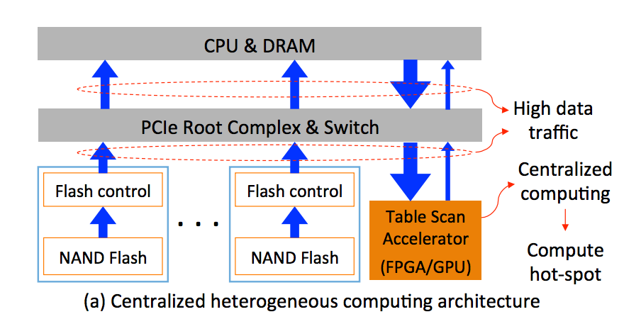

PolarDB是一款云原生OLTP数据库，采用存储计算分离的架构。其设计目标是：大存储量、高TPS及高可用性。

当前的云原生数据库普遍采用从database节点下推table scan到存储节点的方式，来高效处理分析任务。这样做可以减少database节点和storage节点之间的网络消耗，但是会增加storage节点数据处理的负载。然而由于storage节点都是以行式存储数据的，行式存储对table scan的处理不够高效，可以采用的方法如下：

- 更加激进的scale-up存储节点来进行应对，其缺点是对成本不友好。

- 为存储节点装备处理table scan的专用硬件，例如FPGA、GPU等。一个普遍的做法是采用集中式异构体系结构。如下图所示：

但是这样有两个问题：

- High data traffic

所有的数据都要从存储设备传递到该FPGA/GPU设备，数据传输量过大，会带来大量的能量消耗和互相干扰

- Data processing hot-spot

每个存储节点有大量的NVMe SSD，每个都有几GB的读吞吐。所有这些数据都会集中传递给FPGA/GPU，使其成为热点。

因此，PolarDB采用一种分布式异构架构。通过将table scan操作分布到每个storage drive，可以消除上述大量数据传输，避免热点的出现。

