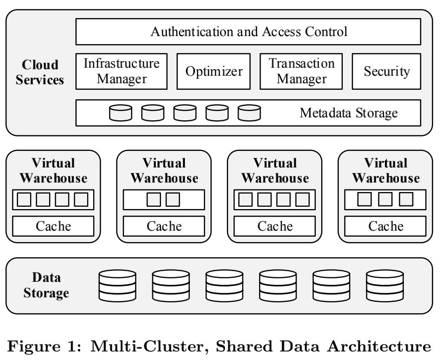
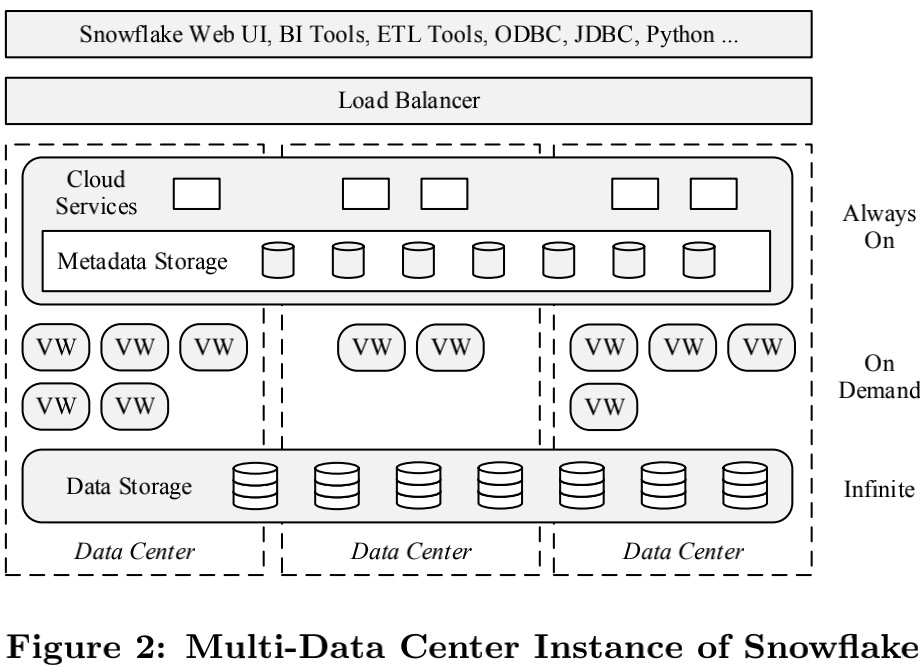
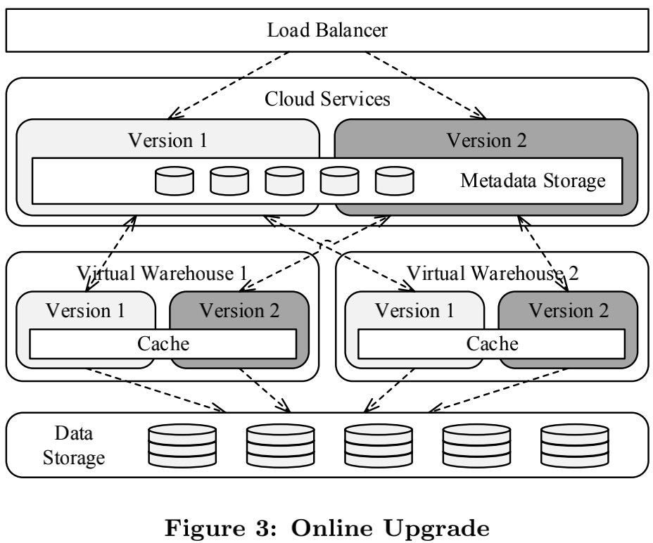

## Introduction

云技术来临了，传统数仓面临如下挑战：

- 传统的数仓是在云时代之前创建的，他们被设计为在小型静态集群上运行，其架构完全不适合云。

- 随着云技术的发展，大量且快速增长的数据来自于不容易控制的外部，而且经常以schema-less、半结构化的格式存储。面对这些数据时，传统数仓则明显力不从心。

为了应对这些缺点，部分数仓社区已经转向Hadoop或Spark等大数据平台。尽管这些工具是不可或缺的，开源社区也在不断地进行重大改进，如Stinger Initiative（号称让Hive提速100倍），但它们仍然缺乏现有数仓的效率和功能。但最重要的是，他们需要大量的努力来推广和使用。

Snowflake是真正利用云设施的经济、弹性、服务化等优点的数仓产品。它的关键特性如下：

- ***纯正的SaaS体验***

用户不需要关心机器、运维、调优、扩容，只要数据上传到Snowflake，立即就可以开始分析。

- ***Retional***

支持ANSI SQL和ACID的事务。大部分用户几乎无需改动或者很小的改动就可以迁移其workloads

- ***Semi-Structured*** 

Snowflake提供了用于遍历、展平和嵌套半结构化数据的内置函数和SQL扩展，并支持JSON和Avro等流行格式。自动schema发现和列式存储使得对schema较少的半结构化数据的操作几乎与对普通关系数据的操作一样快，而无需用户额外的操作

- ***Elastic*** 

存储和计算资源可以独立地、无缝地扩展，而不影响数据可用性或者并发查询的性能。

- ***Highly Available*** 

Snowflake能够容忍节点，集群，甚至全部的数据中心失败。在软件和硬件更新的时候不会下线。

- ***Durable***

Snowflake的设计具使数据具有极高的持久性，并具有防止意外数据丢失的额外保障：克隆、下线和跨区域备份。

- ***Cost-efficient***

Snowflake具有很高的计算效率，所有的表数据都被压缩。用户只为他们实际使用的存储和计算资源付费

- ***Secure***

所有数据包括临时文件和网络流量都是端到端加密的。没有用户数据暴露在云平台上。此外，基于角色的访问控制使用户能够在SQL级别执行级别细粒度的访问

## Storage v.s. Compute

Shared-nothing结构已经成为高性能数据仓库的主流体系结构，主要原因有两个：

- 可扩展性

在Shared-nothing结构中，每个查询处理器节点都有自己的本地磁盘。表是跨节点水平分区的，每个节点只负责其本地磁盘上的rows。这种设计可以很好地扩展星型模式查询，因为将一个小的（广播的）维度表与一个大的（分区的）事实表进行join需要很少的带宽。

- 商用硬件

由于共享数据结构或硬件资源几乎没有争用，因此不需要昂贵的定制硬件。

在Shared-nothing结构中，每个节点都有相同的功能并在相同的硬件上运行。这种结构设计无疑是良好的。不过有一个重要的缺点：它将***计算资源和存储资源紧密耦合***，这在某些场景中会导致问题：

- ***Heterogeneous Workload***

尽管硬件是同构的，然而workload却不是。对bulk load（高IO带宽，轻计算）场景很适合的配置，却不适合负载查询（低IO、重计算），反之亦然。这使得硬件总体利用率不高

- ***Membership Changes***

如果发生节点更改、节点故障，或是用户主动进行了系统调整，则大量数据需要reshuffle。由于相同的节点同时负责数据reshuffle和查询，因此会对性能有显著的影响，从而限制了灵活性和可用性。

- ***Online Upgrade***

各种资源耦合在一起，并且是同质化的，因此在线升级想要完全不影响系统变得很困难。

在on-premise环境中（内部部署），这些问题都可以忍受。虽然负载是异构的，但是仅有固定、少量的节点类型可供选择。另外升级、扩容或者节点故障发生的概率很低。

但是在云上情况则大不相同了：

- 像Amazon EC2这样的平台上拥有多种多样的节点类型。要利用其优势，只需要将数据带到正确类型的节点上。

- 由于节点数量多，节点故障更为频繁，会导致性能发生巨大变化。membership的改变不是偶然，而是常态。

- 在线升级和弹性扩展逐渐成为了当下客户的一个重大痛点。在线升级能够大幅缩短软件开发周期，提升系统的可用性

基于此，Snowflake实现了存储和计算分离。存储和计算由两个松耦合、独立可扩展的服务来处理。计算是通过Snowflake专有的shared-nothing引擎提供。存储是通过亚马逊S3提供的，同时支持多类型的对象存储（Azure 对象存储，Google云存储）。

并且每个计算节点在本地磁盘上（推荐SSD）缓存了一些表的数据，这样做有两个好处：

- 减少计算节点和存储节点之间的网络流量

- 实现了数据的冷热分离，本地磁盘空间不用存储整个数据，这些数据可能非常大，而且大部分是冷数据（很少访问）。本地磁盘专门用于临时数据和缓存，两者都是热数据。因此，缓存了热数据，性能就接近甚至超过shared-nothing架构的性能。

我们称这种新的体系结构为multi-cluster、 shared-data结构。

## Architecture

整个Snowflake分为三层：

- Data Storage

该层使用Amazon S3来存储table data和query result

- Virtual Warehouses

系统的“肌肉”。该层通过弹性的虚拟集群（称为virtual warehouse），执行查询

- Cloud Services

系统的“大脑”。这一层是管理virtual warehouse、查询、事务和围绕virtual warehouse的所有元数据的服务的集合，包含数据库元信息、访问控制信息、加密密钥、使用情况统计等。

### Data Storage

Snowflake选择了AWS S3来存储数据，主要原因是：

- AWS是云平台市场上最成熟的产品。并且，AWS提供了最大的潜在用户资源。

- S3虽然性能不太稳定，但它的易用性、高可用、强数据可靠性都是很难被替代的。

S3有如下特点：

- 相对local storage，延迟高，并且有比较高的CPU负载，尤其在使用HTTPS时。

- 文件只能追加写，不能覆盖写

- GET支持读部分文件

S3中主要存储如下三类数据：

- table数据

S3的特点对Snowflake的table file format和并发控制方案有很大的影响:

    - 表被水平地划分成大的、不可变的文件，这些文件相当于传统数据库系统中的block或page。

    - 在每个文件中，每个属性或列的值都被分组在一起并进行了大量压缩。

    - 每个表文件都有一个file header，其中包含文件中每列的偏移量，以及其他元数据。因为S3允许对部分文件执行GET请求，所以查询只需要下载文件头和它们需要的列。

- 查询产生的临时数据

将临时数据溢出到S3，系统可以计算任意大的查询，而不会出现内存不足或磁盘不足的错误

- 查询结果

将查询结果存储在S3中，实现了客户端交互新方式并简化查询处理，因为不再需要像传统数据库那样在server端维护query的游标了。

元数据，例如catalog信息，由S3文件、统计信息、锁、事务日志等组成，存储在可伸缩的事务KV存储中，这也是云服务的一部分。

### Virtual Warehouse

虚拟仓库层由EC2实例集群组成。每个这样的集群通过一个称为虚拟仓库（VW）的抽象呈现给用户。构成虚拟仓库的单个EC2实例称为工作节点。用户不需要关心哪个或者多少个工作节点组成了一个虚拟仓库。虚拟仓库按照大家所熟悉的“T恤尺寸”从X-Small到XX-Large来标识规模大小。这种抽象允许Snowflake独立演进服务和定价，而不会与具体的云服务绑定。

#### Elasticity and Isolation

VM层是纯计算资源，可以按照需求创建、销毁并且可以随时改变大小。创建或者销毁一个VM对数据库状态没有任何影响。当没有查询时候，用户可以关闭所有的VM资源。这种弹性容许用户独立于数据层，按照需求动态的伸缩他们的计算资源。

***每个query只会在一个VW上运行。work nodes不会在VW之间共享，从而使查询具有强大性能隔离***（snowflake将工作节点共享视为未来工作的重点，因为对于性能隔离不太重要的用例，它将实现更高的利用率和更低的成本）

VW在处理query时会在每个参与的worker node上创建一个新worker进程，这个进程会在query结束后就停止。因为表文件都是不可变的，worker进程不会破坏DB状态，挂掉后直接重试即可。目前Snowflake还没有实现部分重试，而是有节点挂掉则整个query重试。

每个用户可以在任何给定的时间运行多个VW，而每个VW又可以运行多个并发查询。每个VW都可以访问相同的共享表，而无需物理复制数据。

***数据共享意味着用户可以share/integrate自己的所有数据，而计算私有则意味着不同负载和组织之间不会有相互影响***，这也是数据仓库的核心原则之一。这种弹性和隔离使得一些新的使用策略成为可能。对于Snowflake的用户来说为不同目的的queries准备多个VW是很正常的，偶尔还会按需创建VW来执行Bulk Load之类的任务。

Snowflake的弹性还使得同样的价格下用户可以享受到好很多的性能。比如同样的导数据任务，4个节点的系统可能要15小时，而32个节点的系统只要2小时，两者的价格差不多，但后者的体验好很多。弹性VW就是Snowflake最大的优势和差异点之一。

#### Local Caching and File Stealing

每个节点的本地盘会作为表文件的cache，保存访问过的S3对象，包含file header和访问过的列，并使用LRU策略淘汰数据。

cache的生命期与worker节点的生命周期相同，被这个节点上的所有进程和所有query共享。

为了提升命中率，减少不必要的cache，query优化器会使用一致性哈希，根据表文件名将文件分配给各个节点，后续需要读这些文件的query会被优先发给对应节点。

Snowflake中一致的hash是lazy的。当工作节点由于节点故障或VW大小调整而更改时，不会立即对数据进行shuffle。相反，Snowflake依赖LRU替换策略最终替换缓存内容。此解决方案将替换缓存内容的成本分摊到多个查询上，从而获得更好的可用性，并简化了系统。

此外，数据倾斜的处理在云数仓中尤为重要。由于虚拟化问题或者网络争用，某些节点的执行速度可能比其他节点慢很多。Snowflake的做法是当一个worker进程A处理完所有文件后，它会从其它进程那里偷一个文件过来，目标进程B如果此时有多个文件待处理，就会同意这次请求，之后进程A会直接从S3上下载这个文件，而不是从进程B那里，避免使B更慢。该过程叫做File Stealing

#### Execution Engine

虽然可伸缩性是首要的，但每个节点的效率同样重要。Snowflake希望给用户提供市场上任何数据库服务产品中最好的性价比，因此我们决定实现我们自己的SQL执行引擎。Snowflake构建的引擎是列式的、向量化的和基于push的

***Columnar***

列存在分析场景的优势是更高效地使用CPU cache、SIMD，有更多机会使用（轻量）压缩。

***Vectorized***

Snowflake不会物化中间结果，而是流水线处理，每次批量处理列存格式的数千行数据，节省了I/O，还显著提升了cache效率。

***Push-based***

上游算子会将它的结果直接推给下游，而不是等着下游来拉（传统的Volcano模型）。这种方式能提升cache效率，因为它从密集循环中移除了控制流逻辑，也允许更高效地处理DAG形状的执行计划

同时Snowflake中也没有传统引擎会有的一些开销，如:

- query过程面对的是一组固定的不可变文件（S3中的文件不可修改），因此不需要事务管理，也不需要buffer pool。

- Snowflake允许所有主要算子（join/group by/sort）溢写到磁盘上。纯内存引擎虽然更精简、也许更快，但是限制性太强，无法处理所有的查询情况，毕竟分析型workload有时候会有大量的join或aggregation

### Cloud Services

与VW层不同，云服务层是多租户的，负责所有VW的元数据与控制。其中的每个服务都使用多副本来实现高可用与伸缩性。

#### Query Management and Optimization

用户所有查询都通过云服务层。云服务层处理查询生命周期的所有早期阶段：解析、对象解析、访问控制和plan优化。

Snowflake的query优化器基于典型的Cascades风格，采用了自上而下、基于cost的优化。所有优化需要的统计信息都是在数据加载和更新时维护的。因为Snowflake不支持索引，优化器要搜索的空间比其它系统要小，再加上很多决策会被推迟到运行期（如join的数据分布类型），搜索空间就更小了。这种设计减少了优化器生成错误决策的机会，增加了稳健性，只是损失了一点峰值性能。

优化完成后plan会发给所有参与的节点。在query执行过程中，云服务层会持续追踪query的状态，一方面收集性能指标，一方面检测节点错误。

#### Concurrency Control

并发控制完全由云服务层来实现。Snowflake提供了snapshot isolation的ACID事务。因为S3内存储的文件不可修改，因此MVCC是一个很自然的选择。表上的write operations（insert、update、delete、merge）通过添加和删除相对于上一个表版本的整个文件来生成新版本的表，并通过***元数据的MVCC来实现数据本身的MVCC***。

#### Pruning

限制仅仅访问与给定查询相关的数据是查询处理的最重要方面之一。历史上，数据库的数据访问都是通过B+树或者类似的数据结构来索引的。虽然这种方法证明对事务处理非常高效。但是对于Snowflake这样的系统，它会有如下几个问题：

- 严重依赖随机访问，由于存储介质（S3）和数据格式（压缩文件），导致这是一个问题

- 维护索引显著增加了数据量和数据加载时间

- 用户需要显示地创建索引，这与Snowflake的pure service方式不一样。即使有调优人员的建议，维护索引也可能是一个复杂、昂贵有风险的过程

另一种技术最近在大规模数据处理中得到了广泛应用：min-max based purning。也称为small materialized aggregates, zone maps, data skipping：系统维护给定数据块(set of records, file, block etc.)的数据分布信息，特别是块内的最小值和最大值。根据查询谓词的不同，这些值可用于确定给定的查询可能不需要某数据块。例如，假设文件f1和f2在某个列x中分别包含值3..5和4..6。然后，如果查询有一个谓词，其中x>=6，我们就知道只需要访问f2。与传统索引不同，这种元数据通常比实际数据小几个数量级，因此存储开销小、访问速度快。

剪枝优化很好地符合Snowflake的设计原则：它不依赖于用户输入；它可以很好地扩展；并且易于维护。更重要的是，它可以很好地对大数据块进行顺序访问，并且在加载、查询优化和查询执行时间方面增加的开销很小。

除了静态剪枝，Snowflake还会运行期动态剪枝。例如在hash join时，Snowflake会在构建端(build side)统计join key的分布，再传到探测端(probe side)用来过滤数据，甚至有机会跳过整个文件。

## Feature Highlights

### Pure Software-as-a-Service Experience

用户可以通过web页面访问和管理Snowflake。

### Continuous Availability

Snowflake提供了满足期望的continuous availability，其两个主要技术是Fault Resilience和 Online Upgrade。

#### Fault Resilience

S3本身是多AZ(DataCenter)的，保证了99.99%的可用性和99.999999999%（9个9）的可靠性。Snowflake的元数据本身也是多副本、多AZ的。云服务层的其它stateless的服务也是跨AZ的，保证了一个节点到一个zone宕机都不会造成严重后果。

相对地，出于性能原因，VW不是跨AZ的。如果query过程中有节点出错，整个query会无感知地重试。如果节点没有马上恢复，Snowflake还有一个备用节点池。

如果整个AZ不可用，用户需要在别的zone再创建一个VW

#### Online Upgrade

Snowflake被设计为允许系统中同时存在多种版本的服务，这主要得益于所有服务都相当于stateless的，且所有状态都维护在一个事务性的KV store中，通过一个感知元数据版本和schema演化的映射层来访问。每次元数据schema版本变化都会保证向后兼容。

在软件升级时，Snowflake会保留旧服务的同时部署新服务，用户请求按账号迁移到新服务上，但已经进行中的query会在旧服务上完成。一旦所有用户都迁移完了，旧服务就会停止下线。

所有版本的云服务层都会共享相同的元数据。更进一步，不同版本的VW可以共享相同的节点和上面的cache，这样升级后cache仍然保持有效，不会有任何性能损失。

### Semi-Structured and Schema-Less Data

Snowflake支持三种半结构化数据类型：VARIANT、ARRAY和OBJECT，其中：

- VARIANT可以存储任意SQL类型、任意长度的Array、类似JavaScript中的OBJECTs、string到VARIANT的map。

- ARRAY和OBJECT是类型VARIANT类型的严格形式，其内部表现与VARIANT是相同的：自描述、紧凑二进制序列，支持快速的key-value查找，以及高效的类型测试、比较和hash。因此VARIANT类型的列可以像其他列一样用作join keys、grouping keys和ordering keys

VARIANT类型允许Snowflake以ELT（Extract-Load-Transform）方式使用，而不是以传统的ETL（Extract-Transform-Load）方式使用。不需要指定数据的schema或在加载时进行转换。用户可以将JSON、Avro或XML格式的输入数据直接加载到变量列中，Snowflake处理解析和类型推断。这种方法称为“schema later”。

ELT和Snowflake的另一个优点是，如果需要转换，可以使用并行SQL数据库的full power来执行转换，包括连接、排序、聚合、复杂谓词等操作，这些操作在传统的ETL工具链中通常缺失或效率低下。另外，Snowflake还具有自定义函数（udf），支持完整的JavaScript语法，并与VARIANT数据类型集成

