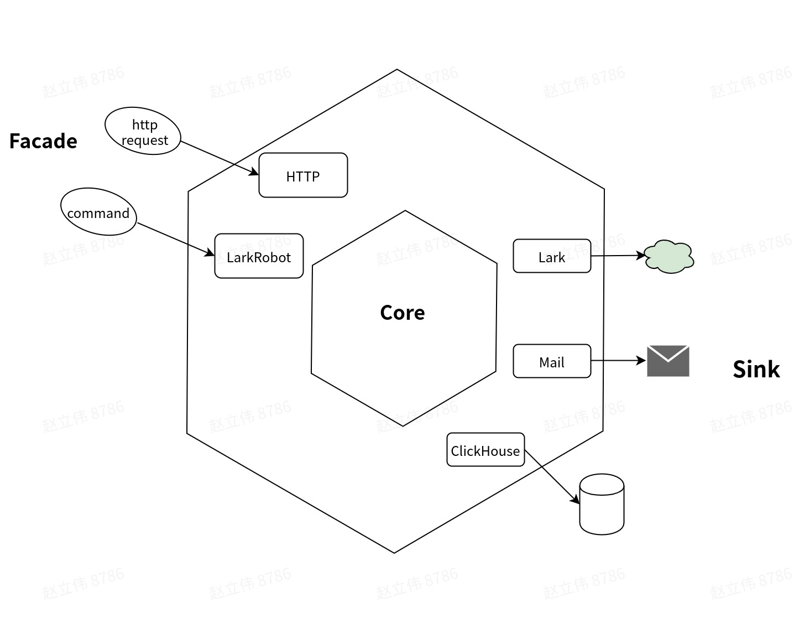

## 整体架构图

- 由于我们未来还要调研StarRocks、Doris或者其他olap系统，所以core模块里采用了可插拔设计，当我们引入一个新的olap引擎时，只需要添加一个OlapEngine的子类即可，改动小、且无需侵入式修改。

- 另外，在Facade和Sink这里，借鉴了DDD中的六边形架构的一部分思想，即core部分暴露出自己的接口，与外部交互时（Facade或者Sink）都通过Adapter进行转换。这样当我们添加一个新的Facade或者Sink时，只需要添加对应的Adapter，无需修改Core部分代码

为了便于理解，这里将olap inspector中的结构用六边形结构表示，如下：

