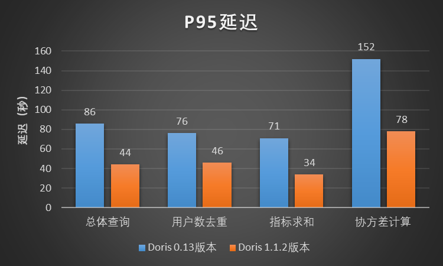

长期以来，Apache Doris在小米集团都有着广泛的应用。随着小米互联网业务的快速发展，用户对Apache Doris的查询性能提出了更高的要求，Doris向量化版本在小米内部上线已经迫在眉睫。在SelectDB公司和Apache Doris社区的鼎力支持下，我们在小米A/B实验场景对Doris向量化版本进行了一系列的调优操作，使得查询性能和稳定性有了显著地提升。

## 业务背景

2019 年 9 月，为了满足小米互联网增长分析业务中近实时、多维分析查询的需求，小米集团首次引入了Apache Doris。在过去的三年里，Apache Doris 已经在小米内部得到了广泛的应用，支持了集团数据看板、广告投放、广告BI、新零售、用户行为分析、A/B实验平台、天星数科、小米有品、用户画像、小米造车等小米内部数十个业务，并且在小米内部形成了一套以 Apache Doris 为核心的数据生态。小米集团作为Apache Doris最早期的用户之一，一直深度参与社区建设，参与Doris的稳定性打磨。

为了保证线上服务的稳定性，小米内部基于Apache Doris社区的0.13版本进行迭代，维护了内部的稳定分支，为小米的业务提供稳定的报表分析和BI看板服务。经过业务的长时间打磨，内部Doris 0.13版本已经非常稳定。但是，随着小米互联网业务的发展，用户对Doris的查询性能提出了更高的要求，Doris 0.13版本在某些场景下逐渐难以满足业务需求了。与此同时，Apache Doris社区在快速发展，Doris版本也在快速迭代，社区发布的1.1版本已经在计算层和存储层全面支持了向量化，查询性能相比非向量化版本有了明显地提升，因此，小米内部的Doris集群进行向量化版本升级已经势在必行。

## 场景介绍

小米的A/B实验平台对Doris查询性能的提升有着迫切的需求，因此我们选择优先在小米的A/B实验平台上线Doris向量化版本，具体的版本选择是Doris社区发布的1.1.2版本。

小米的A/B实验平台是一款通过A/B测试的方式，借助实验分组、流量拆分与科学评估来辅助完成科学的业务决策，最终实现业务增长的一款运营工具产品。在实际业务中，为了验证一个新策略的效果，需要准备原策略A和新策略B两种方案。随后在总体用户中取出一小部分，将这部分用户完全随机地分在两个组中，使两组用户在统计角度无差别。将原策略A和新策略B分别展示给不同的用户组，一段时间后，结合统计方法分析数据，得到两种策略生效后指标的变化结果，并以此判断新策略B是否符合预期。


小米的A/B实验平台有几类典型的查询应用：用户去重、指标求和、实验协方差计算等，查询类型会涉及较多的count(distinct)、bitmap计算、Like语句等。

## 上线前验证

我们基于Doris 1.1.2版本搭建了一个和小米线上Doris 0.13版本在机器配置和机器规模上完全相同的测试集群，用于向量化版本上线前的验证。验证测试分为两个方面：单SQL串行查询测试和批量SQL并发查询测试。在这两种测试中，我们在保证两个集群数据完全相同的条件下，分别在Doris 1.1.2测试集群和小米线上Doris 0.13集群执行相同的查询SQL来做性能对比。我们的目标是，Doris 1.1.2版本在小米线上Doris 0.13版本的基础上有1倍的查询性能提升。

两个集群配置完全相同，具体配置信息如下：

- 集群规模：3 FE + 89 BE

- BE节点CPU:  Intel(R) Xeon(R) Silver 4216 CPU @ 2.10GHz 16核 32线程 × 2

- BE节点内存：256GB

- BE节点磁盘：7.3TB × 12 HDD

### 单SQL串行查询测试

在该测试场景中，我们选取了小米A/B实验场景中7个典型的查询case，针对每一个查询case，我们将扫描的数据时间范围分别限制为1天、7天和20天进行查询测试，其中单日分区数据量级大约为31亿（数据量大约2TB），测试结果如图所示：


根据小米A/B实验场景下的单SQL串行查询测试结果，Doris 1.1.2版本相比小米线上Doris 0.13版本有3~5倍的性能提升。

### 批量SQL并发查询测试

在并发测试中，我们将小米A/B实验场景的查询SQL按照正常的业务并发分别提交到Doris 1.1.2测试集群和小米线上Doris 0.13集群，对比观察两个集群的状态和查询延迟。测试结果为，在完全相同的机器规模、机器配置和查询场景下，Doris 1.1.2版本的查询延迟相比线上Doris 0.13版本整体上升了1倍，查询性能下降非常明显，另外，Doris 1.1.2版本稳定性方面也存在比较严重的问题，查询过程中会有大量的查询报错。Doris 1.1.2版本在小米A/B实验场景并发查询测试的结果与我们的预期差别较大。并发查询测试过程中，我们遇到了几个比较严重的问题：

- CPU使用率上不去

查询下发到Doris 1.1.2版本所在的集群，CPU使用率最多只能打到50%左右，但是完全相同的一批查询下发到线上Doris 0.13版本的集群，CPU使用率可以打到接近100%。Doris 1.1.2版本在小米A/B实验场景中将机器的CPU利用不起来造成了查询性能大幅度降低。


- 查询持续报错

用户并发提交查询的时候会出现如下报错，后续的查询任务均无法执行，集群完全处于不可用的状态，只有重启BE节点才能恢复。

```
RpcException, msg: timeout when waiting for send fragments RPC. Wait(sec): 5, host: xxx
```

用户提交查询的时候也会频繁出现如下报错：

```
detailMessage = failed to initialize storage reader. tablet=440712.1030396814.29476aaa20a4795e-b4dbf9ac52ee56be, res=-214, backend=xxx
```

- Like语句查询较慢

在小米A/B实验场景有较多的使用Like语句进行字符串模糊匹配的查询，在并发测试过程中，该类查询普遍性能较低。

- 内存拷贝耗时较长

并发查询测试过程中，SQL整体执行较慢，通过抓取查询过程中的CPU火焰图，发现读取字符串类型数据的时候内存拷贝会占用较多时间。


## 调优实践

为了解决Doris 1.1.2版本在小米A/B实验场景并发测试过程中暴露出的性能和稳定性问题，推动Doris向量化版本尽快在小米A/B实验平台上线，我们和SelectDB公司以及Apache Doris社区一起对Doris 1.1.2版本进行了一系列的调优工作。

### 提升CPU使用率

针对并发查询时CPU使用率上不去的问题，我们截取了查询过程中BE进程的函数调用栈，通过分析发现，有较多的内存分配和释放操作在等锁，这可能会造成CPU使用率上不去。

- 函数调用栈

```
#0  sys_futex (v3=0, a2=0x0, t=0x7f786c9e7a00, v=<optimized out>, o=128, a=0x560451827c48 <tcmalloc::Static::pageheap_lock_>) at /root/doris/doris/be/src/gutil/linux_syscall_support.h:2419
#1  SpinLockDelay (loop=1822369984, value=2, w=0x560451827c48 <tcmalloc::Static::pageheap_lock_>) at /root/doris/doris/be/src/gutil/spinlock_linux-inl.h:80
#2  base::internal::SpinLockDelay (w=w@entry=0x560451827c48 <tcmalloc::Static::pageheap_lock_>, value=2, loop=loop@entry=20) at /root/doris/doris/be/src/gutil/spinlock_linux-inl.h:68
#3  0x000056044cfd825d in SpinLock::SlowLock (this=0x560451827c48 <tcmalloc::Static::pageheap_lock_>) at src/base/spinlock.cc:118
#4  0x000056044f013a25 in Lock (this=<optimized out>) at src/base/spinlock.h:69
#5  SpinLockHolder (l=<optimized out>, this=0x7f786c9e7a90) at src/base/spinlock.h:124
#6  (anonymous namespace)::do_malloc_pages(tcmalloc::ThreadCache*, unsigned long) () at src/tcmalloc.cc:1360
...
```

```
#0  sys_futex (v3=0, a2=0x0, t=0x7f7494858b20, v=<optimized out>, o=128, a=0x560451827c48 <tcmalloc::Static::pageheap_lock_>) at /root/doris/doris/be/src/gutil/linux_syscall_support.h:2419
#1  SpinLockDelay (loop=-1803179840, value=2, w=0x560451827c48 <tcmalloc::Static::pageheap_lock_>) at /root/doris/doris/be/src/gutil/spinlock_linux-inl.h:80
#2  base::internal::SpinLockDelay (w=w@entry=0x560451827c48 <tcmalloc::Static::pageheap_lock_>, value=2, loop=loop@entry=2) at /root/doris/doris/be/src/gutil/spinlock_linux-inl.h:68
#3  0x000056044cfd825d in SpinLock::SlowLock (this=0x560451827c48 <tcmalloc::Static::pageheap_lock_>) at src/base/spinlock.cc:118
#4  0x000056044f01480d in Lock (this=<optimized out>) at src/base/spinlock.h:69
#5  SpinLockHolder (l=<optimized out>, this=0x7f7494858bb0) at src/base/spinlock.h:124
#6  (anonymous namespace)::do_free_pages(tcmalloc::Span*, void*) [clone .constprop.0] () at src/tcmalloc.cc:1435
...
```

- Doris内存管理机制

Doris中使用TCMalloc进行内存管理。根据所分配和释放内存的大小，TCMalloc将内存分配策略分为小内存管理和大内存管理两类。


   - 小内存管理

   TCMalloc使用了ThreadCache、CentralCache和PageHeap三层缓存来管理小内存的分配和释放。

   对于每个线程，TCMalloc都为其单独维护了一个ThreadCache，每个ThreadCache中包含了多个单独的FreeList，每个FreeList中缓存了n个固定大小的可供分配的内存单元。进行小内存分配时，会直接从ThreadCache中进行内存分配，相应地，小内存的回收也是将空闲内存重新放回ThreadCache中对应的FreeList中。由于每个线程都有自己独立的ThreadCache，因此从ThreadCache中分配或回收内存是不需要加锁的，可以提升内存管理效率。

   内存分配时，如果ThreadCache中对应的FreeList为空，则需要从CertralCache中获取内存来补充自身的FreeList。CentralCache中维护了多个CentralFreeList链表来缓存不同大小的空闲内存，供各线程的ThreadCache取用。由于CentralCache是所有线程共用的，因此ThreadCache从CentralCache中取用或放回内存时是需要加锁的。为了减小锁操作的开销，ThreadCache一般从CentralCache中一次性申请或放回多个空闲内存单元。

   当CentralCache中对应的CentralFreeList为空时，CentralCache会向PageHeap申请一块内存，并将其拆分成一系列小的内存单元，添加到对应的CentralFreeList中。PageHeap用来处理向操作系统申请或释放内存相关的操作，并提供了一层缓存。PageHeap中的缓存部分会以page为单位、并将不同数量的page组合成不同大小的Span，分别存储在不同的SpanList中，过大的Span会存储在一个SpanSet中。CentralCache从PageHeap中获取的内存可能来自PageHeap的缓存，也可能是来自PageHeap向系统申请的新内存。

   - 大内存管理

   大内存的分配和释放直接通过PageHeap来实现，分配的内存可能来自PageHeap的缓存，也可能来自PageHeap向系统申请的新内存。PageHeap向系统申请或释放内存时需要加锁。

   TCMalloc中的aggressive_memory_decommit参数用来配置是否会积极释放内存给操作系统。当设置为true时，PageHeap会积极地将空闲内存释放给操作系统，节约系统内存；当该配置设置为false时，PageHeap会更多地将空闲内存进行缓存，可以提升内存分配效率，不过会占用更多的系统内存；在Doris中该参数默认为true。

   通过分析查询过程中的调用栈发现，有比较多的线程卡在PageHeap向系统申请或释放内存的等锁阶段，因此，我们尝试将aggressive_memory_decommit参数设为false，让PageHeap对空闲内存进行更多的缓存。果然，调整完成之后，CPU使用率可以打到几乎100%。在Doris 1.1.2版本，数据在内存中采用列式存储，因此，会相比于Doris 0.13版本行存的方式有更大的内存管理开销。

   

社区相关的PR：

```
https://github.com/apache/doris/pull/12427
```

### 缓解FE下发Fragment超时的问题

在Doris 1.1.2版本，如果一个查询任务的fragment数量超过一个，查询计划就会采用两阶段执行(`Two Phase Execution`)策略。在第一阶段，FE会下发所有的fragment到BE节点，在BE上对fragment执行相应的准备工作，确保fragment已经准备好处理数据；当fragment完成准备工作，线程就会进入休眠状态。在第二阶段，FE会再次通过RPC向BE下发执行fragment的指令，BE收到执行fragment的指令后，会唤醒正在休眠的的线程，正式执行查询计划。

```
RpcException, msg: timeout when waiting for send fragments RPC. Wait(sec): 5, host: xxx
```

在用户执行查询时，会持续有上面的报错，并导致任何查询无法执行。通过截取进程的调用栈，分析发现大量的线程均在休眠状态，均阻塞在fragment完成准备工作并休眠等待被唤醒的状态。排查发现，查询计划的两阶段执行机制中存在Bug，如果执行计划被FE取消，BE上已经完成fragment准备工作并休眠等待的线程就不会被唤醒，导致BE上的fragment线程池被耗尽，后续所有查询任务的fragment下发到BE节点之后，因为没有线程资源都会等待直到RPC超时。

为了解决这个问题，我们从社区引入了相关的修复patch，为休眠的线程增加了超时唤醒机制，如果线程被超时唤醒，fragment会被取消，进而释放线程资源，极大地缓解了FE下发执行计划时RPC超时的问题。

该问题还未完全解决，当查询并发很大时还会偶发地出现。另外，我们还引入了Doris社区相关的其他patch来缓解该问题，比如：减小执行计划的Thrift size，以及使用池化的RPC Stub替换单一的RPC Stub。

社区相关的PR如下：

```
https://github.com/apache/doris/pull/12392

https://github.com/apache/doris/pull/12495

https://github.com/apache/doris/pull/12459
```

### 修复Tablet元数据汇报的Bug

在Doris中，BE会周期性地检查当前节点上所有tablet是否存在版本缺失，并向FE汇报所有Tablet的状态和元信息，由FE对每一个tablet的三副本进行对比，确认其中的异常副本，并下发clone任务，通过clone正常副本的数据文件来恢复异常副本缺失的版本。

```
detailMessage = failed to initialize storage reader. tablet=440712.1030396814.29476aaa20a4795e-b4dbf9ac52ee56be, res=-214, backend= xxx
```

在该报错信息中，错误代码res=-214（OLAP_ERR_VERSION_NOT_EXIST）表示查询计划执行过程中在BE上初始化rowset reader的时候出现异常，对应的数据版本不存在。在正常情况下，如果Tablet的某一个副本存在版本缺失，FE生成执行计划的时候就不会让查询落在该副本上，然而，查询计划在BE上执行的过程中却发现版本不存在，则说明FE并没有检测到该副本存在版本缺失。

通过排查代码发现，BE的Tablet汇报机制存在Bug，当某一个副本存在版本缺失时，BE并没有将这种情况正常汇报给FE，导致这些存在版本缺失的异常副本并没有被FE检测到，因此不会下发副本修复任务，最终导致查询过程中会发生res=-214的报错。

社区相关的PR如下：

```
https://github.com/apache/doris/pull/12415
```

### 优化Like语句性能

在Doris 1.1.2版本中使用like语句进行字符串模糊匹配查询时，Doris底层其实是使用了标准库中的std::search()函数对存储层读出的数据进行逐行匹配，过滤掉不满足要求的数据行，完成Like语句的模糊匹配。通过调研和对比测试发现，GLIBC库中的std::strstr()函数针对字符串匹配比std::search()函数有1倍以上的性能提升。最终我们使用std::strstr()函数作为Doris底层的字符串匹配算法，将Doris底层字符串匹配的性能可以提升1倍。


### 优化内存拷贝

在小米的场景中有很多字符串类型的查询字段，Doris 1.1.2版本使用ColumnString对象来存储内存中的一列字符串数据，底层使用了PODArray结构来实际存储字符串。执行查询时，需要从存储层逐行读取字符串数据，在这个过程中需要多次对PODArray执行resize操作来为列数据申请更大的存储空间，执行resize操作会引起对已经读取的字符串数据执行内存拷贝，而查询过程中的内存拷贝非常耗时，对查询性能影响极大。

为了降低字符串查询过程中内存拷贝的开销，我们需要尽量减少对PODArray执行resize操作的次数。鉴于小米A/B实验场景中同一列不同行的字符串长度相对比较均匀，我们尝试预先为需要读取的字符串申请足够的内存来减少resize的次数，进而降低内存拷贝的开销。在数据扫描时，每个batch需要读取的数据行数是确定的（假设为n），当字符串数据读取完指定的前m（在小米的场景中，该值配置为100，m < n）行时，我们根据前m行的PODArray大小预估所有n行字符串数据需要的PODArray大小，并为其提前申请内存，避免后面逐行读取时多次执行内存申请和内存拷贝。

内存预估公式为：

```
所需PODArray总大小 = （当前PODArray总大小 / m）* n
```


当然，该方法只是对所需的内存进行了预估，根据预估的大小提前申请了内存，减少了后面逐行读取字符串时大量的resize操作，减少了内存申请和内存拷贝的次数，并不能完全消除字符串读取过程中的内存拷贝。该优化方案只对一列中字符串长度比较均匀的情况有效，内存的预估相对会比较接近实际内存。如果一列中字符串长度差别较大，该方法的效果可能不甚明显，甚至可能会造成内存浪费。

## 调优测试结果

我们基于小米的A/B实验场景对Doris 1.1.2版本进行了一系列调优，并将调优后的Doris 1.1.2版本与小米线上Doris 0.13版本分别进行了并发查询测试。

### 测试1

我们选择了A/B实验场景中一批典型的用户去重、指标求和以及协方差计算的查询case（SQL总数量为3245）对两个版本进行并发查询测试，测试表的单日分区数据大约为31亿（数据量大约2TB），查询的数据范围会覆盖最近一周的分区。测试结果如图所示，Doris 1.1.2版本相比Doris0.13版本，总体的平均延迟降低了大约48%，P95延迟降低了大约49%。在该测试中，Doris 1.1.2版本相比Doris0.13版本的查询性能提升了接近1倍。




### 测试2

我们选择了A/B实验场景下的7份A/B实验报告对两个版本进行测试，每份A/B实验报告对应小米A/B实验平台页面的两个模块，每个模块对应数百或数千条查询SQL。每一份实验报告都以相同的并发向两个版本所在的集群提交查询任务。测试结果如图所示，Doris 1.1.2版本相比Doris 0.13版本，总体的平均延迟降低了大约52%。在该测试中，Doris 1.1.2版本相比Doris 0.13版本的查询性能提升了超过1倍。


### 测试3

为了验证调优后的Doris 1.1.2版本在小米A/B实验场景之外的性能表现，我们选取了小米用户行为分析场景进行了Doris 1.1.2版本和Doris 0.13版本的并发查询性能测试。我们选取了2022年10月24日、25日、26日和27日这4天的小米线上真实的行为分析查询case进行对比查询，测试结果如图所示，Doris 1.1.2版本相比Doris 0.13版本，总体的平均延迟降低了大约77%，P95延迟降低了大约83%。在该测试中，Doris 1.1.2版本相比Doris 0.13版本的查询性能有4~6倍的提升。


## 结束语

经过一个多月的性能调优和测试，Doris 1.1.2版本在查询性能和稳定性方面已经达到了小米A/B实验平台的上线要求，在某些场景下的查询性能甚至超过了我们的预期。希望本次分享可以给有需要的朋友提供一些参考。

最后，感谢SelectDB公司和Apache Doris社区对我们的鼎力支持，感谢衣国垒老师在我们版本调优和测试过程中的全程参与和陪伴。Apache Doris目前已经在小米集团内部得到了广泛地应用，并且业务还在持续增长，未来一段时间我们将逐步推动小米内部其他的Doris业务上线向量化版本。

