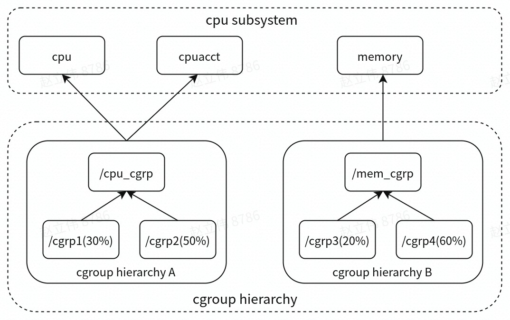
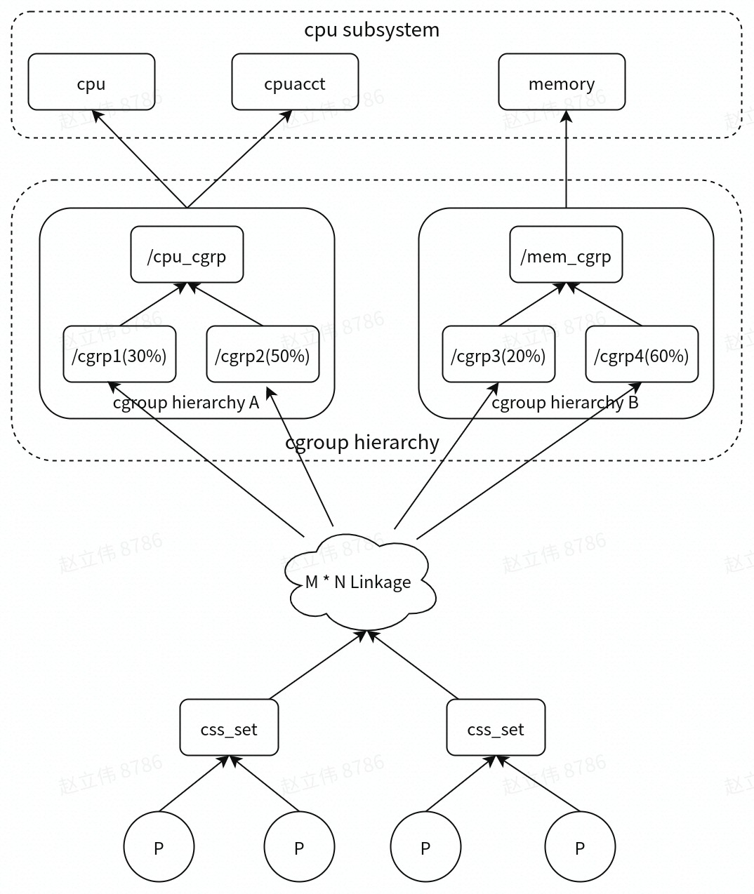

## cgroups子系统

cgroups的全称是control groups，cgroups为每种可以控制的资源定义了一个子系统。典型的子系统介绍如下：

- cpu子系统，主要限制进程的cpu使用率。

  - cpu.cfs_period_us & cpu.cfs_quota_us

  cfs_period_us用来配置时间周期长度，cfs_quota_us用来配置当前cgroup在设置的周期长度内所能使用的CPU时间数，两个文件配合起来设置CPU的使用上限。举几个例子：

    - 限制只能使用1个CPU（每250ms能使用250ms的CPU时间）

      ```
      echo 250000 > cpu.cfs_quota_us /* quota = 250ms */
      echo 250000 > cpu.cfs_period_us /* period = 250ms */
      ```

    - 限制使用2个CPU（内核）（每500ms能使用1000ms的CPU时间，即使用两个内核）

      ```
      echo 1000000 > cpu.cfs_quota_us /* quota = 1000ms */
      echo 500000 > cpu.cfs_period_us /* period = 500ms */
      ```

    - 限制使用1个CPU的20%（每50ms能使用10ms的CPU时间，即使用一个CPU核心的20%）

      ```
      echo 10000 > cpu.cfs_quota_us /* quota = 10ms */
      echo 50000 > cpu.cfs_period_us /* period = 50ms */
      ```

  使用cfs_perios_us和cfs_quota_us会对cpu使用率严格限制，***不会超卖***。

  - cpu.shares

  shares用来设置CPU的相对值，并且是针对所有的CPU，默认值是1024。

  假如系统中有两个cgroup，分别是A和B，A的shares值是1024，B的shares值是512，那么A将获得1024/(1204+512)=66%的CPU资源，而B将获得33%的CPU资源。
	
  shares有两个特点：

    - 如果A不忙，没有使用到66%的CPU时间，那么剩余的CPU时间将会被系统分配给B，即B的CPU使用率可以超过33%

    - 如果添加了一个新的cgroup C，且它的shares值是1024，那么A的限额变成了1024/(1204+512+1024)=40%，B的变成了20%

  从上面两个特点可以看出：

    - 在闲的时候，shares基本上不起作用，只有在CPU忙的时候起作用，这是一个优点。

    - shares没法精确的控制CPU使用率。由于shares是一个绝对值，需要和其它cgroup的值进行比较才能得到自己的相对限额，而在一个部署很多容器的机器上，cgroup的数量是变化的，所以这个限额也是变化的，自>己设置了一个高的值，但别人可能设置了一个更高的值，所以这个功能没法精确的控制CPU使用率。

  shares则对cpu使用率使用软限制，***允许超卖***。

  - cpu.stat

    - nr_periods： 表示过去了多少个cpu.cfs_period_us里面配置的时间周期

    - nr_throttled： 在上面的这些周期中，有多少次是受到了限制（即cgroup中的进程在指定的时间周期中用光了它的配额）

    - throttled_time: cgroup中的进程被限制使用CPU持续了多长时间(纳秒)

- cpuacct子系统，可以统计cgroups中的进程的cpu使用报告。

- cpuset子系统，可以为cgroups中的进程分配单独的cpu节点或者内存节点。

- memory子系统，可以限制进程的memory使用量。

- blkio子系统，可以限制进程的块设备io。

- devices子系统，可以控制进程能够访问某些设备。

- net_cls子系统，可以标记cgroups中进程的网络数据包，然后可以使用tc模块（traffic control）对数据包进行控制。

- freezer子系统，可以挂起或者恢复cgroups中的进程。

- ns子系统，可以使不同cgroups下面的进程使用不同的namespace。

这里面每一个子系统都需要与内核的其他模块配合来完成资源的控制，比如对cpu资源的限制是通过进程调度模块根据cpu子系统的配置来完成的；对内存资源的限制则是内存模块根据memory子系统的配置来完成的，而对网络数据包的控制则需要traffic control子系统来配合完成。

## cgroups hierarchy

- 什么是cgroups hierarchy？

内核使用cgroup结构体来表示一个control group对某一个或者某几个cgroups子系统的资源限制。每一棵cgroup结构体组成的树称为一个cgroups hierarchy。

cgroups hierarchy可以attach一个或者几个cgroups子系统，对其attach的cgroups子系统进行资源的限制。不过，每一个cgroups子系统只能被attach到一个cgroups hierarchy。



比如上图表示两个cgroups hierarchy，每一个cgroups hierarchy是一颗树形结构，树的每一个节点是一个cgroup结构体，每个cgroup结构体可以设置对资源不同的限制权重。其中：

- cgroups hierarchy A: attach了cpu子系统和cpuacct子系统，当前cgroups hierarchy中的cgroup结构体就可以对cpu的资源进行限制(cpu)，并且对进程的cpu使用情况进行统计(cpustat)。其中，cgrp1可以使用60%时间片，cgrp2可以使用20%时间片。

- cgroups hierarchy B: attach了memory子系统，当前cgroups hierarchy中的cgroup结构体就可以对memory的资源进行限制。

## cgroups与进程



上图描述了进程与cgroups之间的关系。其中：

- css_set代表cgroups subsystem set。一个css_set有一个进程链表，可以包含多个进程，隶属于同一css_set的进程受到同一个css_set所关联的资源限制。同时，css_set可以与cgroup hierarchy关联，具体可参见M*N Linkage。

- P代表一个进程。每一个进程的描述符中有一个指针指向了一个css_set，指向某一个css_set的进程会被加入到当前css_set的进程链表中，一个进程只能隶属于一个css_set。

- M*N Linkage说明的是css_set通过辅助数据结构可以与cgroups节点进行多对多的关联。

   - 一个css_set关联多个cgroups hierarchy的节点时，表明需要对当前css_set下的进程进行多种资源的控制。

   - 一个cgroups hierarchy节点关联多个css_set时，表明多个css_set下的进程列表受到同一份资源的相同限制。

   - cgroups的实现不允许css_set同时关联同一个cgroups层级结构下多个节点，这是因为cgroups对同一种资源不允许有多个限制配置。

## cgroups文件系统

cgroups通过VFS把功能暴露给用户态，cgroups与VFS之间的衔接部分称之为cgroups文件系统。用户在用户态对cgroups文件系统的操作，通过VFS转化为对cgroups层级结构的维护。通过这样的方式，内核把cgroups的功能暴露给了用户态的进程。

### 什么是VFS

VFS是一个内核抽象层，能够隐藏具体文件系统的实现细节，从而给用户态进程提供一套统一的API。VFS使用了一种通用文件系统的设计，具体的文件系统只要实现了VFS的接口，就能够注册到VFS中，从而使内核可以读写这种文件系统。

VFS通用文件模型中包含以下四种元数据结构：

- superblock object：用于存放已经注册的文件系统的信息，例如ext2/ext3/cgroups文件系统信息。

- inode object: 用于存放具体文件的信息。其中：

   - 普通磁盘文件系统：inode节点中一般会存放文件在硬盘中的存储块等信息

   - socket文件系统：inode会存放socket的相关属性

   - cgroups文件系统：inode会存放与cgroup节点相关的属性信息

- file object：进程内打开的一个文件。文件中比较重要的部分是一个叫file_operations的结构体，这个结构体描述了具体的文件系统的读写实现。当进程在某一个文件描述符上调用读写操作时，实际调用的是file_operations中定义的方法。 

   - 对于普通的磁盘文件系统，file_operations中定义的就是普通的块设备读写操作

   - 对于socket文件系统，file_operations中定义的就是socket对应的send/recv等操作

   - 而对于cgroups这样的特殊文件系统，file_operations中定义的就是操作cgroup结构体等具体的实现

- dentry object：VFS把每个目录看作一个文件，由若干子目录和文件组成。对于进程查找路径名中的每个分量，内核都为其创建一个目录项对象。例如/tmp/test，内核会分别为“/”，“tmp”，“test”创建目录项。

## Reference

[Linux资源管理之cgroups简介](https://tech.meituan.com/2015/03/31/cgroups.html)

[cgroups subsystem之cpu](https://segmentfault.com/a/1190000008323952)

