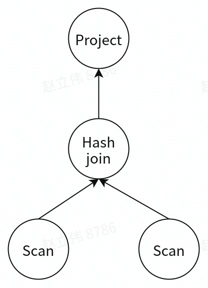
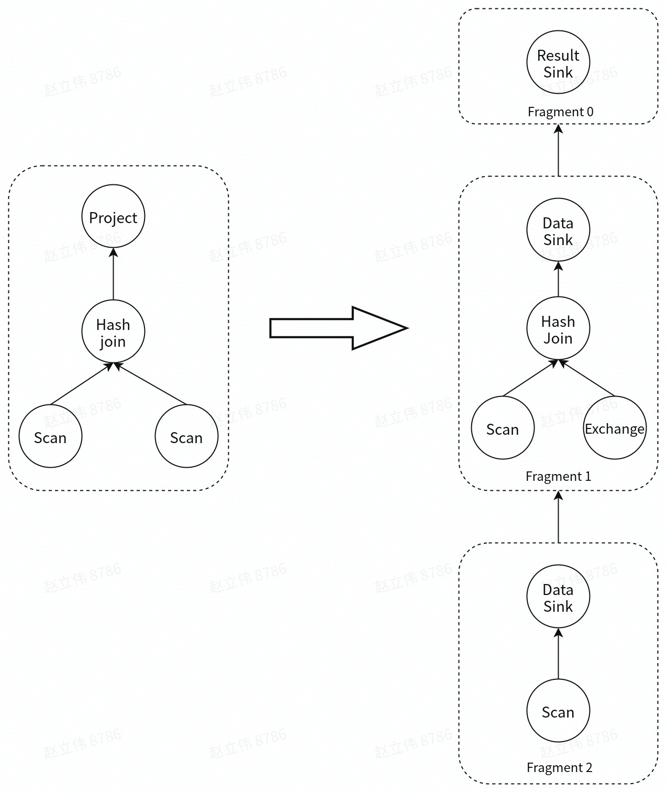

同大多数数据库一样，Doris的查询主要分为查询接收、Parse（词法分析和语法分析）、Analyze（语义分析）、Rewrite（查询重写）、逻辑计划生成（单机执行计划）、物理计划生成（分布式执行计划）、Schedule、查询计划执行、查询结果返回等步骤。其中查询计划执行由BE负责，其他均由FE负责。

## 查询接收

在Doris中，`AcceptListener`负责监听mysql连接。当一个新连接到来时`AcceptListener`会创建一个`ConnectProcessor`类型对象。`ConnectProcessor`周期性的获取该连接上的请求，针对不同的command执行不同的操作，包括use database操作（`COM_INIT_DB`）、查询操作（`COM_QUERY`）、quit（`COM_QUIT`）等

## Parse

`ConnectProcessor::handleQuery`主要处理查询操作，随后使用[Java CUP Parser](http://www2.cs.tum.edu/projects/cup/)对输入的字符串进行词法和语法分析。词法分析主要将输入的字符串解析成一系列token（例如select、from等），而语法分析则根据词法分析生成的token，生成一颗抽象语法树（Abstract Syntax Tree）。在Doris中抽象语法树用类`StatementBase`表示，`StatementBase`是一个虚类，它有多个不同的子类，例如`SelectStmt`、`InsertStmt`等，分别用于表示查询请求、写入请求等等。

其中，`SelectStmt`类中包含`selectList`、`fromClause`、`groupByClause`、`havingClause`等等，具体如下所示：

```
public class SelectStmt extends QueryStmt {
    protected SelectList selectList;
    private final ArrayList<String> colLabels; // lower case column labels
    protected final FromClause fromClause;
    protected GroupByClause groupByClause;
    private List<Expr> originalExpr;
    private Expr havingClause;  // original having clause
    protected Expr whereClause;
    // havingClause with aliases and agg output resolved
    private Expr havingPred;

    // set if we have any kind of aggregation operation, include SELECT DISTINCT
    private AggregateInfo aggInfo;
    // set if we have analytic function
    private AnalyticInfo analyticInfo;
    // substitutes all exprs in this select block to reference base tables
    // directly
    private ExprSubstitutionMap baseTblSmap = new ExprSubstitutionMap();

    private ValueList valueList;

    // if we have grouping extensions like cube or rollup or grouping sets
    private GroupingInfo groupingInfo;

    // having clause which has been analyzed
    // For example: select k1, sum(k2) a from t group by k1 having a>1;
    // this parameter: sum(t.k2) > 1
    private Expr havingClauseAfterAnaylzed;

    // SQL string of this SelectStmt before inline-view expression substitution.
    // Set in analyze().
    protected String sqlString;

    // Table alias generator used during query rewriting.
    private TableAliasGenerator tableAliasGenerator = null;

    // Members that need to be reset to origin
    private SelectList originSelectList;
}
```

## Analyze

当通过Parse阶段得到AST后，随后会根据`parsedStmt`创建一个`StmtExecutor`。该`StmtExecutor`首先为该查询分配一个16位的随机queryId，并通过`analyzeVariablesInStmt`函数获取select查询中的[Optimizer Hints](https://github.com/apache/doris/pull/4504)。

随后通过`Analyzer`来进行语义分析。注意这里的`Analyzer`类其实并不是语义解析器，正确的名字应该叫`AnalyzerContext`，其保存的是语义解析所需要的各种上下文及状态信息。真正的语义解析是在具体的`StatementBase`子类里的，最终通过多态来获取不同执行语句的不同语义分析实现。

对于`SelectStmt`，语义分析阶段所做的主要工作有：

- 检查cluster name是否为空，若是则抛出`AnalysisException`异常

- 对于含有order by但是order by字段为空的查询，将order by移除掉。

- 对于含有limit的查询：

  - 当offset大于0且不含有order by时报错。

  - 当limit = 0时，设置`hasEmptyResultSet`为true，该变量表示该查询结果一定返回空

  - ...

- 对于含有with的查询，依次analyze该查询中的所有的view（即子查询）

- 对于analyze from从句，依次analyze从句中的所有表（包括BaseTable、[LateralView](https://www.bookstack.cn/read/doris-1.0-zh/737eaa4bfec68762.md)、LocalView）。对于BaseTable，如果该表没有指定database，则指定为默认database。

- 对于select list：

  - 如果是select `*`，则将`*`扩展成所有列

  - 判断select从句中是否包含子查询，如果是则抛出异常

  - 依次解析select list中的所有expr及其child expr（如果有）

  - ...

- 对于where从句：

  - 查看where从句中是否有group操作，如果有则抛出异常

  - 查看where从句中是否有聚合操作，如果有则抛出异常

  - 检查where从句是否返回bool类型或者null，否则抛异常

  - 依次解析where从句中的所有child expr（如果有）

  - ...

## Rewrite

当执行完词法分析后，要根据具体的`ExprRewriteRule`进行查询重写，例如：

- `FoldConstantsRule`，通过对expr求值并进行替换：`1 + 1 + 1` --> `3`，`toupper('abc')` --> `'ABC'`、`cast('2016-11-09' as timestamp)` --> `TIMESTAMP '2016-11-09 00:00:00'`。

- `NormalizeBinaryPredicatesRule`，规范化二进制谓词，使`slot`位于左侧，例如：`5 > id` --> `id < 5`

- `BetweenPredicates`，将`between`谓词转换成`conjunctive`/`disjunctive`谓词，例如： `BETWEEN X AND Y` --> `A >= X AND A <= Y`、 `NOT BETWEEN X AND Y` --> `A < X OR A > Y`

另外对于存在子查询的查询，会依次进行from从句子查询重写、where从句子查询重写（`rewriteWhereClauseSubqueries`）以及have从句中子查询重写（`rewriteHavingClauseSubqueries`）。例如，对于have从句子查询的重写，会先将having子句用where进行等价重写，再将where子句等价重写（例如使用in重写）

当某些重写发生时，需要重新执行语义分析。

## 单节点执行计划

逻辑计划生成和物理计划生成都是由`Planner`来完成的。在`Planner`中，`SingleNodePlanner`通过AST生成单节点执行计划（`PlanNode`构成的算子树）。例如：

`
select A.a, B.b
from A join B
where A.a = B.b
`
生成的算子树如下：



在生成单节点执行计划时，主要做了以下优化：

- Slot物化。slot物化是指标记出哪些列在表达式中涉及到，即哪些列需要被读取以及计算。

- 谓词下推。将谓词下推到Scan节点。

- 当没有开启排序落盘时（[enable_spilling](https://cloud.tencent.com/document/product/1387/70771)=true），将sort+limit修改成top n。

- 投影下推。保证在Scan时只读取必须的列。

- Join reorder。对于 Inner Join, Doris 会根据行数调整表的顺序，将大表放在前面。

- 分区，分桶裁剪：根据过滤条件中的信息，确定需要扫描哪些分区，哪些桶的tablet。

- MaterializedView选择：会根据查询需要的列，过滤，排序和Join的列，行数，列数等因素选择最佳的物化视图。

## 分布式计划生成

在`Planner`中，通过`DistributedPlanner`执行生成单节点执行计划。这里需要根据分布式环境，将单机的PlanNode树拆分成分布式`PlanFragment`树。该步骤的主要目标是最大化并行度和数据本地化。主要方法是将能够并行执行的节点拆分出去单独建立一个`PlanFragment`，用`ExchangeNode`代替被拆分出去的节点，用来接收数据。拆分出去的节点增加一个`DataSinkNode`，用来将计算之后的数据传送到`ExchangeNode`中，做进一步的处理。



## Schedule

## 查询计划执行

查询计划是由BE负责执行的，其执行引擎采用Batch模式的Volcano模型，相对于Tuple模式的Volcano，执行效率更高。

## 查询结果返回
