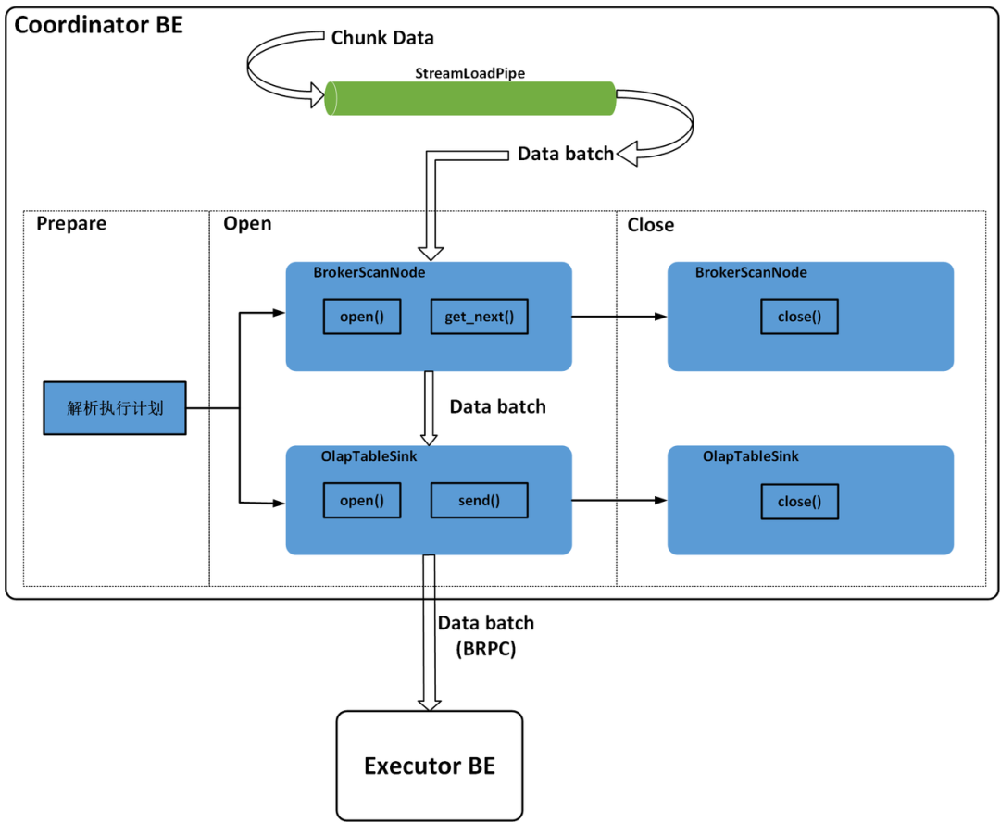
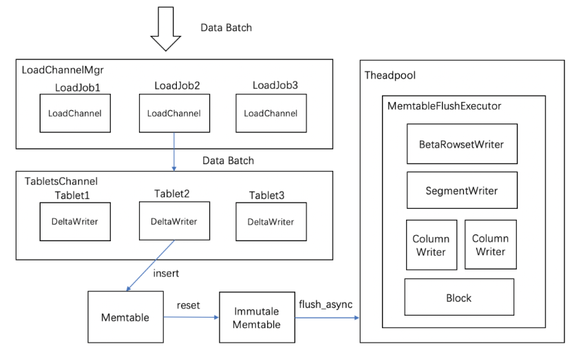
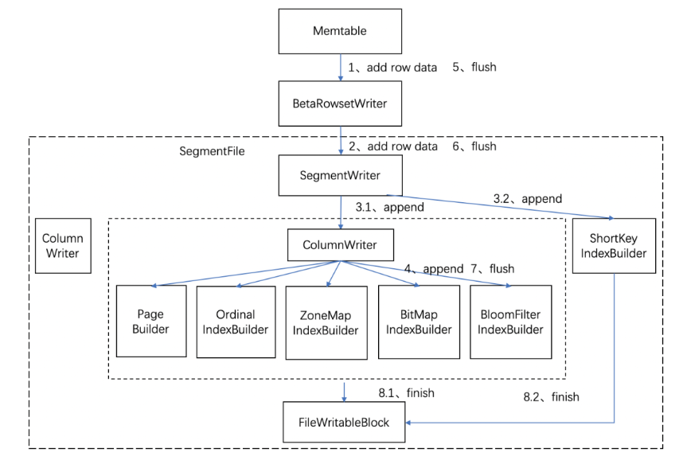

Stream Load是Doris的一种同步的导入方式, 允许用户通过Http访问的方式批量地将CSV或者JSON数据导入Doris，并返回数据导入的结果。用户可以直接通过Http请求的返回体判断数据导入是否成功，也可以通过在客户端执行查询SQL来查询历史任务的结果。Stream Load是是最常用的一种导入方式，在小米内部占了约80%以上场景。 

## 执行过程

用户执行stream load主要有两种方式：

- 将请求直接提交给be，并由该节点作为本次stream load任务的coordinator。

- 将http请求提交给fe，fe再通过http重定向将数据导入请求转发给某一个be节点，该be节点作为本次stream load任务的coordinator，此时的fe主要起到请求转发的作用。

本文中主要介绍第二种方式。其主要执行流程如下：

- 用户提交stream load请求到fe

- fe对http请求进行解析，然后进行鉴权。鉴权通过后，根据策略选取一台be作为coordinator，并将stream load请求转发给coordinator be（`StreamLoadAction::on_header`）

- coordinator be在接到请求后，会对其header信息进行校验，包括body长度、format类型等。

- coordinator be向fe发送begin transaction的请求，fe在接收到该请求时会开启一个事务，并向coordinator be返回事务id

- coordinator be向fe发送`TStreamLoadPutRequest`请求，fe在接收到该请求时，会产生导入执行计划，并向coordinator be返回。该执行计划非常简单，由`OlapTableSink`和`BrokerLoadScanNode`两个算子组成，且只有一个`PlanFragment`

- coordinator be在接收到导入计划之后，开始执行导入计划。`OlapTableSink`会根据数据选取对应的tablet，并将其放入该tablet所在be对应的channel，后台会有线程定期的将channel中的数据通过brpc发送到be（根据配置`olap_table_sink_send_interval_ms`）。其他be在接收到该`PTabletWriterAddBatchRequest`请求后，会执行数据写入操作

- 在导入完之后，会根据导入执行状态，决定是commit或者rollback transaction

整体执行流程如下图所示：

## 数据接收

当doris接收到用户提交的stream load请求，通过`StreamLoadAction::on_chunk_data`接收http请求中的数据，并将数据append到该stream load对应的body_sink中。其中：

- 对于大部分数据格式，都支持使用use_streaming的方式，则将body_sink指定为`StreamLoadPipe`，该class主要是将数据缓存起来。

- 对于少部分不支持streaming的数据格式，则将body_sink指定为`MessageBodyFileSink`，该class主要将数据存储在本地文件中。

## 数据导入

### `BrokerScanNode`算子

`BrokerScanNode`算子在`open`时，会启动一个线程从streaming或者本地文件中读取数据，存入`BrokerScanNode`的`_batch_queue`中。

如[《Doris查询计划》](https://levy5307.github.io/blog/doris-query/)中所讲，查询计划在执行过程中，会自顶向下调用算子的`get_next`函数。`BrokerScanNode`算子在`get_next`时，从`_batch_queue`中获取一个数据batch。

当执行完`BrokerScanNode`算子的`get_next`获取到row_batch之后，会将改row_batch通过`OlapTableSink`写入表中。

### `OlapTableSink`算子

`OlapTableSink`算子在prepare阶段，会对每个rollup（包括base table）建立对应的`IndexChannel`。在`IndexChannel`中，获取到其所有tablets对应的node信息（每个tablet的所有副本都需要找到对应的node），建立对应的`NodeChannel`，在`NodeChannel`中，会根据该node的地址以及brpc port，获取一个brpc stub，用于发送信息至该node。

`OlapTableSink`算子在open阶段，会创建一个后台线程，依次对`IndexChannel`及其内部的`NodeChannel`中的`_pending_batches`，通过`PTabletWriterAddBatchRequest`请求发送到对应的be node。

`OlapTableSink::send`的处理逻辑如下：

- 如果存在表达式，则根据表达式将`input_batch`进行转换。

- 对上述row_batch进行校验，对row_batch的每个row中的每个slot，分别根据类型进行校验，筛选出不符合要求的数据。

- 通过上述`IndexChannel::add_row`，首先获取tablet对应的`NodeChannel`，并逐行地将数据添加到其对应的`NodeChannel::_cur_batch`中，当`_cur_batch`中的数据大于`BATCH_SIZE_FOR_SEND`（2MB）时，则将`_cur_batch`中数据存入`_pending_batches`中。上述open阶段创建的线程，会从`_pending_batches`中依次取出batch，发送至对应的be node

在`OlapTableSink::close`中，将`NodeChannel::_cur_batch`中的剩余的数据放入`_pending_batches`中。后续这些数据则会通过上述open阶段创建的线程发送出去。

### row batch写入

当`NodeChannel`执行`open`操作时：

- 向对应的be node发送`PTabletWriterOpenRequest`请求，be node打开写入通道。

- be节点的`PInternalServiceImpl`在接收到请求时，将请求转发给`LoadChannelManager`

- `LoadChannelManager`根据request中的`load_id`获取（或创建）一个`LoadChannel`并执行`open`操作。对于每个Stream load，都会在其对应的`StreamLoadContext`中随机生成一个`load_id`。

- `LoadChannel::open`则根据`index_id`获取（或创建）一个`TabletsChannel`并执行`open`操作。

- `TabletsChannel::open`操作中，会为每个tablet创建一个`DeltaWriter`，并执行`open`操作。 

- 对于每一个`DeltaWriter`，其内部都包含一个memtable和`RowsetWriter`。当`DeltaWriter::write`第一次写入时，会执行init操作，在init时会分别对memtable和`RowsetWriter`进行创建。

其对应关系如下图：

当be node接收到`PTabletWriterAddBatchRequest`时，开始执行写入操作：

- `PInternalServiceImpl`在接收到请求时，将请求转发给`LoadChannelManager`

- `LoadChannelManager`在接收到请求时，首先根据`load_id`找到对应的`LoadChannel`，将请求转发给该`LoadChannel`

- `LoadChannel`在接收到请求时，首先根据`index_id`找到对应的`TabletsChannel`，将请求转发给该`TabletsChannel`

- `PTabletWriterAddBatchRequest`中记录了每个row对应的tablet id，`TabletsChannel`根据tablet id，将请求转发给对应的`DeltaWriter`

- 每个`DeltaWriter`中都有一个memtable，`DeltaWriter::write`将属于该tablet的所有row写入到其memtable中。memtable是由skiplist实现的，排序规则使用了按照schema的key的顺序依次对字段进行比较，这样保证了写入的每一个写入 Segment 中的数据是有序的。对于不同的数据模型，写入操作有不同的实现：

  - 对于duplicate key，则直接将数据写入到skiplist中

  - 对于aggregate key或者unique key，则需要先在skiplist中查询是否有相同key的row，如果有，则对这两个row的所有value列使用对应的聚合函数进行聚合，然后再写入到skiplist中。

- 当memtable大小超过200MB（可配置值）时，则启动一个后台线程执行flush操作，同时生成一个新的Memtable继续接收新数据的写入。

memtable flush操作流程：

- 后台线程，通过`MemTable::flush`执行memtable的flush操作。该函数主要通过调用`DeltaWriter`中传递过来的`RowsetWriter`的`flush_single_memtable`来执行flush操作。由于Doris存在两种数据格式，这里主要讲解`BetaRowsetWriter`

- `BetaRowsetWriter::flush_single_memtable`首先创建一个`SegmentWriter`，并通过`SegmentWriter::append_row`将row batch中的数据逐行通过`SegmentWriter`写入。

- `SegmentWriter`中会为每个column根据其类型创建一个`ColumnWriter`，在`ColumnWriter`中，创建`page_builder`，对nullable的列创建null bitmap，以及按需创建各类索引builder（包括一级索引、zone map索引、bloom filter索引、bitmap索引）。当写入数据row时，以此调用所有的`ColumnWriter`写入该row的所有cell，`ColumnWriter`将数据写入`PageBuilder`，并对各类索引builder进行更新。当`PageBuilder`中的数据超过`PageBuilderOptions.data_page_size`（默认1MB）时，则生成根据当前`PageBuilder`中的数据生成一个page，放入一个双向链表里。

- 当SegmentWriter中写入的数据量大于256MB时，则通过`SegmentWriter::finalize`通过所有的`ColumnWriter::finalize`，按照Doris特定的文件格式进行落盘。具体文件格式可以[参考](https://mp.weixin.qq.com/s?__biz=Mzg5MDEyODc1OA==&mid=2247484201&idx=1&sn=f3ffed25b688636b9d2181b08afee47c&chksm=cfe01330f8979a2600304595daaa1233ad163faab7f3e44559c5d0c09012ed3ff617a3fc8b48&scene=21#wechat_redirect)

整体的写入流程如下图：

## 事务管理

下面介绍stream load过程中的事务管理：

- 如前文说述，当coordinator接收到http请求时，会向fe发送`begin_txn`请求，开启一个事务，并获取`txn_id`

- 当导入完成之后，根据导入状态（`OlapTableSink`中会根据每个be完成数据导入的状态来判断导入状态，当所有导入都成功时，该次导入状态则为成功），coordinator be决定向fe发送`commit_txn`或者`rollback_txn`请求。

- 当fe接收到`commit_txn`时，则会记录该txn，后台publish线程则异步地对txn涉及到的所有be发送publish请求。

- 当be接收到publish请求时，则设置tablet的该rowset版本为可见，并向fe发送response

- 当fe接收到该txn所有be的response时，在元数据中设置该版本可见。此后，该数据版本将可以被用户查询。

另外，对于每个tablet对应的`DeltaWriter`，也会开启一个本地的txn，用于记录该txn的状态，具体流程是类似的，只是fe并不参与其中，具体流程如下：

- 在`DeltaWriter::init`时，通过prepare_txn开启一个事务，`TxnManager::prepare_txn`会在内部的txn信息里添加一条记录。

- 当写入完成后，`DeltaWriter::close`时，会执行`TxnManager::commit_txn`，主要在txn信息里添加上rowset相关信息。

- 当接收到fe发来的publish请求时，be会启动task完成publish动作。当该task运行时，便会执行`TxnManager::publish_txn`设置该rowset状态为`VISIBLE`，随后便将该rowset添加到对应的tablet里。此时，从be的角度来看，该版本数据已经对用户可见。

## 参考文档

[Doris Stream Load原理解析](https://doris.apache.org/zh-CN/blog/principle-of-Doris-Stream-Load/)

