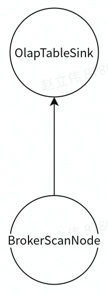
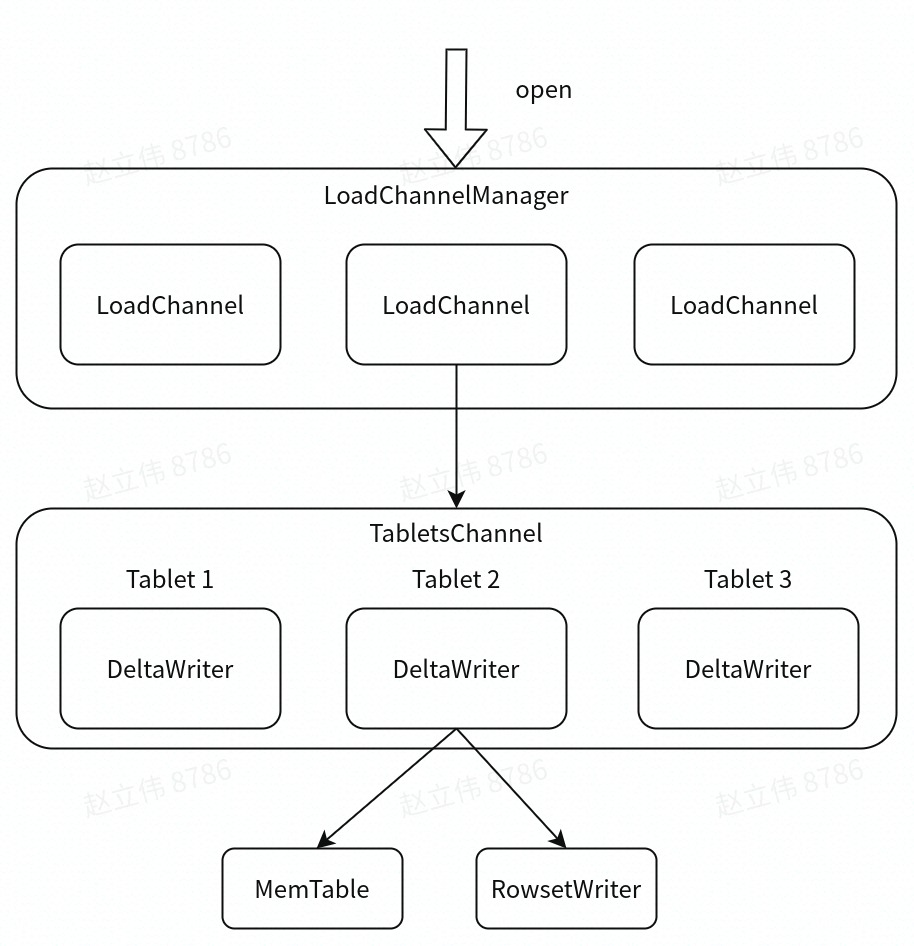

Stream Load是Doris的一种同步的导入方式, 允许用户通过Http访问的方式批量地将CSV或者JSON数据导入Doris，并返回数据导入的结果。用户可以直接通过Http请求的返回体判断数据导入是否成功，也可以通过在客户端执行查询SQL来查询历史任务的结果。Stream Load是是最常用的一种导入方式，在小米内部占了约80%以上场景。 

## 执行过程

用户执行stream load主要有两种方式：

- 将请求直接提交给be，并由该节点作为本次stream load任务的coordinator。

- 将http请求提交给fe，fe再通过http重定向将数据导入请求转发给某一个be节点，该be节点作为本次stream load任务的coordinator，此时的fe主要起到请求转发的作用。

本文中主要介绍第二种方式。其主要执行流程如下：

- 用户提交stream load请求到fe

- fe对http请求进行解析，然后进行鉴权。鉴权通过后，根据策略选取一台be作为coordinator，并将stream load请求转发给coordinator be（`StreamLoadAction::on_header`）

- coordinator be在接到请求后，会对其header信息进行校验，包括body长度、format类型等。

- coordinator be向fe发送begin transaction的请求，fe在接收到该请求时会开启一个事务，并向coordinator be返回事务id

- coordinator be向fe发送`TStreamLoadPutRequest`请求，fe在接收到该请求时，会产生导入执行计划，并向coordinator be返回。该执行计划非常简单，由`OlapTableSink`和`BrokerLoadScanNode`两个算子组成，且只有一个`PlanFragment`

- coordinator be在接收到导入计划之后，开始执行导入计划。`OlapTableSink`会根据数据选取对应的tablet，并将其放入该tablet所在be对应的channel，后台会有线程定期的将channel中的数据通过brpc发送到be（根据配置`olap_table_sink_send_interval_ms`）。其他be在接收到该`PTabletWriterAddBatchRequest`请求后，会执行数据写入操作

- 在导入完之后，会根据导入执行状态，决定是commit或者rollback transaction

整体执行流程如下图所示：

## 数据接收

当doris接收到用户提交的stream load请求，通过`StreamLoadAction::on_chunk_data`接收http请求中的数据，并将数据append到该stream load对应的body_sink中。其中：

- 对于大部分数据格式，都支持使用use_streaming的方式，则将body_sink指定为`StreamLoadPipe`，该class主要是将数据缓存起来。

- 对于少部分不支持streaming的数据格式，则将body_sink指定为`MessageBodyFileSink`，该class主要将数据存储在本地文件中。

## 数据导入

### `BrokerScanNode`算子

`BrokerScanNode`算子在`open`时，会启动一个线程从streaming或者本地文件中读取数据，存入`BrokerScanNode`的`_batch_queue`中。

如[《Doris查询计划》](https://levy5307.github.io/blog/doris-query/)中所讲，查询计划在执行过程中，会自顶向下调用算子的`get_next`函数。`BrokerScanNode`算子在`get_next`时，从`_batch_queue`中获取一个数据batch。

当执行完`BrokerScanNode`算子的`get_next`获取到row_batch之后，会将改row_batch通过`OlapTableSink`写入表中。

### `OlapTableSink`算子

`OlapTableSink`算子在prepare阶段，会对每个rollup（包括base table）建立对应的`IndexChannel`。在`IndexChannel`中，获取到其所有tablets对应的node信息（每个tablet的所有副本都需要找到对应的node），建立对应的`NodeChannel`，在`NodeChannel`中，会根据该node的地址以及brpc port，获取一个brpc stub，用于发送信息至该node。

`OlapTableSink`算子在open阶段，会创建一个后台线程，依次对`IndexChannel`及其内部的`NodeChannel`中的`_pending_batches`，通过`PTabletWriterAddBatchRequest`请求发送到对应的be node。

`OlapTableSink::send`的处理逻辑如下：

- 如果存在表达式，则根据表达式将`input_batch`进行转换。

- 对上述row_batch进行校验，对row_batch的每个row中的每个slot，分别根据类型进行校验，筛选出不符合要求的数据。

- 通过上述`IndexChannel::add_row`，首先获取tablet对应的`NodeChannel`，并逐行地将数据添加到其对应的`NodeChannel::_cur_batch`中，当`_cur_batch`中的数据大于`BATCH_SIZE_FOR_SEND`（2MB）时，则将`_cur_batch`中数据存入`_pending_batches`中。上述open阶段创建的线程，会从`_pending_batches`中依次取出batch，发送至对应的be node

在`OlapTableSink::close`中，将`NodeChannel::_cur_batch`中的剩余的数据放入`_pending_batches`中。后续这些数据则会通过上述open阶段创建的线程发送出去。

### row batch写入

当`NodeChannel`执行`open`操作时：

- 向对应的be node发送`PTabletWriterOpenRequest`请求，be node打开写入通道。

- be节点的`PInternalServiceImpl`在接收到请求时，将请求转发给`LoadChannelManager`

- `LoadChannelManager`根据request中的`load_id`获取（或创建）一个`LoadChannel`并执行`open`操作。对于每个Stream load，都会在其对应的`StreamLoadContext`中随机生成一个`load_id`。

- `LoadChannel::open`则根据`index_id`获取（或创建）一个`TabletsChannel`并执行`open`操作。

- `TabletsChannel::open`操作中，会为每个tablet创建一个`DeltaWriter`，并执行`open`操作。 

其对应关系如下图：

当be node接收到`PTabletWriterAddBatchRequest`时，开始执行写入操作：

- `PInternalServiceImpl`在接收到请求时，将请求转发给`LoadChannelManager`

- `LoadChannelManager`在接收到请求时，首先根据`load_id`找到对应的`LoadChannel`，将请求转发给该`LoadChannel`

- `LoadChannel`在接收到请求时，首先根据`index_id`找到对应的`TabletsChannel`，将请求转发给该`TabletsChannel`

- `PTabletWriterAddBatchRequest`中记录了每个row对应的tablet id，`TabletsChannel`根据tablet id，将请求转发给对应的`DeltaWriter`

- `DeltaWriter::write`将属于该tablet的所有row写入到mem table中，当memtable大小超过200MB（可配置值）时，则启动一个后台线程执行flush操作。

